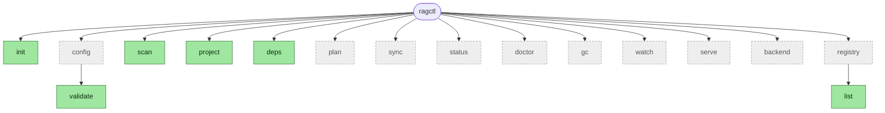
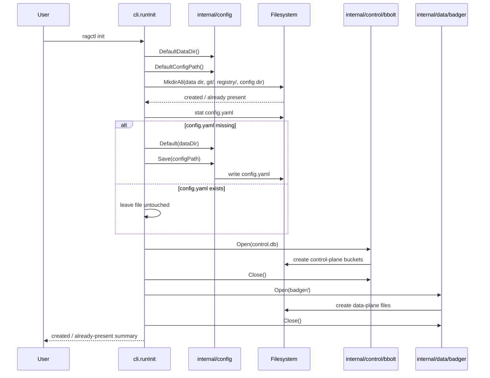
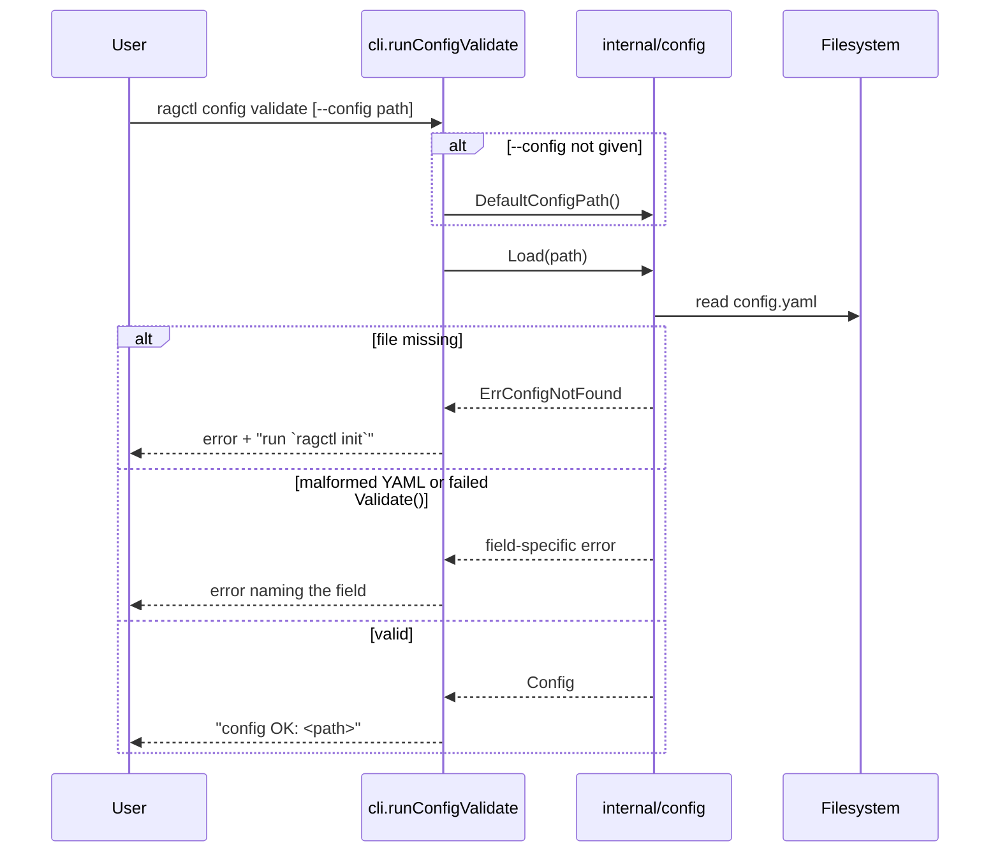
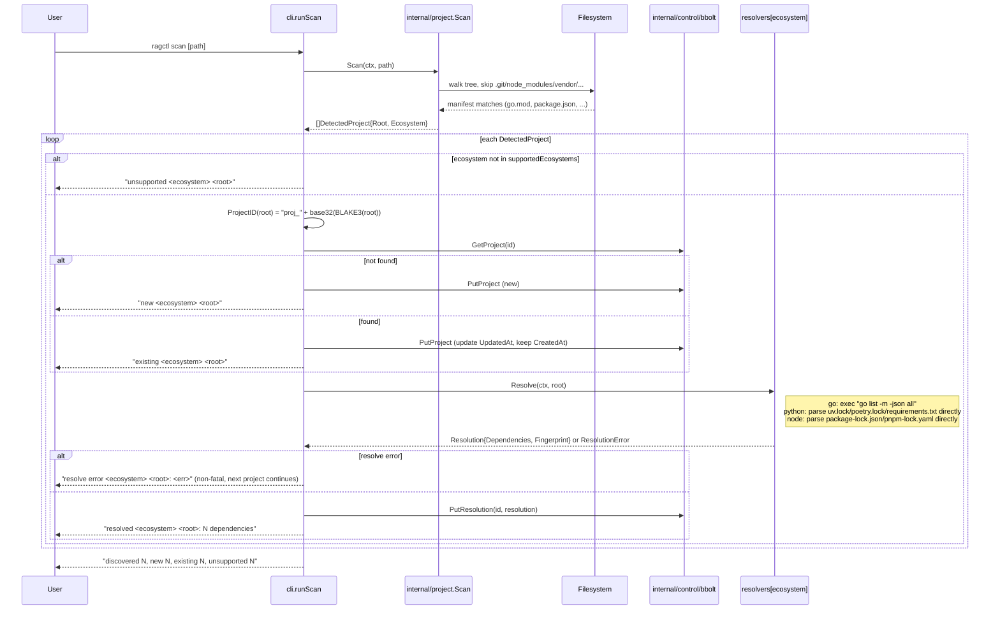
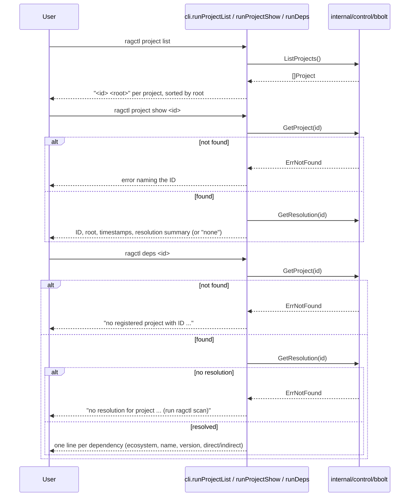
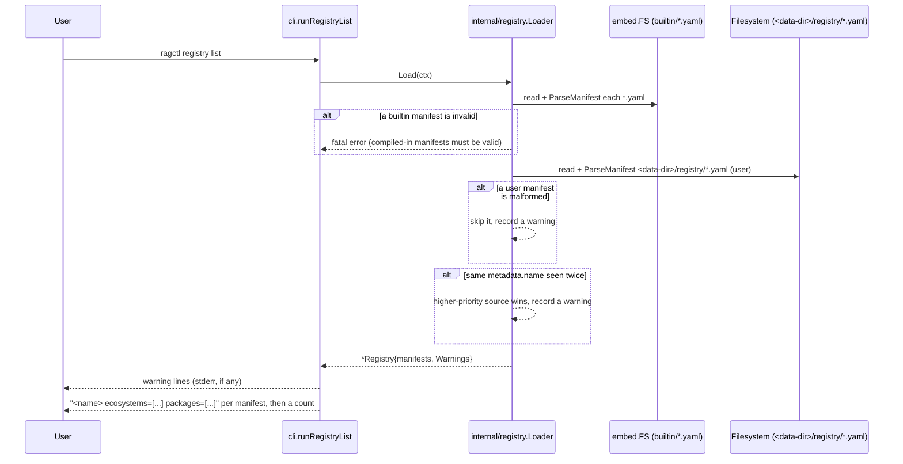

# ragctl — Current Architecture

This doc describes what's **actually implemented**, not the aspirational full design (that lives in the original planning docs referenced by `docs/tickets/`). It's updated as each ticket lands — diagrams here only cover shipped behavior.

For the roadmap, see [docs/tickets/README.md](tickets/README.md). For the native-vs-container execution decision, see [ADR-010](adr/ADR-010-native-first-execution-model.md).

## Coding standard

Go code in this repo follows [CLAUDE.md](../CLAUDE.md): interfaces first, then the structs implementing them, then their methods; a package doc comment on the file that owns the package; a short doc comment on every exported identifier.

## Known gaps in epics 1-2

We're building CLI-first: implementing `docs/tickets/planned/03-config-cli` onward one command at a time, and pulling in only the slice of epic 1 (Bootstrap) and epic 2 (Core Domain and Storage) that each command actually needs — not their full ticket scope up front. As of `scan` landing, that means:

- **BOOT-001**: missing `SECURITY.md`, `CONTRIBUTING.md`, `CODE_OF_CONDUCT.md`, `.golangci.yml`.
- **BOOT-003**: no CI workflow yet — `gofmt`/`vet`/`test -race` (native) and `hack/test-linux.sh` (Linux) are run by hand after each change instead.
- **CORE-001**: `Ecosystem`, `Project`, `Dependency`, `DependencyVersion`, `Resolution`, `SourceSnapshot`, `KnowledgeObject`, `Chunk`, (epic 11) `Generation`, and (epic 13) `BackendReplica` exist in `internal/domain`; `VersionReference`, `SyncJob`, `KnowledgeSource` still don't — the last one deliberately: epic 11's `generation.Build` takes `[]registry.Source` (REG-001's manifest shape) directly rather than a separate `domain.KnowledgeSource`, since that's the actual shape a registry match produces and CORE-001 only ever sketched `KnowledgeSource` as a comment, not a real consumer.
- **CORE-002**: done — `GenerationState`/`JobState` lifecycle enums plus `ValidGenerationTransition`/`ValidJobTransition` exist in `internal/domain/lifecycle.go`.
- **STORE-001**: `PutProject`/`GetProject`/`ListProjects`, `PutResolution`/`GetResolution` (the latter keyed by project ID in the `project_dependencies` bucket as a JSON blob, not the ticket's fuller relational split across `project_dependencies`/`dependency_versions`), (epic 11) `PutGeneration`/`GetGeneration`, and (epic 13) `PutBackendReplica`/`GetBackendReplica`. No active-pointer, reference-counting, or job methods yet.
- **STORE-002**: no schema-version handling yet.
- **STORE-003**: done — `PutKnowledgeObject`/`GetKnowledgeObject`/`DeleteKnowledgeObject`, `PutChunk`/`GetChunk`/`ListGenerationChunks`, `PutManifest`/`GetManifest`, `PutEmbeddingMetadata`/`GetEmbeddingMetadata`, `DeleteGeneration` (batched via `WriteBatch`), plus a `PutContentHashIndex`/`GetContentHashIndex` pair the ticket's keyspace listed (`hash/<content-hash>`) but didn't name explicit methods for — added for GEN-003's dedup lookup.
- **STORE-004**: we have bbolt-only restart-persistence tests (`TestProjectPersistsAcrossRestart`, `TestResolutionPersistsAcrossRestart`), not the ticket's combined bbolt+Badger scenario.

This is expected, not a bug — each gap gets filled exactly when a later command needs it. Worth revisiting once there's more surface area to protect (BOOT-003/CI in particular).

- **REG-001**: the JSON Schema lives at `internal/registry/schema/knowledge-package.schema.json`, not the ticket's `schemas/knowledge-package.schema.json` at repo root — `go:embed` can't reach outside a package's own directory tree, so the canonical copy moved inside the package rather than living at the repo root and being duplicated.
- **REG-002**: the loader has no config-driven remote-registry-clone path yet (the ticket explicitly deferred this to reuse GIT-001 later) — only built-in + user + project directories are read.

Note: the Python and Node resolvers (`internal/resolver/python`, `internal/resolver/node`) implement epics 20 and 21 from `docs/tickets/backlog/`, not `docs/tickets/planned/` — both were pulled forward at the user's explicit request rather than following epic order. The backlog/planned split otherwise still holds; this is a deliberate pattern for user-requested ecosystem coverage, not a change to the split's meaning.

## What's implemented so far

- **CLI skeleton** (`internal/cli`, Cobra): all 13 top-level commands plus `config validate` are registered. Every command except `init`, `config validate`, `scan`, `project`, `deps`, and `registry list` is an explicit stub that fails with `feature not implemented in this build` rather than doing nothing.
- **`ragctl init`**: creates the config file and local storage directories, idempotently, on both macOS and Linux (with platform-appropriate paths — see `internal/config/paths.go`).
- **`ragctl config validate`**: loads and validates `config.yaml` (default location, or `--config <path>`), printing `config OK: <path>` or a field-specific error. A missing file suggests `ragctl init` rather than a bare "not found".
- **`ragctl scan [path]`**: walks a directory tree, detects project roots by manifest file (`go.mod`, `package.json`, `Cargo.toml`, `pyproject.toml`/`requirements.txt`, `pom.xml`/`build.gradle*`), and registers ones whose ecosystem ragctl currently supports. **Go, Python, and Node are now supported** — Go modules resolve via the real `go` toolchain, Python projects by parsing `uv.lock`/`poetry.lock`/`requirements.txt` directly, Node projects by parsing `package-lock.json`/`pnpm-lock.yaml` directly — and the resolution is persisted. Rust and Java still show as `unsupported` until their resolvers land. Idempotent — rescanning doesn't create duplicates, and a resolution's fingerprint is stable across identical resolves.
- **`ragctl project list`**: lists every registered project (ID + root), sorted by root.
- **`ragctl project show <project-id>`**: prints a project's ID, root, timestamps, and resolution summary (ecosystem, dependency count, fingerprint) or "none" if it hasn't been resolved.
- **`ragctl deps <project-id>`**: prints the resolved dependency list for a project (ecosystem, name, version, direct/indirect). Errors clearly distinguish "no such project" from "project registered but never resolved."
- **`ragctl registry list`**: loads the knowledge registry (built-in seed manifests + `<data-dir>/registry/*.yaml`, the directory `init` already creates) and prints every manifest's name, ecosystems, and packages. Load warnings (e.g. a user manifest overriding a built-in one, or a malformed file being skipped) print to stderr.
- **`internal/config`**: the `Config` struct, defaults, YAML load/save, validation.
- **`internal/project`**: the scanner (`Scan`) and stable project IDs (`ProjectID` = `BLAKE3(canonical root)`).
- **`internal/control/bbolt`**: `Open`/`Close`, plus the first CRUD slice — `PutProject`/`GetProject`/`ListProjects`.
- **`internal/data/badger`**: minimal `Open`/`Close` wrapper — enough for `init` to create the on-disk files. No CRUD methods yet; those land with generation-related tickets.
- **`internal/executil`**: `Run(ctx, RunOptions) (RunResult, error)` — the one subprocess-execution helper every ecosystem resolver uses. Argv-only (no shell), context cancellation/timeout kill the child promptly, stdout/stderr captured separately, non-zero exit is not itself an error.
- **`internal/resolver`**: the `Resolver` interface (`Name`/`Detect`/`Resolve`) and a `Registry` for deterministic (registration-order) resolver priority, plus a typed `ResolutionError` and a shared `Fingerprint(deps)` helper (BLAKE3 over the dependency list sorted by ecosystem+name — extracted once both Go and Python needed it). Nothing consumes `Registry` from the CLI yet — `scan` calls the right resolver directly by ecosystem (see below); the registry earns its keep once resolvers need to compete for the same project (e.g. a polyglot repo with ambiguous priority).
- **`internal/resolver/golang`**: `Detect` checks for `go.mod` at the root (no upward search). `Resolve` shells out to `go list -m -json all` via `executil`, decodes the streamed JSON module objects, normalizes them into `domain.DependencyVersion` (drops the main module, resolves replace directives — local filesystem replaces are tagged `local:<path>` and version replaces `replace:<path>@<version>` in `ResolvedBy`, direct/indirect passed through). The `go list` invocation sets `GOFLAGS=-mod=mod`, `GOWORK=off`, and `GOTOOLCHAIN=local` — found necessary by scanning ~1100 real repos (see GO-002's "Post-implementation amendment"): vendored projects (kubernetes, cli) otherwise fail outright under vendor-mode auto-detection, `go.work` workspaces (kubernetes) otherwise reject `-mod=mod`, and a `go.mod` requesting a newer Go than installed (moby, kubernetes, 118 of the 1100 scanned repos) otherwise tries a network toolchain download that can eat most of the 60s per-repo timeout instead of failing in ~10ms. That last one is a deliberate tradeoff, not a pure win: those 118 repos previously *resolved successfully* by silently downloading a matching toolchain over the network; now they fail fast with a clear "requires go >= X" message instead. Local-first, deterministic, no surprise network side effects during a routine `scan` — but real repos that would've worked now report needing a toolchain upgrade instead.
- **`internal/resolver/python`** (backlog epic 20, pulled forward at the user's request — see `docs/tickets/backlog/20-python-resolver`): `Detect` checks for any of `uv.lock`/`poetry.lock`/`requirements.txt`/`pyproject.toml`/`Pipfile.lock`. `Resolve` picks a strategy by priority: `uv.lock` (parsed as TOML via `github.com/BurntSushi/toml`; direct/indirect is derived from the project's own `virtual` root package's declared `dependencies`; git sources keep the full `<url>#<rev>` in `ResolvedBy`; editable/directory/path sources are tagged `local:<path>`) → `poetry.lock` (same TOML approach; poetry.lock doesn't expose direct/indirect so every entry is `Direct: false`) → `requirements.txt` (regex line parser; only exact `==` pins resolve, ranges and bare names are never guessed — they're surfaced in `Resolution.Warnings` instead). `pyproject.toml` alone or `Pipfile.lock` are detected but have no resolution strategy yet — `Resolve` returns a `ResolutionError` naming that gap.
- **`internal/resolver/node`** (backlog epic 21, pulled forward at the user's request — see `docs/tickets/backlog/21-node-resolver`): `Detect` checks for `package.json`. `Resolve` picks a strategy by priority: `package-lock.json` (lockfileVersion 3 only; direct/indirect derived from the root package's own `dependencies`/`devDependencies`; nested `node_modules/a/node_modules/b` keys collapse to the final package name, scoped names like `@types/node` preserved; workspace symlinks — `link: true` — tagged `local:<path>`) → `pnpm-lock.yaml` (parsed as YAML via the existing `yaml.v3` dependency; direct/indirect derived from every workspace `importers` entry's declared dependencies; a peer-dependency-qualified key like `is-odd@3.0.1(is-number@6.0.0)` has its parenthetical suffix stripped before splitting name/version; cross-workspace dependencies between members are naturally excluded since they never appear under `packages:`). `yarn.lock` and `bun.lock` are detected but not yet resolvable — `Resolve` returns a `ResolutionError` naming that gap, same pattern as Python's `pyproject.toml`-only case.
- **`internal/control/bbolt`**: gained `PutResolution`/`GetResolution`, keyed by project ID — an interim simplification of STORE-001's fuller relational split (see gaps above).
- **`internal/registry`**: `Manifest`/`ParseManifest` (REG-001) validate a KnowledgePackage YAML against an embedded JSON Schema (via `github.com/santhosh-tekuri/jsonschema/v5`) before decoding into the Go struct, so a bad field name or out-of-range `authority` fails with the schema's own field-specific message, not a generic parse error. `Loader`/`Registry` (REG-002) merge manifests from three sources in ascending priority — built-in (`embed.FS`) → `<data-dir>/registry/*.yaml` (user) → an optional project override dir — with same-name conflicts logged as warnings rather than erroring, and a malformed built-in manifest treated as fatal (it's compiled in and should never be invalid) while a malformed user/project one is skipped with a warning. `Registry.Match(ecosystem, package)` (REG-003) is an O(1) exact-membership index lookup, built once after loading; no match is `(Manifest{}, false)`, not an error. Six hand-authored seed manifests (REG-004) ship in `internal/registry/builtin/`: grpc-go, protobuf-go, badger, bbolt (Go) and pydantic, fastapi (Python) — enough to validate the format end-to-end, not real coverage.
- **`internal/source/git`** (epic 8 — Git Acquisition): `Cache` (rooted at `<data-dir>/git`) shells out to the system `git` binary via `executil` for every operation, no wire-protocol or object parsing of its own. `EnsureMirror(ctx, url)` (GIT-001) clones a bare mirror under a `<host>/<org>/<repo>.git` layout if one doesn't already exist — one mirror shared across every dependency version of that package, never re-cloned; `FetchTags` updates it incrementally; `ResolveRef` resolves a tag/branch/commit-ish to a commit SHA purely from local cache (`git rev-parse <ref>^{commit}`). `MaterializeWorktree(ctx, repoPath, commit)` (GIT-002) checks out a commit into a fresh temp dir via `git worktree add --detach` and returns a `cleanup func() error` that callers must defer; cleanup runs on its own `context.Background()`, not the caller's context, specifically so a cancelled normalization doesn't leave a dangling worktree — a failed `git worktree remove` falls back to `rm -rf` + `git worktree prune` and only warns rather than erroring, per the ticket's "don't crash the pipeline over cleanup failure." `Delta(ctx, repoPath, oldCommit, newCommit)` (GIT-003) runs `git diff --name-status` and normalizes `A`/`M`/`D`/`R###` into a `FileStatus` enum (`added`/`modified`/`deleted`/`renamed`, with `OldPath` set only for renames); an empty `oldCommit` diffs against Git's well-known empty-tree SHA so first-sync callers don't need special-casing. Every failure is a typed `*CacheError{Op, Kind, Cause}` — clone/fetch failures are `ErrKindTransient` (network, retryable by a later job system), `ResolveRef`/`MaterializeWorktree`/`Delta` failures are `ErrKindPermanent` (bad ref, bad commit — retrying won't help). Not yet wired into any CLI command — `scan` still stops at resolution; acquisition has no trigger yet.
- **`internal/normalize`** (epic 9 — Normalization Pipeline): the shared `Normalizer` interface (NORM-001) — `Name()`, `Version()`, `Supports(src)`, `Normalize(ctx, src) ([]domain.KnowledgeObject, error)` — plus a `Registry` that tries normalizers in registration order and returns the first whose `Supports` matches. `Name()+Version()` are meant to become part of content-identity fingerprinting later (HASH-001): bumping `Version()` is how a parsing-logic change signals "re-normalize this" without a source byte changing. Added two domain types this epic needed that CORE-001 had only sketched as comments: `domain.SourceSnapshot` (materialized file/directory + `LogicalPath`/`LocalPath`/`Metadata`, what a Normalizer consumes) and `domain.KnowledgeObject` (what one produces).
  - **`internal/normalize/markdown`** (NORM-002): parses `.md`/`.mdx` via `goldmark`, one AST walk collecting title (first H1, filename fallback), a heading breadcrumb trail, fenced-code-block languages, and link destinations. Emits **one `KnowledgeObject` per document**, not per section/fence — the ticket explicitly defers section-splitting to chunking (CHUNK-002), so structure is preserved in `Metadata["headings"]` (pipe-separated breadcrumb paths) / `Metadata["code_languages"]` / `Metadata["links"]` for that later stage to consume, rather than in separate objects now. `.mdx` is treated as plain Markdown — goldmark is lenient enough that JSX-looking blocks just pass through as text; no MDX-specific handling exists or is needed.
  - **`internal/normalize/plaintext`** (NORM-003): the simplest normalizer — one `KnowledgeObject` per `.txt`/`.rst` file, trimmed raw content, no structure extraction (`.rst` gets no real reStructuredText parsing, by design). `LICENSE*` files are supported only when `src.Metadata["include_license"] == "true"`, an opt-in hint left for a future acquisition-layer/config wiring — skipped by default since license text rarely helps retrieval and just bloats the corpus.
  - **`internal/normalize/godoc`** (NORM-004): `go/parser` + `go/doc` (stdlib only, no external static-analysis dependency) over a package directory, emitting one `package_doc` object plus one `symbol_doc` object per exported func/type/method/const, each carrying a `go/printer`-rendered signature and (for methods) a `receiver` tag linking it to its type. One real ambiguity the ticket itself flagged got resolved by reading the stdlib source rather than guessing: `doc.AllDecls` does **not** mean "exported only" — it means the opposite, "include unexported declarations too" — so the normalizer deliberately uses the default mode (0), which already filters to exported-only, documented inline so the next reader doesn't reintroduce the bug the ticket almost specified.
  - **`internal/normalize/releasenotes`** (NORM-005): not a parser — a thin decorator wrapping `markdown.Normalizer`/`plaintext.Normalizer` (delegating by extension, or by a `Metadata["source_type"] == "github-releases"` hint), tagging every returned object `Metadata["content_type"] = "release_note"`. Recognizes `CHANGELOG`/`CHANGES`/`RELEASES`/`HISTORY` (`.md` or `.txt`, case-insensitive). For Markdown sources it also sets `Metadata["release_version"]` from the first version-like heading (`^v?\d+\.\d+\.\d+`) — "first," not "each section," because NORM-002 emits one object per document; true per-section tagging waits on CHUNK-002 actually splitting sections, at which point the full heading list this normalizer already threads through remains available to re-derive it.
  - **`normalize.NormalizeLineEndings`** (retrofitted while building HASH-001, epic 10): converts CRLF/lone-CR to LF. Added when HASH-001's own required test — "content with `\r\n` vs `\n` produces identical hashes once normalized" — exposed that NORM-002/003/004 (already shipped) stored raw file bytes verbatim, never actually whitespace-normalizing despite HASH-001 explicitly trusting that they do. All three now call it before setting `KnowledgeObject.Content`; covered by `internal/data/fingerprint`'s `TestCRLFAndLFNormalizeToIdenticalFingerprint` integration test (spans NORM-002 + HASH-001, as the ticket itself specifies).
- **`internal/data/fingerprint`** (epic 10 — Fingerprinting and Chunking): `Fingerprint(sourceIdentity, logicalPath, normalizerName, normalizerVersion, content) [32]byte` (HASH-001) — one BLAKE3 digest over those five inputs, each length-prefixed with a uvarint so variable-length fields can never collide by concatenation (`"ab"+"c"` vs `"a"+"bc"`). `ObjectID(digest) string` (HASH-002) derives a `"ko_"`-prefixed, lowercase, unpadded-base32 ID — deliberately lowercase, unlike `internal/resolver.Fingerprint`'s pre-existing uppercase convention, since this one is a human-inspectable storage key, not just an internal no-op-detection signal.
- **`internal/data/chunk`** (epic 10): the shared `Chunker` interface (CHUNK-001) — just `Chunk(ctx, obj) ([]domain.Chunk, error)`, no `Supports` method (unlike `normalize.Normalizer`) — plus a `Registry` that dispatches by `KnowledgeObject.ContentType` membership (registered explicitly per chunker, not via a predicate method) and the shared `ChunkID`/`ContentHash` helpers every concrete chunker uses. `ChunkID` hashes `objectID + ordinal + content` together (not just ordinal), so a chunk whose boundaries shift due to an upstream edit gets a new ID rather than silently reusing stale content under an old one. Added `domain.Chunk` this epic needed (also only sketched as a comment in CORE-001).
- **`internal/data/generation`** (epic 11 — Generation Builder): the first end-to-end pipeline tying acquisition, normalization, fingerprinting, and chunking together for a real dependency version. `Create(ctx, bboltStore, badgerStore, dep)` (GEN-001) writes a `PLANNED` `domain.Generation` to bbolt (`gen_`-prefixed ULID, a lifecycle entity — not content-addressed like `KnowledgeObject`/`Chunk`) and an empty manifest skeleton to Badger, manifest first so a bbolt-write failure never leaves a record with no manifest to build into. `Build(ctx, gen, sources []registry.Source, gitCache, bboltStore, badgerStore)` (GEN-002) drives one linear pipeline — `ACQUIRING` (materialize a worktree per `type: git` source, via GIT-001/002; a source's `Ref` template like `"v${version}"` has `${version}` substituted with the dependency version stripped of any leading `v`, so both Go's `v1.2.3` and PyPI's bare `1.2.3` land on the same tag shape) → `NORMALIZING` (walk each worktree, select a normalizer per file/package directory exactly like `hack/chunk-sweep` does, filling in `Dependency`/`SourceType`/`Authority` on each `KnowledgeObject` since normalizers themselves don't know which registry source they came from) → `INDEXING` (fingerprint, dedup, chunk, and store). Any stage failure marks the generation `FAILED` with the error persisted, wrapped in a typed `ErrAcquisition`/`ErrNormalization` sentinel via `errors.Is`; a normalizer error on one file fails the whole generation rather than silently dropping it. GEN-003's content-reuse check is folded into the `INDEXING` phase rather than a separate pass: each object's pure content hash (`chunk.ContentHash`, independent of source/commit identity) is looked up in Badger's `hash/<content-hash>` index first — a hit reuses the existing object ID and payload (no rewrite, `objects_reused` incremented) even when the object's own fingerprint-derived ID would differ because the source commit changed; a miss stores the new object under its `fingerprint.ObjectID`-derived key and adds it to the index (`objects_created` incremented). Both counters live on the Badger manifest alongside `object_count`/`chunk_count`/`sources`. Not yet wired into any `ragctl` command — that's `ragctl sync` (still a stub), which needs the planner (PLAN-*) to decide *which* dependency versions need a generation before it's worth calling this.
- **`internal/embedding`** (epic 12 — Embedding Provider): the narrow `Embedder` interface (EMB-001) — `Name()`, `ModelID()`, `Dimensions(ctx)`, `Embed(ctx, texts) ([][]float32, error)` — plus `EmbeddingIdentity` (provider/model/dimensions/normalization/created-at), the metadata a vector replica is always tied to so a model change can never silently reuse a prior replica (enforced later, VEC-003). `internal/embedding/ollama` (EMB-002) is the reference implementation: a small hand-written client (no SDK dependency) posting to Ollama's `/api/embed`, batching requests sequentially (`WithBatchSize`, default 16 — no concurrent fan-out per the ticket), retrying only transient failures (5xx, connection errors — 3 attempts, 200/400/800ms backoff; a 4xx fails immediately with no retry), and probing `Dimensions` once via a fixed short string, cached with `sync.Once` thereafter. `internal/embedding/cache` (EMB-003) wraps any `Embedder` with a Badger-backed cache keyed by content hash (`chunk.ContentHash`, computed from the text itself — no external chunk ID needed) + provider + model, splitting a batch into cache hits/misses and calling the inner embedder only for misses; a cache write failure disables further cache writes for the rest of that `Embed` call (but never blocks embedding itself) rather than retrying a broken cache repeatedly. `Counts()` exposes cumulative reused/generated totals for whichever future caller wires this into a generation build. Nothing calls an `Embedder` from `generation.Build` yet — that wiring is still open (see epic 13's note below).
- **`internal/backend`** (epic 13 — Vector Backend: Qdrant): the narrow `VectorBackend` interface (VEC-001) — `Name()`, `Capabilities(ctx)`, `EnsureNamespace(ctx, ns)`, `Upsert`, `Delete`, `Query`, `Health` — plus the fixed v0.1 point-metadata model (`PointMetadata`: ecosystem/dependency/version/generation/source_type/authority, no arbitrary filter DSL) and `internal/backend/backendtest.Backend`, an in-memory fake (cosine-similarity search, full filter support) for this package's own tests and later ones (VAL-*, MCP-*) that need a `VectorBackend` without a real database. `internal/backend/qdrant` (VEC-002) is the reference adapter: a small hand-written HTTP client against Qdrant's REST API (`PUT /collections/{c}` to create, `PUT .../points` to upsert, `POST .../points/search` to query, `POST .../points/delete` to delete, `GET /healthz`/`GET /collections/{c}` for health) — one collection per install, metadata-filtered rather than one collection per dependency version. Since Qdrant only accepts unsigned-integer or UUID point IDs, ragctl's own chunk IDs (`chk_...`) are deterministically mapped to a UUID-shaped hex string via BLAKE3 (`pointID`), with the original chunk ID stashed in the point's payload (`_id`) so query results can report it back. Errors classify via `errors.Is(err, qdrant.ErrBackendUnavailable)` (5xx/connection failures) vs `ErrBackendRequest` (4xx/malformed) — a `*qdrant.Error` wraps both the sentinel and the underlying cause (`Unwrap() []error`, Go 1.20+'s multi-wrap). Verified against a real Qdrant container via `testcontainers-go` (`v1.13.1` image), not just HTTP-fake unit tests — see testing notes below. `internal/control/bbolt`'s `PutBackendReplica`/`GetBackendReplica` (VEC-003) persist `domain.BackendReplica` (new this epic) keyed by generation ID + backend name, tracking `PointCount`/`Status`/`LastError`. `generation.Replicate` (`internal/data/generation/replicate.go`) is the driver that actually uses them — the missing piece neither GEN-002 nor VEC-003 specified (GEN-002 scoped embedding/replication out; VEC-003's design assumed a caller already existed). It lists a generation's staged chunks (`badger.Store.ListGenerationChunks`), resolves each chunk's parent `KnowledgeObject` (cached per call, since many chunks share one object) for its ecosystem/dependency/version/source_type/authority — chunks don't carry that themselves — embeds in batches of 64 via any `embedding.Embedder` (a `CachingEmbedder` wrapper is the expected choice in practice), upserts into a `VectorBackend`, and persists `BackendReplica` progress after every batch so a crash loses at most one batch's bookkeeping rather than the whole generation. Any embedding or upsert failure marks the replica `failed` with the error recorded and returns immediately, wrapped in `ErrReplication` via `errors.Is`.
  - **`internal/data/chunk/markdown`** (CHUNK-002): splits a Markdown/text `KnowledgeObject` by heading section (re-derived directly from `Content` via a fence-aware ATX-heading-line scan — not a full re-parse, no goldmark dependency here — a `# foo` inside a ` ```bash ` fence is correctly never mistaken for a heading), falling back to greedy paragraph-boundary packing only when a section exceeds `MaxChunkBytes` (default 2000). **Bug found by its own unit tests before shipping**: the first version let a section's heading line get treated as its own blank-line-delimited "paragraph," so an oversized section could emit a bodyless chunk containing only `"# Title"`. Fixed by structurally separating `headingLine` from `body` and only ever prepending the heading to the *first* packed part — see CHUNK-002's ticket amendment. A lone paragraph bigger than the limit is emitted as-is rather than cut mid-paragraph (an accepted edge case, not a bug — confirmed against a real 67KB single-table paragraph in `cockroach/docs/generated/sql/operators.md` during the corpus sweep below).
  - **`internal/data/chunk/symbol`** (CHUNK-003): near-identity passthrough for NORM-004 output — one chunk per `symbol_doc`/`package_doc` object, package/symbol/signature/source_path/version promoted into chunk metadata. **Bug found by a real-corpus sweep, not unit tests**: ~11% of real exported Go symbols have no doc comment, which NORM-004 correctly represents as empty `Content` — but this chunker shipped that empty `Content` straight through, producing a chunk with zero embeddable signal even though `Metadata["signature"]` had real information sitting unused right next to it. Fixed to fall back to the signature (then `package.symbol`, then whichever field exists) when `Content` is empty — see CHUNK-003's ticket amendment.

## Command tree



Green = fully implemented. Dashed/grey = registered but returns `feature not implemented in this build`. (`config` itself is just a parent grouping — `config validate` is its one real subcommand.)

## `ragctl init` flow



Path resolution (`internal/config/paths.go`) differs by OS:
- **macOS:** config and data are co-located under `~/Library/Application Support/ragctl/`.
- **Linux:** the proper XDG split — config under `$XDG_CONFIG_HOME` (default `~/.config/ragctl`), data under `$XDG_DATA_HOME` (default `~/.local/share/ragctl`).

## `ragctl config validate` flow



## `ragctl scan` flow



`supportedEcosystems` and `resolvers` (`internal/cli/scan.go`) currently have three entries: `go` → `resolver/golang.New()`, `python` → `resolver/python.New()`, `node` → `resolver/node.New()`. Rust and Java are still `unsupported` — detected and their ID computed, but not persisted or resolved — until their resolvers land. Note that the scanner flags a directory as `python`/`node` on manifest presence alone (`pyproject.toml`/`requirements.txt`, `package.json`), which is broader than what the resolver can actually resolve (e.g. `pyproject.toml` with no lockfile, or `package.json` with no lockfile at all) — those cases are `new`ly registered but log a non-fatal `resolve error`.

## `ragctl project` / `ragctl deps` flow

No ticket defines these two commands in detail (the planning docs list `ragctl project list`, `ragctl project show`, and `ragctl deps` with no further spec) — their shape below was designed to directly surface what `scan` now persists, and can evolve as later epics need more from it.



## `ragctl registry list` flow



`ragctl init` already creates `<data-dir>/registry/`, so dropping a `*.yaml` manifest there is enough to extend the registry without touching Go code — no project-override directory is wired into the CLI yet (the `Loader` supports one, but no command passes a project root's `.ragctl/registry/` in).

## Next up

Epic 14 (Validation and Promotion — see `docs/tickets/planned/14-validation-promotion`): the critical path (epics 1–13) now has every piece — resolve, acquire, normalize, fingerprint, chunk, dedup, embed, embedding-cache, vector backend, and (closing the one real gap the epic 13 write-up surfaced) `generation.Replicate` tying embedding and vector-backend upsert to a built generation's staged chunks. VAL-001..004 can now validate something real: a generation that's been through `Build` then `Replicate` has actual vector data in a backend to check structural completeness against, run sanity thresholds on, and smoke-test for version correctness before `VAL-004`'s atomic promotion. No `ragctl` command drives any of this yet either; `ragctl sync` is still a stub, waiting on the planner (PLAN-001..003, epic 15) to decide *which* dependency versions need a generation.

## Testing notes

Tests that spawn a real `go` subprocess under an isolated `$HOME` (`internal/cli`'s `requireGo`-gated tests, `internal/resolver/golang`) run fully offline (`GOFLAGS=-mod=mod`, `GOPROXY=off`) and point `GOCACHE`/`GOPATH`/`GOTELEMETRYDIR` at a shared directory outside any per-test temp dir. Without this, Go's build cache and telemetry uploader raced `t.TempDir()` cleanup under the Alpine/Podman container specifically (never observed natively on macOS), intermittently failing with `directory not empty`. `internal/cli/init_test.go`'s `isolateEnv` also retries its own cleanup a few times before giving up, as a second line of defense against the same class of race.

`hack/fetch-corpus` (dev tool, not part of the `ragctl` binary) builds the real-world repo corpus used for the resolver stress tests (see GO-002's amendment) from a plain-text manifest (`hack/fetch-corpus/repos.txt`) instead of the hand-copied shell arrays used originally — it dogfoods `internal/source/git.Cache` (GIT-001) for the mirror+fetch step, one shared bare mirror per repo under ragctl's own `<data-dir>/git` cache by default, then registers a persistent `git worktree add --detach` checkout under `-root` (default `~/offline-knowledge`) so `ragctl scan` still has real working files to walk. Idempotent (skips repos already checked out) and safely concurrent (a bounded goroutine pool, not `xargs -P` — no `command line cannot be assembled, too long` or clone/fetch races). An optional `-backup <dir>` flag rsyncs the corpus root's contents there afterward (`rsync -a`, deliberately no `--delete` — additive only, so it's safe to point at an external drive without risking existing content there). Run via `go run ./hack/fetch-corpus`.

`hack/fetch-geodata` is `fetch-corpus`'s counterpart for raw-HTTP datasets (Census TIGER/Line, NOAA nautical charts/maritime boundaries, and their standalone documentation) that aren't git repos at all — same manifest-driven, idempotent, bounded-concurrency shape (`hack/fetch-geodata/sources.txt`, `"<category> <url>"` per line), but downloads via `net/http` instead of shelling out to `git`. A `.zip` URL is extracted via the stdlib `archive/zip` (with a zip-slip path-traversal guard, since these archives come from external URLs) and the archive deleted afterward, with the extraction directory's existence as the idempotency signal; any other extension (e.g. a PDF technical doc) is downloaded as a plain file instead, with the file's own existence as the idempotency signal — no `unzip` dependency either way. Concurrency defaults lower (3, not 6) since these are large single-server government file downloads, not GitHub. Shares the same `-backup <dir>` rsync convention as `fetch-corpus`. Deliberately excludes NOAA BlueTopo bathymetry — it's S3-hosted and tile-based, too large to blindly bulk-sync; the manifest documents the `aws s3 ls` command to browse it instead.

Corpus category convention: `data/*` is a top-level sibling to `go/`/`python/`/`practices/`/`gis/` — reserved for raw, non-git datasets from any domain (not GIS-specific), keeping `gis/*` itself purely git repos (code/tools/tutorials), the same split `practices/*` already has from the application repos in `go/`/`python/`. Raw geometry (shapefiles, nautical charts) is never intended to flow through `internal/normalize`/`internal/data/chunk` — it isn't text, there's nothing to chunk or embed. Documentation *about* a dataset (schema/field references, technical docs, changelogs) is ordinary RAG content instead, with no new subsystem needed — text/Markdown ones already work via NORM-002/003/005; a PDF like TIGER's technical doc will once a PDF normalizer exists (none does yet — NORM-002/003/004/005 cover Markdown/text/Go/release-notes only).

`hack/normalize-preview` (dev tool) runs `internal/normalize` against one real file or Go package directory and prints the resulting `KnowledgeObject`(s) as JSON, content truncated for terminal readability — the only way to exercise normalization right now, since there's no `ragctl` command or storage layer (STORE-003) wired up yet. Run via `go run ./hack/normalize-preview -path <file-or-dir>` (add `-include-license` to test the plaintext normalizer's LICENSE opt-in). Running it against `~/offline-knowledge` content is what surfaced NORM-002's title-detection bug (see that ticket's amendment) — spf13/cobra's real README, not any hand-written fixture, is what exposed it.

`hack/normalize-sweep` (dev tool) is the broader companion to `normalize-preview`: it walks an entire corpus (default `~/offline-knowledge`), evenly samples up to `-max-per-ext` files per extension and `-max-packages` Go package directories (strided across the whole corpus, not just the first N alphabetically — same reasoning as GO-002's real-world scan), runs every matching normalizer with panic recovery, and reports error/`parse_warning` counts plus samples. First real run: 6,500 files/packages sampled across the full corpus (`.md`, `.mdx`, `.txt`, `.rst`, Go packages), zero markdown/plaintext/release-note errors, one Go-package error (a directory containing only an external `_test`-suffixed package — correctly rejected, not a bug), and four `parse_warning` flags (all genuinely 0-byte files). No further NORM-* fixes needed as of that run.

`hack/chunk-sweep` (dev tool, epic 10) extends the same methodology one stage further: normalize → assign each object an ID exactly the way a future generation builder would (`fingerprint.Fingerprint`+`ObjectID`) → chunk, checking for errors/panics, empty chunks, duplicate chunk IDs, and chunks wildly over `-max-chunk-bytes` (a 5× tolerance, since a single oversized paragraph is an accepted edge case per CHUNK-002). This is what found both of epic 10's real-world bugs: a first run surfaced 6,287 empty chunks out of 56,942 (~11%) — all undocumented Go symbols, root-caused and fixed as CHUNK-003's ticket amendment describes — confirmed via a follow-up run at 0 empty chunks across the same ~22k objects. 122 oversized chunks (~0.2%) remained, all real accepted-edge-case content (giant single-block tables/changelog entries), documented rather than "fixed" per CHUNK-002's amendment.

`internal/data/generation`'s tests (epic 11) use real local Git fixture repos (same `git init`/commit/tag pattern as `internal/source/git`'s own tests, skipped via `requireGit` when `git` isn't on `PATH`) rather than mocks — `TestBuildEndToEnd` builds a generation from a fixture with both a Markdown README and a documented Go package and checks the resulting manifest/chunk counts; `TestBuildAcquisitionFailureMarksGenerationFailed` points a source at a ref template that can never resolve and checks the generation lands in `FAILED` with no chunks written; `TestBuildContentReuseAcrossGenerations` builds twice against an unchanged fixture (expects 100% reuse), then changes one file and retags before a third build (expects exactly one new object, the rest reused despite every object's source commit having changed) — the concrete scenario GEN-003 exists for.

`internal/embedding/ollama`'s tests (epic 12) run entirely against `httptest.NewServer` fakes, no live Ollama required — request-shape/response-parsing, a transient-failure-then-success retry (asserting exactly 2 attempts), a non-transient 4xx (asserting exactly 1 attempt, no retry), context-cancellation-aborts-in-flight (server blocks on a channel until the test's context deadline fires), dimension-probe-caches-after-one-call, and batching (5 texts at `WithBatchSize(2)` produces requests of size 2/2/1). `internal/embedding/cache`'s tests use a `countingEmbedder` fake (atomic call/text counters) against a real `badger.Store` in a temp dir — same-content-twice calls the inner embedder once, a model change on identical content is still a miss (no cross-model reuse), and a mixed hit/miss batch preserves output order while reporting accurate reused/generated counts.

`generation.Replicate`'s tests (`internal/data/generation/replicate_test.go`) chain onto epic 11's real-git-fixture pattern: `TestReplicateEmbedsAndUpsertsAllChunks` runs an actual `Build` against the fixture repo, then `Replicate`s the result through a small deterministic `fakeEmbedder` into `backendtest.Backend`, and checks both the `BackendReplica` bookkeeping (`Status`, `PointCount` matching the manifest's chunk count, `EmbeddingModel`) *and* the actual points landed in the fake backend — right generation ID, right dependency/version/source_type/authority pulled from each chunk's parent object. `TestReplicateFailureMarksReplicaFailedWithError` forces the fake embedder to fail on its first call and confirms the replica lands in `failed` with a non-empty `LastError`; `TestReplicateWithNoChunksCompletesWithZeroPoints` covers a generation with nothing staged.

`internal/backend/qdrant`'s unit tests (epic 13) run against `httptest.NewServer` fakes the same way `ollama`'s do — request/response shape for `EnsureNamespace`/`Upsert`/`Delete`/`Query` (including that the point ID sent to Qdrant is a derived UUID while the payload's `_id` carries the original chunk ID back), batching, and `errors.Is` classification of 4xx vs 5xx. `TestQdrantIntegrationVersionFilteredQuery` additionally spins up a real `qdrant/qdrant:v1.13.1` container via `testcontainers-go`, upserts two versions of the same package's chunks into one shared collection, and confirms a version-filtered query returns only the requested version's point — VEC-002's actual acceptance criterion, not simulated. It skips cleanly (`requireContainerRuntime`) when no Docker-API-compatible runtime is reachable, e.g. inside `hack/test-linux.sh`'s own Alpine/Podman container, which has no nested container runtime. Locally, this repo's rootless Podman machine exposes a Docker-compatible socket (`docker info` succeeds) but its network compatibility layer has no `bridge` network, which `testcontainers-go`'s reaper sidecar ("ryuk") requires — the test sets `TESTCONTAINERS_RYUK_DISABLED=true` for itself rather than relying on ryuk, since it already calls `container.Terminate()` in `t.Cleanup` as its real cleanup path; ryuk is only a backstop for a killed/crashed test process.
