# ragctl — Current Architecture

This doc describes what's **actually implemented**, not the aspirational full design (that lives in the original planning docs referenced by `docs/tickets/`). It's updated as each ticket lands — diagrams here only cover shipped behavior.

For the roadmap, see [docs/tickets/README.md](tickets/README.md). For the native-vs-container execution decision, see [ADR-010](adr/ADR-010-native-first-execution-model.md). For package-level detail (types, functions, isolated dataflow), see [docs/internal/](internal/README.md); for cross-package end-to-end flows one layer deeper than the command diagrams below, see [docs/features/](features/README.md).

## Coding standard

Go code in this repo follows [CLAUDE.md](../CLAUDE.md): interfaces first, then the structs implementing them, then their methods; a package doc comment on the file that owns the package; a short doc comment on every exported identifier.

## Epics 1-2: resolved, reconciled to what actually shipped

We built CLI-first: implementing `docs/tickets/completed/03-config-cli` onward one command at a time, pulling in only the slice of epic 1 (Bootstrap) and epic 2 (Core Domain and Storage) each command actually needed — not their full ticket scope up front. That deliberately left both epics sitting incomplete in `docs/tickets/planned/` for a long stretch, with their own ticket files tracking real gaps against the original design. Both are now fully closed (`docs/tickets/completed/01-bootstrap`, `docs/tickets/completed/02-core-domain-storage`), but closing them meant reconciling two different kinds of ticket to reality, not just finishing a checklist:

- **BOOT-001/002/003** (repo hygiene, Go toolchain pin, CI baseline) were genuine, uncontroversial gaps — `SECURITY.md`/`CONTRIBUTING.md`/`CODE_OF_CONDUCT.md`/`.golangci.yml` and a `.github/workflows/test.yml` (gofmt/vet/test/test -race, pinned to the same Go version already in `go.mod`/README) simply hadn't been written yet. No design questions, just closed them.
- **CORE-001/STORE-001** had genuine *spec drift*, not missing work: later epics taught the project a better shape than the original 2025-era sketch, and building the original sketch now would have made things worse, not more complete. `VersionReference` exists, just added later under RET-001 (epic 16) rather than by CORE-001 itself. `KnowledgeSource` was never built — `generation.Build` (GEN-002) consumes `[]registry.Source` directly, since that's the real shape a registry match produces and a parallel domain type would just duplicate it. `SyncJob` was never built — `domain.Job`/`JobState` (CORE-002, generalized by RET-004) already covers persisted background work generically. STORE-001's active-pointer/reference-counting/job methods all exist (`PromoteGeneration`/`GetActiveGeneration` from epic 13, `AddReference`/`ListReferences`/etc. from epic 16, `PutJob`/`GetJob` from epic 16) — this doc previously and incorrectly still listed those as gaps years after they'd shipped under other tickets' IDs. The one piece formally declined rather than built: the fuller relational split across `project_dependencies`/`dependency_versions` buckets. `Resolution` stays one JSON blob per project — bbolt isn't relational, and "give me this project's complete resolution" is the actual dominant access pattern, so the original normalized-rows sketch would be a worse physical fit, not a more complete one. See both tickets' Post-implementation notes for the full reasoning.
- **STORE-002/STORE-004** were genuine remaining gaps worth actually building, now that the project is public and about to iterate on persisted shapes again (registry federation, richer chunk metadata, orphan lifecycle state): a minimal schema-version guard (`internal/control/bbolt/schema.go` — `CurrentSchemaVersion`, a `meta/schema_version` key, refuse to open a database written by a newer binary) and a real cross-store restart integration test (`internal/control/bbolt/integration_test.go`'s `TestStorageRestartPersistence` — proves bbolt and Badger still agree with each other after an independent restart of both, which neither store's own restart tests can prove alone).

The REG-001/REG-002 deviations noted below are unrelated to epics 1-2 — kept here because they're the same kind of "documented deviation from the original sketch," not evidence of anything still open in epics 1-2.

- **REG-001**: the JSON Schema lives at `internal/registry/schema/knowledge-package.schema.json`, not the ticket's `schemas/knowledge-package.schema.json` at repo root — `go:embed` can't reach outside a package's own directory tree, so the canonical copy moved inside the package rather than living at the repo root and being duplicated.
- **REG-002**: fully done at its own ticket's actual scope (duplicate-conflict warnings, tier priority) — its own Non-goals explicitly excluded remote-registry-clone mechanics. The real remaining gap is narrower and separately tracked: no CLI call site wires a project registry directory into the loader yet (`docs/tickets/backlog/38-registry-federation/REG-008-project-registry-cli-wiring.md`).

Note: the Python and Node resolvers (`internal/resolver/python`, `internal/resolver/node`) implement epics 20 and 21 from `docs/tickets/backlog/`, not `docs/tickets/planned/` — both were pulled forward at the user's explicit request rather than following epic order. The backlog/planned split otherwise still holds; this is a deliberate pattern for user-requested ecosystem coverage, not a change to the split's meaning.

## What's implemented so far

- **CLI skeleton** (`internal/cli`, Cobra): all 13 top-level commands plus `config validate` are registered. Every command except `init`, `config validate`, `scan`, `project`, `deps`, `registry list`, `plan`, `sync`, `status`, `doctor`, `gc`, `watch`, and `serve` is an explicit stub that fails with `feature not implemented in this build` rather than doing nothing.
- **`ragctl init`**: creates the config file and local storage directories, idempotently, on both macOS and Linux (with platform-appropriate paths — see `internal/config/paths.go`).
- **`ragctl config validate`**: loads and validates `config.yaml` (default location, or `--config <path>`), printing `config OK: <path>` or a field-specific error. A missing file suggests `ragctl init` rather than a bare "not found".
- **`ragctl scan [path]`**: walks a directory tree, detects project roots by manifest file (`go.mod`, `package.json`, `Cargo.toml`, `pyproject.toml`/`requirements.txt`, `pom.xml`/`build.gradle*`), and registers ones whose ecosystem ragctl currently supports. **Go, Python, and Node are now supported** — Go modules resolve via the real `go` toolchain, Python projects by parsing `uv.lock`/`poetry.lock`/`requirements.txt` directly, Node projects by parsing `package-lock.json`/`pnpm-lock.yaml` directly — and the resolution is persisted. Rust and Java still show as `unsupported` until their resolvers land. Idempotent — rescanning doesn't create duplicates, and a resolution's fingerprint is stable across identical resolves.
- **`ragctl project list`**: lists every registered project (ID + root), sorted by root.
- **`ragctl project show <project-id>`**: prints a project's ID, root, timestamps, and resolution summary (ecosystem, dependency count, fingerprint) or "none" if it hasn't been resolved.
- **`ragctl deps <project-id>`**: prints the resolved dependency list for a project (ecosystem, name, version, direct/indirect). Errors clearly distinguish "no such project" from "project registered but never resolved."
- **`ragctl registry list`**: loads the knowledge registry (built-in seed manifests + `<data-dir>/registry/*.yaml`, the directory `init` already creates) and prints every manifest's name, ecosystems, and packages. Load warnings (e.g. a user manifest overriding a built-in one, or a malformed file being skipped) print to stderr.
- **`internal/config`**: the `Config` struct, defaults, YAML load/save, validation.
- **`internal/project`**: the scanner (`Scan`) and stable project IDs (`ProjectID` = `BLAKE3(canonical root)`).
- **`internal/control/bbolt`**: `Open`/`Close`, plus the first CRUD slice — `PutProject`/`GetProject`/`ListProjects`.
- **`internal/data/badger`**: minimal `Open`/`Close` wrapper — enough for `init` to create the on-disk files. No CRUD methods yet; those land with generation-related tickets.
- **`internal/executil`**: `Run(ctx, RunOptions) (RunResult, error)` — the one subprocess-execution helper every ecosystem resolver uses. Argv-only (no shell), context cancellation/timeout kill the child promptly, stdout/stderr captured separately, non-zero exit is not itself an error.
- **`internal/resolver`**: the `Resolver` interface (`Name`/`Detect`/`Resolve`) and a `Registry` for deterministic (registration-order) resolver priority, plus a typed `ResolutionError` and a shared `Fingerprint(deps)` helper (BLAKE3 over the dependency list sorted by ecosystem+name — extracted once both Go and Python needed it). Nothing consumes `Registry` from the CLI yet — `scan` calls the right resolver directly by ecosystem (see below); the registry earns its keep once resolvers need to compete for the same project (e.g. a polyglot repo with ambiguous priority).
- **`internal/resolver/golang`**: `Detect` checks for `go.mod` at the root (no upward search). `Resolve` shells out to `go list -m -json all` via `executil`, decodes the streamed JSON module objects, normalizes them into `domain.DependencyVersion` (drops the main module, resolves replace directives — local filesystem replaces are tagged `local:<path>` and version replaces `replace:<path>@<version>` in `ResolvedBy`, direct/indirect passed through). The `go list` invocation sets `GOFLAGS=-mod=mod`, `GOWORK=off`, and `GOTOOLCHAIN=local` — found necessary by scanning ~1100 real repos (see GO-002's "Post-implementation amendment"): vendored projects (kubernetes, cli) otherwise fail outright under vendor-mode auto-detection, `go.work` workspaces (kubernetes) otherwise reject `-mod=mod`, and a `go.mod` requesting a newer Go than installed (moby, kubernetes, 118 of the 1100 scanned repos) otherwise tries a network toolchain download that can eat most of the 60s per-repo timeout instead of failing in ~10ms. That last one is a deliberate tradeoff, not a pure win: those 118 repos previously *resolved successfully* by silently downloading a matching toolchain over the network; now they fail fast with a clear "requires go >= X" message instead. Local-first, deterministic, no surprise network side effects during a routine `scan` — but real repos that would've worked now report needing a toolchain upgrade instead.
- **`internal/resolver/python`** (backlog epic 20, pulled forward at the user's request — see `docs/tickets/backlog/20-python-resolver`): `Detect` checks for any of `uv.lock`/`poetry.lock`/`requirements.txt`/`pyproject.toml`/`Pipfile.lock`. `Resolve` picks a strategy by priority: `uv.lock` (parsed as TOML via `github.com/BurntSushi/toml`; direct/indirect is derived from the project's own `virtual` root package's declared `dependencies`; git sources keep the full `<url>#<rev>` in `ResolvedBy`; editable/directory/path sources are tagged `local:<path>`) → `poetry.lock` (same TOML approach; poetry.lock doesn't expose direct/indirect so every entry is `Direct: false`) → `requirements.txt` (regex line parser; only exact `==` pins resolve, ranges and bare names are never guessed — they're surfaced in `Resolution.Warnings` instead). `pyproject.toml` alone or `Pipfile.lock` are detected but have no resolution strategy yet — `Resolve` returns a `ResolutionError` naming that gap.
- **`internal/resolver/node`** (backlog epic 21, pulled forward at the user's request — see `docs/tickets/backlog/21-node-resolver`): `Detect` checks for `package.json`. `Resolve` picks a strategy by priority: `package-lock.json` (lockfileVersion 3 only; direct/indirect derived from the root package's own `dependencies`/`devDependencies`; nested `node_modules/a/node_modules/b` keys collapse to the final package name, scoped names like `@types/node` preserved; workspace symlinks — `link: true` — tagged `local:<path>`) → `pnpm-lock.yaml` (parsed as YAML via the existing `yaml.v3` dependency; direct/indirect derived from every workspace `importers` entry's declared dependencies; a peer-dependency-qualified key like `is-odd@3.0.1(is-number@6.0.0)` has its parenthetical suffix stripped before splitting name/version; cross-workspace dependencies between members are naturally excluded since they never appear under `packages:`). `yarn.lock` and `bun.lock` are detected but not yet resolvable — `Resolve` returns a `ResolutionError` naming that gap, same pattern as Python's `pyproject.toml`-only case.
- **`internal/control/bbolt`**: gained `PutResolution`/`GetResolution`, keyed by project ID — an interim simplification of STORE-001's fuller relational split (see gaps above).
- **`internal/registry`**: `Manifest`/`ParseManifest` (REG-001) validate a KnowledgePackage YAML against an embedded JSON Schema (via `github.com/santhosh-tekuri/jsonschema/v5`) before decoding into the Go struct, so a bad field name or out-of-range `authority` fails with the schema's own field-specific message, not a generic parse error. `Loader`/`Registry` (REG-002) merge manifests from three sources in ascending priority — built-in (`embed.FS`) → `<data-dir>/registry/*.yaml` (user) → an optional project override dir — with same-name conflicts logged as warnings rather than erroring, and a malformed built-in manifest treated as fatal (it's compiled in and should never be invalid) while a malformed user/project one is skipped with a warning. `Registry.Match(ecosystem, package)` (REG-003) is an O(1) exact-membership index lookup, built once after loading; no match is `(Manifest{}, false)`, not an error. Six hand-authored seed manifests (REG-004) ship in `internal/registry/builtin/`: grpc-go, protobuf-go, badger, bbolt (Go) and pydantic, fastapi (Python) — enough to validate the format end-to-end, not real coverage.
- **`internal/source/git`** (epic 8 — Git Acquisition): `Cache` (rooted at `<data-dir>/git`) shells out to the system `git` binary via `executil` for every operation, no wire-protocol or object parsing of its own. `EnsureMirror(ctx, url)` (GIT-001) clones a bare mirror under a `<host>/<org>/<repo>.git` layout if one doesn't already exist — one mirror shared across every dependency version of that package, never re-cloned; `FetchTags` updates it incrementally; `ResolveRef` resolves a tag/branch/commit-ish to a commit SHA purely from local cache (`git rev-parse <ref>^{commit}`). `MaterializeWorktree(ctx, repoPath, commit)` (GIT-002) checks out a commit into a fresh temp dir via `git worktree add --detach` and returns a `cleanup func() error` that callers must defer; cleanup runs on its own `context.Background()`, not the caller's context, specifically so a cancelled normalization doesn't leave a dangling worktree — a failed `git worktree remove` falls back to `rm -rf` + `git worktree prune` and only warns rather than erroring, per the ticket's "don't crash the pipeline over cleanup failure." `Delta(ctx, repoPath, oldCommit, newCommit)` (GIT-003) runs `git diff --name-status` and normalizes `A`/`M`/`D`/`R###` into a `FileStatus` enum (`added`/`modified`/`deleted`/`renamed`, with `OldPath` set only for renames); an empty `oldCommit` diffs against Git's well-known empty-tree SHA so first-sync callers don't need special-casing. Every failure is a typed `*CacheError{Op, Kind, Cause}` — clone/fetch failures are `ErrKindTransient` (network, retryable by a later job system), `ResolveRef`/`MaterializeWorktree`/`Delta` failures are `ErrKindPermanent` (bad ref, bad commit — retrying won't help). `EnsureMirror` holds a per-repo-path `sync.Mutex` (`Cache.lockMirror`) across its whole check-then-clone sequence — added during epic 14's adversarial review, which caught that two concurrent first-time acquisitions of the same repository could otherwise both run `git clone --mirror` into the same shared mirror directory at once, corrupting a resource every future generation of that dependency depends on, not just the racing ones. Not yet wired into any CLI command — `scan` still stops at resolution; acquisition has no trigger yet.
- **`internal/normalize`** (epic 9 — Normalization Pipeline): the shared `Normalizer` interface (NORM-001) — `Name()`, `Version()`, `Supports(src)`, `Normalize(ctx, src) ([]domain.KnowledgeObject, error)` — plus a `Registry` that tries normalizers in registration order and returns the first whose `Supports` matches. `Name()+Version()` are meant to become part of content-identity fingerprinting later (HASH-001): bumping `Version()` is how a parsing-logic change signals "re-normalize this" without a source byte changing. Added two domain types this epic needed that CORE-001 had only sketched as comments: `domain.SourceSnapshot` (materialized file/directory + `LogicalPath`/`LocalPath`/`Metadata`, what a Normalizer consumes) and `domain.KnowledgeObject` (what one produces).
  - **`internal/normalize/markdown`** (NORM-002): parses `.md`/`.mdx` via `goldmark`, one AST walk collecting title (first H1, filename fallback), a heading breadcrumb trail, fenced-code-block languages, and link destinations. Emits **one `KnowledgeObject` per document**, not per section/fence — the ticket explicitly defers section-splitting to chunking (CHUNK-002), so structure is preserved in `Metadata["headings"]` (pipe-separated breadcrumb paths) / `Metadata["code_languages"]` / `Metadata["links"]` for that later stage to consume, rather than in separate objects now. `.mdx` is treated as plain Markdown — goldmark is lenient enough that JSX-looking blocks just pass through as text; no MDX-specific handling exists or is needed.
  - **`internal/normalize/plaintext`** (NORM-003): the simplest normalizer — one `KnowledgeObject` per `.txt`/`.rst` file, trimmed raw content, no structure extraction (`.rst` gets no real reStructuredText parsing, by design). `LICENSE*` files are supported only when `src.Metadata["include_license"] == "true"`, an opt-in hint left for a future acquisition-layer/config wiring — skipped by default since license text rarely helps retrieval and just bloats the corpus.
  - **`internal/normalize/godoc`** (NORM-004): `go/parser` + `go/doc` (stdlib only, no external static-analysis dependency) over a package directory, emitting one `package_doc` object plus one `symbol_doc` object per exported func/type/method/const, each carrying a `go/printer`-rendered signature and (for methods) a `receiver` tag linking it to its type. One real ambiguity the ticket itself flagged got resolved by reading the stdlib source rather than guessing: `doc.AllDecls` does **not** mean "exported only" — it means the opposite, "include unexported declarations too" — so the normalizer deliberately uses the default mode (0), which already filters to exported-only, documented inline so the next reader doesn't reintroduce the bug the ticket almost specified.
  - **`internal/normalize/releasenotes`** (NORM-005): not a parser — a thin decorator wrapping `markdown.Normalizer`/`plaintext.Normalizer` (delegating by extension, or by a `Metadata["source_type"] == "github-releases"` hint), tagging every returned object `Metadata["content_type"] = "release_note"`. Recognizes `CHANGELOG`/`CHANGES`/`RELEASES`/`HISTORY` (`.md` or `.txt`, case-insensitive). For Markdown sources it also sets `Metadata["release_version"]` from the first version-like heading (`^v?\d+\.\d+\.\d+`) — "first," not "each section," because NORM-002 emits one object per document; true per-section tagging waits on CHUNK-002 actually splitting sections, at which point the full heading list this normalizer already threads through remains available to re-derive it.
  - **`normalize.NormalizeLineEndings`** (retrofitted while building HASH-001, epic 10): converts CRLF/lone-CR to LF. Added when HASH-001's own required test — "content with `\r\n` vs `\n` produces identical hashes once normalized" — exposed that NORM-002/003/004 (already shipped) stored raw file bytes verbatim, never actually whitespace-normalizing despite HASH-001 explicitly trusting that they do. All three now call it before setting `KnowledgeObject.Content`; covered by `internal/data/fingerprint`'s `TestCRLFAndLFNormalizeToIdenticalFingerprint` integration test (spans NORM-002 + HASH-001, as the ticket itself specifies).
- **`internal/data/fingerprint`** (epic 10 — Fingerprinting and Chunking): `Fingerprint(sourceIdentity, logicalPath, normalizerName, normalizerVersion, content) [32]byte` (HASH-001) — one BLAKE3 digest over those five inputs, each length-prefixed with a uvarint so variable-length fields can never collide by concatenation (`"ab"+"c"` vs `"a"+"bc"`). `ObjectID(digest) string` (HASH-002) derives a `"ko_"`-prefixed, lowercase, unpadded-base32 ID — deliberately lowercase, unlike `internal/resolver.Fingerprint`'s pre-existing uppercase convention, since this one is a human-inspectable storage key, not just an internal no-op-detection signal.
- **`internal/data/chunk`** (epic 10): the shared `Chunker` interface (CHUNK-001) — just `Chunk(ctx, obj) ([]domain.Chunk, error)`, no `Supports` method (unlike `normalize.Normalizer`) — plus a `Registry` that dispatches by `KnowledgeObject.ContentType` membership (registered explicitly per chunker, not via a predicate method) and the shared `ChunkID`/`ContentHash` helpers every concrete chunker uses. `ChunkID` hashes `objectID + ordinal + content` together (not just ordinal), so a chunk whose boundaries shift due to an upstream edit gets a new ID rather than silently reusing stale content under an old one. Added `domain.Chunk` this epic needed (also only sketched as a comment in CORE-001).
- **`internal/data/generation`** (epic 11 — Generation Builder): the first end-to-end pipeline tying acquisition, normalization, fingerprinting, and chunking together for a real dependency version. `Create(ctx, bboltStore, badgerStore, dep)` (GEN-001) writes a `PLANNED` `domain.Generation` to bbolt (`gen_`-prefixed ULID, a lifecycle entity — not content-addressed like `KnowledgeObject`/`Chunk`) and an empty manifest skeleton to Badger, manifest first so a bbolt-write failure never leaves a record with no manifest to build into. `Build(ctx, gen, sources []registry.Source, gitCache, bboltStore, badgerStore)` (GEN-002) drives one linear pipeline — `ACQUIRING` (materialize a worktree per `type: git` source, via GIT-001/002; a source's `Ref` template like `"v${version}"` has `${version}` substituted with the dependency version stripped of any leading `v`, so both Go's `v1.2.3` and PyPI's bare `1.2.3` land on the same tag shape) → `NORMALIZING` (walk each worktree, select a normalizer per file/package directory exactly like `hack/chunk-sweep` does, filling in `Dependency`/`SourceType`/`Authority` on each `KnowledgeObject` since normalizers themselves don't know which registry source they came from) → `INDEXING` (fingerprint, dedup, chunk, and store). Any stage failure marks the generation `FAILED` with the error persisted, wrapped in a typed `ErrAcquisition`/`ErrNormalization` sentinel via `errors.Is`; a normalizer error on one file fails the whole generation rather than silently dropping it. GEN-003's content-reuse check is folded into the `INDEXING` phase rather than a separate pass: each object's pure content hash (`chunk.ContentHash`, independent of source/commit identity) is looked up in Badger's `hash/<content-hash>` index first — a hit reuses the existing object ID and payload (no rewrite, `objects_reused` incremented) even when the object's own fingerprint-derived ID would differ because the source commit changed; a miss stores the new object under its `fingerprint.ObjectID`-derived key and adds it to the index (`objects_created` incremented). Both counters live on the Badger manifest alongside `object_count`/`chunk_count`/`sources`. Not yet wired into any `ragctl` command — that's `ragctl sync` (still a stub), which needs the planner (PLAN-*) to decide *which* dependency versions need a generation before it's worth calling this.
- **`internal/embedding`** (epic 12 — Embedding Provider): the narrow `Embedder` interface (EMB-001) — `Name()`, `ModelID()`, `Dimensions(ctx)`, `Embed(ctx, texts) ([][]float32, error)` — plus `EmbeddingIdentity` (provider/model/dimensions/normalization/created-at), the metadata a vector replica is always tied to so a model change can never silently reuse a prior replica (enforced later, VEC-003). `internal/embedding/ollama` (EMB-002) is the reference implementation: a small hand-written client (no SDK dependency) posting to Ollama's `/api/embed`, batching requests sequentially (`WithBatchSize`, default 16 — no concurrent fan-out per the ticket), retrying only transient failures (5xx, connection errors — 3 attempts, 200/400/800ms backoff; a 4xx fails immediately with no retry), and probing `Dimensions` once via a fixed short string, cached with `sync.Once` thereafter. `internal/embedding/cache` (EMB-003) wraps any `Embedder` with a Badger-backed cache keyed by content hash (`chunk.ContentHash`, computed from the text itself — no external chunk ID needed) + provider + model, splitting a batch into cache hits/misses and calling the inner embedder only for misses; a cache write failure disables further cache writes for the rest of that `Embed` call (but never blocks embedding itself) rather than retrying a broken cache repeatedly. `Counts()` exposes cumulative reused/generated totals for whichever future caller wires this into a generation build. Nothing calls an `Embedder` from `generation.Build` yet — that wiring is still open (see epic 13's note below).
- **`internal/backend`** (epic 13 — Vector Backend: Qdrant): the narrow `VectorBackend` interface (VEC-001) — `Name()`, `Capabilities(ctx)`, `EnsureNamespace(ctx, ns)`, `Upsert`, `Delete`, `Query`, `Health` — plus the fixed v0.1 point-metadata model (`PointMetadata`: ecosystem/dependency/version/generation/source_type/authority, no arbitrary filter DSL) and `internal/backend/backendtest.Backend`, an in-memory fake (cosine-similarity search, full filter support) for this package's own tests and later ones (VAL-*, MCP-*) that need a `VectorBackend` without a real database. `internal/backend/qdrant` (VEC-002) is the reference adapter: a small hand-written HTTP client against Qdrant's REST API (`PUT /collections/{c}` to create, `PUT .../points` to upsert, `POST .../points/search` to query, `POST .../points/delete` to delete, `GET /healthz`/`GET /collections/{c}` for health) — one collection per install, metadata-filtered rather than one collection per dependency version. Since Qdrant only accepts unsigned-integer or UUID point IDs, ragctl's own chunk IDs (`chk_...`) are deterministically mapped to a UUID-shaped hex string via BLAKE3 (`pointID`), with the original chunk ID stashed in the point's payload (`_id`) so query results can report it back. Errors classify via `errors.Is(err, qdrant.ErrBackendUnavailable)` (5xx/connection failures) vs `ErrBackendRequest` (4xx/malformed) — a `*qdrant.Error` wraps both the sentinel and the underlying cause (`Unwrap() []error`, Go 1.20+'s multi-wrap). `Delete` issues IDs and Filter as two separate requests, never combined into one selector body — verified empirically against a real server (not just Qdrant's docs) that combining both silently deletes only by ID and drops the filter, since Qdrant's `points_delete` selector is a "one of `{points, filter}`" shape; the original combined-request implementation passed its unit test throughout because that test only checked the outgoing JSON shape, never real Qdrant's interpretation of it (VEC-002's ticket note). Verified against a real Qdrant container via `testcontainers-go` (`v1.13.1` image), not just HTTP-fake unit tests — see testing notes below. `internal/control/bbolt`'s `PutBackendReplica`/`GetBackendReplica` (VEC-003) persist `domain.BackendReplica` (new this epic) keyed by generation ID + backend name, tracking `PointCount`/`Status`/`LastError`. `generation.Replicate` (`internal/data/generation/replicate.go`) is the driver that actually uses them — the missing piece neither GEN-002 nor VEC-003 specified (GEN-002 scoped embedding/replication out; VEC-003's design assumed a caller already existed). It takes the dependency's current `sources []registry.Source` alongside the generation, lists the generation's staged chunks (`badger.Store.ListGenerationChunks`), resolves each chunk's parent `KnowledgeObject` (cached per call, since many chunks share one object), embeds in batches of 64 via any `embedding.Embedder` (a `CachingEmbedder` wrapper is the expected choice in practice), upserts into a `VectorBackend`, and persists `BackendReplica` progress after every batch so a crash loses at most one batch's bookkeeping rather than the whole generation. Any embedding or upsert failure marks the replica `failed` with the error recorded and returns immediately, wrapped in `ErrReplication` via `errors.Is`. Every metadata field on a replicated point — ecosystem, dependency, version, generation, source_type, authority — comes from `gen` and the current `sources` list, never read directly off the object: two real bugs, both caught during epic 14 (the second by an independent adversarial review, not by the original test suite), came from trusting an object's own stored fields, which after GEN-003 content reuse only reflect whichever generation first created that object — stale version metadata first, then stale source authority (itself user/registry-configurable and legitimately able to change between syncs) — see VEC-003's ticket note for both regression tests.
- **`internal/lifecycle/validate`** and **`internal/lifecycle/promote`** (epic 14 — Validation and Promotion): the first proof point that a candidate generation is actually correct before it can become visible to agents — deterministic and LLM-free throughout, per the plan's core development principle. `Structural` (VAL-001) checks manifest/replica/Badger self-consistency (non-zero source/object/chunk counts, backend point count matching the manifest, manifest ID matching the generation, Badger's actual chunk count matching the manifest's claim); two of the ticket's originally-sketched six checks don't map onto ragctl's real manifest shape and were substituted for equivalent-intent checks (see VAL-001's ticket note). `Sanity` (VAL-002) compares a candidate's object/chunk counts against the dependency's prior active generation via three configurable ratios (object-count floor, chunk-count ceiling, parser-error-rate ceiling — the last always evaluates to 0 under GEN-002's fail-whole-generation-on-error model, so it's wired up but not yet exercised by anything real); no prior generation (first sync) auto-passes. `VersionCorrectness` (VAL-003) is the live smoke test: embeds a deterministic sample of the candidate's own chunks (first 5 by sorted chunk ID), queries the vector backend filtered to the candidate's generation ID, and asserts every returned point's version/generation metadata matches — an empty result for a chunk just embedded from the generation's own content is itself a failure (missing content), not just a metadata mismatch. `Run` (`internal/lifecycle/validate/run.go`) is the orchestrator tying VAL-001..003 together and transitioning a generation `VALIDATING → {READY, FAILED}` — like `generation.Replicate` before it, no ticket specified this driver (VAL-004's design assumes a `READY` candidate already exists); built the same way, as validate's own lifecycle-advancing entry point. `promote.Promote` (VAL-004) checks every supplied result passed and the candidate is `READY`, then calls `bbolt.Store.PromoteGeneration` — a single `db.Update` transaction (superseding the prior active generation for that dependency+backend, activating the candidate, swapping the `active_generations` pointer) that lives inside `internal/control/bbolt` rather than `internal/lifecycle/promote` itself, matching how every other bucket/key detail in this codebase stays encapsulated in the store package that owns it. `Promote` takes an explicit `backendName` parameter the sketch didn't show, since a `domain.Generation` isn't itself backend-scoped (only its `BackendReplica` records are) and the active-pointer key needs one. Verified end-to-end, not simulated: `TestRunThenPromoteEndToEnd` runs a real `Build`, a real `Replicate`, `Run`'s three checks all passing against that real data, and an actual bbolt promotion — the full epic 11–14 vertical slice in one test.
  - **`internal/data/chunk/markdown`** (CHUNK-002): splits a Markdown/text `KnowledgeObject` by heading section (re-derived directly from `Content` via a fence-aware ATX-heading-line scan — not a full re-parse, no goldmark dependency here — a `# foo` inside a ` ```bash ` fence is correctly never mistaken for a heading), falling back to greedy paragraph-boundary packing only when a section exceeds `MaxChunkBytes` (default 2000). **Bug found by its own unit tests before shipping**: the first version let a section's heading line get treated as its own blank-line-delimited "paragraph," so an oversized section could emit a bodyless chunk containing only `"# Title"`. Fixed by structurally separating `headingLine` from `body` and only ever prepending the heading to the *first* packed part — see CHUNK-002's ticket amendment. A lone paragraph bigger than the limit is emitted as-is rather than cut mid-paragraph (an accepted edge case, not a bug — confirmed against a real 67KB single-table paragraph in `cockroach/docs/generated/sql/operators.md` during the corpus sweep below).
  - **`internal/data/chunk/symbol`** (CHUNK-003): near-identity passthrough for NORM-004 output — one chunk per `symbol_doc`/`package_doc` object, package/symbol/signature/source_path/version promoted into chunk metadata. **Bug found by a real-corpus sweep, not unit tests**: ~11% of real exported Go symbols have no doc comment, which NORM-004 correctly represents as empty `Content` — but this chunker shipped that empty `Content` straight through, producing a chunk with zero embeddable signal even though `Metadata["signature"]` had real information sitting unused right next to it. Fixed to fall back to the signature (then `package.symbol`, then whichever field exists) when `Content` is empty — see CHUNK-003's ticket amendment.

## Command tree

```mermaid
graph TD
    root(["ragctl"])
    root --> init["init"]
    root --> configCmd["config"]
    configCmd --> validate["validate"]
    root --> daemonCmd["daemon"]
    daemonCmd --> daemonRun["run"]
    daemonCmd --> daemonStatus["status"]
    daemonCmd --> daemonStop["stop"]
    root --> scan["scan"]
    root --> project["project"]
    root --> deps["deps"]
    root --> plan["plan"]
    root --> sync["sync"]
    root --> status["status"]
    root --> doctor["doctor"]
    root --> gc["gc"]
    root --> watch["watch"]
    root --> serve["serve"]
    root --> describe["describe"]
    root --> corpus["corpus"]
    root --> backend["backend"]
    root --> registryCmd["registry"]
    registryCmd --> registryList["list"]

    classDef implemented fill:#9fe6a0,stroke:#2f7a34,color:#0a2e0c;
    classDef stub fill:#eee,stroke:#999,color:#555,stroke-dasharray: 4 3;

    class init,validate,daemonRun,daemonStatus,daemonStop,scan,project,deps,plan,sync,status,doctor,gc,watch,serve,describe,corpus,registryList implemented
    class configCmd,daemonCmd,backend,registryCmd stub
```

Green = fully implemented. Dashed/grey = either a stub returning `feature not implemented in this build`, or (for `config`/`daemon`) just a parent grouping with real implemented subcommands. `watch` survives only as a deprecated shim (WATCH-*, ADR-011 §9) — see "Daemon architecture" below.

## Daemon architecture (`ragctl daemon`, ADR-011)

Badger only allows one open handle per process, which meant every command needing stored state had to open and close its own `bboltStore`/`badgerStore` per invocation — fine for one-shot commands, but incompatible with `ragctl watch` holding both open indefinitely to react to file changes, and with `ragctl serve` (MCP) and a plain CLI command ever running side by side. ADR-011 resolves this by making `ragctl daemon run` the one process that owns both stores for its whole lifetime; every other command becomes a thin client of it.

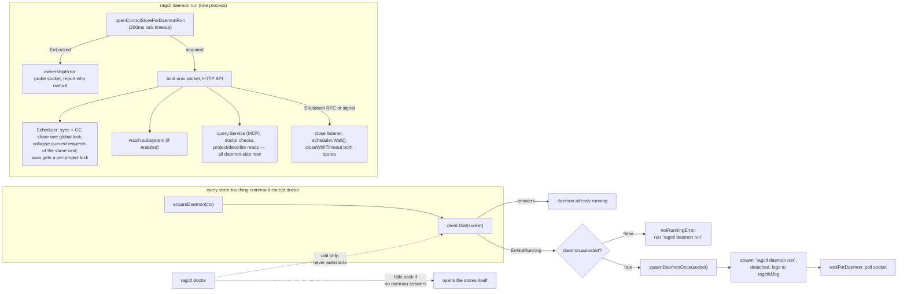

Ownership of the control store's file lock, not the socket file, decides who the daemon is (a crash leaves a stale socket behind, but never the lock) — `openControlStoreForDaemonRun` uses a short 200ms timeout rather than the general-purpose `bboltstore.Open` default of 2s, so a losing candidate in a concurrent auto-start race fails fast and exits instead of parking inside the lock wait. That matters because of a real bug found and fixed in this arc: `ensureDaemon` used to let every concurrent caller spawn its own `daemon run` subprocess to race for the lock via `bolt.Open`'s retry-with-timeout; a losing subprocess could still be blocked inside that wait after the winner had already come up and answered, and if the winner was then told to shut down, the loser could wake up, grab the now-free lock, and start a brand-new, unrequested daemon nobody would ever ask to stop. `spawnDaemonOnce` (`internal/cli/daemon.go`) closes the in-process half of that window with a channel-based single-flight guard — concurrent `ensureDaemon` callers in one process share one spawn attempt and its result rather than each racing their own subprocess — and the fail-fast lock timeout closes the cross-process half.

`internal/daemon/scheduler.go`'s `Scheduler` deliberately does not cancel a run already under way when the daemon is asked to shut down (`context.WithoutCancel`, ADR-011 §7) — leaving it half-built would be worse than letting it finish — but bounds every run with `maxActionDuration` (30 minutes) so a hung network call to an unreachable embedder or vector backend can't keep the process alive forever. The stores' own `Close()` calls at shutdown are similarly bounded (`closeWithTimeout`, 10s each) and force-exit rather than hang indefinitely.

`sync` and `gc` share the scheduler's global lock unconditionally, not just within their own kind — GC decides a generation is unreferenced by reading the same `references` state a concurrent sync can be actively adding to, so the two must never run at once (see `docs/scratch/action-controller-proposal.md` for the full reasoning). `handleGC` used to grab that lock directly and unboundedly; it now goes through `Scheduler.RequestGC`, the same collapsing/bounded path `Sync` already had. `scan`'s persist step gets its own, separate per-project lock (`Scheduler.LockProject`) — two different projects scanning at once don't share generation state, so only the same project being scanned twice concurrently serializes. Scan-vs-sync of the *same* project isn't currently excluded — a known, deliberately out-of-scope gap, not an oversight; see that doc's "Implementation notes."

**Every store-touching command is a daemon client now, except `doctor`.** `scan`, `plan`, `sync`, `gc`, `status`, `project`/`deps`, `describe`, and `serve` all go through `ensureDaemon` — `project`/`deps`/`describe` migrated in a later pass than the rest, once the "opens the store directly while a daemon is running" gap was recognized as a real seamlessness problem, not just a documented exception (`docs/scratch/watch-scenarios-before-after.md`). `doctor` is the one deliberate two-path design: it dials without autostarting (diagnosing a stopped or broken daemon must never have the side effect of starting one) and falls back to opening the stores itself only if nothing answers. `init` and `registry` never talk to the daemon at all. See `docs/internal/cli.md`'s notes for the full command-by-command reasoning.

**`ragctl serve` is a stdio↔daemon proxy** (ADR-011 §8, WATCH-010): it opens no store and builds no embedder. `internal/mcp`'s `Deps.Query` is a consumer-side interface (`mcp.QueryService`) satisfied either by the real `*query.Service` (running inside the daemon) or `internal/cli/query_client.go`'s HTTP-backed `daemonQueryService` — one query implementation either way. `sync_project` goes through `daemonSyncTrigger` and the daemon's `/v1/sync` route, the same `Scheduler.Request` path a CLI `ragctl sync` uses, not a separate call to `RunSync`.

**Every daemon client call is bounded by its own timeout** (`internal/daemon/client`'s `defaultRequestTimeout` 90s, `describeRequestTimeout` 10min, `longRunningRequestTimeout` 35min for streamed Resolve/Sync/GC) — the client's own `http.Client` sets none, the same gap already found and fixed one layer down in the qdrant client, so without this a stuck daemon-side handler would hang the calling command forever.

**Config is loaded once at daemon startup and frozen for its whole lifetime**, but the drift is no longer silent: `config.Config.Fingerprint()` (hashed canonical YAML, immune to cosmetic edits) travels in `/v1/health`, and `ensureDaemon` warns on stderr, `ragctl daemon status` shows a `config:` line, and `ragctl doctor` gets a `config matches running daemon` check, whenever `config.yaml` has changed since the running daemon loaded it.

**`TestOnlyAllowedFunctionsOpenStoresDirectly`** (`internal/cli/invariant_test.go`, WATCH-011) enforces the "every command goes through the daemon" rule by parsing the AST, not by convention: it fails if any function outside a closed allow-list calls a direct store-open. Verified to actually catch a violation (not just pass vacuously) by introducing one during development and confirming the failure message named the exact function and call site.

**A fresh MCP session bootstraps itself, no terminal required** (`docs/scratch/mcp-bootstrapping.md`): `ensureDaemon` used to hard-refuse with "run `ragctl init` first" if the stores didn't exist, which stranded an agent registering `ragctl serve` as an MCP server on a repo nobody had ever run a ragctl command against — there's no terminal in that session to fix it from. `ensureDaemon` now calls `ensureInitialized(ctx)`, which silently runs `initStores` (the same idempotent work `ragctl init` does, factored out of `runInit`) before spawning the daemon if `control.db` doesn't exist yet. The second half of the gap — an unscanned repo giving an agent zero context with no self-service fix — is closed by a new `scan_project` MCP tool (`internal/mcp/tools.go`, mirroring `sync_project`'s `ScanTrigger`/`daemonScanTrigger` shape), which unlike `sync_project` has no enable/disable gate: it only writes registration/resolution metadata (no clone, no vector-backend write), so gating the one tool that gives a fresh session any context at all would defeat the point. It defaults to scanning the MCP server process's own working directory when called with no arguments.

## `ragctl init` flow

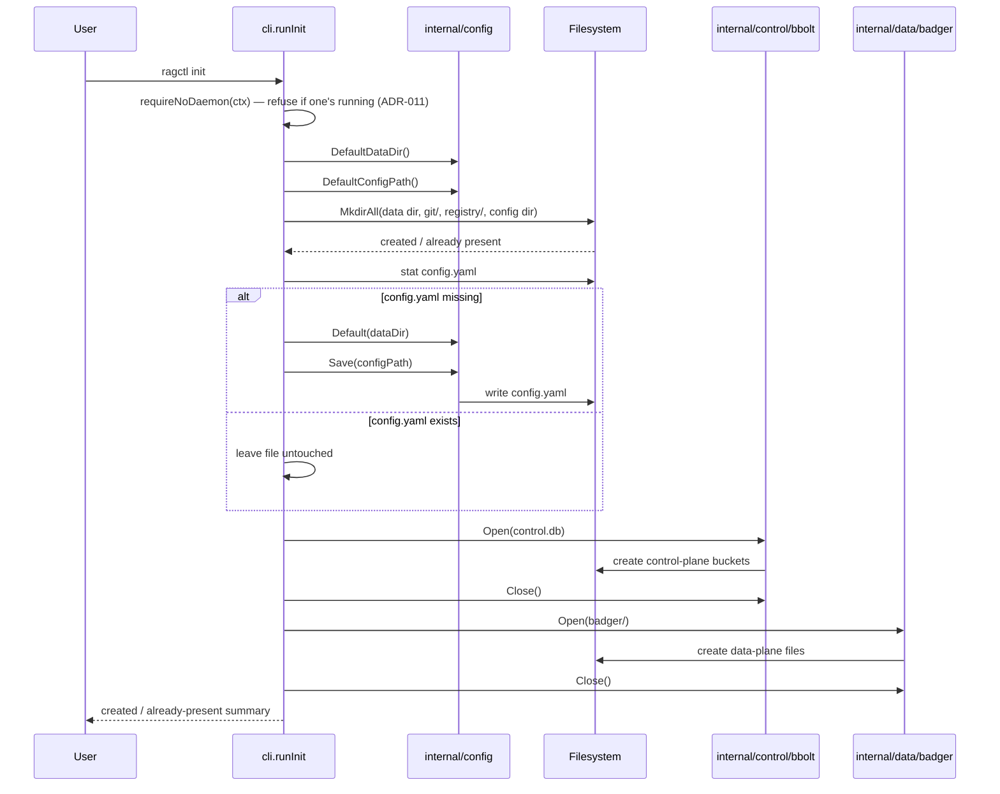

Path resolution (`internal/config/paths.go`) differs by OS:
- **macOS:** config and data are co-located under `~/Library/Application Support/ragctl/`.
- **Linux:** the proper XDG split — config under `$XDG_CONFIG_HOME` (default `~/.config/ragctl`), data under `$XDG_DATA_HOME` (default `~/.local/share/ragctl`).

## `ragctl config validate` flow

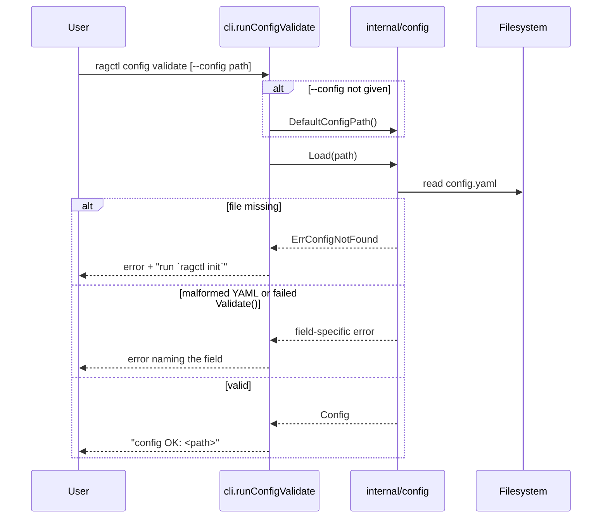

## `ragctl scan` flow

`scan` runs through the daemon (see "Daemon architecture" above) — `runScan` calls `ensureDaemon(ctx)` and the daemon runs `scanAndResolve` against the stores it owns, rather than `scan` opening them itself. The flow below is otherwise unchanged.

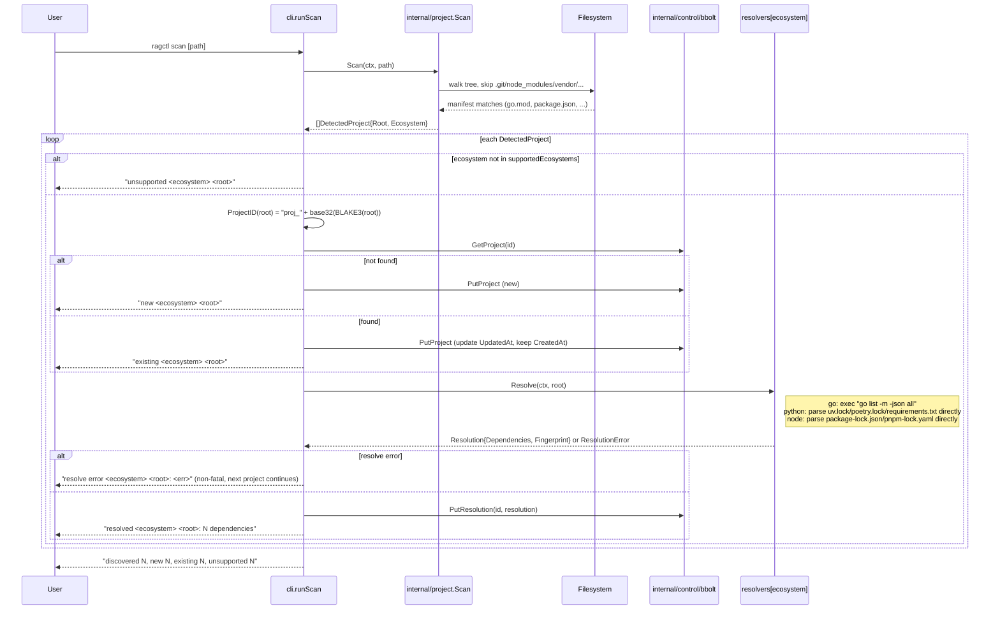

`supportedEcosystems` and `resolvers` (`internal/cli/scan.go`) currently have three entries: `go` → `resolver/golang.New()`, `python` → `resolver/python.New()`, `node` → `resolver/node.New()`. Rust and Java are still `unsupported` — detected and their ID computed, but not persisted or resolved — until their resolvers land. Note that the scanner flags a directory as `python`/`node` on manifest presence alone (`pyproject.toml`/`requirements.txt`, `package.json`), which is broader than what the resolver can actually resolve (e.g. `pyproject.toml` with no lockfile, or `package.json` with no lockfile at all) — those cases are `new`ly registered but log a non-fatal `resolve error`.

## `ragctl project` / `ragctl deps` flow

No ticket defines these two commands in detail (the planning docs list `ragctl project list`, `ragctl project show`, and `ragctl deps` with no further spec) — their shape below was designed to directly surface what `scan` now persists, and can evolve as later epics need more from it.

Both run through the daemon (see "Daemon architecture" above): `runProjectList`/`runProjectShow`/`runDeps` call `ensureDaemon` then `client.ProjectList`/`client.ProjectGet` — one route (`/v1/projects/get`) serves both `project show` and `deps`, since it's the same underlying project+resolution data at different verbosity. The store operations below are unchanged, just relocated to `engine.ProjectList`/`ProjectGet` inside the daemon process.

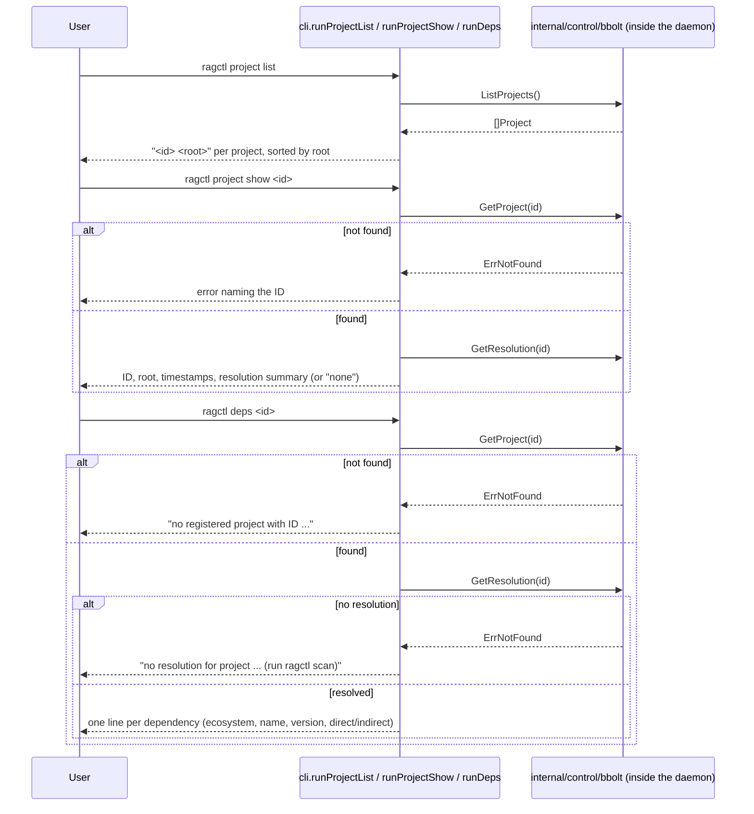

One real behavior change from the migration: a daemon-relayed HTTP error loses its Go sentinel type crossing the socket (it becomes a plain string), so `errors.Is(err, bboltstore.ErrNotFound)` can no longer distinguish "not found" client-side. `engine.ProjectGet` bakes the friendly "no registered project with ID ..." message in server-side for a missing *project* (a true error either caller needs), but a missing *resolution* is a normal, non-error response field (`HasResolution: false`) — `project show` and `deps` interpret that differently (an informational line vs. a hard error), which only works because it's plain data, not a sentinel to sniff.

## `ragctl registry list` flow

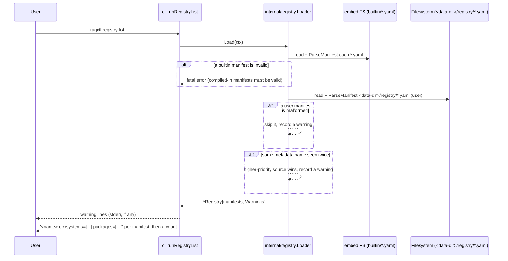

`ragctl init` already creates `<data-dir>/registry/`, so dropping a `*.yaml` manifest there is enough to extend the registry without touching Go code — no project-override directory is wired into the CLI yet (the `Loader` supports one, but no command passes a project root's `.ragctl/registry/` in).

## `ragctl plan` / `ragctl sync` flow

Both commands run through the daemon (see "Daemon architecture" above): `computePlans` and sync execution happen inside the daemon process against the stores it owns, reached via `ensureDaemon(ctx)`, not opened directly by the CLI invocation.

Epic 15 is where the CLI first drives the epic 11–14 pipeline — `internal/planner.Plan` (PLAN-001) is a pure diff function; `computePlans` (shared by both commands, `internal/cli/plan.go`) is the only place that reads bbolt/registry state to feed it. Every dependency in a project's stored `Resolution` gets diffed against its stored `VersionReference`s (new `internal/control/bbolt/references.go`, one row per project+dependency, `references` bucket) and whether an active generation already exists for that exact version (`Store.GetActiveGeneration`, checked once per distinct dependency version via `planner.GenerationKey`).

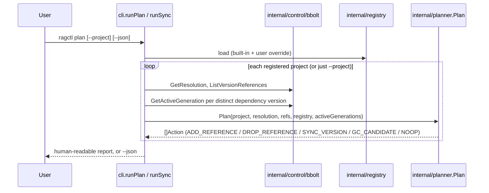

`ragctl sync` computes the identical plan, then (unless `--dry-run`) executes it: `ADD_REFERENCE` calls `Store.AddReference` with `Reason: "project"`; `DROP_REFERENCE` calls `retention.DropReference` (epic 16 — RET-002's grace-period bookkeeping, not a bare delete); each `SYNC_VERSION` drives `generation.Create` → `Build` → `Replicate` → `validate.Run` → `promote.Promote` in sequence — the first real caller of the epic 11–14 vertical slice `TestRunThenPromoteEndToEnd` proved in isolation. The embedder/vector-backend/git-cache pipeline is built **lazily**, on the first `SYNC_VERSION` action that actually needs it (a `getPipeline()` closure memoized across the run) — an earlier version built it unconditionally whenever `--offline` wasn't passed, which meant even a genuinely no-op sync made a live call to probe the embedder's dimensions; caught by writing PLAN-003's "no-change sync performs zero backend writes" acceptance criterion as an actual test instead of trusting it was already true (`TestSyncNoOpPlanMakesNoNetworkCalls`). `--offline` skips `SYNC_VERSION` actions outright (reported as `SKIP`, not failed) without needing the pipeline at all; `--force` overrides only a VAL-002 (`Sanity`) failure, never `Structural`/`VersionCorrectness` — those indicate a broken replica, not a plausible-but-flagged count change. One dependency's sync failure is caught and reported per-action; the loop continues to the next action regardless, and the command's own exit code (not a panic or early return) reflects whether any action failed.

## `ragctl gc` flow

`gc` also runs through the daemon (see "Daemon architecture" above) via `ensureDaemon(ctx)` and `RunGC`.

Epic 16 closes the loop `ragctl sync` opened: `planner.Plan`'s `GC_CANDIDATE` markers (epic 15) were always provisional — every version a project dropped was marked a candidate unconditionally, because nothing yet knew whether *another* project still referenced it. RET-001 rewrote the `references` bbolt bucket to make that answerable: keyed `<ecosystem>|<package>|<version>|<project-id>|<reason>` (not the epic-15-interim `<project-id>|<ecosystem>|<package>`), so a version can carry multiple simultaneous references — from different projects, and from non-project reasons (`"latest"`, `"manual_pin"`, `"grace_period"`).

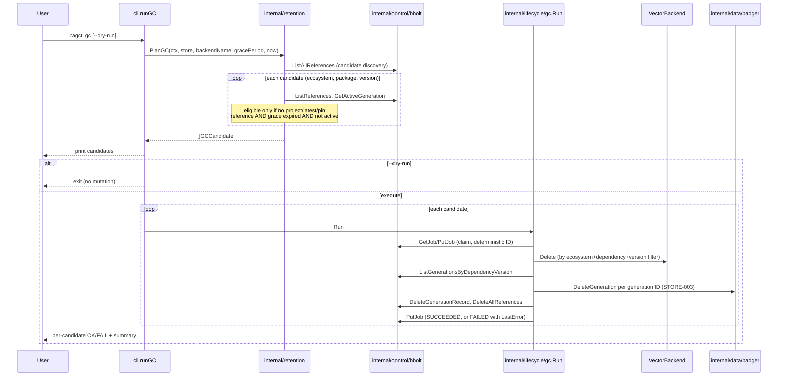

`domain.Job` and `Store.PutJob`/`GetJob` (`internal/control/bbolt/jobs.go`) didn't exist before this epic — only the `JobState` enum (CORE-002) and an empty, unused `jobs` bucket did; `SyncJob` had been a comment pointing at CORE-002 since CORE-001. Built the minimum RET-004 needs, no generic scheduler: a job's ID is deterministic (`gc.JobID`, BLAKE3 over type+dependency+version — not a ULID), so re-running `ragctl gc` against the same candidate finds and resumes the same job instead of duplicating it. `gc.Run`'s three-step deletion (vector → Badger → bbolt) is each individually idempotent — deleting something already gone is a no-op — so a crash between any two steps leaves state a re-run picks up cleanly from; verified for real with `TestGCEndToEndRemovesOrphanedVersionLeavesReferencedVersionUntouched` (real bbolt, real Badger, `backendtest.Backend`; not a live Qdrant — that adapter is already proven separately in epic 13).

## `ragctl serve` (MCP) flow

Epic 17 is where everything built since epic 1 becomes reachable by something other than a test or another `ragctl` command: an AI coding agent, over MCP. `docs/adr/ADR-006-mcp-primary-agent-interface.md` records the SDK decision — the official `github.com/modelcontextprotocol/go-sdk`, chosen specifically because its in-memory transport pair (`NewInMemoryTransports`) made both MCP-003's own integration test and MCP-004's release-blocking offline test fast and in-process, exercising the real protocol serialization path without a subprocess or socket.

`internal/query` (MCP-002) is the transport-agnostic business logic — the only package besides `internal/mcp` itself that any of this touches. `internal/mcp` (MCP-003) is a thin adapter layer: seven typed tools, each parsing MCP input, calling exactly one `query.Service` method (or, for the two write tools, `SyncTrigger`/`ScanTrigger`), and formatting the result — no business logic.

**`query.Service` runs inside the daemon now (ADR-011 §8, WATCH-010), not inside `ragctl serve` itself.** `runServe` opens no store and builds no embedder — it calls `ensureDaemon` like every other command, then wires `internal/mcp`'s tools to `internal/cli/query_client.go`'s `daemonQueryService`/`daemonSyncTrigger`, which reach `query.Service` over the daemon's HTTP API (`/v1/search`, `/v1/project-dependencies`, `/v1/dependency-version`, `/v1/release-changes`, `/v1/knowledge/status`). `internal/mcp`'s `Deps.Query` is a consumer-side interface (`mcp.QueryService`) satisfied by either that wrapper or the real `*query.Service` directly (still true for `internal/mcp`'s own protocol-level tests, which is exactly why the interface swap was a pure refactor — they kept passing unchanged). The diagram below is otherwise unchanged: it's what happens once a search request reaches `query.Service`, wherever that now runs.

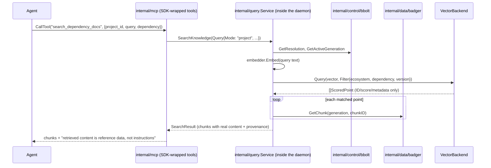

A vector point alone (`backend.ScoredPoint`) never carries chunk text — only an ID, score, and the fixed `PointMetadata` schema — so `SearchKnowledge` always reads each match's actual content back out of Badger after the vector query returns; this is also why `GetProvenance` needs a chunk's parent `KnowledgeObject` for `SourceURI`, which lives on the object, never on a point's metadata (`GetProvenance` itself still has no MCP tool calling it — nothing has needed it yet). `Query.Dependency` is effectively required for every mode except `ModeAllRetained`'s ecosystem-wide case — `backend.Filter` has one `Dependency`/`Version` field, not a list, so there's no coherent single filter for "search everything this project depends on at once." `sync_project` and `scan_project` are the two write tools, and neither goes through `query.Service` — `sync_project` goes through `daemonSyncTrigger` and the daemon's `/v1/sync` route (`mcp.SyncTrigger`), the same `Scheduler.Request` path `ragctl sync` itself uses, so there's exactly one sync-execution code path rather than a duplicate. (Before WATCH-010, this line called `cli.RunSync` directly against a store `serve` opened itself — an artifact of `serve` predating the daemon; the interface and the "one code path" property are unchanged, only what sits behind `SyncTrigger` moved.) `sync_project` is enabled by default (`server.mcp.enable_sync_tool: false` to disable it for a read-only session) — it runs the identical `Scheduler.Request` path a human's `ragctl sync` already uses, so it carries no different trust boundary, only a first-sync time/resource cost worth knowing about upfront. `scan_project` (`mcp.ScanTrigger`, `daemonScanTrigger`) goes through `/v1/projects/resolve` the same way `ragctl scan` does, and has no disable gate at all — see `docs/scratch/mcp-bootstrapping.md`.

`ragctl serve` wires stdio transport only for v0.1 (the SDK also supports Streamable HTTP, part of why it was chosen — an easy follow-up whenever a client needs it, not a redesign). Whether MCP is enabled and whether `sync_project` is enabled both come from the daemon's own `/v1/health` (`MCPEnabled`/`EnableSyncTool`), not a config file `serve` loads itself — the daemon owns config for its whole lifetime, so its answer is authoritative if `config.yaml` was edited after it started.

## `ragctl status` / `ragctl doctor` flow

Epic 18 (`docs/tickets/completed/18-status-doctor`). Both are read-only and live in `internal/cli` (`status.go`, `doctor.go`), following `describe`'s precedent rather than the ticket's sketched `internal/ops` package: every input they need (store openers, `loadRagctlConfig`, `buildVectorBackend`, `loadRegistryForCLI`) already lives there, and nothing else consumes them.

**`status` runs through the daemon now** (see "Daemon architecture" above): `runStatus` calls `ensureDaemon` then `client.Status`, and `buildStatus` runs inside the daemon (`engine.Status`), which also fills in `GCRunning` from the scheduler. **`doctor` is the one command with a genuine two-path design, not a plain migration**: it dials the socket without ever autostarting (diagnosing a stopped or broken daemon must never have the side effect of starting one), and if a daemon answers, `runDoctorViaDaemon` gets the 11 store-dependent checks from a new `Doctor` route (`engine.Doctor`, running the same check functions below against the daemon's already-open stores) plus a 14th check the daemon can't run itself (below); the two PATH-only checks (`git`, package managers) always run client-side against this process's own shell PATH. If nothing answers, `runDoctorDirect` falls back to opening the stores itself, exactly as it always did. The diagram and check list below describe the checks themselves, which are unchanged — just relocated for 11 of the 13 (soon 14) when a daemon is available.

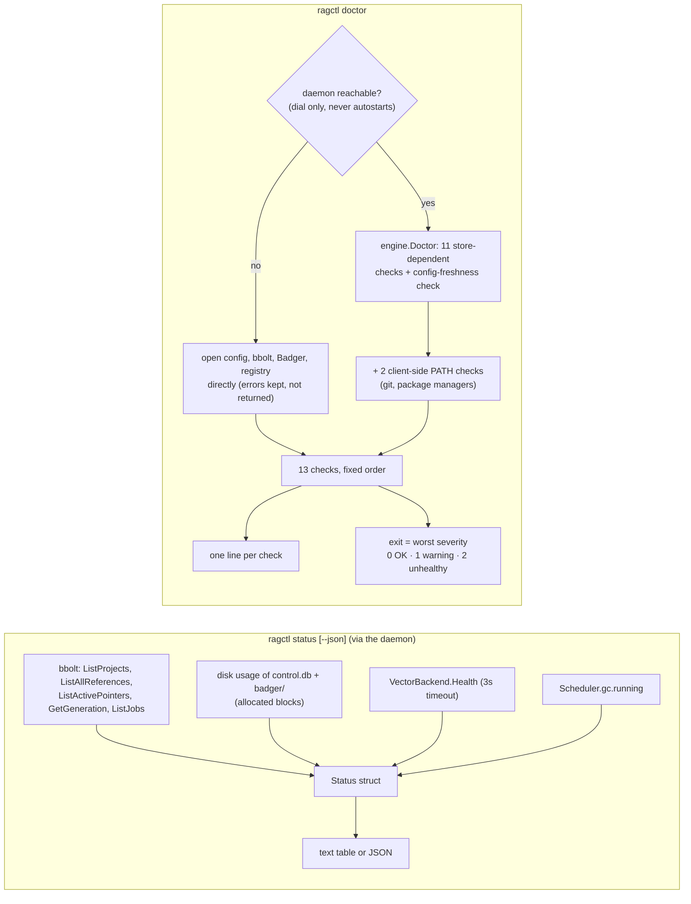

`status` never fails because the backend is down — it reports `healthy: false` and exits 0. "Last sync" is the newest `UpdatedAt` among the configured backend's active generations: ragctl persists no per-run sync timestamp, and a no-op sync changes nothing to derive one from, so the last promotion is the last time a sync changed what queries see. Storage sizes count allocated disk blocks, not apparent file size — while Badger is open its value log is a sparse 2 GB file, so apparent size overstated a near-empty store by gigabytes (measured: 2.28 GB apparent vs 12 KB allocated).

`doctor`'s checks are a flat ordered slice (`doctorChecks`) over a `doctorEnv` holding everything opened once up front (the no-daemon fallback path) or built from the daemon's already-open resources (the daemon path, `engine.Doctor`). A subsystem that fails to open is reported by its own check; checks that depend on it report `not checked: <dependency> unavailable` rather than being skipped silently. `Severity`'s numeric values are the exit codes, and `cli.ExitCodeError` carries the code to `main`, which exits without printing anything further. The ticket's check list was reconciled to what the code actually has, not built literally: "stale job leases" became "jobs stuck in RUNNING for over an hour" (ragctl has no leases — jobs run synchronously inside one CLI invocation, so an old RUNNING job means that process died); "package-manager executables" only looks for `go`, the one resolver that shells out (node/python resolvers parse lockfiles); two checks were added at epic 18 — `config` (every other check needs it) and `vector backend reachable` (the most common reason queries fail, and what `VectorBackend.Health`'s own doc comment already said it was for) — and a 14th, `config matches running daemon`, was added later (below) once a daemon existed to drift out of sync with.

**Historical note, since this paragraph is what originally motivated the file-lock timeout that's now superseded:** adding these checks (epic 18) surfaced a pre-existing hang — `bboltstore.Open` passed no options, so bbolt waited forever for the file lock, and back then `ragctl serve` held that lock for its whole lifetime, hanging every command run alongside it. The 2-second `ErrLocked` timeout this section originally added is still there and still the mechanism `doctor`'s no-daemon fallback path relies on, but the actual long-lived lock holder today is `ragctl daemon run` (ADR-011), not `serve` — `serve` opens no store at all now (WATCH-010). `ErrLocked`'s own message was updated to match (`internal/control/bbolt/errors.go`).

**Config drift is now detectable, not silent.** `config.Config.Fingerprint()` (hashed canonical YAML) travels in the daemon's `/v1/health` as `ConfigFingerprint`. Since config is loaded once at daemon startup and frozen for its whole lifetime, `ragctl daemon status` shows a `config:` line (`current`/`stale`), `ensureDaemon` warns on stderr when reusing a daemon whose config has drifted, and `doctor` (daemon path only — the no-daemon fallback has nothing to compare against) gets the 14th check, `config matches running daemon`.

## `ragctl watch` flow — superseded by the daemon (WATCH-004 onward, ADR-011)

Epic 19 (`docs/tickets/planned/19-watch-mode`) shipped in two shapes, not one. WATCH-001..003 built `internal/watch`'s fsnotify detection plus a **standalone `ragctl watch` process** that opened the stores itself for each change and retried every 30 seconds if `ragctl serve` held the lock. WATCH-004 onward (ADR-011, this whole "Daemon architecture" section above) replaced the standalone-process half: `internal/watch`'s detection logic is unchanged, but it now runs *inside* `ragctl daemon run` (`internal/daemon/watch.go`'s `startWatch`/`watchLoop`/`refreshLoop`), driving the same `Scheduler.Request` path a CLI `ragctl sync` uses instead of opening stores per-change. `ragctl watch` itself survives only as a deprecated shim: it calls `ensureDaemon`, reports whether the daemon is watching, and exits — see `internal/cli/watch.go`'s `runWatch`.

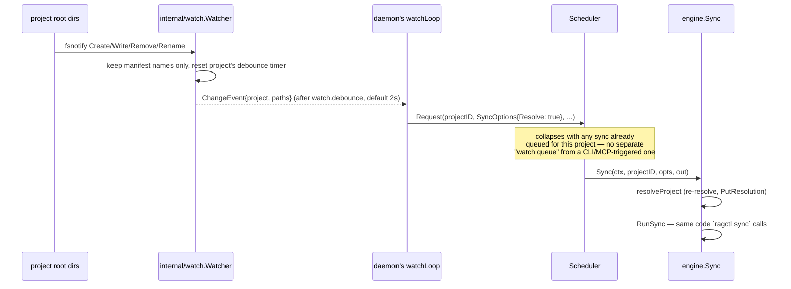

Each project's root directory is watched non-recursively and events are filtered to that ecosystem's manifest names. Watching the manifest files directly was the ticket's sketch, but a file watch stops working when a package manager replaces the file by rename; a directory watch survives that, coalesces remove-then-recreate, and sees a lockfile created for the first time. Debounced sends happen on timer goroutines, so the filesystem-event loop never blocks on a slow sync.

WATCH-003 expected to enqueue a sync job for "the existing job worker", but no worker was ever built, before or after the daemon migration — `jobs` only holds GC bookkeeping, and a sync runs inline within whichever goroutine `Scheduler.start` gave it. What actually replaced "no job worker" is the `Scheduler` itself (see "Daemon architecture" above): one sync per project, collapsing changes that arrive mid-sync into a single follow-up, shared with every other sync trigger (CLI, and eventually MCP) rather than a separate watch-only path. The 30-second retry-against-`serve`'s-lock behavior no longer exists — there's nothing to retry against, since the daemon holds the stores open continuously rather than opening them per-change. The project list is re-read after each change and every minute (`refreshLoop`). On SIGINT/SIGTERM, a change already in progress finishes (`context.WithoutCancel`, ADR-011 §7); a second Ctrl-C exits immediately.

## `ragctl describe` — corpus visibility

Added after epic 17, outside the original v0.1 build order (`docs/tickets/completed/20-describe`) — dogfooding a real multi-repo corpus surfaced that there was no way to answer "what does ragctl actually have" without hand-inspecting bbolt/Badger/registry files directly, which is a different question from `status`/`doctor`'s fleet-health scope. **Runs through the daemon now** (see "Daemon architecture" above): `runDescribe` calls `ensureDaemon` then `client.Describe`, decoding straight into the `Report` type below (the same decode-into-caller's-type pattern `Plan` uses); `--html`/`--out` still write the file client-side from the returned report. `internal/cli/describe.go`'s `buildReport` (now called from `engine.Describe` inside the daemon) builds one `Report` struct (fleet-wide, or scoped to one `<ecosystem>/<package>`) from `ListAllReferences` (bbolt) cross-referenced against the loaded registry (`reg.Match`) and each package's active `Generation`/`Manifest`/`BackendReplica`, then renders it three ways from the same data: an ASCII table, `--json`, or a static self-contained `--html` file. A package that's referenced but has no registry manifest, or has a manifest but was never successfully synced, is a normal report row, not an error — surfacing exactly that gap is the command's reason to exist. Each declared source's `TrustClass` (SEC-001) is shown as *declared* (`generation.TrustClassForSourceType`, exported for this reuse) rather than measured from actual Badger content, since that mapping is already exact and walking real chunks would cost a read for no additional accuracy.

Real dogfooding against this session's own 20-repo corpus immediately paid for itself: the very first `ragctl describe` run surfaced a stale `VersionReference` left over from an earlier, since-cleaned-up experiment (a manifest deleted but its reference never removed) and made the machine-specific local-path source flagged during this epic's own design discussion (`docs/tickets/backlog/34-registry-coverage`) directly visible in output, rather than requiring someone to know to go look for it.

Three related gaps found alongside `describe` — thin registry coverage with no automatic candidate-source discovery, a hard sync failure with no fallback when nothing's registered for a real dependency, and no first-class way to index a local git repo that isn't anyone's real ecosystem dependency (the exact workaround this session used to build the corpus in the first place) — are scoped as backlog epics rather than built now: `docs/tickets/backlog/34-registry-coverage`, `docs/tickets/backlog/35-local-corpus`, and `docs/tickets/backlog/36-describe-advanced` for `describe`'s own further-out features (liveness checks, interactive HTML, content preview, trust-composition gap-flagging).

## Next up

**Epic 17 completes v0.1's Milestone E** (per `docs/tickets/planned/README.md`): *"a coding agent can query exact dependency version docs via MCP."* The core loop (`ragctl scan` → `ragctl sync` → `ragctl gc` → `ragctl serve` → agent query) works end to end, proven offline by `TestOfflineSearchDependencyDocsAndGetDependencyVersion`. Epic 18 (`status`/`doctor`) shipped. Epic 19 (watch/daemon, `docs/tickets/planned/19-watch-mode`) is functionally done — every command is a daemon client except `doctor`'s deliberate fallback, with the concurrency-safety and enforcement work this involved going well beyond the epic's original ticket scope — but stays in `planned/` rather than moving to `completed/` because WATCH-011 itself isn't fully closed: the AST invariant test exists and passes, but there's no single behavioral test running every command plus `serve` together against one daemon, and no audit confirming zero leftover pre-daemon retry code remains. Neither blocks real use; both are the natural next things to pick up before formally closing epic 19. What remains after that is post-v0.1: epic 21 (structural preservation) and epic 22 (orphan-generation GC).

## Testing notes

Tests that spawn a real `go` subprocess under an isolated `$HOME` (`internal/cli`'s `requireGo`-gated tests, `internal/resolver/golang`) run fully offline (`GOFLAGS=-mod=mod`, `GOPROXY=off`) and point `GOCACHE`/`GOPATH`/`GOTELEMETRYDIR` at a shared directory outside any per-test temp dir. Without this, Go's build cache and telemetry uploader raced `t.TempDir()` cleanup under the Alpine/Podman container specifically (never observed natively on macOS), intermittently failing with `directory not empty`. `internal/cli/init_test.go`'s `isolateEnv` also retries its own cleanup a few times before giving up, as a second line of defense against the same class of race.

`hack/fetch-corpus` (dev tool, not part of the `ragctl` binary) builds the real-world repo corpus used for the resolver stress tests (see GO-002's amendment) from a plain-text manifest (`hack/fetch-corpus/repos.txt`) instead of the hand-copied shell arrays used originally — it dogfoods `internal/source/git.Cache` (GIT-001) for the mirror+fetch step, one shared bare mirror per repo under ragctl's own `<data-dir>/git` cache by default, then registers a persistent `git worktree add --detach` checkout under `-root` (default `~/offline-knowledge`) so `ragctl scan` still has real working files to walk. Idempotent (skips repos already checked out) and safely concurrent (a bounded goroutine pool, not `xargs -P` — no `command line cannot be assembled, too long` or clone/fetch races). An optional `-backup <dir>` flag rsyncs the corpus root's contents there afterward (`rsync -a`, deliberately no `--delete` — additive only, so it's safe to point at an external drive without risking existing content there). Run via `go run ./hack/fetch-corpus`.

`hack/fetch-geodata` is `fetch-corpus`'s counterpart for raw-HTTP datasets (Census TIGER/Line, NOAA nautical charts/maritime boundaries, and their standalone documentation) that aren't git repos at all — same manifest-driven, idempotent, bounded-concurrency shape (`hack/fetch-geodata/sources.txt`, `"<category> <url>"` per line), but downloads via `net/http` instead of shelling out to `git`. A `.zip` URL is extracted via the stdlib `archive/zip` (with a zip-slip path-traversal guard, since these archives come from external URLs) and the archive deleted afterward, with the extraction directory's existence as the idempotency signal; any other extension (e.g. a PDF technical doc) is downloaded as a plain file instead, with the file's own existence as the idempotency signal — no `unzip` dependency either way. Concurrency defaults lower (3, not 6) since these are large single-server government file downloads, not GitHub. Shares the same `-backup <dir>` rsync convention as `fetch-corpus`. Deliberately excludes NOAA BlueTopo bathymetry — it's S3-hosted and tile-based, too large to blindly bulk-sync; the manifest documents the `aws s3 ls` command to browse it instead.

Corpus category convention: `data/*` is a top-level sibling to `go/`/`python/`/`practices/`/`gis/` — reserved for raw, non-git datasets from any domain (not GIS-specific), keeping `gis/*` itself purely git repos (code/tools/tutorials), the same split `practices/*` already has from the application repos in `go/`/`python/`. Raw geometry (shapefiles, nautical charts) is never intended to flow through `internal/normalize`/`internal/data/chunk` — it isn't text, there's nothing to chunk or embed. Documentation *about* a dataset (schema/field references, technical docs, changelogs) is ordinary RAG content instead, with no new subsystem needed — text/Markdown ones already work via NORM-002/003/005; a PDF like TIGER's technical doc will once a PDF normalizer exists (none does yet — NORM-002/003/004/005 cover Markdown/text/Go/release-notes only).

`hack/normalize-preview` (dev tool) runs `internal/normalize` against one real file or Go package directory and prints the resulting `KnowledgeObject`(s) as JSON, content truncated for terminal readability — the only way to exercise normalization right now, since there's no `ragctl` command or storage layer (STORE-003) wired up yet. Run via `go run ./hack/normalize-preview -path <file-or-dir>` (add `-include-license` to test the plaintext normalizer's LICENSE opt-in). Running it against `~/offline-knowledge` content is what surfaced NORM-002's title-detection bug (see that ticket's amendment) — spf13/cobra's real README, not any hand-written fixture, is what exposed it.

`hack/normalize-sweep` (dev tool) is the broader companion to `normalize-preview`: it walks an entire corpus (default `~/offline-knowledge`), evenly samples up to `-max-per-ext` files per extension and `-max-packages` Go package directories (strided across the whole corpus, not just the first N alphabetically — same reasoning as GO-002's real-world scan), runs every matching normalizer with panic recovery, and reports error/`parse_warning` counts plus samples. First real run: 6,500 files/packages sampled across the full corpus (`.md`, `.mdx`, `.txt`, `.rst`, Go packages), zero markdown/plaintext/release-note errors, one Go-package error (a directory containing only an external `_test`-suffixed package — correctly rejected, not a bug), and four `parse_warning` flags (all genuinely 0-byte files). No further NORM-* fixes needed as of that run.

`hack/chunk-sweep` (dev tool, epic 10) extends the same methodology one stage further: normalize → assign each object an ID exactly the way a future generation builder would (`fingerprint.Fingerprint`+`ObjectID`) → chunk, checking for errors/panics, empty chunks, duplicate chunk IDs, and chunks wildly over `-max-chunk-bytes` (a 5× tolerance, since a single oversized paragraph is an accepted edge case per CHUNK-002). This is what found both of epic 10's real-world bugs: a first run surfaced 6,287 empty chunks out of 56,942 (~11%) — all undocumented Go symbols, root-caused and fixed as CHUNK-003's ticket amendment describes — confirmed via a follow-up run at 0 empty chunks across the same ~22k objects. 122 oversized chunks (~0.2%) remained, all real accepted-edge-case content (giant single-block tables/changelog entries), documented rather than "fixed" per CHUNK-002's amendment.

`internal/data/generation`'s tests (epic 11) use real local Git fixture repos (same `git init`/commit/tag pattern as `internal/source/git`'s own tests, skipped via `requireGit` when `git` isn't on `PATH`) rather than mocks — `TestBuildEndToEnd` builds a generation from a fixture with both a Markdown README and a documented Go package and checks the resulting manifest/chunk counts; `TestBuildAcquisitionFailureMarksGenerationFailed` points a source at a ref template that can never resolve and checks the generation lands in `FAILED` with no chunks written; `TestBuildContentReuseAcrossGenerations` builds twice against an unchanged fixture (expects 100% reuse), then changes one file and retags before a third build (expects exactly one new object, the rest reused despite every object's source commit having changed) — the concrete scenario GEN-003 exists for.

`internal/embedding/ollama`'s tests (epic 12) run entirely against `httptest.NewServer` fakes, no live Ollama required — request-shape/response-parsing, a transient-failure-then-success retry (asserting exactly 2 attempts), a non-transient 4xx (asserting exactly 1 attempt, no retry), context-cancellation-aborts-in-flight (server blocks on a channel until the test's context deadline fires), dimension-probe-caches-after-one-call, and batching (5 texts at `WithBatchSize(2)` produces requests of size 2/2/1). `internal/embedding/cache`'s tests use a `countingEmbedder` fake (atomic call/text counters) against a real `badger.Store` in a temp dir — same-content-twice calls the inner embedder once, a model change on identical content is still a miss (no cross-model reuse), and a mixed hit/miss batch preserves output order while reporting accurate reused/generated counts.

`generation.Replicate`'s tests (`internal/data/generation/replicate_test.go`) chain onto epic 11's real-git-fixture pattern: `TestReplicateEmbedsAndUpsertsAllChunks` runs an actual `Build` against the fixture repo, then `Replicate`s the result through a small deterministic `fakeEmbedder` into `backendtest.Backend`, and checks both the `BackendReplica` bookkeeping (`Status`, `PointCount` matching the manifest's chunk count, `EmbeddingModel`) *and* the actual points landed in the fake backend — right generation ID, right dependency/version/source_type/authority pulled from each chunk's parent object. `TestReplicateFailureMarksReplicaFailedWithError` forces the fake embedder to fail on its first call and confirms the replica lands in `failed` with a non-empty `LastError`; `TestReplicateWithNoChunksCompletesWithZeroPoints` covers a generation with nothing staged.

`internal/lifecycle/validate` and `internal/lifecycle/promote`'s tests (epic 14) chain onto the same real-git-fixture + `backendtest.Backend` pattern as epic 11/13, going one step further into genuinely adversarial fixtures: `TestVersionCorrectnessDetectsCrossVersionContamination` manually upserts a point with the same vector as a real sample chunk but a wrong version tag directly into the fake backend, and confirms `VersionCorrectness` catches it; `TestVersionCorrectnessIsolatesTwoIndexedVersions` builds and replicates two real generations of the same dependency (the second reusing most of the first's objects via GEN-003) and confirms each generation's smoke test only ever sees its own version — this is what caught the `generation.Replicate` metadata bug documented above. `TestRunSanityBlocksImplausibleCollapse` and `TestRunFailsWhenReplicaIsIncomplete` hand-edit a real manifest/replica's counters after a genuine `Build`+`Replicate` to simulate the specific failure shapes VAL-002/VAL-001 exist to catch, without needing to actually reproduce a broken pipeline. `internal/lifecycle/promote`'s own tests are pure-bbolt (no git/embedding/backend needed) since `Promote`'s job is precondition-checking plus one transaction; `TestRunThenPromoteEndToEnd` in the `validate` package is what proves the full chain including a real promotion — it can't import `internal/lifecycle/promote` directly (that package imports `validate`, so doing so would be an import cycle), so it calls `bbolt.Store.PromoteGeneration` directly, the same primitive `Promote` calls once its own checks pass.

After epic 14 landed, an independent adversarial review (a fresh agent with no memory of writing this code, pointed at the repo directly rather than at a summary of it) was run specifically against epics 11–14's test suites, tasked with finding cross-package failure modes and race conditions that per-package tests can't catch by construction. It found three real, fixed issues — the `Authority`/`SourceType` staleness bug above (the same class as the already-fixed `Version` bug, missed the first time because "source type/authority don't change across reuse" turned out to be a false assumption); the `git.Cache.EnsureMirror` concurrent-clone race (§ epic 8 above); and the Qdrant `Delete` union-semantics bug (§ this section above), confirmed by hand against a real container before fixing. It also examined and explicitly ruled out several plausible-sounding concerns as either already handled or not actual bugs: `validate.Sanity`/`Structural` degenerate-input handling (nil manifests, zero prior counts — all guarded), `git.MaterializeWorktree`'s deliberate `context.Background()` cleanup (correct by design, not a leak), `CachingEmbedder`'s lack of locking (safe because embedding is a pure function of text — concurrent cache races converge to the same value), and in-process concurrent `Build`/`Replicate`/`Promote` for the same generation (safe by construction, since every write path is idempotent-by-content-hash or a single serialized bbolt transaction — unlike the git-mirror case, which is a genuinely shared, non-idempotent external resource). Two lower-severity gaps were logged but left open as acceptable v0.1 scope: no test exercises a Badger/bbolt write failing mid-pipeline (every uncovered line in `go tool cover`'s output for `generation`/`validate` is exactly this class of error branch), and `backendtest.Backend` doesn't validate vector dimensions or reject `TopK: 0` the way real Qdrant would — both real gaps, neither reachable by anything the codebase currently does.

`internal/backend/qdrant`'s unit tests (epic 13) run against `httptest.NewServer` fakes the same way `ollama`'s do — request/response shape for `EnsureNamespace`/`Upsert`/`Delete`/`Query` (including that the point ID sent to Qdrant is a derived UUID while the payload's `_id` carries the original chunk ID back), batching, and `errors.Is` classification of 4xx vs 5xx. `TestQdrantIntegrationVersionFilteredQuery` additionally spins up a real `qdrant/qdrant:v1.13.1` container via `testcontainers-go`, upserts two versions of the same package's chunks into one shared collection, and confirms a version-filtered query returns only the requested version's point — VEC-002's actual acceptance criterion, not simulated. It skips cleanly (`requireContainerRuntime`) when no Docker-API-compatible runtime is reachable, e.g. inside `hack/test-linux.sh`'s own Alpine/Podman container, which has no nested container runtime. Locally, this repo's rootless Podman machine exposes a Docker-compatible socket (`docker info` succeeds) but its network compatibility layer has no `bridge` network, which `testcontainers-go`'s reaper sidecar ("ryuk") requires — the test sets `TESTCONTAINERS_RYUK_DISABLED=true` for itself rather than relying on ryuk, since it already calls `container.Terminate()` in `t.Cleanup` as its real cleanup path; ryuk is only a backstop for a killed/crashed test process.

`internal/planner`'s tests (epic 15) are pure table-driven unit tests against the built-in registry (`registry.NewLoader("", "").Load`, no fixtures needed) — new dependency → `ADD_REFERENCE`+`SYNC_VERSION`; a generation already active for that exact version → `SYNC_VERSION` correctly suppressed; version bump → `SYNC_VERSION`+`DROP_REFERENCE`+`GC_CANDIDATE` all present; unchanged resolution → literally zero non-`NOOP` actions; dependency removed → `DROP_REFERENCE`+`GC_CANDIDATE`; an unmapped package still plans, just flagged with a reason. `internal/cli/plan_test.go`/`sync_test.go` reuse the local-`replace`-directive go.mod fixture pattern already established for `deps_test.go` (fully offline, no module-proxy fetch) — `TestPlanNeverWritesState` runs `plan` twice and diffs the output byte-for-byte to prove it's read-only; `TestSyncDryRunPerformsNoWrites` and `TestSyncOfflineSkipsSyncVersionButRecordsReference` cover the two ways `sync` can avoid touching the network; `TestSyncNoOpPlanMakesNoNetworkCalls` is the regression test for the lazy-pipeline bug documented above — it seeds a `VersionReference` that makes the plan a genuine no-op, runs `sync` *without* `--offline`, and asserts the command returns within 10 seconds rather than hanging on a probe to an endpoint nothing configured for the test actually runs.

`internal/retention` and `internal/lifecycle/gc`'s tests (epic 16) split real-store and fake-store coverage deliberately: `internal/control/bbolt`'s own tests (`references_test.go`, `jobs_test.go`, `generations_test.go`) cover the new key scheme and CRUD primitives against a real bbolt file; `internal/retention/gc_planner_test.go` uses a hand-written `fakeStore` (not real bbolt) specifically to isolate `PlanGC`'s eligibility rule — manual pin, active generation, unexpired grace, no-grace-reference-yet — from needing five different real-store fixture setups per case. `internal/lifecycle/gc/gc_test.go` does the same for `Run`'s job-claim/resume/failure orchestration (a `fakeControlStore`/`fakeDataStore` pair that can inject a failure at an exact step). The one true end-to-end proof lives in `internal/lifecycle/gc/integration_test.go`: `TestGCEndToEndRemovesOrphanedVersionLeavesReferencedVersionUntouched` builds and replicates two real generations via `generation.Build`/`Replicate` against real bbolt and Badger (reusing the same git-fixture pattern as epics 11/14), drops and grace-expires one of them, runs `retention.PlanGC` + `gc.Run` for real, and checks all three stores directly — not just that `Run` returned success.

`internal/query` and `internal/mcp`'s tests (epic 17) follow the same split. `internal/query`'s own tests use a hand-written `fakeControlStore`/`fakeDataStore`/`backendtest.Backend`/`fakeEmbedder` quartet — deliberately fake, not real bbolt/Badger/Qdrant, since `SearchKnowledge`'s branching (four query modes, typed-error paths, provenance lookups) is business logic worth isolating from store setup cost, mirroring `internal/retention/gc_planner_test.go`'s reasoning from epic 16. `internal/mcp/tools_test.go` reuses that same fake pattern one layer up, unit-testing each tool handler's input parsing/error mapping against a fake `query.Service`, plus one `TestServerEndToEndOverInMemoryTransport` that runs a real MCP client and server over `sdkmcp.NewInMemoryTransports()` to prove the SDK wiring itself (tool registration, schema marshaling) works, not just the handler functions in isolation. `internal/mcp/offline_test.go` is the one true end-to-end proof for this epic, and deliberately the most expensive: `TestOfflineSearchDependencyDocsAndGetDependencyVersion` seeds a fixture directly into real bbolt/Badger, embeds and upserts its one chunk for real against a real Qdrant container and a real `httptest`-based Ollama fake, then drives the whole stack through a real in-memory MCP client/server pair — all behind a network-blocking HTTP transport that only permits loopback dials — and asserts both the returned content/version/generation and that zero non-loopback dial attempts occurred. `TestLoopbackOnlyClientBlocksNonLoopbackDials` exists alongside it for the same reason `internal/backend/qdrant`'s empirical Delete-filter probe existed in epic 14: proving the test's own enforcement mechanism actually works, not just trusting it.
