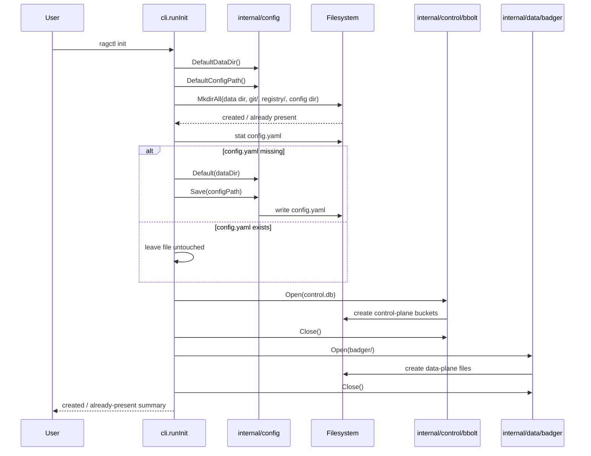
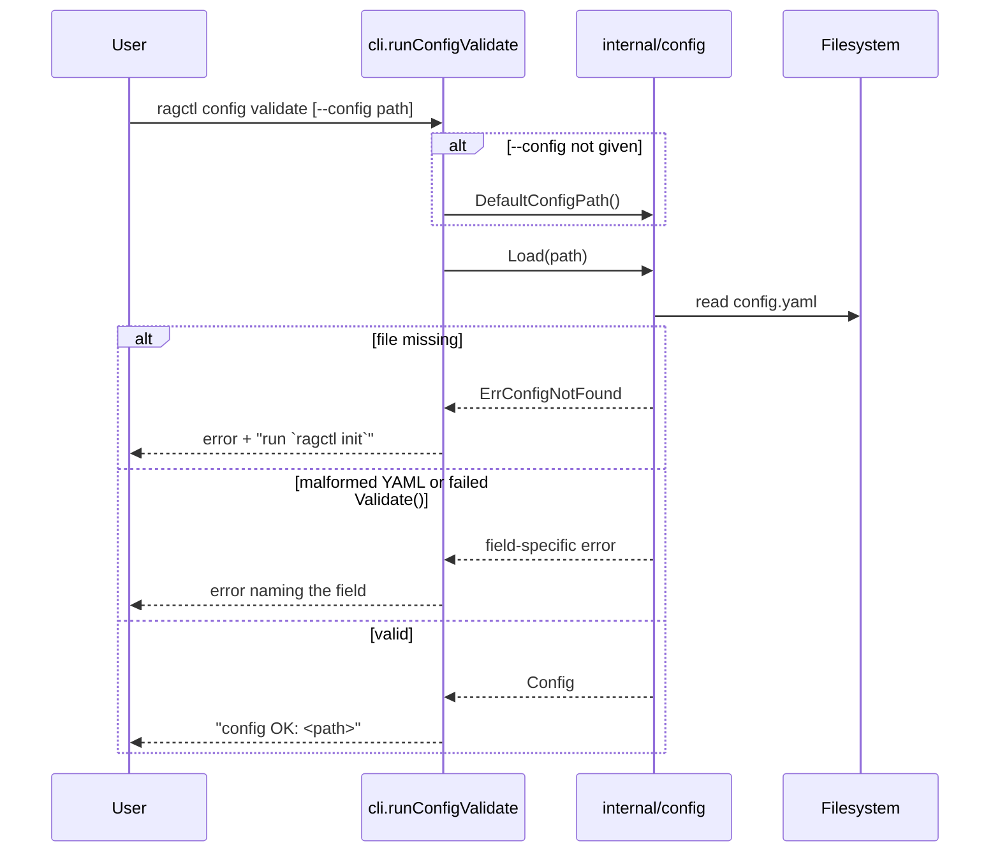
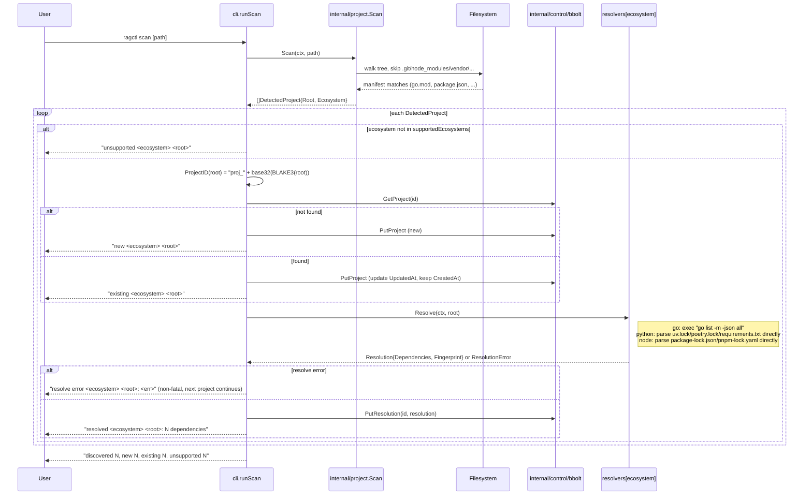
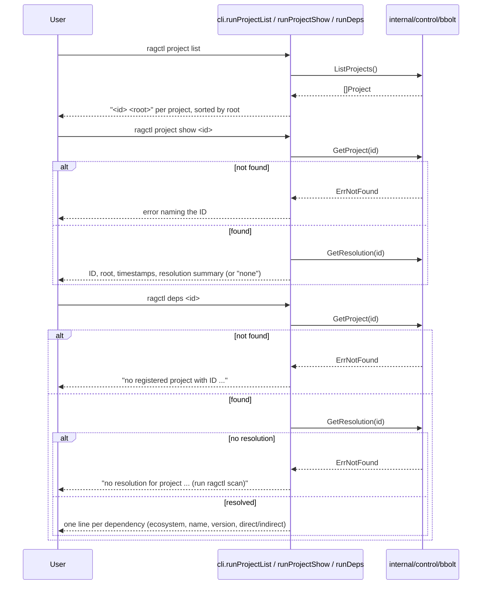
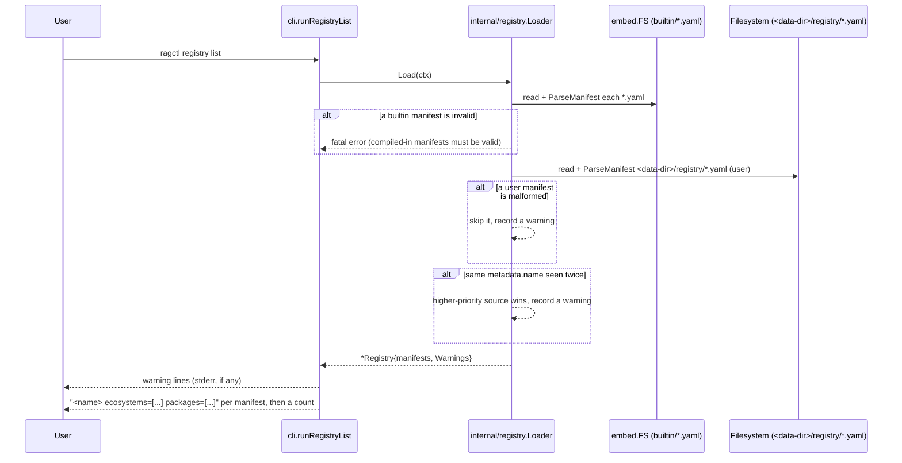

# ragctl — Current Architecture

This doc describes what's **actually implemented**, not the aspirational full design (that lives in the original planning docs referenced by `docs/tickets/`). It's updated as each ticket lands — diagrams here only cover shipped behavior.

For the roadmap, see [docs/tickets/README.md](tickets/README.md). For the native-vs-container execution decision, see [ADR-010](adr/ADR-010-native-first-execution-model.md).

## Coding standard

Go code in this repo follows [CLAUDE.md](../CLAUDE.md): interfaces first, then the structs implementing them, then their methods; a package doc comment on the file that owns the package; a short doc comment on every exported identifier.

## Known gaps in epics 1-2

We're building CLI-first: implementing `docs/tickets/planned/03-config-cli` onward one command at a time, and pulling in only the slice of epic 1 (Bootstrap) and epic 2 (Core Domain and Storage) that each command actually needs — not their full ticket scope up front. As of `scan` landing, that means:

- **BOOT-001**: missing `SECURITY.md`, `CONTRIBUTING.md`, `CODE_OF_CONDUCT.md`, `.golangci.yml`.
- **BOOT-003**: no CI workflow yet — `gofmt`/`vet`/`test -race` (native) and `hack/test-linux.sh` (Linux) are run by hand after each change instead.
- **CORE-001**: `Ecosystem`, `Project`, `Dependency`, `DependencyVersion`, and `Resolution` exist in `internal/domain`; `Generation`, `Chunk`, `BackendReplica`, etc. don't exist yet.
- **CORE-002**: `GenerationState`/`JobState` lifecycle enums don't exist yet.
- **STORE-001**: `PutProject`/`GetProject`/`ListProjects` plus `PutResolution`/`GetResolution` (the latter keyed by project ID in the `project_dependencies` bucket as a JSON blob, not the ticket's fuller relational split across `project_dependencies`/`dependency_versions`). No generation, active-pointer, reference-counting, or job methods yet.
- **STORE-002**: no schema-version handling yet.
- **STORE-003**: `Open`/`Close` only, no knowledge-object/chunk/manifest/embedding CRUD.
- **STORE-004**: we have bbolt-only restart-persistence tests (`TestProjectPersistsAcrossRestart`, `TestResolutionPersistsAcrossRestart`), not the ticket's combined bbolt+Badger scenario.

This is expected, not a bug — each gap gets filled exactly when a later command needs it. Worth revisiting once there's more surface area to protect (BOOT-003/CI in particular).

- **REG-001**: the JSON Schema lives at `internal/registry/schema/knowledge-package.schema.json`, not the ticket's `schemas/knowledge-package.schema.json` at repo root — `go:embed` can't reach outside a package's own directory tree, so the canonical copy moved inside the package rather than living at the repo root and being duplicated.
- **REG-002**: the loader has no config-driven remote-registry-clone path yet (the ticket explicitly deferred this to reuse GIT-001 later) — only built-in + user + project directories are read.

Note: the Python and Node resolvers (`internal/resolver/python`, `internal/resolver/node`) implement epics 20 and 21 from `docs/tickets/backlog/`, not `docs/tickets/planned/` — both were pulled forward at the user's explicit request rather than following epic order. The backlog/planned split otherwise still holds; this is a deliberate pattern for user-requested ecosystem coverage, not a change to the split's meaning.

## What's implemented so far

- **CLI skeleton** (`internal/cli`, Cobra): all 13 top-level commands plus `config validate` are registered. Every command except `init`, `config validate`, `scan`, `project`, `deps`, and `registry list` is an explicit stub that fails with `feature not implemented in this build` rather than doing nothing.
- **`ragctl init`**: creates the config file and local storage directories, idempotently, on both macOS and Linux (with platform-appropriate paths — see `internal/config/paths.go`).
- **`ragctl config validate`**: loads and validates `config.yaml` (default location, or `--config <path>`), printing `config OK: <path>` or a field-specific error. A missing file suggests `ragctl init` rather than a bare "not found".
- **`ragctl scan [path]`**: walks a directory tree, detects project roots by manifest file (`go.mod`, `package.json`, `Cargo.toml`, `pyproject.toml`/`requirements.txt`, `pom.xml`/`build.gradle*`), and registers ones whose ecosystem ragctl currently supports. **Go, Python, and Node are now supported** — Go modules resolve via the real `go` toolchain, Python projects by parsing `uv.lock`/`poetry.lock`/`requirements.txt` directly, Node projects by parsing `package-lock.json`/`pnpm-lock.yaml` directly — and the resolution is persisted. Rust and Java still show as `unsupported` until their resolvers land. Idempotent — rescanning doesn't create duplicates, and a resolution's fingerprint is stable across identical resolves.
- **`ragctl project list`**: lists every registered project (ID + root), sorted by root.
- **`ragctl project show <project-id>`**: prints a project's ID, root, timestamps, and resolution summary (ecosystem, dependency count, fingerprint) or "none" if it hasn't been resolved.
- **`ragctl deps <project-id>`**: prints the resolved dependency list for a project (ecosystem, name, version, direct/indirect). Errors clearly distinguish "no such project" from "project registered but never resolved."
- **`ragctl registry list`**: loads the knowledge registry (built-in seed manifests + `<data-dir>/registry/*.yaml`, the directory `init` already creates) and prints every manifest's name, ecosystems, and packages. Load warnings (e.g. a user manifest overriding a built-in one, or a malformed file being skipped) print to stderr.
- **`internal/config`**: the `Config` struct, defaults, YAML load/save, validation.
- **`internal/project`**: the scanner (`Scan`) and stable project IDs (`ProjectID` = `BLAKE3(canonical root)`).
- **`internal/control/bbolt`**: `Open`/`Close`, plus the first CRUD slice — `PutProject`/`GetProject`/`ListProjects`.
- **`internal/data/badger`**: minimal `Open`/`Close` wrapper — enough for `init` to create the on-disk files. No CRUD methods yet; those land with generation-related tickets.
- **`internal/executil`**: `Run(ctx, RunOptions) (RunResult, error)` — the one subprocess-execution helper every ecosystem resolver uses. Argv-only (no shell), context cancellation/timeout kill the child promptly, stdout/stderr captured separately, non-zero exit is not itself an error.
- **`internal/resolver`**: the `Resolver` interface (`Name`/`Detect`/`Resolve`) and a `Registry` for deterministic (registration-order) resolver priority, plus a typed `ResolutionError` and a shared `Fingerprint(deps)` helper (BLAKE3 over the dependency list sorted by ecosystem+name — extracted once both Go and Python needed it). Nothing consumes `Registry` from the CLI yet — `scan` calls the right resolver directly by ecosystem (see below); the registry earns its keep once resolvers need to compete for the same project (e.g. a polyglot repo with ambiguous priority).
- **`internal/resolver/golang`**: `Detect` checks for `go.mod` at the root (no upward search). `Resolve` shells out to `go list -m -json all` via `executil`, decodes the streamed JSON module objects, normalizes them into `domain.DependencyVersion` (drops the main module, resolves replace directives — local filesystem replaces are tagged `local:<path>` and version replaces `replace:<path>@<version>` in `ResolvedBy`, direct/indirect passed through). The `go list` invocation sets `GOFLAGS=-mod=mod`, `GOWORK=off`, and `GOTOOLCHAIN=local` — found necessary by scanning ~1100 real repos (see GO-002's "Post-implementation amendment"): vendored projects (kubernetes, cli) otherwise fail outright under vendor-mode auto-detection, `go.work` workspaces (kubernetes) otherwise reject `-mod=mod`, and a `go.mod` requesting a newer Go than installed (moby, kubernetes, 118 of the 1100 scanned repos) otherwise tries a network toolchain download that can eat most of the 60s per-repo timeout instead of failing in ~10ms. That last one is a deliberate tradeoff, not a pure win: those 118 repos previously *resolved successfully* by silently downloading a matching toolchain over the network; now they fail fast with a clear "requires go >= X" message instead. Local-first, deterministic, no surprise network side effects during a routine `scan` — but real repos that would've worked now report needing a toolchain upgrade instead.
- **`internal/resolver/python`** (backlog epic 20, pulled forward at the user's request — see `docs/tickets/backlog/20-python-resolver`): `Detect` checks for any of `uv.lock`/`poetry.lock`/`requirements.txt`/`pyproject.toml`/`Pipfile.lock`. `Resolve` picks a strategy by priority: `uv.lock` (parsed as TOML via `github.com/BurntSushi/toml`; direct/indirect is derived from the project's own `virtual` root package's declared `dependencies`; git sources keep the full `<url>#<rev>` in `ResolvedBy`; editable/directory/path sources are tagged `local:<path>`) → `poetry.lock` (same TOML approach; poetry.lock doesn't expose direct/indirect so every entry is `Direct: false`) → `requirements.txt` (regex line parser; only exact `==` pins resolve, ranges and bare names are never guessed — they're surfaced in `Resolution.Warnings` instead). `pyproject.toml` alone or `Pipfile.lock` are detected but have no resolution strategy yet — `Resolve` returns a `ResolutionError` naming that gap.
- **`internal/resolver/node`** (backlog epic 21, pulled forward at the user's request — see `docs/tickets/backlog/21-node-resolver`): `Detect` checks for `package.json`. `Resolve` picks a strategy by priority: `package-lock.json` (lockfileVersion 3 only; direct/indirect derived from the root package's own `dependencies`/`devDependencies`; nested `node_modules/a/node_modules/b` keys collapse to the final package name, scoped names like `@types/node` preserved; workspace symlinks — `link: true` — tagged `local:<path>`) → `pnpm-lock.yaml` (parsed as YAML via the existing `yaml.v3` dependency; direct/indirect derived from every workspace `importers` entry's declared dependencies; a peer-dependency-qualified key like `is-odd@3.0.1(is-number@6.0.0)` has its parenthetical suffix stripped before splitting name/version; cross-workspace dependencies between members are naturally excluded since they never appear under `packages:`). `yarn.lock` and `bun.lock` are detected but not yet resolvable — `Resolve` returns a `ResolutionError` naming that gap, same pattern as Python's `pyproject.toml`-only case.
- **`internal/control/bbolt`**: gained `PutResolution`/`GetResolution`, keyed by project ID — an interim simplification of STORE-001's fuller relational split (see gaps above).
- **`internal/registry`**: `Manifest`/`ParseManifest` (REG-001) validate a KnowledgePackage YAML against an embedded JSON Schema (via `github.com/santhosh-tekuri/jsonschema/v5`) before decoding into the Go struct, so a bad field name or out-of-range `authority` fails with the schema's own field-specific message, not a generic parse error. `Loader`/`Registry` (REG-002) merge manifests from three sources in ascending priority — built-in (`embed.FS`) → `<data-dir>/registry/*.yaml` (user) → an optional project override dir — with same-name conflicts logged as warnings rather than erroring, and a malformed built-in manifest treated as fatal (it's compiled in and should never be invalid) while a malformed user/project one is skipped with a warning. `Registry.Match(ecosystem, package)` (REG-003) is an O(1) exact-membership index lookup, built once after loading; no match is `(Manifest{}, false)`, not an error. Six hand-authored seed manifests (REG-004) ship in `internal/registry/builtin/`: grpc-go, protobuf-go, badger, bbolt (Go) and pydantic, fastapi (Python) — enough to validate the format end-to-end, not real coverage.
- **`internal/source/git`** (epic 8 — Git Acquisition): `Cache` (rooted at `<data-dir>/git`) shells out to the system `git` binary via `executil` for every operation, no wire-protocol or object parsing of its own. `EnsureMirror(ctx, url)` (GIT-001) clones a bare mirror under a `<host>/<org>/<repo>.git` layout if one doesn't already exist — one mirror shared across every dependency version of that package, never re-cloned; `FetchTags` updates it incrementally; `ResolveRef` resolves a tag/branch/commit-ish to a commit SHA purely from local cache (`git rev-parse <ref>^{commit}`). `MaterializeWorktree(ctx, repoPath, commit)` (GIT-002) checks out a commit into a fresh temp dir via `git worktree add --detach` and returns a `cleanup func() error` that callers must defer; cleanup runs on its own `context.Background()`, not the caller's context, specifically so a cancelled normalization doesn't leave a dangling worktree — a failed `git worktree remove` falls back to `rm -rf` + `git worktree prune` and only warns rather than erroring, per the ticket's "don't crash the pipeline over cleanup failure." `Delta(ctx, repoPath, oldCommit, newCommit)` (GIT-003) runs `git diff --name-status` and normalizes `A`/`M`/`D`/`R###` into a `FileStatus` enum (`added`/`modified`/`deleted`/`renamed`, with `OldPath` set only for renames); an empty `oldCommit` diffs against Git's well-known empty-tree SHA so first-sync callers don't need special-casing. Every failure is a typed `*CacheError{Op, Kind, Cause}` — clone/fetch failures are `ErrKindTransient` (network, retryable by a later job system), `ResolveRef`/`MaterializeWorktree`/`Delta` failures are `ErrKindPermanent` (bad ref, bad commit — retrying won't help). Not yet wired into any CLI command — `scan` still stops at resolution; acquisition has no trigger yet.
- **`internal/normalize`** (epic 9 — Normalization Pipeline): the shared `Normalizer` interface (NORM-001) — `Name()`, `Version()`, `Supports(src)`, `Normalize(ctx, src) ([]domain.KnowledgeObject, error)` — plus a `Registry` that tries normalizers in registration order and returns the first whose `Supports` matches. `Name()+Version()` are meant to become part of content-identity fingerprinting later (HASH-001): bumping `Version()` is how a parsing-logic change signals "re-normalize this" without a source byte changing. Added two domain types this epic needed that CORE-001 had only sketched as comments: `domain.SourceSnapshot` (materialized file/directory + `LogicalPath`/`LocalPath`/`Metadata`, what a Normalizer consumes) and `domain.KnowledgeObject` (what one produces).
  - **`internal/normalize/markdown`** (NORM-002): parses `.md`/`.mdx` via `goldmark`, one AST walk collecting title (first H1, filename fallback), a heading breadcrumb trail, fenced-code-block languages, and link destinations. Emits **one `KnowledgeObject` per document**, not per section/fence — the ticket explicitly defers section-splitting to chunking (CHUNK-002), so structure is preserved in `Metadata["headings"]` (pipe-separated breadcrumb paths) / `Metadata["code_languages"]` / `Metadata["links"]` for that later stage to consume, rather than in separate objects now. `.mdx` is treated as plain Markdown — goldmark is lenient enough that JSX-looking blocks just pass through as text; no MDX-specific handling exists or is needed.
  - **`internal/normalize/plaintext`** (NORM-003): the simplest normalizer — one `KnowledgeObject` per `.txt`/`.rst` file, trimmed raw content, no structure extraction (`.rst` gets no real reStructuredText parsing, by design). `LICENSE*` files are supported only when `src.Metadata["include_license"] == "true"`, an opt-in hint left for a future acquisition-layer/config wiring — skipped by default since license text rarely helps retrieval and just bloats the corpus.
  - **`internal/normalize/godoc`** (NORM-004): `go/parser` + `go/doc` (stdlib only, no external static-analysis dependency) over a package directory, emitting one `package_doc` object plus one `symbol_doc` object per exported func/type/method/const, each carrying a `go/printer`-rendered signature and (for methods) a `receiver` tag linking it to its type. One real ambiguity the ticket itself flagged got resolved by reading the stdlib source rather than guessing: `doc.AllDecls` does **not** mean "exported only" — it means the opposite, "include unexported declarations too" — so the normalizer deliberately uses the default mode (0), which already filters to exported-only, documented inline so the next reader doesn't reintroduce the bug the ticket almost specified.
  - **`internal/normalize/releasenotes`** (NORM-005): not a parser — a thin decorator wrapping `markdown.Normalizer`/`plaintext.Normalizer` (delegating by extension, or by a `Metadata["source_type"] == "github-releases"` hint), tagging every returned object `Metadata["content_type"] = "release_note"`. Recognizes `CHANGELOG`/`CHANGES`/`RELEASES`/`HISTORY` (`.md` or `.txt`, case-insensitive). For Markdown sources it also sets `Metadata["release_version"]` from the first version-like heading (`^v?\d+\.\d+\.\d+`) — "first," not "each section," because NORM-002 emits one object per document; true per-section tagging waits on CHUNK-002 actually splitting sections, at which point the full heading list this normalizer already threads through remains available to re-derive it.

## Command tree

Green = fully implemented. Dashed/grey = registered but returns `feature not implemented in this build`. (`config` itself is just a parent grouping — `config validate` is its one real subcommand.)

## `ragctl init` flow

Path resolution (`internal/config/paths.go`) differs by OS:
- **macOS:** config and data are co-located under `~/Library/Application Support/ragctl/`.
- **Linux:** the proper XDG split — config under `$XDG_CONFIG_HOME` (default `~/.config/ragctl`), data under `$XDG_DATA_HOME` (default `~/.local/share/ragctl`).

## `ragctl config validate` flow

## `ragctl scan` flow

`supportedEcosystems` and `resolvers` (`internal/cli/scan.go`) currently have three entries: `go` → `resolver/golang.New()`, `python` → `resolver/python.New()`, `node` → `resolver/node.New()`. Rust and Java are still `unsupported` — detected and their ID computed, but not persisted or resolved — until their resolvers land. Note that the scanner flags a directory as `python`/`node` on manifest presence alone (`pyproject.toml`/`requirements.txt`, `package.json`), which is broader than what the resolver can actually resolve (e.g. `pyproject.toml` with no lockfile, or `package.json` with no lockfile at all) — those cases are `new`ly registered but log a non-fatal `resolve error`.

## `ragctl project` / `ragctl deps` flow

No ticket defines these two commands in detail (the planning docs list `ragctl project list`, `ragctl project show`, and `ragctl deps` with no further spec) — their shape below was designed to directly surface what `scan` now persists, and can evolve as later epics need more from it.

## `ragctl registry list` flow

`ragctl init` already creates `<data-dir>/registry/`, so dropping a `*.yaml` manifest there is enough to extend the registry without touching Go code — no project-override directory is wired into the CLI yet (the `Loader` supports one, but no command passes a project root's `.ragctl/registry/` in).

## Next up

Epic 10 (Fingerprinting & Chunking — see `docs/tickets/planned/10-fingerprinting-chunking`): epic 9 produces `KnowledgeObject`s but nothing yet assigns them stable IDs (HASH-002), computes the content fingerprint that makes normalizer-version bumps and no-op detection actually work (HASH-001), or splits a whole-document Markdown object into the section-level `Chunk`s that NORM-002 explicitly deferred (CHUNK-002). Neither epic 8 (acquisition) nor epic 9 (normalization) is wired into any CLI command yet — there's still no `ragctl` verb that runs this pipeline end to end; that's `ragctl sync` (currently a stub), which needs a complete acquire → normalize → chunk → store path before it's worth implementing for real.

## Testing notes

Tests that spawn a real `go` subprocess under an isolated `$HOME` (`internal/cli`'s `requireGo`-gated tests, `internal/resolver/golang`) run fully offline (`GOFLAGS=-mod=mod`, `GOPROXY=off`) and point `GOCACHE`/`GOPATH`/`GOTELEMETRYDIR` at a shared directory outside any per-test temp dir. Without this, Go's build cache and telemetry uploader raced `t.TempDir()` cleanup under the Alpine/Podman container specifically (never observed natively on macOS), intermittently failing with `directory not empty`. `internal/cli/init_test.go`'s `isolateEnv` also retries its own cleanup a few times before giving up, as a second line of defense against the same class of race.

`hack/fetch-corpus` (dev tool, not part of the `ragctl` binary) builds the real-world repo corpus used for the resolver stress tests (see GO-002's amendment) from a plain-text manifest (`hack/fetch-corpus/repos.txt`) instead of the hand-copied shell arrays used originally — it dogfoods `internal/source/git.Cache` (GIT-001) for the mirror+fetch step, one shared bare mirror per repo under ragctl's own `<data-dir>/git` cache by default, then registers a persistent `git worktree add --detach` checkout under `-root` (default `~/offline-knowledge`) so `ragctl scan` still has real working files to walk. Idempotent (skips repos already checked out) and safely concurrent (a bounded goroutine pool, not `xargs -P` — no `command line cannot be assembled, too long` or clone/fetch races). An optional `-backup <dir>` flag rsyncs the corpus root's contents there afterward (`rsync -a`, deliberately no `--delete` — additive only, so it's safe to point at an external drive without risking existing content there). Run via `go run ./hack/fetch-corpus`.
