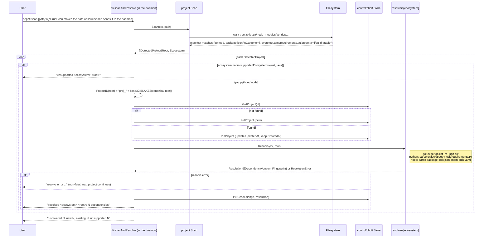
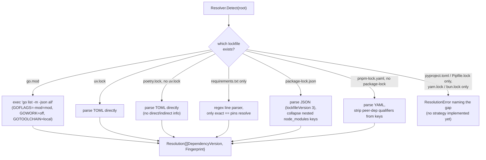

# Feature: discovery, resolution, and registry matching

Before anything can be synced or queried, depctl has to answer three separate questions that are easy to conflate but resolved by three different packages: *what projects exist* (`internal/project`), *what do they actually depend on, at exactly which versions* (`internal/resolver`), and *does depctl know a knowledge source for that dependency* (`internal/registry`). This doc traces that front door — `depctl scan` through to the point where `internal/planner` (see [sync](sync.md)) can turn a resolved dependency into an action.

Related package docs: [project](../internal/project.md), [resolver](../internal/resolver.md), [registry](../internal/registry.md), [control](../internal/control.md), [cli](../internal/cli.md).

## The three questions, three packages

```mermaid
flowchart LR
    subgraph Q1["1. What projects exist?"]
        scan["project.Scan\nwalk tree, match manifest files\n(go.mod, package.json, pyproject.toml, ...)"]
    end
    subgraph Q2["2. What do they depend on?"]
        resolve["resolver.Resolver\nDetect + Resolve per ecosystem"]
    end
    subgraph Q3["3. Does depctl know a source for it?"]
        match["registry.Registry.Match\necosystem + package -> Manifest"]
    end

    scan -->|DetectedProject{Root, Ecosystem}| resolve
    resolve -->|Resolution{[]DependencyVersion}| match
    match -->|Manifest or 'no match'| planner["internal/planner.Plan\n(see sync.md)"]
```

These three are deliberately decoupled: `project.Scan` never imports `resolver`, and neither imports `registry` — `cli.scanAndResolve` (`depctl scan`'s work) and `cli.computePlans` are the only places that wire them together, which keeps each package testable (and swappable — e.g. adding a Rust resolver) without touching the others.

## `depctl scan` end to end



`ProjectID` is stable across rescans because it's derived purely from the canonicalized root path (BLAKE3), not an incrementing counter or a timestamp — rescanning the same directory tree never creates duplicate projects. Moving a project to a new path, however, is indistinguishable from a brand-new project (see [project](../internal/project.md)'s notes) — there's no rename tracking.

## Where resolution strategy is chosen (per ecosystem)

Each ecosystem resolver follows the same shape — `Detect` checks for known manifest/lockfiles, `Resolve` picks the first strategy it can actually satisfy, in priority order:



`Fingerprint` (`internal/resolver.Fingerprint`) is a BLAKE3 digest over the dependency list sorted by ecosystem+name, shared by every resolver — it's what lets `internal/planner` (see [sync](sync.md)) tell "nothing changed since last scan" from "dependencies actually changed" without comparing full dependency lists directly.

## Where registry matching happens

`registry.Match` isn't called during `depctl scan` at all — resolution and registry matching are separate steps on purpose, since a project can be scanned and resolved long before anyone runs `sync`. The match happens inside `cli.computePlans` (shared by `depctl plan` and `depctl sync`) and again inside `syncVersion` itself right before `generation.Create` — see [sync](sync.md)'s "Where the trigger comes from" section for that half of the flow. `depctl registry list` is the standalone command for inspecting what's loaded without touching any project state — see `docs/architecture.md`'s "`depctl registry list` flow" for that diagram.

## Notes

- `scan` flags a directory `python`/`node` on manifest presence alone (`pyproject.toml`/`package.json`), which is broader than what the resolver can actually resolve — a `pyproject.toml` with no lockfile registers as `new` but then logs a non-fatal `resolve error`, not a scan failure.
- Rust and Java are detected (their `ProjectID` is computed) but never persisted or resolved — `supportedEcosystems` in `internal/cli/scan.go` is the single switch that turns a resolver on.
- A resolve error for one project never aborts the scan loop — `scan` reports "unsupported"/"resolve error" per project and keeps going, then prints one summary line.
