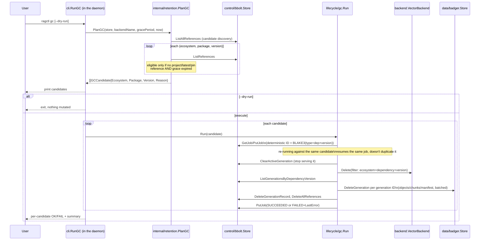

# Feature: garbage collection

`ragctl sync` only ever adds — a dropped dependency or a version bump leaves the *old* version's generation fully intact in all three stores, marked with a `GC_CANDIDATE` hint from `planner.Plan`. Garbage collection is the separate, explicit step that actually reclaims that storage, and it exists as its own command specifically because deleting a generation is riskier than creating one: two different projects can reference the very same dependency version, so "no longer referenced by project X" is not the same question as "safe to delete."

Related package docs: [retention](../internal/retention.md), [lifecycle](../internal/lifecycle.md), [control](../internal/control.md), [data-badger](../internal/data-badger.md), [backend](../internal/backend.md), [cli](../internal/cli.md).

## Why a version becomes eligible

`internal/control/bbolt`'s `references` bucket is keyed `<ecosystem>|<package>|<version>|<project-id>|<reason>`, so one version can carry several simultaneous references: one row per project that still depends on it, plus non-project reasons (`"latest"`, `"manual_pin"`, `"grace_period"`). A version is a GC candidate only when **none** of those hold:

- no project reference,
- no `"manual_pin"` or `"latest"` reference,
- its `"grace_period"` reference (added the moment the last real reference was dropped, via `retention.DropReference`) has actually expired against `config.Retention.GracePeriod`.

A version with zero references and no grace-period row yet is *not* eligible — the grace period only starts counting once `DropReference` has run at least once for it.

Being the active (served) generation does not protect a version. Active generations are per dependency version (ADR-012), so an old version stays active until GC retires it; references and the grace period alone decide its lifetime. Deletion clears the version's active pointer first, so search never resolves to data that's mid-deletion.

## End-to-end flow

`VB` here is every index that may hold this install's data (`buildAllIndexes`, `internal/cli/retrieval.go`): the keyword index in `auto`/`keyword` mode and the vector store in `auto`/`vector` mode — in `auto` mode GC deletes from the vector store even when Ollama is down.

## Why deletion order is vector → Badger → bbolt

Each of the three deletion steps is individually idempotent — deleting something already gone is a no-op — so the *order* is chosen so a crash between any two steps always leaves state a re-run can clean up correctly, never a state where something is queryable but partially gone:

1. **Search index first** (vector store and/or keyword index): if this step succeeds but the process crashes before Badger/bbolt are touched, the version is simply unqueryable (safe) while its bookkeeping still exists — a re-run finds the same candidate and continues.
2. **Badger second**: once vector points are gone, deleting the underlying chunks/objects can't create a state where a live query returns points with no backing content.
3. **bbolt last**: the generation record and references are the bookkeeping *about* the other two stores — deleting them last means a crash never leaves bbolt claiming a generation is gone while Badger/the vector backend still hold its data.

A `domain.Job` (bbolt, `internal/control/bbolt/jobs.go`) tracks each candidate's deletion with a deterministic ID rather than a ULID specifically so `ragctl gc` is safe to re-run after a partial failure — it finds and resumes the existing job instead of creating a duplicate one racing the first.

## Notes

- `--dry-run` stops after printing candidates — `retention.PlanGC` is read-only; nothing is deleted, no jobs are created.
- A candidate's `Reason` field (printed to the user) explains *why* it's eligible — e.g. "grace period expired" — so `ragctl gc`'s output is auditable, not just a bare list of deletions.
- GC is per-backend: `PlanGC` takes `backendName` (`vector.backend`, in every retrieval mode) and `gc.Run` clears the active pointer under the index's `Name()`, since active-generation pointers are backend-scoped. A data dir that was used with two different `vector.backend` values needs `ragctl gc` run under each config.
- One candidate's failure is caught and reported per-candidate; the loop continues to the rest, and the command's exit code reflects whether *any* candidate failed — the same "don't let one bad item abort the batch" pattern `ragctl sync` uses for `SYNC_VERSION` actions.

## The separate orphan-generation path (`--orphans`)

Everything above assumes a generation that *succeeded* — it was promoted, served, and is now safely unreferenced. A generation that failed mid-build, or crashed and got stuck `ACQUIRING`/`NORMALIZING`/`INDEXING`/`VALIDATING`, was never promoted at all, so it has no `dependency+version+active` semantics the reference-based path above relies on — it never enters `PlanGC`'s candidate discovery, and could otherwise leak Badger content and vector-backend points indefinitely (epic 22).

`ragctl gc --orphans [--dry-run]` is a second, independent eligibility path — opt-in, never automatic, and never combined with the reference-based path in one report or one deletion run:

- `retention.PlanOrphanGC` (GC-001) finds every generation that's `FAILED`, or stuck non-terminal past `config.retention.orphan_age` (default 24h) and not currently anyone's active generation — a full `ListAllGenerations` scan, since an orphan by definition has no dependency+version index pointing at it.
- Deletion (GC-003, `gc.RunOrphans`) is **generation-ID scoped throughout**, not dependency+version scoped like `gc.Run` above — a healthy, successfully-*retried* generation can legitimately share the same dependency+version as a failed earlier attempt, so deleting "everything for this dependency+version" would be unsafe here. `backend.Filter.Generation` (already fully wired for the reference-based path's `PointMetadata.Generation` stamping) is reused as-is; no new backend capability was needed. An orphan generation also never owned reference rows (it was never promoted), so `RunOrphans` never calls `DeleteAllReferences`.
- Scheduling: `Scheduler.RequestOrphanGC` shares the same global lock `RequestGC` uses (GC and sync still never interleave), but — unlike `RequestGC` — has no request-coalescing: orphan GC is deliberately manual, never fired automatically the way sync (and therefore reference-based GC's own coalescing need) is, so each caller gets its own real run rather than being folded into someone else's.
- `ragctl gc` (no `--orphans`) is completely unaffected — orphan generations are invisible to it.

## Notes (orphan path)

- Same three-store deletion order as the reference-based path (vector → Badger → bbolt), same idempotent-job restartability (`orphanJobID`, derived directly from the generation ID rather than a hash of dependency+version, since a generation ID already is a unique, stable identity).
- `config.Retention.OrphanAge` is independent of `GracePeriod` — the two paths' eligibility windows are configured separately.

## The superseded-duplicate path (`--superseded-duplicates`)

`ragctl gc --superseded-duplicates [--dry-run]` is a third, separate pass (it can't be combined with `--orphans`). `retention.PlanSupersededDuplicateGC` selects `SUPERSEDED` generations left behind by a same-version build race — ones whose exact (ecosystem, package, version) still has an `ACTIVE` generation. Their content is identical to the active one, so no grace period or reference check is needed. Deletion (`gc.RunSupersededDuplicates`) is generation-ID scoped like the orphan path, in the same index → Badger → bbolt order.
