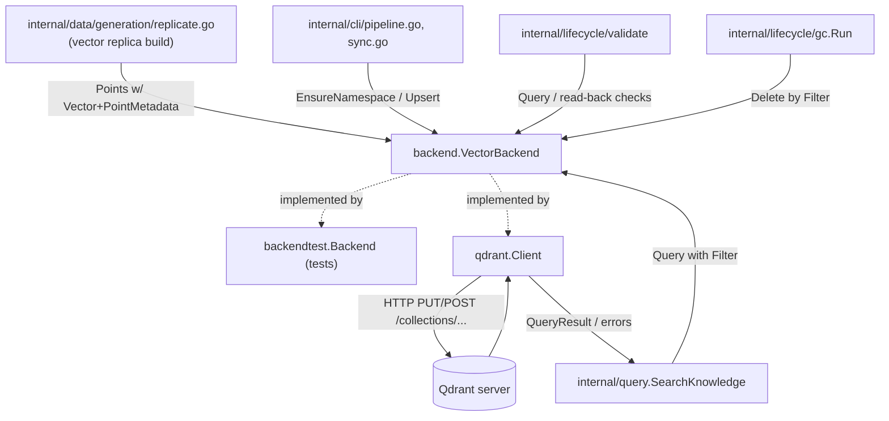

# internal/backend

`internal/backend` defines ragctl's narrow `VectorBackend` interface and the mandatory `PointMetadata` model every adapter implements. There is deliberately no lowest-common-denominator query DSL — `Capabilities` just reports what an adapter can do. `internal/backend/qdrant` is the one production adapter; `internal/backend/backendtest` is an in-memory fake used across the rest of the codebase's tests.

## Key types and functions

**internal/backend**
- `VectorBackend` — interface: `Name()`, `Capabilities(ctx)`, `EnsureNamespace(ctx, ns)`, `Upsert(ctx, req)`, `Delete(ctx, req)`, `Query(ctx, req)`, `Health(ctx)`. Six methods only, matching the design spec exactly (internal/backend/backend.go).
- `Capabilities` — `VectorSearch`, `KeywordSearch`, `HybridSearch`, `MetadataFilter`, `DeleteByFilter` booleans (internal/backend/backend.go).
- `Namespace` — `Name`, `Dimensions`, `Distance`; `Dimensions`/`Distance` come from the `embedding.EmbeddingIdentity` that produced the vectors being stored (internal/backend/backend.go).
- `PointMetadata` — mandatory per-point metadata: `Ecosystem`, `Dependency`, `Version`, `Generation`, `SourceType`, `Authority` — fixed to v0.1's required filter set, not an arbitrary key/value bag (internal/backend/backend.go).
- `Point`, `UpsertRequest`, `Filter`, `DeleteRequest`, `QueryRequest`, `ScoredPoint`, `QueryResult` — request/response shapes for the interface's methods (internal/backend/backend.go).

**internal/backend/backendtest**
- `Backend` — in-memory `VectorBackend` fake: one map of points per namespace, cosine-similarity search, no persistence (internal/backend/backendtest/fake.go).
- `New()` — constructs an empty `Backend` (internal/backend/backendtest/fake.go).
- Reports full `Capabilities` (`VectorSearch`, `MetadataFilter`, `DeleteByFilter`) unconditionally, to exercise every code path a real adapter might take (internal/backend/backendtest/fake.go).

**internal/backend/qdrant**
- `Client` — `VectorBackend` implementation against Qdrant's HTTP API via a hand-written client (net/http + encoding/json), not a generated SDK (internal/backend/qdrant/qdrant.go).
- `New(endpoint, opts...)` — constructs a `Client`; default batch size 256 (internal/backend/qdrant/qdrant.go).
- `(*Client) HealthCollection(ctx, collection)` — extra method beyond the interface, checks a specific collection exists/is reachable; currently has no caller (`ragctl doctor` and `status` use the interface's `Health`) (internal/backend/qdrant/qdrant.go).
- `(*Client) EnsureNamespace` — GETs the collection; creates it (`PUT /collections/<name>`) only if missing, idempotent (internal/backend/qdrant/qdrant.go).
- `(*Client) Upsert` — batches points into groups of `batchSize` (internal/backend/qdrant/qdrant.go).
- `(*Client) Delete` — sends IDs and Filter as two *separate* requests, never combined (internal/backend/qdrant/qdrant.go).
- `(*Client) Query` — POSTs `/points/search`, decodes results back into `backend.ScoredPoint`/`PointMetadata` (internal/backend/qdrant/qdrant.go).
- `pointID(chunkID)` — derives a UUIDv5-shaped Qdrant point ID via blake3 hash of the ragctl chunk ID, since Qdrant only accepts uint or UUID point IDs (internal/backend/qdrant/qdrant.go).
- `filterFrom`/`payloadFrom`/`metadataFrom` (types.go) — convert between `backend.Filter`/`PointMetadata` and Qdrant's JSON wire shapes; the original ragctl point ID is stashed in the payload under `_id` since Qdrant's own ID is a derived UUID (internal/backend/qdrant/types.go).
- `Error`, `ErrBackendUnavailable`, `ErrBackendRequest`, `classify(statusCode)` — 5xx/connection failures classify as `ErrBackendUnavailable` (retryable), 4xx/malformed as `ErrBackendRequest` (not retryable) (internal/backend/qdrant/errors.go).

## Dataflow



`internal/backend` itself has no callers of storage — it's a pure interface package. `internal/data/generation`, `internal/cli` (pipeline/sync), `internal/query`, `internal/lifecycle/validate`, and `internal/lifecycle/gc` all depend on `backend.VectorBackend` as an interface and are wired to a concrete `qdrant.Client` in production, or `backendtest.Backend` in tests. `qdrant.Client` is the only adapter that actually talks over the network, to a real Qdrant HTTP endpoint.

## Walkthrough

Scenario: the pipeline has embedded three chunks of `requests==2.31.0`'s docs and calls `qdrant.Client.Upsert` to write them into the `ragctl_default` collection.

1. Caller builds a `backend.UpsertRequest` (internal/backend/backend.go):

   ```go
   req := backend.UpsertRequest{
       Namespace: "ragctl_default",
       Points: []backend.Point{
           {
               ID:     "chk_a1b2c3d4e5f6",
               Vector: []float32{0.0123, -0.0456, 0.0789, /* ...1536 dims */},
               Metadata: backend.PointMetadata{
                   Ecosystem:  "python",
                   Dependency: "requests",
                   Version:    "2.31.0",
                   Generation: "gen_20260910T0100Z",
                   SourceType: "readme",
                   Authority:  3,
               },
           },
           // ...two more points
       },
   }
   client.Upsert(ctx, req)
   ```

2. `Upsert` (internal/backend/qdrant/qdrant.go) walks `req.Points` in slices of `c.batchSize` (256 by default) — with only 3 points, there's a single batch — and calls `upsertBatch(ctx, "ragctl_default", points)`.

3. `upsertBatch` (internal/backend/qdrant/qdrant.go) converts each `backend.Point` into a `qdrantPoint` (internal/backend/qdrant/types.go). For the point above:
   - `ID` is derived by `pointID("chk_a1b2c3d4e5f6")` (internal/backend/qdrant/qdrant.go): blake3-hash the chunk ID, take the first 16 bytes, patch in UUIDv5 version/variant bits, and hex-format as `8-4-4-4-12`. That chunk ID deterministically yields `13d72b41-8d0e-54b7-8ab0-7a1f7a97d12f` — a UUID-shaped string Qdrant will accept as a point ID, but not itself meaningful to ragctl.
   - `Payload` comes from `payloadFrom(p.Metadata, p.ID)` (internal/backend/qdrant/types.go), which stashes the *original* chunk ID under `_id` (`payloadIDField`, types.go) alongside the metadata fields — this is what lets `Query` recover `chk_a1b2c3d4e5f6` later instead of the opaque UUID.

4. The batch is marshaled as an `upsertRequest` (types.go) and sent via `c.do` (qdrant.go) as:

   ```
   PUT http://127.0.0.1:6333/collections/ragctl_default/points
   Content-Type: application/json

   {
     "points": [
       {
         "id": "13d72b41-8d0e-54b7-8ab0-7a1f7a97d12f",
         "vector": [0.0123, -0.0456, 0.0789, ...],
         "payload": {
           "_id": "chk_a1b2c3d4e5f6",
           "ecosystem": "python",
           "dependency": "requests",
           "version": "2.31.0",
           "generation": "gen_20260910T0100Z",
           "source_type": "readme",
           "authority": 3
         }
       }
       // ...two more qdrantPoint entries
     ]
   }
   ```

5. `c.do` reads the response; any non-2xx status is classified via `classify(resp.StatusCode)` into `ErrBackendUnavailable` (5xx/network) or `ErrBackendRequest` (4xx) and wrapped in `*Error{Op: "Upsert", ...}` (qdrant.go). On success (`200 OK`), `Upsert` returns `nil` and the three points are now queryable by `ecosystem`/`dependency`/`version`/`generation` filters.

## Notes

- `Delete`'s two-request split (IDs then Filter, never combined) is a documented workaround for an empirically verified Qdrant server bug: sending both `points` and `filter` in one `points/delete` body silently deletes only by ID and drops the filter — caught by adversarial review against a live v1.13.1 server, not by the original unit tests, which only asserted on outgoing JSON shape (internal/backend/qdrant/qdrant.go).
- Qdrant point IDs must be unsigned integers or UUIDs; ragctl chunk IDs (`chk_...`) are neither, so `pointID` deterministically derives a UUIDv5-shaped ID via blake3, and the original ID is round-tripped through the payload's `_id` field so query results can report it back (internal/backend/qdrant/qdrant.go, types.go).
- `qdrant.Client.Health` only checks server reachability (`/healthz`); it cannot also confirm a specific collection exists because the `VectorBackend.Health(ctx)` interface method takes no namespace argument. `HealthCollection` (not part of the interface) exists for callers that already know their collection name, though nothing calls it yet — `ragctl doctor` and `ragctl status` both call `Health` through the interface, under a 3-second timeout (internal/backend/qdrant/qdrant.go).
- `backendtest.Backend.Health` always succeeds — there's nothing external for the fake to be unreachable from (internal/backend/backendtest/fake.go).
- `Capabilities` is intentionally advertised, not enforced structurally: e.g. an adapter with `DeleteByFilter == false` is documented as required to reject a non-nil `Filter` in `DeleteRequest`, but that's a contract on the implementation, not something the interface itself checks (internal/backend/backend.go).
