# internal/cli

`internal/cli` wires the `ragctl` command tree (Cobra) and is the only package that talks to the user directly — argument parsing, output formatting, and orchestrating calls into every other `internal/*` package. Each command is implemented one at a time, pulling in only the slice of `internal/domain`, `internal/config`, `internal/control/bbolt`, `internal/data/badger`, etc. that command actually needs, per the project's CLI-first build order (see `docs/architecture.md` → "Epics 1-2: resolved, reconciled to what actually shipped"). Unimplemented commands are explicit stubs that fail loudly rather than silently no-op'ing.

## Key types and functions

Dispatch and shared setup:
- `NewRootCmd() *cobra.Command` — builds the root `ragctl` command with all top-level subcommands registered — `internal/cli/root.go`.
- `notImplementedCmd(use, short string) *cobra.Command` — stub whose `RunE` always fails with `"feature not implemented in this build"` — `internal/cli/root.go`.
- `openControlStore() (*bbolt.Store, error)` / `openDataStore() (*badger.Store, error)` — open the control/data stores at their platform-default paths; callers must `Close()`. Under ADR-011, only `init` and `runDaemonRun`'s own path call these directly now — every other command goes through `ensureDaemon` — `internal/cli/store.go`.
- `loadRagctlConfig() (config.Config, error)` — loads `config.yaml`, falling back to `config.Default` if the file doesn't exist yet — `internal/cli/pipeline.go`.
- `buildEmbedder`, `buildVectorBackend`, `buildGitCache` — construct the configured (network-touching) providers, used inside `RunSync`/`RunGC` and (lazily, on first MCP search) `engine.fullQueryService` — `internal/cli/pipeline.go`.

Daemon wiring (`internal/cli/daemon.go`; the client side of ADR-011 — see `docs/internal/daemon.md` for the daemon process itself):
- `ensureDaemon(ctx) (*client.Client, error)` — the entry point every store-touching command calls first: dial the socket, and if nothing answers, auto-start a daemon (unless `daemon.autostart: false`) and wait for it. Returns `notRunningError` if autostart is disabled, or an error pointing at `ragctl init` if the stores don't exist yet.
- `spawnDaemonOnce(socket) error` — an in-process, channel-based single-flight guard: concurrent `ensureDaemon` callers in the same process share one `spawnDaemon()` attempt and its result, instead of each racing their own subprocess for `control.db`'s file lock.
- `spawnDaemon() error` — `exec.Command(exe, "daemon", "run")`, detached, output redirected to `ragctld.log`. Refuses to run under a `.test` binary.
- `runDaemonRun(cmd) error` — `ragctl daemon run`'s implementation: opens both stores (via `openControlStoreForDaemonRun`, a fail-fast 200ms lock timeout, not the general 2s default), constructs an `engine`, and calls `daemon.Server.Serve`. Both stores are closed on the way out via `closeWithTimeout` (10s each, force-`os.Exit` past that) so a hung `Close()` can't keep the process alive after shutdown was already requested.
- `engine` — implements `daemon.Engine` over the stores `runDaemonRun` holds open for the daemon's whole lifetime: `Status`, `Projects`, `ProjectIDs`, `Sync`, `Scan`, `Plan`, `GC`, `Search`/`ProjectDependencies`/`DependencyVersion`/`ReleaseChanges`/`KnowledgeStatus` (MCP query surface), `ProjectList`/`ProjectGet` (`project`/`deps`), `Describe`, and `Doctor`. Every method calls straight into the same functions the CLI used to call directly (`computePlans`, `RunSync`, `RunGC`, `scanAndResolve`, `buildReport`, the doctor check functions) — no domain logic moves into `internal/daemon`.

Commands (one file each, matching the command tree):
- `init` — creates config file and local storage directories, idempotently; refuses to run while a daemon holds the stores — `internal/cli/init.go`.
- `config validate` — loads and validates `config.yaml`, printing `config OK: <path>` or a field-specific error — `internal/cli/config.go`.
- `daemon run` / `daemon status` / `daemon stop` — the ADR-011 daemon process itself, and thin commands to check/stop it — `internal/cli/daemon.go`.
- `scan [path]` — thin client: `ensureDaemon` then `client.Resolve`. The actual walk (`internal/project.Scan`) and persistence (`scanAndResolve`) run inside the daemon — `internal/cli/scan.go`.
- `project list` / `project show <id>` — thin client: `ensureDaemon` then `client.ProjectList`/`ProjectGet` — `internal/cli/project.go`.
- `deps <project-id>` — thin client: `ensureDaemon` then `client.ProjectGet` (same data `project show` uses, just the full dependency list) — `internal/cli/deps.go`.
- `registry list` / `registry discover <ecosystem> <package>` — never talks to the daemon; reads registry manifests off disk directly — `internal/cli/registry.go`.
- `plan [--project] [--json]` — thin client: `ensureDaemon` then `client.Plan`. `computePlans` runs inside the daemon — `internal/cli/plan.go`.
- `sync [--project] [--dependency] [--dry-run] [--offline] [--force]` — thin client: `ensureDaemon` then `client.Sync`, which the daemon runs through `Scheduler.Request` — `internal/cli/sync.go`.
- `gc [--dry-run]` — thin client: `ensureDaemon` then `client.GC`, run through `Scheduler.RequestGC` (shares the sync scheduler's global lock — GC and sync can never run at once) — `internal/cli/gc.go`.
- `serve` — runs the MCP server over stdio. A thin daemon client like every other command now (WATCH-010): `ensureDaemon` then `query_client.go`'s `daemonQueryService`/`daemonSyncTrigger`, no store or embedder of its own — `internal/cli/serve.go`.
- `corpus add|list|remove` — manages a synthetic Node "project" for indexing local git repos that aren't real dependencies — `internal/cli/corpus.go`.
- `describe [alias | ecosystem package] [--json] [--html] [--check-liveness]` — thin client: `ensureDaemon` then `client.Describe` decodes straight into the CLI's own `Report` type (`Plan`'s decode-into-caller's-type pattern). `--html`/`--out` still write the file client-side from the returned report — `internal/cli/describe.go`.
- `status [--json]` — thin client: `ensureDaemon` then `client.Status`. `buildStatus` runs inside the daemon (`engine.Status`), which also fills in `GCRunning` from the scheduler — `internal/cli/status.go`.
- `doctor` — 13 ordered health checks, one line each; exit code is the worst severity (0 OK, 1 warning, 2 unhealthy), carried to `main` by `ExitCodeError`. The one command with a genuine dial-only, no-autostart path: it never calls `ensureDaemon` (diagnosing a stopped or broken daemon is its job, so running doctor must never have the side effect of starting one) — see "Notes" for the two-path design.
- `watch` — deprecated shim only: ensures a daemon is running (which watches internally, per ADR-011 §9) and exits, rather than running its own loop — `internal/cli/watch.go`.
- `backend` — registered but unimplemented stub (`notImplementedCmd`) — `internal/cli/root.go`.

Key exported/shared functions worth knowing across commands (all now called from inside the daemon via `engine`, not directly by `RunE` handlers, except where noted):
- `computePlans(ctx, store, backendName, projectID) ([]projectPlan, error)` — shared by `engine.Plan` and `engine.Sync`'s underlying `RunSync`; the only place that reads bbolt/registry state to feed `planner.Plan` — `internal/cli/plan.go`.
- `RunSync(ctx, store, badgerStore, cfg, projectID, dependency, offline, force, out) (synced, failed, skipped int, err error)` — called by `engine.Sync` (daemon-side). `sync_project`'s MCP tool no longer calls this directly — `daemonSyncTrigger` (`query_client.go`) goes through the daemon's `/v1/sync` route like `runSync` does — `internal/cli/sync.go`.
- `syncVersion(...)` — drives one `SYNC_VERSION` action through `generation.Create` → `Build` → `Replicate` → `validate.Run` → `promote.Promote` — `internal/cli/sync.go`.
- `fallbackManifest(dep) (registry.Manifest, bool)` — derives a minimal single-source manifest for a Go dependency shaped like `github.com/<org>/<repo>` when the registry has no match — `internal/cli/sync.go`.
- `scanAndResolve(ctx, store, root, out, lockProject) ([]string, error)` — called by `engine.Scan`; `lockProject` is `Scheduler.LockProject`, held around each discovered project's persist step so two concurrent scans of the same project can't race — `internal/cli/scan.go`.
- `RunGC(ctx, store, badgerStore, cfg, dryRun, out) (api.GCResult, error)` — called by `engine.GC` — `internal/cli/gc.go`.
- `daemonQueryService` / `daemonSyncTrigger` (`internal/cli/query_client.go`) — implement `mcp.QueryService`/`mcp.SyncTrigger` over a `*daemon/client.Client`, converting `api.*` wire types back to `query.*`/`domain.*` types. What `runServe` wires into `mcp.New` instead of a real `*query.Service`.

## Dataflow

```mermaid
flowchart TD
    User(["user: ragctl &lt;command&gt;"]) --> Root["cli.NewRootCmd\n(Cobra command tree)"]
    Root --> Dispatch{"which command?"}

    Dispatch -->|init| CInit["runInit\n(opens stores directly)"]
    Dispatch -->|config validate| CConfig["runConfigValidate"]
    Dispatch -->|daemon run/status/stop| CDaemon["runDaemonRun/Status/Stop"]
    Dispatch -->|scan| CScan["runScan"]
    Dispatch -->|project / deps| CProj["runProjectList/Show, runDeps"]
    Dispatch -->|registry| CReg["runRegistryList/Discover\n(never talks to the daemon)"]
    Dispatch -->|plan| CPlan["runPlan"]
    Dispatch -->|sync| CSync["runSync"]
    Dispatch -->|gc| CGC["runGC"]
    Dispatch -->|serve| CServe["runServe"]
    Dispatch -->|corpus| CCorpus["runCorpusAdd/List/Remove"]
    Dispatch -->|describe| CDesc["runDescribe"]
    Dispatch -->|status| CStatus["runStatus"]
    Dispatch -->|doctor| CDoctor["runDoctor\n(dial only, never autostarts —\nsee Notes)"]
    Dispatch -->|watch| CWatch["runWatch\n(deprecated shim:\nensures a daemon, exits)"]
    Dispatch -->|backend| Stub["notImplementedCmd\n(fails: feature not implemented)"]

    ConfigPkg["internal/config\nDefaultConfigPath/DataDir, Load"] --> CInit
    ConfigPkg --> CConfig
    ConfigPkg --> CDaemon
    ConfigPkg --> CServe

    CScan --> EnsureDaemon["ensureDaemon(ctx)\n(dial socket, or\nauto-start + wait)"]
    CProj --> EnsureDaemon
    CPlan --> EnsureDaemon
    CSync --> EnsureDaemon
    CGC --> EnsureDaemon
    CDesc --> EnsureDaemon
    CStatus --> EnsureDaemon
    CWatch --> EnsureDaemon
    CServe --> EnsureDaemon
    EnsureDaemon -->|HTTP/JSON over\nUnix socket| Daemon["ragctl daemon run\n(separate process —\nsee docs/internal/daemon.md)"]
    CDoctor -.->|client.Dial only,\nno autostart| Daemon
    CDoctor -.->|falls back to opening\nstores directly if no\ndaemon answers| Bbolt
    Daemon -->|engine.Scan/Plan/Sync/GC/Status/\nSearch/ProjectDependencies/etc./\nProjectList/ProjectGet/Describe/Doctor| DaemonInternals["computePlans, RunSync,\nRunGC, scanAndResolve,\nquery.Service, buildReport,\ndoctor checks\n(same functions, now called\nfrom inside the daemon)"]

    Bbolt["internal/control/bbolt\n(openControlStore)"] --> CInit
    Bbolt -.->|inside the daemon process| DaemonInternals
    Badger["internal/data/badger\n(openDataStore)"] -.->|inside the daemon process| DaemonInternals

    ProjectPkg["internal/project.Scan"] -.-> DaemonInternals
    ProjectPkg --> CCorpus
    Resolver["internal/resolver/golang,python,node"] -.-> DaemonInternals
    Registry["internal/registry\n(Loader.Load, Match)"] --> CReg
    Registry -.-> DaemonInternals

    Planner["internal/planner.Plan"] -.-> DaemonInternals
    GenPkg["internal/data/generation\nCreate/Build/Replicate"] -.-> DaemonInternals
    Validate["internal/lifecycle/validate.Run"] -.-> DaemonInternals
    Promote["internal/lifecycle/promote.Promote"] -.-> DaemonInternals
    Retention["internal/retention.PlanGC/DropReference"] -.-> DaemonInternals
    GCPkg["internal/lifecycle/gc.Run"] -.-> DaemonInternals
    QueryPkg["internal/query.Service"] -.-> DaemonInternals
    MCP["internal/mcp\n(QueryService/SyncTrigger\nsatisfied by daemonQueryService/\ndaemonSyncTrigger, query_client.go)"] --> CServe

    CDesc -->|Report| Out(["stdout: text table / JSON / static HTML file"])
    CStatus -->|Status| StatusOut(["stdout: text or JSON"])
    CDoctor -->|CheckResults| DoctorOut(["stdout: one line per check;\nexit 0/1/2"])
```



Dashed edges mark packages only reached from inside the daemon process now, not from the CLI command's own process.

## Walkthrough

Concrete scenario: from `/Users/dev`, a user runs `ragctl scan ./myapp`, where `./myapp` is a Go module, and no daemon is currently running.

1. `main` (outside this package) calls `cli.NewRootCmd().Execute()`. `NewRootCmd` (`internal/cli/root.go`) has already registered `newScanCmd()` among the root's subcommands.
2. Cobra parses argv `["scan", "./myapp"]`, binds `root = "./myapp"` (`internal/cli/scan.go`), and invokes `RunE`, which resolves that to an absolute path (`/Users/dev/myapp` — the daemon's working directory isn't the caller's, so this has to happen client-side) and calls `runScan`.
3. `runScan` calls `ensureDaemon(cmd.Context())` (`internal/cli/daemon.go`). Nothing answers the socket, so it spawns `ragctl daemon run` detached and polls until it's up — the full mechanics of this step, including the concurrent-auto-start race and how it's avoided, are `docs/internal/daemon.md`'s own walkthrough, not repeated here.
4. `runScan` calls `c.Resolve(ctx, "/Users/dev/myapp", cmd.OutOrStdout())` — a streamed HTTP request to the daemon's `/v1/projects/resolve` route.
5. Inside the (now separate) daemon process, `handleResolve` calls `engine.Scan`, which calls `scanAndResolve(ctx, e.store, "/Users/dev/myapp", out, lockProject)` (`internal/cli/scan.go`) — against the store the daemon already has open, not a fresh handle. This is `internal/project.Scan` finding `go.mod`, `resolvers[domain.EcosystemGo].Resolve` running `go list -m -json all`, and `store.PutProject`/`PutResolution` — unchanged from before ADR-011, just running inside a different, longer-lived process now (see `docs/internal/project.md` for the scan-detection detail and `docs/internal/daemon.md` for the daemon-side detail).
6. Progress lines stream back over the socket as `scanAndResolve` runs, so `runScan`'s output looks the same as it always did:
   ```
   new          go       /Users/dev/myapp
   resolved     go       /Users/dev/myapp: 2 dependencies

   discovered 1, new 1, existing 0, unsupported 0
   ```
7. Back in Cobra: `RunE` returned `nil`, so `Execute()` returns `nil` and the process exits `0`. `NewRootCmd`'s `SilenceErrors: true`/`SilenceUsage: true` (`internal/cli/root.go`) means `main` is responsible for printing any error `RunE` does return, not Cobra's default usage dump.
8. Contrast with `doctor`, the one command that never calls `ensureDaemon`: it dials the socket directly (`client.Dial`, no autostart) and, only if nothing answers, falls back to opening the stores itself — see "Notes" below for why.
9. Contrast with a command that hasn't landed yet: `ragctl backend` dispatches to a stub built by `notImplementedCmd("backend", "Manage vector backends")` (`internal/cli/root.go`) — its `RunE` unconditionally returns `fmt.Errorf("feature not implemented in this build")`.

## Notes

- The command tree in `root.go` matches `docs/architecture.md`'s "Command tree" mermaid diagram, plus `corpus`, `config`, and `daemon` which were added after that diagram was last drawn; do not duplicate architecture.md's per-command sequence diagrams here — this file only covers overall dispatch structure.
- **Every store-touching command is a thin daemon client now (ADR-011), except `doctor`.** `scan`, `plan`, `sync`, `gc`, `status`, `serve`, `project`/`deps`, and `describe` all follow the same shape: `ensureDaemon(cmd.Context())` then one or more `client.Client` calls. The actual work (`computePlans`, `RunSync`, `RunGC`, `scanAndResolve`, `buildStatus`, `query.Service`, `buildReport`) is unchanged code, just invoked from inside the daemon process via `engine` rather than directly by the CLI's `RunE`. See `docs/internal/daemon.md` for that side. `init` and `registry` are the two commands that never talk to the daemon at all — `init` creates the stores and must run before a daemon can exist; `registry` never touches the stores.
- **`doctor` is deliberately not a plain daemon client — a two-path design, not an oversight.** Its whole job is diagnosing a possibly-stopped or broken daemon, so `runDoctor` never calls `ensureDaemon` (which would autostart one — running `doctor` must never have that side effect). It only dials (`client.Dial`, no spawn): if a daemon answers, `runDoctorViaDaemon` gets the store-dependent checks from its new `Doctor` route and runs the two PATH-only checks (`git`, package managers) locally against this process's own shell PATH, which can legitimately differ from the daemon's — that's a `runDoctorViaDaemon`/`packageManagersNeeded`/`checkPackageManagersOnPath` split, not a whole-check split. If no daemon answers, `runDoctorDirect` falls back to opening the stores itself exactly as doctor always did, so a genuinely locked or corrupted store still gets a specific diagnosis instead of an opaque "no daemon."
- `plan`/`sync` share `computePlans` (`plan.go`) so a dry-run `sync` and a plain `plan` produce byte-identical output — verified by `TestPlanNeverWritesState`/`TestSyncDryRunPerformsNoWrites` per architecture.md's testing notes.
- The embedder/vector-backend/git-cache pipeline (`pipeline.go`'s `syncPipeline`) is built lazily inside `RunSync`, only on the first `SYNC_VERSION` action that needs it — a genuinely no-op sync makes zero network calls, not just zero writes (regression-tested as `TestSyncNoOpPlanMakesNoNetworkCalls`).
- `describe` (`describe.go`) intentionally shows each source's `TrustClass` as *declared* (`generation.TrustClassForSourceType`) rather than measured from actual Badger content — walking real chunks would cost a read for no additional accuracy, per the DESC-001 simplicity constraint noted in its own doc comments.
- `corpus` (`corpus.go`) is a workaround, not a first-class feature: it fabricates a synthetic Node `package.json`/`package-lock.json` project under `<data-dir>/corpus` so an arbitrary local git repo can be indexed via the existing Node resolver + `scan` path, rather than requiring a real "local corpus" concept. `docs/tickets/backlog/35-local-corpus` tracks the deferred first-class version.
- `serve` (`serve.go`) only wires stdio transport for MCP; Streamable HTTP is a documented future option on the same SDK, not built. It's a pure stdio↔daemon proxy now (ADR-011 §8, WATCH-010): `runServe` opens no store and builds no embedder itself, wiring `mcp.New` to `internal/cli/query_client.go`'s `daemonQueryService`/`daemonSyncTrigger` instead. `internal/mcp`'s `Deps.Query` is a consumer-side interface (`mcp.QueryService`) satisfied by either that HTTP-backed wrapper or the real `*query.Service` directly, so there's exactly one query implementation either way.
- `backend` remains a `notImplementedCmd` stub — matches architecture.md's "What's implemented so far" list.
- `openControlStore()`/`openDataStore()` still exist and still wait at most 2 seconds for bbolt's file lock (`ErrLocked` past that) — but only `init` and `doctor`'s no-daemon fallback call them from a CLI-invoked process now. `runDaemonRun` uses a separate, faster path (`openControlStoreForDaemonRun`, 200ms) for the daemon's own attempt to become the store owner — see `docs/internal/daemon.md`.
