# internal/cli

`internal/cli` wires the `ragctl` command tree (Cobra) and is the only package that talks to the user directly — argument parsing, output formatting, and orchestrating calls into every other `internal/*` package. Each command is implemented one at a time, pulling in only the slice of `internal/domain`, `internal/config`, `internal/control/bbolt`, `internal/data/badger`, etc. that command actually needs, per the project's CLI-first build order (see `docs/architecture.md` → "Epics 1-2: resolved, reconciled to what actually shipped"). Unimplemented commands are explicit stubs that fail loudly rather than silently no-op'ing.

## Key types and functions

Dispatch and shared setup:
- `NewRootCmd() *cobra.Command` — builds the root `ragctl` command with all top-level subcommands registered — `internal/cli/root.go`.
- `notImplementedCmd(use, short string) *cobra.Command` — stub whose `RunE` always fails with `"feature not implemented in this build"` — `internal/cli/root.go`.
- `openControlStore() (*bbolt.Store, error)` / `openDataStore() (*badger.Store, error)` — open the control/data stores at their platform-default paths; callers must `Close()` — `internal/cli/store.go`, `:51`.
- `loadRagctlConfig() (config.Config, error)` — loads `config.yaml`, falling back to `config.Default` if the file doesn't exist yet — `internal/cli/pipeline.go`.
- `buildEmbedder`, `buildVectorBackend`, `buildGitCache` — construct the configured (network-touching) providers for `sync`/`serve`/`gc` — `internal/cli/pipeline.go`, `:69`, `:78`.

Commands (one file each, matching the command tree):
- `init` — creates config file and local storage directories, idempotently — `internal/cli/init.go`.
- `config validate` — loads and validates `config.yaml`, printing `config OK: <path>` or a field-specific error — `internal/cli/config.go`.
- `scan [path]` — walks a directory via `internal/project.Scan`, registers supported-ecosystem projects, resolves dependencies — `internal/cli/scan.go`.
- `project list` / `project show <id>` — list registered projects, or show one's details and resolution summary — `internal/cli/project.go`.
- `deps <project-id>` — prints a project's resolved dependency list — `internal/cli/deps.go`.
- `registry list` / `registry discover <ecosystem> <package>` — list loaded knowledge-package manifests, or draft candidate sources from ecosystem metadata (never applied) — `internal/cli/registry.go`.
- `plan [--project] [--json]` — computes and prints the desired-state sync plan, read-only — `internal/cli/plan.go`.
- `sync [--project] [--dependency] [--dry-run] [--offline] [--force]` — computes the same plan, then executes it — `internal/cli/sync.go`.
- `gc [--dry-run]` — garbage-collects unreferenced dependency versions — `internal/cli/gc.go`.
- `serve` — runs the MCP server over stdio — `internal/cli/serve.go`.
- `corpus add|list|remove` — manages a synthetic Node "project" for indexing local git repos that aren't real dependencies — `internal/cli/corpus.go`.
- `describe [alias | ecosystem package] [--json] [--html] [--check-liveness]` — reports what packages ragctl knows about: registry match, sources, active generation, replica status — `internal/cli/describe.go`.
- `status [--json]` — read-only snapshot: project/reference/active-generation counts, job counts, on-disk store sizes, backend health, last sync — `internal/cli/status.go`.
- `doctor` — 13 ordered health checks, one line each; exit code is the worst severity (0 OK, 1 warning, 2 unhealthy), carried to `main` by `ExitCodeError` — `internal/cli/doctor.go`.
- `watch`, `backend` — registered but unimplemented stubs (`notImplementedCmd`) — `internal/cli/root.go`.

Key exported/shared functions worth knowing across commands:
- `computePlans(ctx, store, backendName, projectID) ([]projectPlan, error)` — shared by `plan` and `sync`; the only place that reads bbolt/registry state to feed `planner.Plan` — `internal/cli/plan.go`.
- `RunSync(ctx, store, badgerStore, cfg, projectID, dependency, offline, force, out) (synced, failed, skipped int, err error)` — exported so `internal/mcp`'s `sync_project` tool can trigger the identical sync logic `ragctl sync` uses — `internal/cli/sync.go`.
- `syncVersion(...)` — drives one `SYNC_VERSION` action through `generation.Create` → `Build` → `Replicate` → `validate.Run` → `promote.Promote` — `internal/cli/sync.go`.
- `fallbackManifest(dep) (registry.Manifest, bool)` — derives a minimal single-source manifest for a Go dependency shaped like `github.com/<org>/<repo>` when the registry has no match — `internal/cli/sync.go`.

## Dataflow

```mermaid
flowchart TD
    User(["user: ragctl &lt;command&gt;"]) --> Root["cli.NewRootCmd\n(Cobra command tree)"]
    Root --> Dispatch{"which command?"}

    Dispatch -->|init| CInit["runInit"]
    Dispatch -->|config validate| CConfig["runConfigValidate"]
    Dispatch -->|scan| CScan["runScan"]
    Dispatch -->|project / deps| CProj["runProjectList/Show, runDeps"]
    Dispatch -->|registry| CReg["runRegistryList/Discover"]
    Dispatch -->|plan| CPlan["runPlan -> computePlans"]
    Dispatch -->|sync| CSync["runSync -> RunSync"]
    Dispatch -->|gc| CGC["runGC"]
    Dispatch -->|serve| CServe["runServe"]
    Dispatch -->|corpus| CCorpus["runCorpusAdd/List/Remove"]
    Dispatch -->|describe| CDesc["runDescribe -> buildReport"]
    Dispatch -->|status| CStatus["runStatus -> buildStatus"]
    Dispatch -->|doctor| CDoctor["runDoctor -> runChecks"]
    Dispatch -->|watch/backend| Stub["notImplementedCmd\n(fails: feature not implemented)"]

    ConfigPkg["internal/config\nDefaultConfigPath/DataDir, Load"] --> CInit
    ConfigPkg --> CConfig
    ConfigPkg --> CPlan
    ConfigPkg --> CSync
    ConfigPkg --> CGC
    ConfigPkg --> CServe

    Bbolt["internal/control/bbolt\n(openControlStore)"] --> CScan
    Bbolt --> CProj
    Bbolt --> CPlan
    Bbolt --> CSync
    Bbolt --> CGC
    Bbolt --> CDesc
    Bbolt --> CStatus
    Bbolt --> CDoctor
    Badger["internal/data/badger\n(openDataStore)"] --> CSync
    Badger --> CGC
    Badger --> CServe
    Badger --> CDesc
    Badger --> CDoctor

    ProjectPkg["internal/project.Scan"] --> CScan
    ProjectPkg --> CCorpus
    Resolver["internal/resolver/golang,python,node"] --> CScan
    Registry["internal/registry\n(Loader.Load, Match)"] --> CReg
    Registry --> CPlan
    Registry --> CSync
    Registry --> CDesc
    Registry --> CDoctor

    Planner["internal/planner.Plan"] --> CPlan
    Planner --> CSync
    GenPkg["internal/data/generation\nCreate/Build/Replicate"] --> CSync
    Validate["internal/lifecycle/validate.Run"] --> CSync
    Promote["internal/lifecycle/promote.Promote"] --> CSync
    Retention["internal/retention.PlanGC/DropReference"] --> CGC
    Retention --> CSync
    GCPkg["internal/lifecycle/gc.Run"] --> CGC
    MCP["internal/mcp + internal/query"] --> CServe

    CScan -->|Project, Resolution| Bbolt
    CSync -->|Generation, VersionReference,\nBackendReplica| Bbolt
    CSync -->|KnowledgeObject, Chunk, Manifest| Badger
    CGC -->|deletes| Bbolt
    CGC -->|deletes| Badger
    CDesc -->|Report| Out(["stdout: text table / JSON / static HTML file"])
    CStatus -->|Status| StatusOut(["stdout: text or JSON"])
    CDoctor -->|CheckResults| DoctorOut(["stdout: one line per check;\nexit 0/1/2"])
```



## Walkthrough

Concrete scenario: from `/Users/dev`, a user runs `ragctl scan ./myapp`, where `./myapp` is a Go module.

1. `main` (outside this package) calls `cli.NewRootCmd().Execute()`. `NewRootCmd` (`internal/cli/root.go`) has already registered `newScanCmd()` among the root's subcommands (`internal/cli/root.go`).
2. Cobra parses argv `["scan", "./myapp"]`, matches the `scan` command built by `newScanCmd` (`internal/cli/scan.go`), and binds its one positional arg: `args == ["./myapp"]`, so `root = "./myapp"` (`internal/cli/scan.go`, since `len(args) == 1` skips the `root = "."` default).
3. Cobra invokes `RunE`, which calls `runScan(cmd, "./myapp")` (`internal/cli/scan.go`).
4. `runScan` calls `project.Scan(context.Background(), "./myapp")` — this is `internal/project`'s job, not `cli`'s: it walks the tree, finds `./myapp/go.mod`, and canonicalizes the relative path against the process's working directory (`/Users/dev`), returning `[]project.DetectedProject{{Root: "/Users/dev/myapp", Ecosystem: domain.EcosystemGo}}` (see `docs/internal/project.md`'s own walkthrough for the full detail of this step).
5. `runScan` opens the control store: `store, err := openControlStore()` (`internal/cli/scan.go`, defined at `internal/cli/store.go`). `openControlStore` calls `config.DefaultDataDir()` to get e.g. `/Users/dev/Library/Application Support/ragctl` (macOS) or reads `$XDG_DATA_HOME` (Linux), joins `"control.db"`, and opens that bbolt file with `bboltstore.Open`. `runScan` defers `store.Close()`.
6. `runScan` loops over the one `DetectedProject{Root: "/Users/dev/myapp", Ecosystem: "go"}`. `supportedEcosystems[domain.EcosystemGo]` is `true` (`internal/cli/scan.go`, the static set at `internal/cli/scan.go`), so it's not treated as `unsupported`.
7. `id := project.ProjectID("/Users/dev/myapp")` computes `proj_qmlpl3fszfmjzqnnmfqyipckzipuefhmuahg35tz252d36on6zya` (an actual run of `project.ProjectID` on this exact path — see `docs/internal/project.md`). `store.GetProject(ctx, id)` misses on a first run, so `errors.Is(err, bboltstore.ErrNotFound)` is `true` and `isNew = true` (`internal/cli/scan.go`).
8. `runScan` builds `domain.Project{ID: "proj_qmlpl3...", Root: "/Users/dev/myapp", CreatedAt: now, UpdatedAt: now}` and writes it with `store.PutProject(ctx, p)` (`internal/cli/scan.go`), then writes to `cmd.OutOrStdout()`:
   ```
   new          go       /Users/dev/myapp
   ```
9. `runScan` looks up `resolvers[domain.EcosystemGo]`, a `*golang.Resolver` (`internal/cli/scan.go`), and calls `.Resolve(ctx, "/Users/dev/myapp")` — this runs `go list -m -json all` in that directory and returns a `domain.Resolution{Ecosystem: "go", Dependencies: [...], Fingerprint: "res_..."}`.
10. `runScan` persists it with `store.PutResolution(ctx, id, res)` (`internal/cli/scan.go`) and prints:
    ```
    resolved     go       /Users/dev/myapp: 2 dependencies
    ```
11. After the loop, `runScan` prints the summary line and returns `nil` (`internal/cli/scan.go`):
    ```

    discovered 1, new 1, existing 0, unsupported 0
    ```
12. Back in Cobra: `RunE` returned `nil`, so `Execute()` returns `nil` and the process exits `0`. Had any step instead returned a non-nil error from `RunE` itself (as opposed to the per-dependency errors in the loop, which are logged to stderr and skipped rather than aborting the whole scan), `NewRootCmd`'s `SilenceErrors: true`/`SilenceUsage: true` (`internal/cli/root.go`) means the caller (`main`) is responsible for printing that error, not Cobra's default usage dump.
13. Contrast with a command that hasn't landed yet: `ragctl watch` dispatches to a stub built by `notImplementedCmd("watch", "Watch projects for dependency changes")` (`internal/cli/root.go`) — its `RunE` unconditionally returns `fmt.Errorf("feature not implemented in this build")`, so `Execute()` propagates that error and the process exits non-zero, regardless of arguments.

## Notes

- The command tree in `root.go` matches `docs/architecture.md`'s "Command tree" mermaid diagram, plus `corpus` and `config` which were added after that diagram was last drawn; do not duplicate architecture.md's per-command sequence diagrams here — this file only covers overall dispatch structure.
- `plan`/`sync` share `computePlans` (`plan.go`) so a dry-run `sync` and a plain `plan` produce byte-identical output — verified by `TestPlanNeverWritesState`/`TestSyncDryRunPerformsNoWrites` per architecture.md's testing notes.
- The embedder/vector-backend/git-cache pipeline (`pipeline.go`'s `syncPipeline`) is built lazily inside `RunSync`, only on the first `SYNC_VERSION` action that needs it — a genuinely no-op sync makes zero network calls, not just zero writes (regression-tested as `TestSyncNoOpPlanMakesNoNetworkCalls`).
- `describe` (`describe.go`) intentionally shows each source's `TrustClass` as *declared* (`generation.TrustClassForSourceType`) rather than measured from actual Badger content — walking real chunks would cost a read for no additional accuracy, per the DESC-001 simplicity constraint noted in its own doc comments.
- `corpus` (`corpus.go`) is a workaround, not a first-class feature: it fabricates a synthetic Node `package.json`/`package-lock.json` project under `<data-dir>/corpus` so an arbitrary local git repo can be indexed via the existing Node resolver + `scan` path, rather than requiring a real "local corpus" concept. `docs/tickets/backlog/35-local-corpus` tracks the deferred first-class version.
- `serve` (`serve.go`) only wires stdio transport for MCP; Streamable HTTP is a documented future option on the same SDK, not built.
- `watch` and `backend` remain `notImplementedCmd` stubs — matches architecture.md's "What's implemented so far" list.
- Every command opens `control.db` through `bboltstore.Open`, which waits at most 2 seconds for bbolt's file lock and then fails with `ErrLocked`. While `ragctl serve` is running (for example under an MCP client), other commands report that lock instead of reading state.
- Every command opens its own store handles per-invocation (`openControlStore`/`openDataStore`) and defers `Close()`, except `serve`, which holds them open for the life of the long-running process — `RunSync` is written to accept already-open handles specifically so `internal/mcp`'s `sync_project` tool can reuse `serve`'s open Badger handle rather than opening a second one (Badger only allows one open handle per directory per process).
