# internal/cli

`internal/cli` wires the `ragctl` command tree (Cobra) and is the only package that talks to the user directly — argument parsing, output formatting, and orchestrating calls into every other `internal/*` package. Each command is implemented one at a time, pulling in only the slice of `internal/domain`, `internal/config`, `internal/control/bbolt`, `internal/data/badger`, etc. that command actually needs, per the project's CLI-first build order (see `docs/architecture.md` → "Epics 1-2: resolved, reconciled to what actually shipped"). Unimplemented commands are explicit stubs that fail loudly rather than silently no-op'ing.

## Key types and functions

Dispatch and shared setup:
- `NewRootCmd() *cobra.Command` — builds the root `ragctl` command with all top-level subcommands registered — `internal/cli/root.go`.
- `notImplementedCmd(use, short string) *cobra.Command` — stub whose `RunE` always fails with `"feature not implemented in this build"` — `internal/cli/root.go`.
- `openControlStore() (*bbolt.Store, error)` / `openDataStore() (*badger.Store, error)` — open the control/data stores at their platform-default paths; callers must `Close()`. Under ADR-011, only `init`, `runDaemonRun` and doctor's no-daemon fallback open stores directly — every other command goes through `ensureDaemon` — `internal/cli/store.go`.
- `loadRagctlConfig() (config.Config, error)` — loads `config.yaml`, falling back to `config.Default` if the file doesn't exist yet — `internal/cli/pipeline.go`.
- `buildEmbedder`, `buildVectorBackend`, `buildGitCache` — construct the configured providers. `buildVectorBackend` picks the vector store from `vector.backend`: `embedded` (a bbolt file, `vectors.db` next to `control.db`, unless `vector.endpoint` names another path), `qdrant`, `pgvector` or `weaviate`, reading the secret named by `vector.api_key_env` from the daemon's environment — `internal/cli/pipeline.go`.

Retrieval modes (`internal/cli/retrieval.go`; `retrieval.mode` is `auto`, `vector` or `keyword`, see `docs/internal/config.md`):
- `searchIndex` — presents every index an install writes as one `backend.VectorBackend`: the keyword index (`keyword.db` next to `control.db`, `internal/backend/keyword`) in auto and keyword modes, plus the vector store in vector mode and in auto mode when vectors are ready. Writes and deletes go to all of them, so sync, GC and promotion work the same in every mode. `Query` runs a hybrid search when the request carries a vector and both indexes exist: each index's top 50, merged by reciprocal rank fusion (k = 60). A generation built without vectors contributes no vector candidates, so its results are keyword search's. With one usable index, that index answers alone. `Name()` is always `vector.backend`, so active-generation bookkeeping doesn't depend on the mode.
- `buildSearchIndex(cfg, withVectors)` / `buildAllIndexes(cfg)` — the indexes one build or search writes, and every index that may hold data (for GC and health).
- `vectorsReady` — auto mode's per-build and per-search decision: use vectors only when both the embedder and the vector store are ready.
- `backfillKeyword` / `backfillVectors` — run at the start of each sync. The first adds keyword entries for active generations built in vector mode (local, no model). The second adds vectors to generations built keyword-only while Ollama or the vector store was unavailable, using the chunks already stored (`generation.AddToIndex`). Both are best-effort; a failure is printed and retried next sync.
- `switchEmbedding` — runs before `backfillVectors` when the embedding settings (model, prompts or size, compared as `Prompts.Identity`) differ from what some active generation was embedded with (`staleVectorGenerations`). It clears those generations' vectors and marks their replicas as built without vectors, so `backfillVectors` re-embeds them from the stored chunks. The embedded store drops the whole namespace (`namespaceDropper`). A remote collection may be shared, so only this install's generations are deleted from it, and if the size changed while it still holds them, nothing changes and the error asks for a new `vector.collection`. `switchMu` keeps two syncs from switching at once. Until it has run, `hasStaleVectors` keeps vectors out of use: auto mode searches and builds keyword-only, and vector mode fails with `errStaleVectors`.

Readiness (`internal/cli/embedding_readiness.go`, `internal/cli/vector_readiness.go`, `internal/cli/vector_bootstrap.go`):
- `embeddingReadiness` / `vectorReadiness` — the daemon's shared view of whether Ollama (with the model pulled) and the vector store are usable. Probed in the background at daemon startup (`checkEmbeddingReadiness` pulls a missing model; `checkVectorReadiness` starts a ragctl-managed Qdrant container via `ensureManagedQdrant` when `vector.managed` is set and nothing answers), and re-probed at most once per cooldown while down. Sync and search read this state instead of hitting the network. Neither probe runs in keyword mode. A nil readiness (a caller outside the daemon) counts as ready.

Daemon wiring (`internal/cli/daemon.go`; the client side of ADR-011 — see `docs/internal/daemon.md` for the daemon process itself):
- `ensureDaemon(ctx) (*client.Client, error)` — the entry point every store-touching command calls first: dial the socket, and if nothing answers, auto-start a daemon (unless `daemon.autostart: false`, which returns `notRunningError`) and wait for it. If the stores don't exist yet it first runs init's work silently (`ensureInitialized` → `initStores`, status lines to stderr), so an MCP session with no terminal never hits a "run `ragctl init` first" wall. When it reuses an already-running daemon, it prints one-line stderr warnings if `config.yaml` has changed since that daemon started (`warnIfConfigStale`, comparing `config.Config.Fingerprint()` against `Health.ConfigFingerprint`) or if the daemon was built from a different revision than this binary (`warnIfVersionStale`).
- `spawnDaemonOnce(ctx, socket) error` — an in-process single-flight guard: concurrent `ensureDaemon` callers in the same process share one spawn attempt, which lasts until the new daemon answers on its socket, so no caller arriving in between spawns a second daemon.
- `spawnDaemon() error` — `exec.Command(exe, "daemon", "run")`, detached, output redirected to `ragctld.log`; a background `cmd.Wait()` reaps the child so a long-lived parent like `ragctl serve` doesn't collect zombies. Refuses to run under a `.test` binary.
- `runDaemonRun(cmd) error` — `ragctl daemon run`'s implementation: opens both stores (via `openControlStoreForDaemonRun`, a fail-fast 200ms lock timeout, not the general 2s default), constructs an `engine`, and calls `daemon.Server.Serve`. Both stores are closed on the way out via `closeWithTimeout` (10s each, force-`os.Exit` past that) so a hung `Close()` can't keep the process alive after shutdown was already requested.
- `engine` — implements `daemon.Engine` over the stores `runDaemonRun` holds open for the daemon's whole lifetime (method list in `docs/internal/daemon.md`). Every method calls straight into this package's functions (`computePlans`, `RunSync`, `RunGC`/`RunOrphanGC`/`RunSupersededDuplicatesGC`, `scanAndResolve`, `buildReport`, the doctor checks, the export connectors) — no domain logic moves into `internal/daemon`. Search goes through one of three memoized `query.Service`s chosen per call by retrieval mode and readiness (`baseQueryService`, `keywordQueryService`, `fullQueryService`).

Commands (one file each, matching the command tree):
- `init [--vector-backend embedded|qdrant] [--retrieval-mode auto|vector|keyword]` — creates the config file and local storage directories, idempotently; refuses to run while a daemon holds the stores. The flags only shape a newly written config (defaults: `embedded`, `auto`; `qdrant` applies `VectorConfig.QdrantDefaults`, a ragctl-managed local Qdrant). An existing config is never rewritten, so asking for a different backend or mode than it has is an error — `internal/cli/init.go`.
- `config validate` — loads and validates `config.yaml`, printing `config OK: <path>` or a field-specific error — `internal/cli/config.go`.
- `daemon run` / `daemon status` / `daemon stop` — the ADR-011 daemon process itself, and thin commands to check/stop it. `daemon status` includes a `config:` line (`configFreshnessLabel`) reporting whether `config.yaml` has changed since this daemon started — `internal/cli/daemon.go`.
- `scan [path]` — thin client: `ensureDaemon` then `client.Resolve`. The actual walk (`internal/project.Scan`) and persistence (`scanAndResolve`) run inside the daemon — `internal/cli/scan.go`.
- `project list` / `project show <id>` — thin client: `ensureDaemon` then `client.ProjectList`/`ProjectGet` — `internal/cli/project.go`.
- `deps <project-id>` — thin client: `ensureDaemon` then `client.ProjectGet` (same data `project show` uses, just the full dependency list) — `internal/cli/deps.go`.
- `registry list` / `registry discover <ecosystem> <package>` — never talks to the daemon; reads registry manifests off disk directly — `internal/cli/registry.go`.
- `plan [--project] [--json]` — thin client: `ensureDaemon` then `client.Plan`. `computePlans` runs inside the daemon — `internal/cli/plan.go`.
- `sync [--project] [--dependency] [--dry-run] [--offline] [--force] [--rebuild]` — thin client: `ensureDaemon` then `client.Sync`, which the daemon runs through `Scheduler.Request` — `internal/cli/sync.go`. `--rebuild` (OPS-004, epic 61, 2026-09) requires `--dependency` and forces a genuine rebuild of each named dependency even though its resolved version hasn't changed — `planner.Plan`'s own version-unchanged branch NOOPs unconditionally otherwise, regardless of whether the active generation actually has real backend content, and `--force` alone has no effect on which actions the planner selects. Implemented as `clearForRebuild`: clears the `active_generations` pointer (`Store.ClearActiveGeneration`) and `VersionReference` (`Store.RemoveReference`) for each named dependency in every matching project before `computePlans` runs, so a fresh `SYNC_VERSION` action gets planned. Not supported with `--dry-run` (the printed plan wouldn't reflect the rebuild's own effect).
- `gc [--dry-run] [--orphans | --superseded-duplicates]` — thin client: `ensureDaemon` then `client.GC`. The default path (`RunGC`) removes versions no project references any more, after `retention.grace_period`; it runs through `Scheduler.RequestGC`, which excludes every in-flight build while it runs. `--orphans` (`RunOrphanGC`) removes FAILED or stuck generations older than `retention.orphan_age`; `--superseded-duplicates` (`RunSupersededDuplicatesGC`) removes SUPERSEDED generations that duplicate an ACTIVE one of the same version. The three paths never combine in one run — `internal/cli/gc.go`.
- `export mem0|graphiti|cognee --project <id> [--dependency ...] [--endpoint ...] [--api-key-env | --auth-token-env ...]` — thin client: pushes a project's already-synced chunks into the user's own Mem0, Graphiti or Cognee instance, via the daemon's `/v1/export/*` routes. Flags override the matching `export.*` config keys; there is no default endpoint, so nothing is sent anywhere unless configured — `internal/cli/export.go` (the connectors' engine side is in `daemon.go`).
- `serve` — runs the MCP server over stdio. A thin daemon client like every other command now (WATCH-010): `ensureDaemon` then `query_client.go`'s `daemonQueryService`/`daemonSyncTrigger`, no store or embedder of its own — `internal/cli/serve.go`.
- `corpus add|list|remove` — manages a synthetic Node "project" for indexing local git repos that aren't real dependencies — `internal/cli/corpus.go`.
- `describe [alias | ecosystem package] [--json] [--html] [--check-liveness]` — thin client: `ensureDaemon` then `client.Describe` decodes straight into the CLI's own `Report` type (`Plan`'s decode-into-caller's-type pattern). `--html`/`--out` still write the file client-side from the returned report — `internal/cli/describe.go`.
- `status [--json]` — thin client: `ensureDaemon` then `client.Status`. `buildStatus` runs inside the daemon (`engine.Status`), which also fills in `GCRunning` from the scheduler — `internal/cli/status.go`.
- `doctor` — 17 ordered health checks (`doctorChecks`: config, control DB, schema version, Badger, stale jobs, active generations and their manifests, backend replicas, empty active generations, referenced-but-never-built, vector backend reachable, embedding model compatibility, registry, embedding backend, vector backend, git and package managers on PATH), plus `config matches running daemon` and `daemon build matches this command` when a daemon answers; one line each. Keyword mode, and auto mode without Ollama, are normal states, reported as OK ("not used", "using keyword search for now"); exit code is the worst severity (0 OK, 1 warning, 2 unhealthy), carried to `main` by `ExitCodeError`. The one command with a genuine dial-only, no-autostart path: it never calls `ensureDaemon` (diagnosing a stopped or broken daemon is its job, so running doctor must never have the side effect of starting one) — see "Notes" for the two-path design.
- `watch` — deprecated shim only (Cobra hides it from `--help`): ensures a daemon is running (which watches internally, per ADR-011 §9) and exits, rather than running its own loop — `internal/cli/watch.go`.
- `backend` — registered but unimplemented stub (`notImplementedCmd`) — `internal/cli/root.go`.

Key exported/shared functions worth knowing across commands (all now called from inside the daemon via `engine`, not directly by `RunE` handlers, except where noted):
- `computePlans(ctx, store, backendName, projectID) ([]projectPlan, error)` — shared by `engine.Plan` and `engine.Sync`'s underlying `RunSync`; the only place that reads bbolt/registry state to feed `planner.Plan` — `internal/cli/plan.go`.
- `RunSync(ctx, coordinator, store, badgerStore, cfg, projectID, dependencies, offline, force, rebuild, out, readiness, vecReadiness, priority, progress, daemonSem, gitCache) (synced, failed, skipped int, err error)` — called by `engine.Sync` (daemon-side); `sync_project`'s MCP tool reaches it through the daemon's `/v1/sync` route like `ragctl sync` does. It runs `backfillKeyword`/`backfillVectors` first, then works through the planned actions with `sync.max_concurrency` workers. `coordinator` keeps builds and reference changes apart from GC; `daemonSem` caps actions across all projects at `sync.max_total_concurrency`; `priority` (WATCH-020) lets a concurrent `BumpPriority` move a dependency to the front of the remaining queue (`nil` is a valid no-op); `progress` feeds `ragctl status` and `sync_progress`. Each `SYNC_VERSION` action is bounded by `dependencySyncTimeout` (10 min) — `internal/cli/sync.go`.
- `syncVersion(...)` — drives one `SYNC_VERSION` action through `generation.Create` → `Build` → `Replicate` → `validate.Run` → `promote.Promote`. The pipeline it gets is keyword-only (no embedder) in keyword mode, and in auto mode when vectors aren't ready — `internal/cli/sync.go`.
- `fallbackManifest(dep) (registry.Manifest, bool)` — derives a minimal single-source git manifest when the registry has no match: for Go from the module path (`github.com/<org>/<repo>` directly, or a vanity import resolved like `go get` does), for npm and PyPI from the package registry's repository field, trying only tags verified to exist — `internal/cli/sync.go`.
- `scanAndResolve(ctx, store, root, out, lockProject) ([]string, error)` — called by `engine.Scan`; `lockProject` is `Scheduler.LockProject`, held around each discovered project's persist step so two concurrent scans of the same project can't race — `internal/cli/scan.go`.
- `RunGC(ctx, store, badgerStore, cfg, dryRun, out, vecReadiness) (api.GCResult, error)` — called by `engine.GC`; `RunOrphanGC`/`RunSupersededDuplicatesGC` have the same shape — `internal/cli/gc.go`.
- `daemonQueryService`, `daemonSyncTrigger`, `daemonScanTrigger`, `daemonPriorityBumper`, `daemonProgressReader` (`internal/cli/query_client.go`) — implement `internal/mcp`'s consumer-side interfaces over a `*daemon/client.Client`, converting `api.*` wire types back to `query.*`/`domain.*` types. What `runServe` wires into `mcp.New` instead of a real `*query.Service`.

## Dataflow

```mermaid
flowchart TD
    User(["user: ragctl &lt;command&gt;"]) --> Root["cli.NewRootCmd\n(Cobra command tree)"]
    Root --> Dispatch{"which command?"}

    Dispatch -->|init| CInit["runInit\n(opens stores directly)"]
    Dispatch -->|config validate| CConfig["runConfigValidate"]
    Dispatch -->|daemon run/status/stop| CDaemon["runDaemonRun/Status/Stop"]
    Dispatch -->|scan| CScan["runScan"]
    Dispatch -->|project / deps| CProj["runProjectList/Show, runDeps"]
    Dispatch -->|registry| CReg["runRegistryList/Discover\n(never talks to the daemon)"]
    Dispatch -->|plan| CPlan["runPlan"]
    Dispatch -->|sync| CSync["runSync"]
    Dispatch -->|gc| CGC["runGC"]
    Dispatch -->|serve| CServe["runServe"]
    Dispatch -->|corpus| CCorpus["runCorpusAdd/List/Remove"]
    Dispatch -->|describe| CDesc["runDescribe"]
    Dispatch -->|status| CStatus["runStatus"]
    Dispatch -->|doctor| CDoctor["runDoctor\n(dial only, never autostarts —\nsee Notes)"]
    Dispatch -->|export mem0/graphiti/cognee| CExport["runExportMem0/Graphiti/Cognee"]
    Dispatch -->|watch| CWatch["runWatch\n(deprecated shim:\nensures a daemon, exits)"]
    Dispatch -->|backend| Stub["notImplementedCmd\n(fails: feature not implemented)"]

    ConfigPkg["internal/config\nDefaultConfigPath/DataDir, Load"] --> CInit
    ConfigPkg --> CConfig
    ConfigPkg --> CDaemon
    ConfigPkg --> CServe

    CScan --> EnsureDaemon["ensureDaemon(ctx)\n(dial socket, or\nauto-start + wait)"]
    CProj --> EnsureDaemon
    CPlan --> EnsureDaemon
    CSync --> EnsureDaemon
    CGC --> EnsureDaemon
    CExport --> EnsureDaemon
    CDesc --> EnsureDaemon
    CStatus --> EnsureDaemon
    CWatch --> EnsureDaemon
    CServe --> EnsureDaemon
    EnsureDaemon -->|HTTP/JSON over\nUnix socket| Daemon["ragctl daemon run\n(separate process —\nsee docs/internal/daemon.md)"]
    CDoctor -.->|client.Dial only,\nno autostart| Daemon
    CDoctor -.->|falls back to opening\nstores directly if no\ndaemon answers| Bbolt
    Daemon -->|engine.Scan/Plan/Sync/GC/Status/\nSearch/ProjectDependencies/etc./\nProjectList/ProjectGet/Describe/Doctor| DaemonInternals["computePlans, RunSync,\nRunGC, scanAndResolve,\nquery.Service, buildReport,\ndoctor checks\n(same functions, now called\nfrom inside the daemon)"]

    Bbolt["internal/control/bbolt\n(openControlStore)"] --> CInit
    Bbolt -.->|inside the daemon process| DaemonInternals
    Badger["internal/data/badger\n(openDataStore)"] -.->|inside the daemon process| DaemonInternals

    ProjectPkg["internal/project.Scan"] -.-> DaemonInternals
    ProjectPkg --> CCorpus
    Resolver["internal/resolver/golang,python,node"] -.-> DaemonInternals
    Registry["internal/registry\n(Loader.Load, Match)"] --> CReg
    Registry -.-> DaemonInternals

    Planner["internal/planner.Plan"] -.-> DaemonInternals
    GenPkg["internal/data/generation\nCreate/Build/Replicate"] -.-> DaemonInternals
    Validate["internal/lifecycle/validate.Run"] -.-> DaemonInternals
    Promote["internal/lifecycle/promote.Promote"] -.-> DaemonInternals
    Retention["internal/retention.PlanGC/DropReference"] -.-> DaemonInternals
    GCPkg["internal/lifecycle/gc.Run"] -.-> DaemonInternals
    QueryPkg["internal/query.Service"] -.-> DaemonInternals
    MCP["internal/mcp\n(QueryService/SyncTrigger\nsatisfied by daemonQueryService/\ndaemonSyncTrigger, query_client.go)"] --> CServe

    CDesc -->|Report| Out(["stdout: text table / JSON / static HTML file"])
    CStatus -->|Status| StatusOut(["stdout: text or JSON"])
    CDoctor -->|CheckResults| DoctorOut(["stdout: one line per check;\nexit 0/1/2"])
```



Dashed edges mark packages only reached from inside the daemon process now, not from the CLI command's own process.

## Walkthrough

Concrete scenario: from `/Users/dev`, a user runs `ragctl scan ./myapp`, where `./myapp` is a Go module, and no daemon is currently running.

1. `main` (outside this package) calls `cli.NewRootCmd().Execute()`. `NewRootCmd` (`internal/cli/root.go`) has already registered `newScanCmd()` among the root's subcommands.
2. Cobra parses argv `["scan", "./myapp"]`, binds `root = "./myapp"` (`internal/cli/scan.go`), and invokes `RunE`, which resolves that to an absolute path (`/Users/dev/myapp` — the daemon's working directory isn't the caller's, so this has to happen client-side) and calls `runScan`.
3. `runScan` calls `ensureDaemon(cmd.Context())` (`internal/cli/daemon.go`). Nothing answers the socket, so it spawns `ragctl daemon run` detached and polls until it's up — the full mechanics of this step, including the concurrent-auto-start race and how it's avoided, are `docs/internal/daemon.md`'s own walkthrough, not repeated here.
4. `runScan` calls `c.Resolve(ctx, "/Users/dev/myapp", cmd.OutOrStdout())` — a streamed HTTP request to the daemon's `/v1/projects/resolve` route.
5. Inside the (now separate) daemon process, `handleResolve` calls `engine.Scan`, which calls `scanAndResolve(ctx, e.store, "/Users/dev/myapp", out, lockProject)` (`internal/cli/scan.go`) — against the store the daemon already has open, not a fresh handle. This is `internal/project.Scan` finding `go.mod`, `resolvers[domain.EcosystemGo].Resolve` running `go list -m -json all`, and `store.PutProject`/`PutResolution` — unchanged from before ADR-011, just running inside a different, longer-lived process now (see `docs/internal/project.md` for the scan-detection detail and `docs/internal/daemon.md` for the daemon-side detail).
6. Progress lines stream back over the socket as `scanAndResolve` runs, so `runScan`'s output looks the same as it always did:
   ```
   new          go       /Users/dev/myapp
   resolved     go       /Users/dev/myapp: 2 dependencies

   discovered 1, new 1, existing 0, unsupported 0
   ```
7. Back in Cobra: `RunE` returned `nil`, so `Execute()` returns `nil` and the process exits `0`. `NewRootCmd`'s `SilenceErrors: true`/`SilenceUsage: true` (`internal/cli/root.go`) means `main` is responsible for printing any error `RunE` does return, not Cobra's default usage dump.
8. If the stores hadn't existed yet, step 3 would also have run init's work first (`ensureInitialized`), silently, before spawning the daemon.
9. Contrast with `doctor`, the one command that never calls `ensureDaemon`: it dials the socket directly (`client.Dial`, no autostart) and, only if nothing answers, falls back to opening the stores itself — see "Notes" below for why.
10. Contrast with a command that hasn't landed yet: `ragctl backend` dispatches to a stub built by `notImplementedCmd("backend", "Manage vector backends")` (`internal/cli/root.go`) — its `RunE` unconditionally returns `fmt.Errorf("feature not implemented in this build")`.

## Notes

- The command tree is built in `root.go`; do not duplicate architecture.md's per-command sequence diagrams here — this file only covers overall dispatch structure.
- **Every store-touching command is a thin daemon client now (ADR-011), except `doctor`.** `scan`, `plan`, `sync`, `gc`, `status`, `serve`, `project`/`deps`, `describe`, `export` and `corpus add` (which writes its files, then runs `scan`) all follow the same shape: `ensureDaemon(cmd.Context())` then one or more `client.Client` calls. The actual work (`computePlans`, `RunSync`, `RunGC`, `scanAndResolve`, `buildStatus`, `query.Service`, `buildReport`) is unchanged code, just invoked from inside the daemon process via `engine` rather than directly by the CLI's `RunE`. See `docs/internal/daemon.md` for that side. `init`, `config validate`, `registry`, and `corpus list`/`remove` never talk to the daemon — `init` creates the stores and must run before a daemon can exist; the others only read or write files, not the stores.
- **`doctor` is deliberately not a plain daemon client — a two-path design, not an oversight.** Its whole job is diagnosing a possibly-stopped or broken daemon, so `runDoctor` never calls `ensureDaemon` (which would autostart one — running `doctor` must never have that side effect). It only dials (`client.Dial`, no spawn): if a daemon answers, `runDoctorViaDaemon` gets the store-dependent checks from its new `Doctor` route and runs the two PATH-only checks (`git`, package managers) locally against this process's own shell PATH, which can legitimately differ from the daemon's — that's a `runDoctorViaDaemon`/`packageManagersNeeded`/`checkPackageManagersOnPath` split, not a whole-check split. If no daemon answers, `runDoctorDirect` falls back to opening the stores itself exactly as doctor always did, so a genuinely locked or corrupted store still gets a specific diagnosis instead of an opaque "no daemon."
- `plan`/`sync` share `computePlans` (`plan.go`) so a dry-run `sync` and a plain `plan` produce byte-identical output — verified by `TestPlanNeverWritesState`/`TestSyncDryRunPerformsNoWrites` per architecture.md's testing notes.
- The sync pipeline (`sync.go`'s `syncPipeline`: embedder, search index, git cache) is built lazily inside `RunSync`, only on the first `SYNC_VERSION` action that needs it — a genuinely no-op sync makes zero network calls, not just zero writes (regression-tested as `TestSyncNoOpPlanMakesNoNetworkCalls`). Vector backfill checks the store first for the same reason.
- `describe` (`describe.go`) intentionally shows each source's `TrustClass` as *declared* (`generation.TrustClassForSourceType`) rather than measured from actual Badger content — walking real chunks would cost a read for no additional accuracy, per the DESC-001 simplicity constraint noted in its own doc comments.
- `corpus` (`corpus.go`) is a workaround, not a first-class feature: it fabricates a synthetic Node `package.json`/`package-lock.json` project under `<data-dir>/corpus` so an arbitrary local git repo can be indexed via the existing Node resolver + `scan` path, rather than requiring a real "local corpus" concept. `docs/tickets/backlog/35-local-corpus` tracks the deferred first-class version.
- `serve` (`serve.go`) only wires stdio transport for MCP; Streamable HTTP is a documented future option on the same SDK, not built. It's a pure stdio↔daemon proxy now (ADR-011 §8, WATCH-010): `runServe` opens no store and builds no embedder itself, wiring `mcp.New` to `internal/cli/query_client.go`'s `daemonQueryService`/`daemonSyncTrigger` instead. `internal/mcp`'s `Deps.Query` is a consumer-side interface (`mcp.QueryService`) satisfied by either that HTTP-backed wrapper or the real `*query.Service` directly, so there's exactly one query implementation either way.
- `startupScan` (MCP-006, `serve.go`) runs `scan_project`'s own `ScanTrigger.ScanProject(".")` and a `Status` read against the server's own working directory, in the background alongside the MCP loop (MCP-009) rather than before it — a cold first resolution can hit the network with no time bound, and must never block the MCP handshake. Registration + status only (manifest parsing/version resolution), never a sync, although the daemon's ambient sync then starts for a newly registered project unless `sync.disable_ambient` is set. Failures are logged to stderr and non-fatal.
- `backend` remains a `notImplementedCmd` stub; vector stores are chosen in `config.yaml` (`vector.backend`) or with `ragctl init --vector-backend`.
- `openControlStore()`/`openDataStore()` still exist and still wait at most 2 seconds for bbolt's file lock (`ErrLocked` past that) — but only `init` (including auto-init) and `doctor`'s no-daemon fallback open stores from a CLI-invoked process now. `runDaemonRun` uses a separate, faster path (`openControlStoreForDaemonRun`, 200ms) for the daemon's own attempt to become the store owner — see `docs/internal/daemon.md`.
- **`TestOnlyAllowedFunctionsOpenStoresDirectly` (`invariant_test.go`, WATCH-011) enforces the above by parsing the AST**, not by trusting convention: it fails if any function outside a closed allow-list (`openControlStore`, `openDataStore`, `openControlStoreForDaemonRun`, `runInit`, `initStores`, `runDaemonRun`, `runDoctorDirect`) calls a direct-open function. A new command that opens a store itself fails this test immediately, with a message naming exactly which function and which call. Verified to actually catch a violation, not just pass vacuously, by temporarily introducing one during development.
