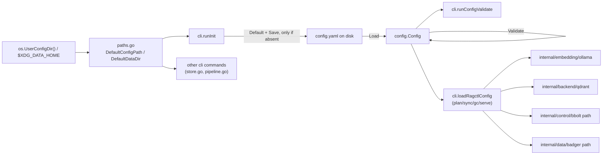

# internal/config

`internal/config` defines ragctl's global configuration model — the `Config` struct, its documented defaults, YAML load/save, and validation — plus platform-specific path resolution for where config and data live. It's pure data and I/O against `config.yaml`: no bbolt/Badger/network access, so every other package (and every CLI command) can depend on it without pulling in storage or execution concerns.

## Key types and functions

- `Config` — the full YAML-serializable config tree (storage, embedding, vector, retention, watch, server) — `internal/config/config.go`.
- `StorageConfig` / `ControlStoreConfig` / `DataStoreConfig` — bbolt (`control.db`) and Badger (`badger/`) paths — `internal/config/config.go`.
- `EmbeddingConfig` — provider/model/endpoint for the embedder (`ollama` in v0.1) — `internal/config/config.go`.
- `VectorConfig` — vector backend/endpoint/collection (`qdrant` in v0.1) — `internal/config/config.go`.
- `RetentionConfig` — GC grace period and keep-latest policy — `internal/config/config.go`.
- `WatchConfig` / `ServerConfig` (`MCPServerConfig`) — `WatchConfig.Enabled`/`Debounce` are read by `ragctl watch` (refuses to start when disabled; debounce window, default 2s), and `ServerConfig.MCP` by `ragctl serve` — `internal/config/config.go`. **CFG-001 (epic 61, 2026-09):** `ServerConfig` no longer carries an `HTTPServerConfig` field — it existed with zero real consumers (a documented future Streamable HTTP transport option, never built), which meant a fresh `config.yaml` shipped a `server.http.listen` setting that silently did nothing. Removed rather than kept-but-documented, matching the project's own "don't ship the abstraction before a second implementation" convention; a config file written before this change that still has a `server.http` key loads fine (unknown YAML keys are ignored, not an error) — add the field back only alongside a real HTTP transport implementation.
- `GitConfig` (epic 43, 2026-09) — `MirrorSearchPaths`/`CheckoutSearchPaths`, both `[]string`, empty by default. Read by `internal/cli/pipeline.go`'s `buildGitCache` and passed straight through to `git.NewCache`'s `WithExternalMirrorRoots`/`WithCheckoutSearchRoots` options (GIT-006/GIT-007) — no consumer inside this package itself, purely a config carrier — `internal/config/config.go`.
- `Default(dataDir string) Config` — documented v0.1 defaults rooted at `dataDir` — `internal/config/config.go`.
- `Load(path string) (Config, error)` — reads, parses, and validates `config.yaml`; returns `ErrConfigNotFound` (wrapped, `errors.Is`-compatible) if missing — `internal/config/config.go`.
- `(Config) Validate() error` — checks required paths are non-empty and durations are non-negative — `internal/config/config.go`.
- `(Config) Save(path string) error` — marshals to YAML and writes, creating no parent directory validation of its own — `internal/config/config.go`.
- `ErrConfigNotFound` — sentinel error distinguishing "not yet initialized" from "malformed config" — `internal/config/config.go`.
- `DefaultConfigPath() (string, error)` — platform-appropriate `config.yaml` location via `os.UserConfigDir()` — `internal/config/paths.go`.
- `DefaultDataDir() (string, error)` — where `control.db`, `badger/`, `git/`, `registry/` live: co-located with config on macOS, XDG-split (`$XDG_DATA_HOME` or `~/.local/share/ragctl`) on Linux — `internal/config/paths.go`.

## Dataflow



## Walkthrough

Concrete scenario: on macOS, a user has already hand-edited a config file at a non-default location, `/Users/jin/ragctl-configs/staging.yaml`, and runs `ragctl config validate --config /Users/jin/ragctl-configs/staging.yaml`.

1. `newConfigCmd` (`internal/cli/config.go`) registers `validate`'s `--config` flag bound to the local `configPath` string, defaulting to `""`.
2. Cobra parses the flag, so `configPath == "/Users/jin/ragctl-configs/staging.yaml"` when `RunE` calls `runConfigValidate(cmd, configPath)` (`internal/cli/config.go`).
3. Because `configPath != ""`, `runConfigValidate` skips `config.DefaultConfigPath()` entirely (`internal/cli/config.go`) — the `--config` flag takes priority over platform resolution, and `DefaultConfigPath`'s macOS-specific `os.UserConfigDir()` logic (`internal/config/paths.go`) never runs in this invocation.
4. `config.Load("/Users/jin/ragctl-configs/staging.yaml")` (`internal/config/config.go`) calls `os.ReadFile`. Say the file on disk is:
   ```yaml
   version: 1
   storage:
     control:
       type: bbolt
       path: /Users/jin/ragctl-configs/data/control.db
     data:
       type: badger
       path: /Users/jin/ragctl-configs/data/badger
   embedding:
     provider: ollama
     model: nomic-embed-text-v2-moe
     endpoint: http://127.0.0.1:11434
   vector:
     backend: qdrant
     endpoint: http://127.0.0.1:6333
     collection: ragctl-staging
   retention:
     grace_period: 336h0m0s
     keep_latest: true
   watch:
     enabled: false
     debounce: 0s
   server:
     mcp:
       enabled: true
       enable_sync_tool: false
   ```
5. `yaml.Unmarshal` decodes this into a `config.Config{}` value — `c.Storage.Control.Path == "/Users/jin/ragctl-configs/data/control.db"`, `c.Vector.Collection == "ragctl-staging"`, `c.Retention.GracePeriod == 336 * time.Hour` (YAML's `336h0m0s` duration syntax parses via `time.Duration`'s `yaml.v3` support), `c.Watch.Enabled == false`, etc. (`internal/config/config.go`).
6. `c.Validate()` (`internal/config/config.go`) runs its four checks: `Storage.Control.Path` is non-empty (`"/Users/jin/ragctl-configs/data/control.db"`, passes), `Storage.Data.Path` is non-empty (passes), `Retention.GracePeriod >= 0` (`336h`, passes), `Watch.Debounce >= 0` (`0s`, passes). No error.
7. `Load` returns `(c, nil)`; `runConfigValidate` discards `c` (it only needs to know loading+validation succeeded) and prints:
   ```
   config OK: /Users/jin/ragctl-configs/staging.yaml
   ```
8. Contrast: if `staging.yaml` had instead omitted `storage.control.path` (e.g. a hand-trimmed file with `path: ""` or the key missing), step 5 would decode it as the empty string — `Load` never fills in `Default`'s value here, per the "no implicit defaulting" note below — and step 6 would fail at the first check, so `Load` returns `fmt.Errorf("invalid config %s: %w", path, errors.New("storage.control.path: must not be empty"))`, and `runConfigValidate` propagates that error (not the `ErrConfigNotFound` branch, since the file did exist) — Cobra prints it to stderr and the command exits non-zero.
9. If `--config` had been omitted instead, `configPath` would stay `""`, and `runConfigValidate` would call `config.DefaultConfigPath()` (`internal/config/paths.go`), which on macOS resolves `os.UserConfigDir()` to `~/Library/Application Support` and joins `"ragctl"` and `"config.yaml"` — e.g. `/Users/jin/Library/Application Support/ragctl/config.yaml` — regardless of any `$XDG_CONFIG_HOME` set in the environment.

## Notes

- `os.UserConfigDir()` only honors `$XDG_CONFIG_HOME` on Linux — macOS always resolves to `~/Library/Application Support` regardless of that env var, documented inline at `internal/config/paths.go`.
- `DefaultDataDir` co-locates config and data on macOS (no separate data-dir convention worth honoring for a single-user CLI) but splits them on Linux per the XDG Base Directory spec.
- `Load` intentionally never applies defaults for missing fields — `ragctl init`'s `Default(dataDir)` is the only place defaults get materialized; a hand-edited partial `config.yaml` loads with zero-valued fields rather than silently defaulting.
- `Config.Version` exists but isn't checked against anything. This is separate from STORE-002's schema-version guard, which only covers `control.db` (`internal/control/bbolt/schema.go`), not the config file. Reviewed under CFG-001 (epic 61, 2026-09) and left as-is, deliberately: it's a real, intentionally-reserved field (a config-format version to gate a future breaking change against), not a silently-broken one like `HTTPServerConfig` was — no schema-breaking config change has happened yet to need it.
- `Save` never serializes resolved secrets — only `VectorConfig.APIKeyEnv`, a reference to an env var name, is the one secret-shaped field.
- **`vector.collection`'s default is per-install-unique, not a shared literal (SAFE-001, epic 61, 2026-09).** `defaultCollectionName()` generates a random `ragctl-<8 hex chars>` name inside `Default()`, replacing the old plain `"ragctl"` every fresh install used to share identically. Live-found: two independent installs (a real one and an isolated/test one) pointed at the same Qdrant server with the old default silently commingled data the moment either one synced — this happened for real, twice, during one session's own live-verification work, since ambient sync (SCOPE-002) fires automatically on first project registration with no separate opt-in step. **This only protects fresh installs from here on** — `Load` never re-derives a default for a field already on disk, so an existing `config.yaml` keeps whatever collection name it already has. A second, independent guard (`internal/cli/checkForeignCollectionData`, run once at daemon startup) warns loudly if a fresh instance's collection already holds points despite this instance never having registered anything of its own — deliberately a warning, not a refusal, since a deliberately shared/reused collection is still a legitimate choice this check can't distinguish from an accidental collision.
