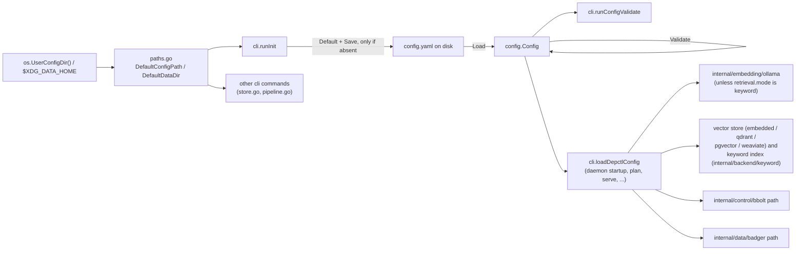

# internal/config

`internal/config` defines depctl's global configuration model — the `Config` struct (the shape of `config.yaml`), its defaults, YAML load/save, and validation — plus platform-specific path resolution for where config and data live. It's pure data and I/O against `config.yaml`: no bbolt/Badger/network access, so every other package (and every CLI command) can depend on it without pulling in storage or execution concerns.

## Config keys

Every key `config.yaml` can hold, with the default a fresh `depctl init` writes. `Load` never fills in defaults for keys missing from an existing file (see Notes), so "if absent" below says what an older or hand-written config gets.

| Key | Default (fresh install) | Meaning |
|---|---|---|
| `version` | `1` | Reserved config-format version; not checked yet. |
| `storage.control.type` / `.path` | `bbolt`, `<data-dir>/control.db` | Control-plane store. The keyword index (`keyword.db`), the embedded vector store (`vectors.db`), the daemon socket (`depctld.sock`) and its log (`depctld.log`) all live next to this file. |
| `storage.data.type` / `.path` | `badger`, `<data-dir>/badger` | Content store (normalized objects, chunks, embedding cache). |
| `embedding.provider` | `ollama` | The only supported provider. |
| `embedding.model` | `embeddinggemma-2:270m` | Pulled automatically by the daemon if missing (Ollama itself is never installed). |
| `embedding.query_prompt` | `task: code retrieval \| query: {q}` | Wraps each search question the way the model was trained; empty sends the question as is. |
| `embedding.document_prompt` | `title: {title} \| text: {text}` | Wraps each chunk; `{title}` is its qualified symbol (e.g. `pgxpool.New`), else its file path, else `none`. Empty sends the text as is. |
| `embedding.dimensions` | `256` | Keeps the first N values of each vector (EmbeddingGemma 2 is a Matryoshka model); `0` keeps all. |

Changing `embedding.model`, `query_prompt`, `document_prompt` or `dimensions` on an install that already has vectors: run `depctl daemon stop` so the daemon reads the new config, then `depctl sync`. The sync re-embeds every active version from its stored chunks (nothing is re-fetched or rebuilt). Until then, search doesn't use the old vectors: `auto` searches by keyword, and `vector` returns an error saying to sync. With a remote vector store, changing the size also needs a new `vector.collection`, since a collection has one vector size and may be shared with another install.
| `embedding.endpoint` | `http://127.0.0.1:11434` | Ollama URL. |
| `vector.backend` | `embedded` | Vector store: `embedded` (a bbolt file, no service), `qdrant`, `pgvector` or `weaviate`. Also the key active generations are recorded under, in every retrieval mode. |
| `vector.endpoint` | empty | Qdrant/Weaviate URL or Postgres connection URL. For `embedded`, an optional file path (default `vectors.db` next to `control.db`). `depctl init --vector-backend qdrant` sets `http://127.0.0.1:6333`. |
| `vector.collection` | `depctl-<8 random hex>` | Collection/table/namespace name; random per install (see Notes). |
| `vector.api_key_env` | empty | Name of an environment variable holding the secret: Qdrant's or Weaviate's API key, or pgvector's database password. Read by the daemon process, so it must be set in the daemon's environment. |
| `vector.managed` | `false` (`true` with `init --vector-backend qdrant`) | For `qdrant` only: start a depctl-owned Qdrant container (podman or docker) when the endpoint doesn't answer. |
| `retrieval.mode` | `auto` (if absent: `vector`) | `auto`: always build a keyword index, and add vectors when Ollama and the vector store are ready; search combines keyword and vector rankings (hybrid) when vectors exist, and uses keyword search otherwise. `vector`: always require Ollama. `keyword`: never use an embedding model. Set at init with `--retrieval-mode`. |
| `retention.grace_period` | `336h` (14 days; 0 = default) | How long a version no project references any more is kept before `depctl gc` may delete it. |
| `retention.keep_latest` | `true` | Written by `Default`, but nothing reads it yet. |
| `retention.orphan_age` | `24h` (0 = default) | How long a FAILED or stuck generation must sit untouched before `depctl gc --orphans` may delete it. |
| `watch.enabled` | `true` | Whether the daemon watches registered projects' manifests (and so starts ambient syncs). |
| `watch.debounce` | `2s` | Quiet period after a manifest change before re-resolving. |
| `sync.max_concurrency` | `2` (if absent or 0: 2) | Workers per project sync. |
| `sync.max_total_concurrency` | `4` (if absent or 0: 4) | Cap on sync actions running at once across the whole daemon. |
| `sync.disable_ambient` | `false` | Stop the daemon starting a full sync when a project is first registered. |
| `server.mcp.enabled` | `true` | Whether `depctl serve` runs. |
| `server.mcp.enable_sync_tool` | `true` | Whether the `sync_project` MCP tool is offered. |
| `daemon.autostart` | `true` (if absent: `true`) | Whether commands may start a daemon themselves. |
| `git.mirror_search_paths` | empty | Directories laid out like depctl's own mirror cache (`<host>/<org>/<repo>.git`), checked before a network clone. |
| `git.checkout_search_paths` | empty | Directories containing ordinary git checkouts, matched to a dependency by their `origin` remote. |
| `fetch.max_file_size` | 10 MiB (0 = default) | Cap on one external HTTP response (registry metadata, vanity-import lookups). |
| `fetch.max_redirects` | 5 (0 = default) | Redirect hops one external fetch may follow. |
| `fetch.max_source_total_bytes` | 500 MiB (0 = default) | Cap on one dependency's on-disk git mirror. |
| `log.json` / `log.level` | `false`, `info` | Structured logging format and level (`debug`, `info`, `warn`, `error`; unknown values mean `info`). |
| `observability.otel.enabled` / `.endpoint` | off | OpenTelemetry tracing; `endpoint` is required when enabled. |
| `observability.metrics.enabled` / `.listen` | off, `127.0.0.1:9090` | Prometheus `/metrics` endpoint. |
| `export.mem0.endpoint` / `.api_key_env` | empty | Target for `depctl export mem0`. |
| `export.graphiti.endpoint` / `.auth_token_env` | empty | Target for `depctl export graphiti`. |
| `export.cognee.endpoint` / `.auth_token_env` | empty | Target for `depctl export cognee`. |

The daemon loads config once at startup; edits take effect after `depctl daemon stop` and the next command (see `docs/internal/daemon.md`).

## Key types and functions

- `Config` — the full YAML-serializable config tree, one field per top-level key above — `internal/config/config.go`.
- `StorageConfig` / `ControlStoreConfig` / `DataStoreConfig`, `EmbeddingConfig`, `VectorConfig`, `RetrievalConfig`, `RetentionConfig`, `WatchConfig`, `SyncConfig`, `ServerConfig` (`MCPServerConfig`), `DaemonConfig`, `GitConfig`, `FetchConfig`, `LogConfig`, `ObservabilityConfig` (`OTelConfig`, `MetricsConfig`), `ExportConfig` (`Mem0ExportConfig`, `GraphitiExportConfig`, `CogneeExportConfig`) — one struct per section — `internal/config/config.go`.
- `RetrievalAuto` / `RetrievalVector` / `RetrievalKeyword` and `RetrievalConfig.ModeOrDefault()` — the three modes; an empty mode resolves to `vector`, so an install from before retrieval modes existed keeps behaving as it did. Consumers are in `internal/cli` (`retrieval.go`, `sync.go`, `daemon.go`, `doctor.go`).
- `VectorConfig.QdrantDefaults()` — switches a config to a depctl-managed local Qdrant (`backend: qdrant`, `endpoint: http://127.0.0.1:6333`, `managed: true`); used by `depctl init --vector-backend qdrant`.
- `DaemonConfig.AutostartEnabled()` — `Autostart` is a pointer so a config with no `daemon` key keeps auto-start on.
- `FetchConfig.MaxFileSizeOrDefault` / `MaxRedirectsOrDefault` / `MaxSourceTotalBytesOrDefault`, `MetricsConfig.ListenOrDefault`, `LogConfig.SlogLevel` — resolve zero values to defaults. See [security-hardening.md](../security-hardening.md#sec-003-every-external-fetch-has-a-real-enforced-sizeredirect-ceiling) and [observability-guide.md](../observability-guide.md).
- `Default(dataDir string) Config` — the defaults a fresh install gets, rooted at `dataDir` — `internal/config/config.go`.
- `Load(path string) (Config, error)` — reads, parses, and validates `config.yaml`; returns `ErrConfigNotFound` (wrapped, `errors.Is`-compatible) if missing — `internal/config/config.go`.
- `(Config) Validate() error` — required paths non-empty; durations and concurrency values non-negative; `observability.otel.endpoint` set when tracing is enabled; `retrieval.mode` empty or one of the three modes — `internal/config/config.go`.
- `(Config) Save(path string) error` — marshals to YAML and writes the file; the parent directory must already exist (`depctl init` creates it) — `internal/config/config.go`.
- `(Config) Fingerprint() (string, error)` — hash of the canonical YAML encoding, so the daemon and its clients can tell when `config.yaml` changed after the daemon started — `internal/config/config.go`.
- `ErrConfigNotFound` — sentinel error distinguishing "not yet initialized" from "malformed config" — `internal/config/config.go`.
- `DefaultConfigPath() (string, error)` — platform-appropriate `config.yaml` location via `os.UserConfigDir()` — `internal/config/paths.go`.
- `DefaultDataDir() (string, error)` — where `control.db`, `badger/`, `git/`, `registry/` live: co-located with config on macOS, XDG-split (`$XDG_DATA_HOME` or `~/.local/share/depctl`) on Linux — `internal/config/paths.go`.

## Dataflow



## Walkthrough

Concrete scenario: on macOS, a user has already hand-edited a config file at a non-default location, `/Users/jin/depctl-configs/staging.yaml`, and runs `depctl config validate --config /Users/jin/depctl-configs/staging.yaml`.

1. `newConfigCmd` (`internal/cli/config.go`) registers `validate`'s `--config` flag bound to the local `configPath` string, defaulting to `""`.
2. Cobra parses the flag, so `configPath == "/Users/jin/depctl-configs/staging.yaml"` when `RunE` calls `runConfigValidate(cmd, configPath)` (`internal/cli/config.go`).
3. Because `configPath != ""`, `runConfigValidate` skips `config.DefaultConfigPath()` entirely (`internal/cli/config.go`) — the `--config` flag takes priority over platform resolution, and `DefaultConfigPath`'s macOS-specific `os.UserConfigDir()` logic (`internal/config/paths.go`) never runs in this invocation.
4. `config.Load("/Users/jin/depctl-configs/staging.yaml")` (`internal/config/config.go`) calls `os.ReadFile`. Say the file on disk is:
   ```yaml
   version: 1
   storage:
     control:
       type: bbolt
       path: /Users/jin/depctl-configs/data/control.db
     data:
       type: badger
       path: /Users/jin/depctl-configs/data/badger
   embedding:
     provider: ollama
     model: embeddinggemma-2:270m
     endpoint: http://127.0.0.1:11434
   vector:
     backend: qdrant
     endpoint: http://127.0.0.1:6333
     collection: depctl-staging
   retrieval:
     mode: auto
   retention:
     grace_period: 336h0m0s
     keep_latest: true
   watch:
     enabled: false
     debounce: 0s
   server:
     mcp:
       enabled: true
       enable_sync_tool: false
   ```
5. `yaml.Unmarshal` decodes this into a `config.Config{}` value — `c.Storage.Control.Path == "/Users/jin/depctl-configs/data/control.db"`, `c.Vector.Collection == "depctl-staging"`, `c.Retention.GracePeriod == 336 * time.Hour` (YAML's `336h0m0s` duration syntax parses via `time.Duration`'s `yaml.v3` support), `c.Watch.Enabled == false`, etc. (`internal/config/config.go`).
6. `c.Validate()` (`internal/config/config.go`) runs its checks: `Storage.Control.Path` is non-empty (`"/Users/jin/depctl-configs/data/control.db"`, passes), `Storage.Data.Path` is non-empty (passes), `Retention.GracePeriod`, `Retention.OrphanAge` and `Watch.Debounce` are non-negative (pass; `orphan_age` is absent, so zero, which GC treats as its 24h default), the sync concurrency values are non-negative (absent, so zero, which callers treat as "use the default"), OTel is off, and `retrieval.mode` is `auto` (passes). No error.
7. `Load` returns `(c, nil)`; `runConfigValidate` discards `c` (it only needs to know loading+validation succeeded) and prints:
   ```
   config OK: /Users/jin/depctl-configs/staging.yaml
   ```
8. Contrast: if `staging.yaml` had instead omitted `storage.control.path` (e.g. a hand-trimmed file with `path: ""` or the key missing), step 5 would decode it as the empty string — `Load` never fills in `Default`'s value here, per the "no implicit defaulting" note below — and step 6 would fail at the first check, so `Load` returns `fmt.Errorf("invalid config %s: %w", path, errors.New("storage.control.path: must not be empty"))`, and `runConfigValidate` propagates that error (not the `ErrConfigNotFound` branch, since the file did exist) — Cobra prints it to stderr and the command exits non-zero.
9. If `--config` had been omitted instead, `configPath` would stay `""`, and `runConfigValidate` would call `config.DefaultConfigPath()` (`internal/config/paths.go`), which on macOS resolves `os.UserConfigDir()` to `~/Library/Application Support` and joins `"depctl"` and `"config.yaml"` — e.g. `/Users/jin/Library/Application Support/depctl/config.yaml` — regardless of any `$XDG_CONFIG_HOME` set in the environment.

## Notes

- `os.UserConfigDir()` only honors `$XDG_CONFIG_HOME` on Linux — macOS always resolves to `~/Library/Application Support` regardless of that env var, documented inline at `internal/config/paths.go`.
- `DefaultDataDir` co-locates config and data on macOS (no separate data-dir convention worth honoring for a single-user CLI) but splits them on Linux per the XDG Base Directory spec.
- `Load` intentionally never applies defaults for missing fields — `depctl init`'s `Default(dataDir)` is the only place defaults get materialized; a hand-edited partial `config.yaml` loads with zero-valued fields rather than silently defaulting.
- `Config.Version` exists but isn't checked against anything. This is separate from STORE-002's schema-version guard, which only covers `control.db` (`internal/control/bbolt/schema.go`), not the config file. Reviewed under CFG-001 (epic 61, 2026-09) and left as-is, deliberately: it's a real, intentionally-reserved field (a config-format version to gate a future breaking change against), not a silently-broken one like `HTTPServerConfig` was — no schema-breaking config change has happened yet to need it.
- `Save` never serializes secrets — `vector.api_key_env`, `export.mem0.api_key_env` and the `export.*.auth_token_env` keys hold only the *names* of environment variables.
- `retrieval.mode` follows the same "no implicit defaulting" rule: a config written before retrieval modes existed has no key, `ModeOrDefault` reads that as `vector`, and the install keeps requiring Ollama exactly as before. Only fresh installs get `auto`.
- `vector.managed` likewise: a config written before it existed reads as `false`, so nobody already pointing at their own Qdrant gets a surprise second instance.
- `ServerConfig` has no HTTP transport field: only MCP over stdio exists, and an unused config field that looks functional is worse than none (CFG-001). A config file that still has an old `server.http` key loads fine, since unknown YAML keys are ignored.
- **`vector.collection`'s default is per-install-unique, not a shared literal (SAFE-001, epic 61, 2026-09).** `defaultCollectionName()` generates a random `depctl-<8 hex chars>` name inside `Default()`, replacing the old plain `"depctl"` every fresh install used to share identically. Live-found: two independent installs (a real one and an isolated/test one) pointed at the same Qdrant server with the old default silently commingled data the moment either one synced — this happened for real, twice, during one session's own live-verification work, since ambient sync (SCOPE-002) fires automatically on first project registration with no separate opt-in step. **This only protects fresh installs from here on** — `Load` never re-derives a default for a field already on disk, so an existing `config.yaml` keeps whatever collection name it already has. A second, independent guard (`internal/cli/checkForeignCollectionData`, run once at daemon startup unless retrieval mode is keyword) warns loudly if a fresh instance's collection already holds points despite this instance never having registered anything of its own — deliberately a warning, not a refusal, since a deliberately shared/reused collection is still a legitimate choice this check can't distinguish from an accidental collision.
