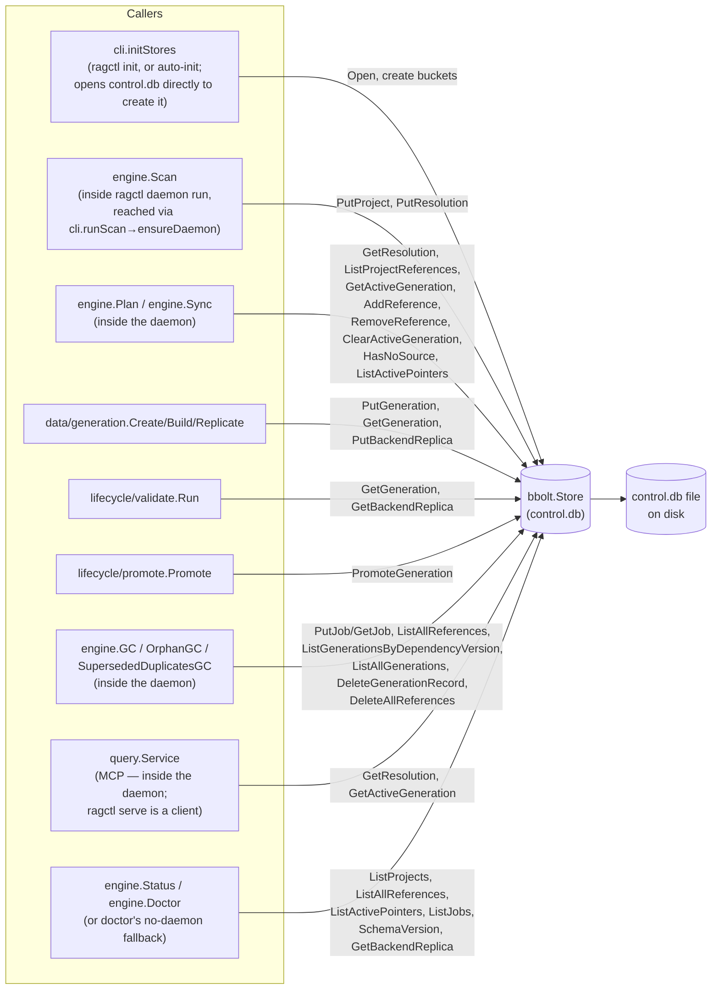

# internal/control

`internal/control/bbolt` is ragctl's control-plane store, the file `control.db`. It holds small, strongly structured lifecycle and bookkeeping state: projects, resolutions, generations, active-generation pointers, backend replicas, jobs, version references, and "no docs source" records. It is kept separate from `internal/data/badger`, the high-volume content store: bbolt suits small keyed records with occasional prefix scans, while Badger's LSM design is tuned for large content blobs.

Terms used below:
- A **generation** is one build of one dependency version's docs (ID like `gen_01J8...`), moving through states such as READY, ACTIVE, SUPERSEDED and FAILED.
- An **active pointer** says which generation queries should use for one exact dependency version on one vector backend (ADR-012: pointers are per version, so several versions of one dependency can be active at once when different projects use them).
- A **reference** records that a project (or a grace period) still needs a dependency version; GC removes versions nothing references.

## Key types and functions

- `Store` — wraps a `*bolt.DB`; every control-plane method hangs off it. internal/control/bbolt/store.go
- `Open(path)` — opens/creates the bbolt file, ensures all 13 control-plane buckets exist (`meta`, `projects`, `project_dependencies`, `dependency_versions`, `knowledge_sources`, `generations`, `active_generations`, `backend_replicas`, `jobs`, `references`, `retention`, `migrations`, `no_source_versions`), then runs `ensureSchema`. Waits at most 2 seconds (`lockTimeout`) for bbolt's exclusive file lock and returns `ErrLocked` rather than blocking forever when another process holds it — a thin wrapper over `OpenWithTimeout(path, lockTimeout)`. internal/control/bbolt/store.go
- `OpenWithTimeout(path, timeout)` — `Open` with an explicit lock wait. `ragctl daemon run` uses 200ms for its own attempt to become the store owner: a losing candidate in a concurrent auto-start race needs to find out and exit almost immediately, not park inside the lock wait long enough to inherit the lock later (see `docs/internal/daemon.md`). internal/control/bbolt/store.go
- `CurrentSchemaVersion` (2) / `Migration` / `ensureSchema` / `Store.SchemaVersion` — the schema-version guard (STORE-002). Pending migrations run in order inside `Open`, each in one transaction; a database written by a newer binary is refused with `ErrUnsupportedSchemaVersion`. Migration 1 just records version 1; migration 2 (`migrateActivePointersPerVersion`, ADR-012) rekeys old per-dependency active pointers by version. `SchemaVersion` is what `ragctl doctor` reports. internal/control/bbolt/schema.go
- `Store.Close()` — closes the bbolt file, releasing its lock. internal/control/bbolt/store.go
- `Store.PutProject` / `GetProject` / `ListProjects` — `domain.Project` records, keyed by project ID. internal/control/bbolt/projects.go
- `Store.PutResolution` / `GetResolution` — one `domain.Resolution` per project, keyed by project ID (stored in the `project_dependencies` bucket; see Notes). internal/control/bbolt/resolutions.go
- `Store.PutGeneration` / `GetGeneration` / `DeleteGenerationRecord` / `ListGenerationsByDependencyVersion` / `ListAllGenerations` — `domain.Generation` records, keyed by generation ID. The two list methods are full bucket scans: GC uses the first to find a version's generations, orphan GC uses the second to find never-promoted ones. internal/control/bbolt/generations.go
- `Store.PromoteGeneration(ctx, candidate, backendName)` — one bbolt transaction that marks the generation previously active for the candidate's exact version (if any) SUPERSEDED, marks the candidate ACTIVE, and points the version's active pointer at it. Other versions of the same dependency are untouched. internal/control/bbolt/active_generations.go
- `Store.GetActiveGeneration(ctx, ecosystem, dependency, version, backendName)` — the active generation for one exact dependency version, or `ErrNotFound`. There is deliberately no version-less lookup (ADR-012). internal/control/bbolt/active_generations.go
- `Store.ClearActiveGeneration(...)` — removes one version's active pointer and marks its generation SUPERSEDED, so the planner treats that version as unbuilt; used by `ragctl sync --rebuild` (OPS-004). internal/control/bbolt/active_generations.go
- `Store.ListActivePointers(ctx, backendName)` / `ActivePointer` — every active pointer for one backend, as `(ecosystem, dependency, version, generation ID)`. The pointed-to record is deliberately not resolved, so `ragctl doctor` can spot a pointer whose generation record is missing; `ragctl status` counts them, and sync's keyword/vector backfill walks them. A legacy pointer that migration 2 couldn't rekey is listed with an empty version. internal/control/bbolt/active_generations.go
- `Store.PutBackendReplica` / `GetBackendReplica` — `domain.BackendReplica` records, keyed by generation ID + backend name. A replica's empty `EmbeddingModel` marks a generation built keyword-only. internal/control/bbolt/backend_replicas.go
- `Store.PutJob` / `GetJob` / `ListJobs` — `domain.Job` records (GC's deletion jobs, with deterministic IDs); `ListJobs` feeds `ragctl status`'s job counts and `ragctl doctor`'s stuck-job check. internal/control/bbolt/jobs.go
- `Store.AddReference` / `RemoveReference` / `CountReferences` / `ListReferences` / `ListProjectReferences` / `DeleteAllReferences` / `ListAllReferences` — `domain.VersionReference` records, keyed `<ecosystem>|<package>|<version>|<projectID>|<reason>` so one version can carry several references at once. internal/control/bbolt/references.go
- `NoSourceVersion` / `Store.PutNoSourceVersion` / `HasNoSource` / `DeleteNoSourceVersion` — records that sync found no usable docs source for a dependency version (no registry manifest and no fallback). Kept separate from FAILED generations because failures are retried on the next sync and no-source versions are not. internal/control/bbolt/no_source.go
- `ErrNotFound` — sentinel returned by every getter when a key is absent, checked via `errors.Is`. internal/control/bbolt/errors.go
- `ErrLocked` — returned (wrapped) by `Open` when the file lock can't be acquired in time; `ragctl daemon run` turns it into an "another daemon is already running" explanation (`ownershipError`), and `ragctl doctor`'s no-daemon fallback reports it. internal/control/bbolt/errors.go

## Dataflow



## Walkthrough

Scenario: project `proj_8f3e1c2a` (root `/Users/dev/website-backend`) has already been scanned, its `go.mod` resolved to include `github.com/redis/go-redis/v9@v9.5.1`, and a sync has just built and validated a new generation for that version on the `embedded` vector backend, replacing a previously active generation of the same version (a rebuild).

1. **Scan stores the resolution.** Inside the daemon, `engine.Scan` → `scanAndResolve` calls `Store.PutResolution(ctx, "proj_8f3e1c2a", r)` with a `domain.Resolution{Ecosystem: "go", ManifestPath: "go.mod", Dependencies: []domain.DependencyVersion{{Dependency: {Ecosystem: "go", Name: "github.com/redis/go-redis/v9", Direct: true}, Version: "v9.5.1", ResolvedBy: "go.sum"}, ...}}`. `resolutions.go` JSON-marshals `r` and writes it under key `"proj_8f3e1c2a"` in the bucket named `project_dependencies` (`resolutionsBucket`).

2. **A generation is built and reaches READY.** `internal/data/generation` (see `docs/internal/data-generation.md`) produces `domain.Generation{ID: "gen_01J8Z3K9QG7XZQZ8YB2QYQXABC", Dependency: {Dependency: {Ecosystem: "go", Name: "github.com/redis/go-redis/v9"}, Version: "v9.5.1"}, State: domain.GenReady}`, persisted via `Store.PutGeneration` under its ID in the `generations` bucket.

3. **Promotion is requested.** `lifecycle/promote.Promote` calls `Store.PromoteGeneration(ctx, candidate, "embedded")`. `activeGenerationKey` builds the pointer key from the candidate's exact version:

   ```
   key = "go|github.com/redis/go-redis/v9|v9.5.1|embedded"
   ```

   Pipe-separated deliberately, since dependency names contain `/`.

4. **Inside the single `db.Update`:** `activeBucket.Get(key)` finds the prior pointer value, say `"gen_01J7Q2M4NPBXTVK1RS9WYH3EFG"` (yesterday's build of v9.5.1). `markSuperseded` loads that record, sets its `State` to `SUPERSEDED` and `UpdatedAt` to now, and writes it back.

5. **The candidate is activated.** `candidate.State = domain.GenActive`, `UpdatedAt = now`, written back under its ID.

6. **The pointer swings over.** `activeBucket.Put(key, "gen_01J8Z3K9QG7XZQZ8YB2QYQXABC")`. Reading the old pointer, superseding the old record, activating the new one and moving the pointer is one bbolt transaction, so a crash partway through leaves the previous state intact, never a pointer to a non-ACTIVE generation. If another project uses v9.4.0 of the same module, that version's pointer (`...|v9.4.0|embedded`) is untouched.

7. **A later query reads it back.** `query.Service` calls `Store.GetActiveGeneration(ctx, "go", "github.com/redis/go-redis/v9", "v9.5.1", "embedded")`, which recomputes the key, looks up the generation ID in `active_generations`, then that ID in `generations`, and returns the ACTIVE record.

## Notes

- The pointer key's last part is `vector.backend` in every retrieval mode, including keyword mode, so a generation's lifecycle doesn't depend on how it is searched (see `searchIndex` in `docs/internal/cli.md`).
- Resolutions live in the `project_dependencies` bucket — an interim simplification of STORE-001's planned `project_dependencies`/`dependency_versions` relational split. `dependency_versions`, `knowledge_sources`, `retention` and `migrations` are created by `Open` but unused (the schema version lives in `meta`). internal/control/bbolt/resolutions.go
- Only one process can have `control.db` open at a time: bbolt holds an exclusive file lock for as long as a `Store` is open. Under ADR-011, `ragctl daemon run` is that process for its whole lifetime, and every other command is a client over its socket (see `docs/internal/daemon.md`). The exceptions are `init` (and the auto-init `ensureDaemon` runs), which creates the store before a daemon can exist, and `doctor`, which dials without autostarting and only opens the stores itself if no daemon answers — see `docs/internal/cli.md`'s notes.
- No index from `(ecosystem, package, version)` to generation ID exists, so `ListGenerationsByDependencyVersion`, `ListAllGenerations` and `ListAllReferences` are full bucket scans — an accepted "small keyspace" tradeoff (see the comments in generations.go and references.go).
- `PromoteGeneration`, `ClearActiveGeneration` and migration 2 are the multi-record read-modify-write transactions here; every other method is a single get, put or scan.
- Every write is a full JSON marshal of the whole record — fine at ragctl's scale, but records are rewritten wholesale rather than patched.
