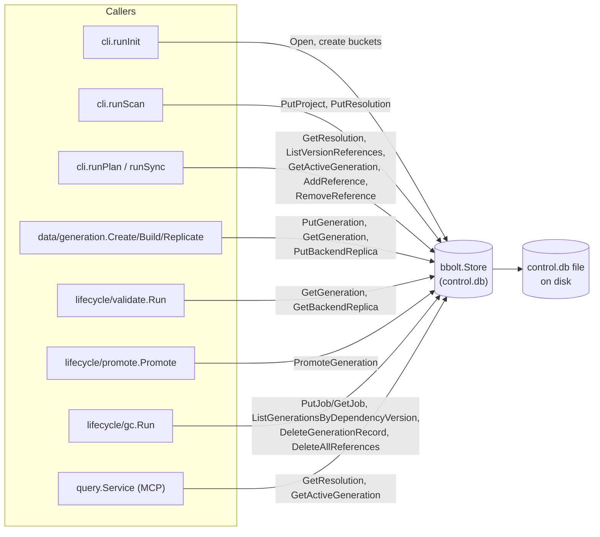

# internal/control

`internal/control/bbolt` is ragctl's control-plane store: small, strongly structured lifecycle and bookkeeping state (projects, resolutions, generations, active-generation pointers, backend replicas, jobs, version references). It exists to keep "what does ragctl know / what state is something in" separate from `internal/data/badger`'s high-volume content store — a bbolt file is cheap to keep fully in memory-mapped form and well suited to small keyed records with occasional prefix scans, unlike Badger's LSM design tuned for large content blobs.

## Key types and functions

- `Store` — wraps a `*bolt.DB`; every control-plane method hangs off it. internal/control/bbolt/store.go
- `Open(path)` — opens/creates the bbolt file and ensures all 12 control-plane buckets exist (`projects`, `project_dependencies`, `dependency_versions`, `knowledge_sources`, `generations`, `active_generations`, `backend_replicas`, `jobs`, `references`, `retention`, `migrations`, `meta`). internal/control/bbolt/store.go
- `Store.Close()` — closes the underlying bbolt file. internal/control/bbolt/store.go
- `Store.PutProject` / `GetProject` / `ListProjects` — CRUD for `domain.Project`, keyed by project ID. internal/control/bbolt/projects.go
- `Store.PutResolution` / `GetResolution` — one `domain.Resolution` per project, keyed by project ID; an interim simplification of STORE-001's fuller relational split. internal/control/bbolt/resolutions.go
- `Store.PutGeneration` / `GetGeneration` / `DeleteGenerationRecord` / `ListGenerationsByDependencyVersion` — CRUD for `domain.Generation` lifecycle records, keyed by generation ID; the version-scan is a full bucket scan since no `(ecosystem,pkg,version)` index exists. internal/control/bbolt/generations.go
- `Store.PromoteGeneration` — one bbolt transaction that supersedes the prior active generation for a dependency+backend, activates the candidate, and swaps the `active_generations` pointer. internal/control/bbolt/active_generations.go
- `Store.GetActiveGeneration` — looks up the currently active generation for `(ecosystem, dependencyName, backendName)`. internal/control/bbolt/active_generations.go
- `Store.PutBackendReplica` / `GetBackendReplica` — CRUD for `domain.BackendReplica`, keyed by `generationID/backendName`. internal/control/bbolt/backend_replicas.go
- `Store.PutJob` / `GetJob` — CRUD for `domain.Job`, keyed by (deterministic, GC-caller-supplied) job ID. internal/control/bbolt/jobs.go
- `Store.AddReference` / `RemoveReference` / `CountReferences` / `ListReferences` / `ListProjectReferences` / `DeleteAllReferences` / `ListAllReferences` — CRUD over `domain.VersionReference`, keyed `<ecosystem>|<package>|<version>|<projectID>|<reason>` so one version can carry multiple simultaneous references. internal/control/bbolt/references.go
- `ErrNotFound` — sentinel returned by every getter when a key is absent, checked via `errors.Is`. internal/control/bbolt/errors.go

## Dataflow



## Walkthrough

Scenario: project `proj_8f3e1c2a` (root `/Users/dev/website-backend`) has already been scanned, its `go.mod` resolved to include `github.com/redis/go-redis/v9@v9.5.1`, and a sync has just built and validated a new generation for that dependency that's now ready for promotion to the `qdrant` backend, superseding a previously active generation.

1. **Scan stores the resolution.** `cli.runScan` calls `Store.PutResolution(ctx, "proj_8f3e1c2a", r)` with a `domain.Resolution{Ecosystem: "go", ManifestPath: "go.mod", Dependencies: []domain.DependencyVersion{{Dependency: {Ecosystem: "go", Name: "github.com/redis/go-redis/v9", Direct: true}, Version: "v9.5.1", ResolvedBy: "go.sum"}, ...}}`. internal/control/bbolt/resolutions.go JSON-marshals `r` and writes it under key `"proj_8f3e1c2a"` in the bucket literally named `project_dependencies` (`resolutionsBucket`, internal/control/bbolt/resolutions.go) — not `dependency_versions`, which STORE-001 reserved for a relational split that hasn't been built yet.

2. **A generation is built and reaches READY.** Elsewhere (`internal/data/generation`, see docs/internal/data-generation.md), `Create`/`Build`/validation produce `domain.Generation{ID: "gen_01J8Z3K9QG7XZQZ8YB2QYQXABC", Dependency: {Dependency: {Ecosystem: "go", Name: "github.com/redis/go-redis/v9"}, Version: "v9.5.1"}, State: domain.GenReady}`, persisted via `Store.PutGeneration` under key `"gen_01J8Z3K9QG7XZQZ8YB2QYQXABC"` in the `generations` bucket (internal/control/bbolt/generations.go).

3. **Promotion is requested.** `lifecycle/promote.Promote` calls `Store.PromoteGeneration(ctx, candidate, "qdrant")` where `candidate` is that `GenReady` generation. internal/control/bbolt/active_generations.go first computes the pointer key via `activeGenerationKey`:

   ```
   key := "go" + "|" + "github.com/redis/go-redis/v9" + "|" + "qdrant"
        = "go|github.com/redis/go-redis/v9|qdrant"
   ```

   internal/control/bbolt/active_generations.go — pipe-separated deliberately, since the dependency name itself contains `/`.

4. **Inside the single `db.Update`** (internal/control/bbolt/active_generations.go): `activeBucket.Get(key)` finds the prior pointer value, say `"gen_01J7Q2M4NPBXTVK1RS9WYH3EFG"` (yesterday's active generation for this exact dependency+backend pair). `genBucket.Get([]byte("gen_01J7Q2M4NPBXTVK1RS9WYH3EFG"))` loads that record, its `State` is flipped from `ACTIVE` to `domain.GenSuperseded` (`"SUPERSEDED"`), `UpdatedAt` set to `now`, re-marshaled, and written back to the same key in `generations`.

5. **The candidate is activated.** `candidate.State = domain.GenActive` (`"ACTIVE"`), `UpdatedAt = now`, marshaled, and `genBucket.Put([]byte("gen_01J8Z3K9QG7XZQZ8YB2QYQXABC"), data)` writes it into `generations`.

6. **The pointer swings over.** `activeBucket.Put(key, []byte("gen_01J8Z3K9QG7XZQZ8YB2QYQXABC"))` — so the `active_generations` bucket entry for `"go|github.com/redis/go-redis/v9|qdrant"` now resolves to the new generation ID. All of this — reading the old pointer, superseding the old record, activating the new one, swinging the pointer — is one bbolt transaction; a crash partway through leaves the *previous* state intact (bbolt only commits atomically), never a dangling pointer to a non-`ACTIVE` generation.

7. **A later query reads it back.** `query.Service` (MCP) calls `Store.GetActiveGeneration(ctx, "go", "github.com/redis/go-redis/v9", "qdrant")`, which recomputes the same key, looks up `"gen_01J8Z3K9QG7XZQZ8YB2QYQXABC"` in `active_generations`, then that ID in `generations`, and returns the now-`ACTIVE` record — internal/control/bbolt/active_generations.go.

## Notes

- `resolutionsBucket` uses the bucket name `project_dependencies` for historical/schema reasons — an interim simplification of STORE-001's fuller `project_dependencies`/`dependency_versions` relational split; the latter bucket is created but unused. internal/control/bbolt/resolutions.go
- No schema-version handling yet (STORE-002 gap, per architecture.md).
- No `dependency_versions`-bucket index from `(ecosystem, package, version)` to generation ID exists, so `ListGenerationsByDependencyVersion` and `ListAllReferences`/GC candidate discovery are full bucket scans — an accepted "small keyspace" tradeoff, not an oversight (see comments at internal/control/bbolt/generations.go and references.go).
- `PromoteGeneration` is the one place in this package that does multi-record read-modify-write inside a single `db.Update` — every other method is a single get/put, keeping the rest of the package simple key-value CRUD.
- Every write path here is a full JSON marshal of the whole record on every update — fine at ragctl's current scale, but means large records (e.g. a generation with many nested fields) are rewritten wholesale rather than patched.
