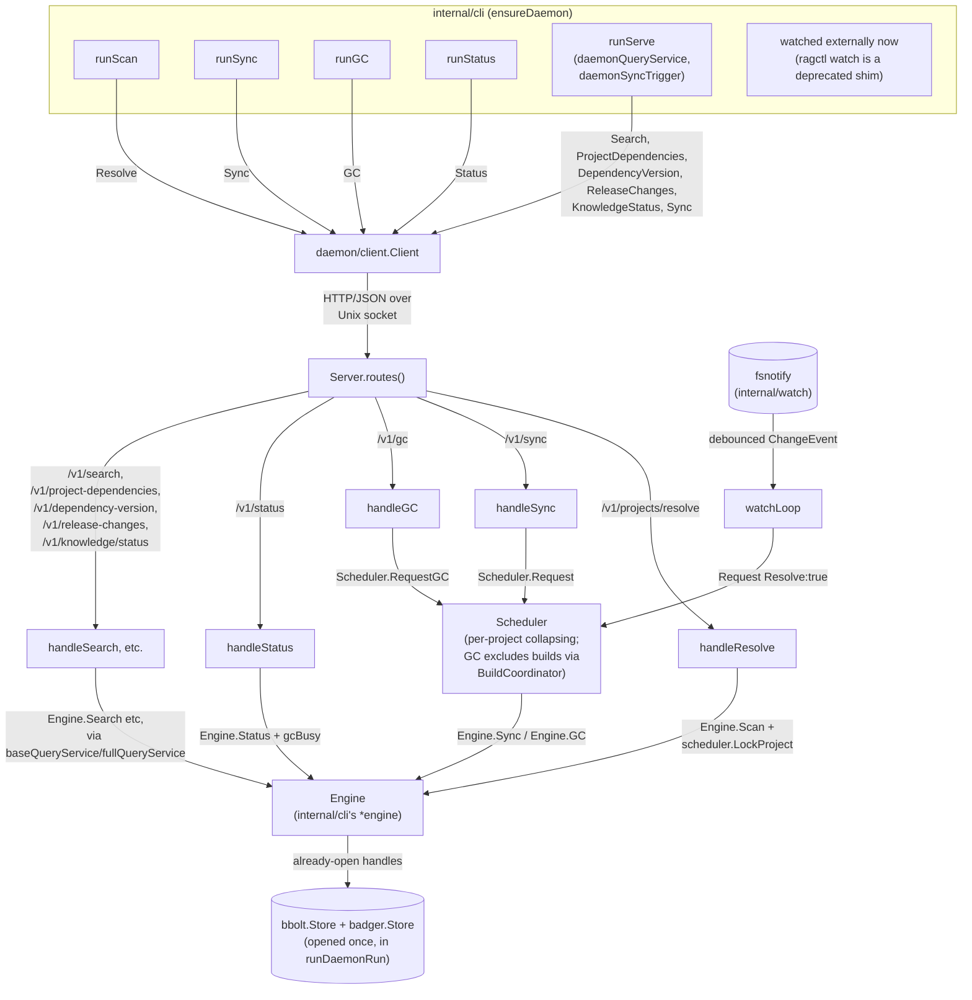

# internal/daemon

`internal/daemon` is the one process that owns ragctl's persistent stores while it runs (ADR-011). Every other `ragctl` process — CLI commands, `ragctl serve`, the watcher — reaches that state through this package's HTTP/JSON API over a Unix domain socket, never by opening bbolt or Badger itself. This package owns transport, scheduling, and lifecycle only; the work behind each route is done by an `Engine`, implemented in `internal/cli` over the stores the daemon holds open, so no domain logic moves here. `internal/daemon/client` is the other side of the same contract, used by `internal/cli`'s command implementations.

## Key types and functions

Server and lifecycle:
- `Server` / `New(opts Options)` / `Serve(ctx) error` — binds the socket, starts watching (if enabled), serves HTTP until `ctx` ends or `Shutdown()` is called, then waits for the scheduler to drain before returning — `internal/daemon/server.go`.
- `Engine` — the daemon's view of ragctl's actual functionality, defined consumer-side here and implemented by `internal/cli/daemon.go`'s `engine` struct over the already-open stores — `internal/daemon/server.go`. Its methods:
  - `Status`, `Projects`, `ProjectIDs`, `Sync`, `Scan`, `Plan`.
  - `GC`, `OrphanGC`, `SupersededDuplicatesGC` — the three separate GC paths behind `ragctl gc`, `gc --orphans` and `gc --superseded-duplicates`.
  - The read-only MCP query surface: `Search`, `ProjectDependencies`, `DependencyVersion`, `ReleaseChanges`, `KnowledgeStatus`.
  - `ProjectList`/`ProjectGet` (`project`/`deps`), `Describe`, and `Doctor` (every check that needs the stores; the two PATH-only checks stay client-side, see `docs/internal/cli.md`).
  - `EmbeddingReadiness`/`VectorReadiness` — the background readiness probes' current state, reported in `Health`.
  - `ExportMem0`, `ExportGraphiti`, `ExportCognee` — `ragctl export <target>`.
- `Options` — `Engine` and `Socket` (required), `ControlPath`, `Version`, `WatchEnabled`, `Debounce`, `DisableAmbientSync`, `MCPEnabled`, `EnableSyncTool`, `ConfigFingerprint`, `Logf`, `Out` — `internal/daemon/server.go`.
- `Shutdown()` — asks a running `Serve` to stop; returns immediately, closing `s.stop` — `internal/daemon/server.go`.

Scheduling (`internal/daemon/scheduler.go`, `coordinator.go`, `progress.go`):
- `Scheduler` / `NewScheduler(base, run SyncFunc, runGC GCFunc, logf)` — runs at most one sync per project at a time (different projects sync concurrently) and one GC daemon-wide. It holds no durable state (ADR-011 §7).
- `BuildCoordinator` — keeps GC and builds apart without serializing all syncs. Every generation build (`Build`) and every reference change (`ProtectFromGC`) takes the read side of one gate; GC takes the write side (`ExcludeForGC`), so it waits for in-flight builds and blocks new ones while it runs. This matters because GC decides a generation is unreferenced by reading the same `references` state a sync can be changing. `Build` also joins two callers building the same dependency version into one real build (singleflight).
- `Request(projectID, opts, out) <-chan Result` / `RequestGC(dryRun, out) <-chan GCOutcome` — queue work and get back a channel for the run that covers it: the run it starts, or the single follow-up run if one of that kind is already in progress. A request that arrives mid-run collapses into that follow-up rather than queuing its own. When sync options merge, `Force`/`Resolve` are OR'd, `Offline` is AND'd, and `Dependencies` are unioned (a request with no filter absorbs any named set). GC's `DryRun` is OR'd: if any collapsed request asked for a dry run, the follow-up is a dry run, so a preview request is never silently upgraded into a real delete.
- `RequestOrphanGC(ctx, run, dryRun, out)` — runs `gc --orphans` or `gc --superseded-duplicates` (the caller passes which). No collapsing: both are manual, opt-in operations, so each caller gets its own run.
- `BumpPriority(projectID, dependency) bool` — asks a project's running sync to do one dependency next (used by the MCP search tool's just-in-time sync). Returns false if nothing is running for that project.
- `SyncProgress(projectID)` / `SyncingProjects()` — live per-project counters (`SyncProgress` type: done/failed/total, dependencies in flight with chunk counts, and an observed-timing estimate), or the last meaningful run's counters once idle. Read by `ragctl status` and the `sync_progress` MCP tool.
- `LockProject(projectID) func()` — a separate lock that scan holds around one project's persist step, so two concurrent scans that discover the same project don't race `PutProject`/`PutResolution`. Refcounted, so the map doesn't grow by one entry per project ever scanned.
- Time bounds: each GC run (and each scan and export request) is bounded by `maxActionDuration` (var, 30 min). Sync runs have no whole-run bound; instead each `SYNC_VERSION` action has its own `dependencySyncTimeout` (10 min, `internal/cli/sync.go`), so one huge dependency can't starve the rest of a large batch. Runs use `context.WithoutCancel(base)`, so an in-flight run survives `Shutdown` rather than leaving a half-built generation.
- `States()` — each project's `idle`/`syncing`/`syncing+dirty` state.
- `Shutdown()` / `Wait()` — stop accepting work and fail anything still queued; then block until in-flight runs finish. `Server.Serve` calls both after the HTTP listener closes.

HTTP surface (`internal/daemon/handlers.go`, `internal/daemon/server.go`):
- Routes: `GET /v1/health`, `GET /v1/status`, `POST /v1/shutdown`, `POST /v1/projects/resolve`, `POST /v1/plan`, `POST /v1/sync`, `POST /v1/sync/priority`, `POST /v1/sync/progress`, `POST /v1/gc`, `POST /v1/export/mem0`, `POST /v1/export/graphiti`, `POST /v1/export/cognee`, the read-only query routes `POST /v1/search`, `POST /v1/project-dependencies`, `POST /v1/dependency-version`, `POST /v1/release-changes`, `POST /v1/knowledge/status` (named to avoid colliding with `/v1/status`, which means daemon/process health, not query.Service's fleet-wide sync-coverage summary), and `POST /v1/projects/list`, `POST /v1/projects/get`, `POST /v1/describe`, `POST /v1/doctor` — path constants and every request/response type live in `internal/daemon/api`, shared by server and client so they can't drift.
- `handleResolve` — runs `Engine.Scan`, passing `s.scheduler.LockProject` as the per-project lock callback, then refreshes the watched set immediately (rather than waiting up to a minute for the periodic refresh) so a newly registered project starts being watched right away.
- `handleSync` / `handleGC` — go through `Scheduler.Request`/`RequestGC` (or `RequestOrphanGC` for the two opt-in GC paths); both stream NDJSON progress lines (`stream`, `internal/daemon/stream.go`) so the CLI can print output as it happens instead of only at the end. The export handlers stream the same way.
- `handleStatus` — calls `Engine.Status` then fills in `GCRunning` (`gcBusy()`) and `Syncs` (`syncActivity`, from `SyncingProjects`), since `Engine` has no scheduler awareness (deliberately — see the package doc on why domain logic stays in `internal/cli`).

Watching (`internal/daemon/watch.go`):
- `startWatch(ctx)` — wraps `internal/watch.Watcher`, run inside the daemon instead of as its own process (ADR-011 §9; `ragctl watch` survives only as a deprecated shim).
- `watchLoop(ctx)` — turns debounced `ChangeEvent`s into `Scheduler.Request(projectID, SyncOptions{Resolve: true}, ...)` calls; doesn't wait for the sync, since the scheduler already collapses repeats.
- `refreshLoop(ctx)` — re-reads the registered project list every `projectRefreshInterval` (1 minute) so projects added or removed while the daemon runs are picked up without a restart; also runs immediately after any request that changes the project set (`refreshProjects`, called from `handleResolve`).
- Ambient sync: when `refreshProjects` sees a project registered after the daemon's initial load, it requests a full sync for it (`SyncOptions{Resolve: true}`), unless `sync.disable_ambient` is set. Projects already registered at startup don't count, so a restart doesn't resync the whole fleet. Watching (and so ambient sync) only runs when `watch.enabled` is true.

Client (`internal/daemon/client/client.go`):
- `Client` / `New(socket)` / `Dial(ctx, socket) (*Client, error)` — `Dial` returns a `Client` only if a daemon actually answers `Health`, otherwise `ErrNotRunning`; `New` doesn't contact the socket.
- `Health`, `Status`, `Shutdown`, `Resolve`, `Sync`, `SyncProgress`, `BumpSyncPriority`, `Plan`, `GC`, `ExportMem0`, `ExportGraphiti`, `ExportCognee`, `Search`, `ProjectDependencies`, `DependencyVersion`, `ReleaseChanges`, `KnowledgeStatus`, `ProjectList`, `ProjectGet`, `Describe`, `Doctor` — one method per route, matching the server's handlers. All return `api.*` wire types (`Describe`'s exception: it decodes into a caller-supplied `any`, the same pattern `Plan` uses, since `Report` is a pre-existing `internal/cli` type not worth duplicating into `api`); converting `api.*` back to `internal/query`'s types is `internal/cli`'s job (`daemonQueryService` and friends in `internal/cli/query_client.go`), not this package's — a client stays a thin protocol library.
- **Every method wraps its own request with a timeout** (`defaultRequestTimeout` 90s, `describeRequestTimeout` 10min, `longRunningRequestTimeout` 35min for the streamed Resolve/GC/export calls, `syncTimeout` 4h for Sync, since a large first sync legitimately runs long) — `c.http` itself sets none, same as `http.DefaultClient`, the exact gap already found and fixed one layer down in the qdrant client. Without this, a stuck daemon-side handler would hang the *calling command* forever (not the whole daemon — Go's net/http runs each request on its own goroutine, so this was never global paralysis, but a real per-command risk). vars, not consts, so tests can shorten them — see `TestHealthTimesOutOnAStuckDaemon`.
- `api.Health` — PID, start time, socket, control path, build `Version`, whether it is watching, the MCP settings, the embedding and vector readiness states (`EmbeddingState`/`VectorState` plus detail), and `ConfigFingerprint`.
- `api.Health.ConfigFingerprint` — `config.Config.Fingerprint()` (hashes the canonical YAML encoding, not the on-disk bytes, so cosmetic edits don't register) as of when the daemon started. Since config is loaded once for the daemon's whole lifetime, every `ensureDaemon` call compares this against a fresh load and warns on stderr if they differ (`warnIfConfigStale`), `ragctl daemon status` shows a `config:` line (`configFreshnessLabel`), and `ragctl doctor` gets a `config matches running daemon` check either way. `Health.Version` drives the same kind of warning when the binary was rebuilt after the daemon started (`warnIfVersionStale`).
- `ErrNotRunning` — the socket file is absent, or stale and refuses connections; `internal/cli`'s `ensureDaemon` treats this as "try to auto-start."

## Dataflow

## Walkthrough

Scenario: no daemon is running. A user runs `ragctl scan .` in a Go module directory that's never been scanned before.

1. `runScan` (`internal/cli/scan.go`) resolves the path to absolute, then calls `ensureDaemon(cmd.Context())` (`internal/cli/daemon.go`).
2. `ensureDaemon` calls `socketPath()`, then `client.Dial(ctx, socket)`. Nothing is listening, so `Dial`'s `Health` call fails and returns `ErrNotRunning`.
3. `ensureDaemon` checks `cfg.Daemon.AutostartEnabled()` (true by default), then calls `ensureInitialized(ctx)`: if `control.db` doesn't exist yet, this transparently runs the same work `ragctl init` does (`initStores`, status lines to stderr) before proceeding — no hard "run `ragctl init` first" refusal, since an MCP session has no terminal to run that from (see `docs/scratch/mcp-bootstrapping.md`). Once the stores exist (already, or freshly created), `ensureDaemon` calls `spawnDaemonOnce(socket)`.
4. `spawnDaemonOnce` is the first caller for this socket, so it actually calls `spawnDaemon()`: `exec.Command(exe, "daemon", "run")`, detached, stdout/stderr redirected to `ragctld.log`; a background `cmd.Wait()` reaps the child when it exits, so a long-lived parent like `ragctl serve` doesn't collect zombie processes. (A second concurrent caller in the same process would instead wait on this same attempt's result via a shared channel — see `internal/cli/daemon.go`'s `spawnAttempt`.)
5. Meanwhile, `spawnDaemonOnce` keeps the attempt open until the new daemon answers, so another caller in the same process waits for it rather than spawning a second daemon. The new `ragctl daemon run` process (`runDaemonRun`, `internal/cli/daemon.go`) opens `control.db` via `openControlStoreForDaemonRun` — a 200ms lock timeout, deliberately shorter than the general 2s default, so a losing candidate in a concurrent auto-start race fails fast rather than parking inside the lock wait. It wins (nothing else was running), opens Badger, and calls `daemon.New(Options{Engine: &engine{...}, ...}).Serve(ctx)`.
6. `Serve` removes any stale socket file, binds `ragctld.sock`, starts watching (`startWatch`, since `watch.enabled` defaults true), and begins serving HTTP.
7. Back in the original CLI process, `ensureDaemon`'s `waitForDaemon` polls the socket until `Dial` succeeds, then returns the connected `*client.Client`.
8. `runScan` calls `c.Resolve(ctx, "/abs/path", cmd.OutOrStdout())` — a `POST /v1/projects/resolve` request, streamed NDJSON.
9. `handleResolve` calls `Engine.Scan(ctx, root, out, s.scheduler.LockProject)`. `engine.Scan` runs `scanAndResolve` (`internal/cli/scan.go`) against the store the daemon already has open — no second store handle, no lock contention with anything else, since this is the only process touching `control.db`.
10. `scanAndResolve` discovers the one project, acquires its `LockProject` lock (uncontended, since nothing else is scanning it), writes `PutProject`/`PutResolution`, releases the lock.
11. `handleResolve` calls `s.refreshProjects(ctx)` immediately after, so the new project starts being watched without waiting up to a minute for the periodic refresh.
12. The daemon streams progress lines back over the socket as it goes; `runScan`'s output looks identical to what it printed before ADR-011, even though the actual work now happens in a separate, persistent process.
13. The CLI process exits. The daemon keeps running — nobody told it to stop, and there's no idle timeout. It'll serve the next command — from this terminal, another terminal, or an MCP session's `ragctl serve` (now a client of the same daemon, ADR-011 §8) — without paying Badger's open cost again.

## Notes

- **Ownership is proven by the bbolt lock, not the socket file.** A socket left behind by a crash is stale and gets removed before a new daemon binds; a socket file is never itself evidence a daemon is running (ADR-011 §3).
- **Every store-touching command goes through the daemon now, `doctor` aside.** `doctor` dials without autostarting and falls back to opening the stores itself only if nothing answers — deliberate, since diagnosing a stopped or broken daemon is its job (see `docs/internal/cli.md`'s notes). `init`, `config validate`, and `registry` never talk to the daemon at all, since they don't need the stores it owns (or, for `init`, actively refuse to run while a daemon holds them).
- **`ragctl serve` follows this pattern now (ADR-011 §8, WATCH-010).** It opens no store and builds no embedder — `runServe` calls `ensureDaemon` like every other command, then wires MCP tools to `internal/cli/query_client.go`'s daemon-backed adapters: `daemonQueryService` (the query routes), `daemonSyncTrigger` (`/v1/sync`), `daemonScanTrigger` (`/v1/projects/resolve`), `daemonPriorityBumper` (`/v1/sync/priority`) and `daemonProgressReader` (`/v1/sync/progress`). `internal/mcp`'s `Deps.Query` is a consumer-side interface (`mcp.QueryService`, the five methods `tools.go` actually calls — not `GetProvenance`, which nothing calls yet) satisfied by either the real `*query.Service` (daemon-side) or this HTTP-backed wrapper. The `query.Service` an MCP session searches against is built lazily inside `engine`, in three memoized variants: a stores-only `baseQueryService` (everything except search), a `keywordQueryService` (search over the keyword index, no embedder), and a `fullQueryService` (embedder plus vector store, and in auto mode the keyword index too). `retrieval.mode` picks per search: keyword mode always uses keyword search, auto uses it whenever the embedder or vector store isn't ready, and vector mode returns the readiness error. The embedder's dimensions are probed only on the first vector search, so a daemon started for `scan`/`sync`/`gc` alone never has to reach Ollama.
- **Readiness probes run off the request path.** At startup the daemon probes Ollama (pulling the model if missing) and the vector store in the background (`checkEmbeddingReadiness`/`checkVectorReadiness`, `internal/cli`), and starts a ragctl-managed Qdrant container if `vector.managed` is set and nothing answers. Requests read the cached state instead of hanging on a network call. In keyword mode none of these probes run.
- **Config is loaded once, at daemon startup, and held for the daemon's whole lifetime** (`runDaemonRun` → `engine.cfg`). Editing `config.yaml` while a daemon is running (backend endpoint, embedding model, `watch.debounce`, `daemon.autostart`, ...) still has no effect until `ragctl daemon stop` and the next auto-start — that limitation itself isn't fixed. What changed: it's no longer silent. `ConfigFingerprint` (above) makes the drift detectable, and `ensureDaemon`, `daemon status`, and `doctor` all surface it. The registry (`<data-dir>/registry/*.yaml`) isn't subject to any of this — `loadRegistryForCLI` is called fresh on every `plan`/`sync`, not cached.
- **The scheduler's queue is in-memory only.** No bbolt jobs, no durable queue, no worker framework (ADR-011 §7, deliberately). Work queued but not yet started when the daemon stops is simply lost — nothing was written for it, so there's no corruption risk, just lost work the next file change or command re-requests.
- **Scan isn't tracked by `Scheduler.Wait()`.** `handleResolve` runs `Engine.Scan` synchronously in the HTTP handler goroutine, not through `Scheduler.start`/`inFlight`. Daemon shutdown still drains it, but via `http.Server.Shutdown`'s own connection-draining (bounded by `shutdownGrace`, 30s) rather than the scheduler's explicit wait — a different, less visible mechanism than what sync/GC get.
- **Scan-vs-sync of the same project isn't cross-locked** — only scan-vs-scan is (via `LockProject`). Deliberately left that way: bbolt's own transactional atomicity means the actual exposure is a sync computing its plan from a resolution snapshot a few milliseconds stale, not corruption — see `docs/scratch/action-controller-proposal.md`'s "Implementation notes" for the full reasoning and what would change if this ever needs tightening.
