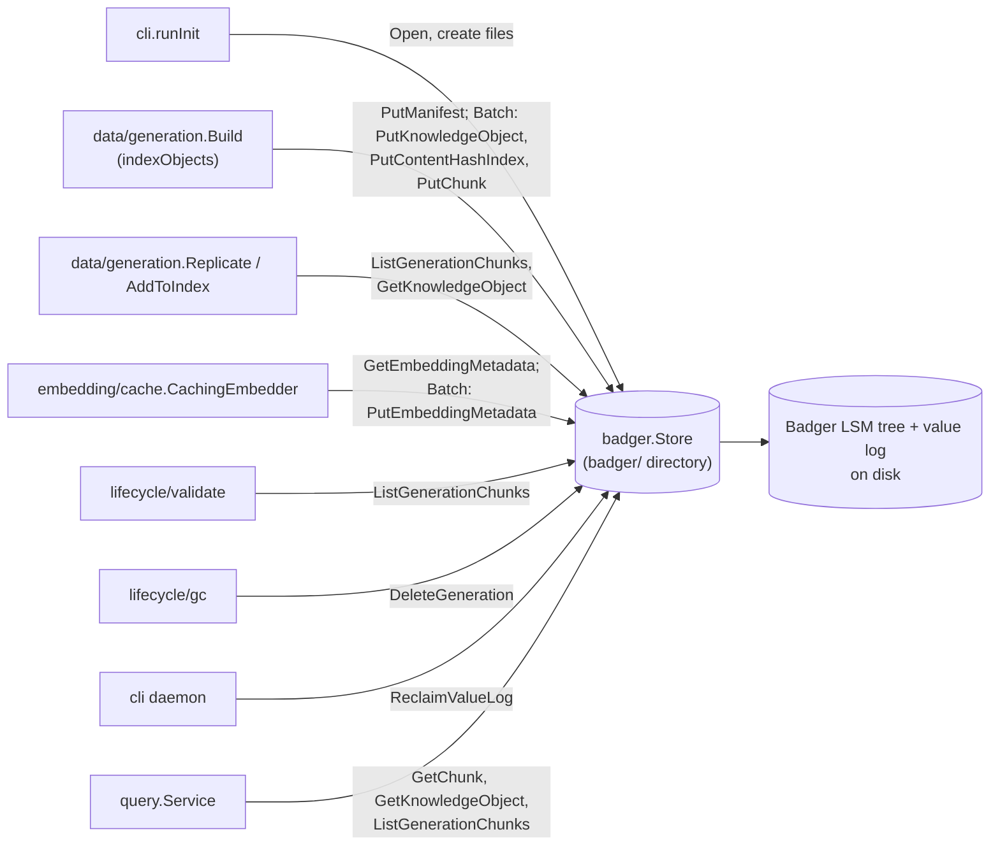

# internal/data/badger

`internal/data/badger` is depctl's data-plane store: high-volume normalized content — knowledge objects, chunks, generation manifests, the content-hash dedup index, and the embedding cache. It lives in the `badger/` directory under the data dir. It is separate from `internal/control/bbolt` because this content is large, content-addressed, and mostly write-once/read-many, which suits Badger's LSM-tree design better than bbolt's B+tree, which is tuned for small strongly-consistent records.

Search indexes (the vector store and keyword index) are not here; they are separate files or services (see [internal/backend](backend.md)).

## Key types and functions

- `Store` — wraps a `*bg.DB` (Badger v4); every data-plane method hangs off it. internal/data/badger/store.go
- `Open(path)` — opens/creates the Badger directory at `path`, with Badger's own logging silenced and tuned for large values (see Notes). internal/data/badger/store.go
- `Store.Close()` — closes the underlying Badger DB. internal/data/badger/store.go
- `Store.ReclaimValueLog()` — rewrites value-log files that are mostly stale, so deleted generations' disk space is returned; the daemon calls it after deleting data. internal/data/badger/store.go
- `Store.PutKnowledgeObject` / `GetKnowledgeObject` / `DeleteKnowledgeObject` — `domain.KnowledgeObject` as JSON, keyed `obj/<id>`. internal/data/badger/objects.go
- `Store.PutChunk` / `GetChunk` / `ListGenerationChunks` — `domain.Chunk` as JSON, keyed `chunk/<generationID>/<chunkID>`. A chunk whose text is byte-identical to its parent object's is stored without its text and flagged `ContentInObject`; reads restore the text from the object in the same transaction. internal/data/badger/chunks.go
- `Store.DeleteGeneration` — batched deletion of every chunk plus the manifest belonging to a generation ID; used by GC. internal/data/badger/chunks.go
- `Store.PutManifest` / `GetManifest` — raw-bytes storage for a generation's `generation.Manifest`, keyed `manifest/<generationID>`. internal/data/badger/manifest.go
- `Store.PutEmbeddingMetadata` / `GetEmbeddingMetadata` — raw bytes under `embed/<key>`; the embedding cache's only user, with keys `embedcache/<content-hash>/<provider>/<model>`. internal/data/badger/embedding.go
- `Store.PutContentHashIndex` / `GetContentHashIndex` — maps a pure content hash to the object ID storing it, keyed `hash/<content-hash>`; the primitive content reuse (GEN-003) is built on. internal/data/badger/hashindex.go
- `Batch`, `Store.NewBatch()` — groups many writes into a few large commits: `PutKnowledgeObject`, `PutContentHashIndex`, `PutChunk(generationID, c, objectContent)`, `PutEmbeddingMetadata`, then `Flush` (or `Cancel`, safe to defer). Writes aren't readable until `Flush`. Used by `generation.Build` and the embedding cache. internal/data/badger/batch.go
- `ErrNotFound` — returned by every getter when a key is absent, checked via `errors.Is`. internal/data/badger/errors.go

## Dataflow

## Walkthrough

Scenario: `data/generation.Build` (see [data-generation](data-generation.md)) is indexing generation `gen_01J8Z3K9QG7XZQZ8YB2QYQXABC` for `github.com/redis/go-redis/v9@v9.5.1` and has just normalized `README.md` into one `domain.KnowledgeObject`.

1. **The manifest skeleton already exists.** `generation.Create` called `Store.PutManifest(ctx, "gen_01J8Z3K9QG7XZQZ8YB2QYQXABC", data)` first, so key `manifest/gen_01J8Z3K9QG7XZQZ8YB2QYQXABC` holds the JSON of an empty `generation.Manifest`.

2. **A batch is opened.** `indexObjects` (internal/data/generation/build.go) calls `badgerStore.NewBatch()` and defers `Cancel()`; every write below is queued on it.

3. **The object is queued.** `indexObjects` has computed `obj.ID = "ko_5xj2qk7v3n8w1yzrt9m4pbhs6c0e2d"` (a fingerprint-derived ID — see [data-fingerprint](data-fingerprint.md)). No object with this content hash exists, so `batch.PutKnowledgeObject(obj)` queues key `obj/ko_5xj2qk7v3n8w1yzrt9m4pbhs6c0e2d` with the JSON-marshaled object.

4. **The content-hash index entry is queued.** `resolveObjectIdentity` also computed `contentHash = chunk.ContentHash(obj.Content)`, a 64-hex-character BLAKE3 digest such as `7f3a9c1e…`. `batch.PutContentHashIndex("7f3a9c1e…", "ko_5xj2…")` queues key `hash/7f3a9c1e…` — what the *next* generation's build will find when this README hasn't changed.

5. **Chunks are queued under the generation.** The Markdown chunker splits the README into four sections (see [data-chunk](data-chunk.md)). For each, `batch.PutChunk("gen_01J8Z3K9QG7XZQZ8YB2QYQXABC", c, obj.Content)` queues key `chunk/gen_01J8Z3K9QG7XZQZ8YB2QYQXABC/<chunkID>`. These chunks are parts of the README, so their text differs from the object's and is stored inline. A Go symbol's single chunk, by contrast, usually equals its object's content, so it would be stored with `ContentInObject: true` and no text.

6. **The batch is committed, then the manifest rewritten.** After every object, `batch.Flush()` commits all queued writes in a few large commits; `putManifest` then overwrites `manifest/gen_01J8…` with the final counts.

7. **Replicate reads the chunks back.** `generation.Replicate` calls `ListGenerationChunks(ctx, "gen_01J8…")`, which iterates prefix `chunk/gen_01J8…/` and decodes each chunk (restoring text from the parent object where flagged), then `GetKnowledgeObject` per parent object for its source attribution.

8. **Eventually, GC deletes the generation** (not the objects). `DeleteGeneration(ctx, "gen_01J8…")` batch-deletes every key under `chunk/gen_01J8…/` plus the manifest. `obj/ko_5xj2…` and `hash/7f3a9c1e…` stay, since a later generation may still reuse that object. The daemon then calls `ReclaimValueLog` so the freed space is actually returned to disk.

## Notes

- **Tuning.** Every value here is large (chunk text, whole objects, embedding vectors). With Badger's defaults, values under 1 MB live inside the sorted tree and are rewritten by every compaction; a live sync measured 1.2 GB of table-builder memory and a later out-of-memory crash at 7.5 GB. `Open` sets a 1 KB value threshold so the bulk goes into the append-only value log, plus smaller memtables, block cache and compactor count. Value-log space is reclaimed by `ReclaimValueLog`, not by compaction.
- `DeleteGeneration` deletes chunks and the manifest but not the objects those chunks point to or the content-hash index entries — an object can be shared across generations by content reuse, so GC leaves them; nothing in this package prunes orphaned objects.
- Because a `ContentInObject` chunk reads its text from the parent object, deleting an object that a remaining chunk points to would make that chunk unreadable. Nothing currently calls `DeleteKnowledgeObject` outside tests.
- Every record is a full JSON marshal (except the raw-bytes manifest, embedding and hash-index values), matching the pattern in `internal/control/bbolt`.
