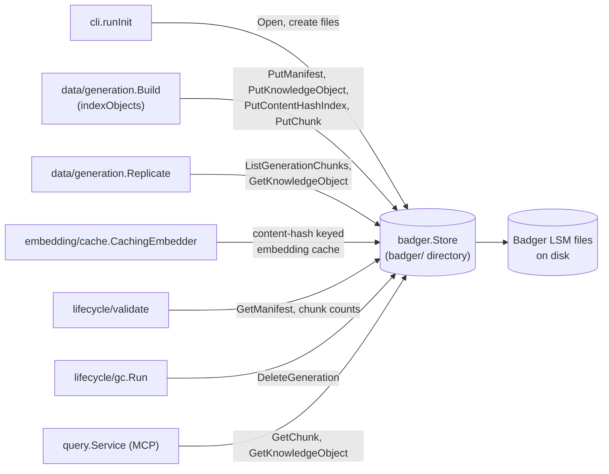

# internal/data/badger

`internal/data/badger` is ragctl's data-plane store: high-volume normalized content — knowledge objects, chunks, generation manifests, embedding metadata, and the content-hash dedup index. It exists separately from `internal/control/bbolt` because this content is large, content-addressed, and mostly write-once/read-many, which suits Badger's LSM-tree design (built for exactly this shape) better than bbolt's B+tree, which is tuned for small strongly-consistent records.

## Key types and functions

- `Store` — wraps a `*bg.DB` (Badger v4); every data-plane method hangs off it. internal/data/badger/store.go
- `Open(path)` — opens/creates the Badger directory at `path`, with Badger's own logging silenced. internal/data/badger/store.go
- `Store.Close()` — closes the underlying Badger DB. internal/data/badger/store.go
- `Store.PutKnowledgeObject` / `GetKnowledgeObject` / `DeleteKnowledgeObject` — CRUD for `domain.KnowledgeObject`, keyed `obj/<id>`. internal/data/badger/objects.go
- `Store.PutChunk` / `GetChunk` / `ListGenerationChunks` — CRUD for `domain.Chunk`, keyed `chunk/<generationID>/<chunkID>`. internal/data/badger/chunks.go
- `Store.DeleteGeneration` — batched (via `WriteBatch`) deletion of every chunk plus the manifest belonging to a generation ID; used by GC. internal/data/badger/chunks.go
- `Store.PutManifest` / `GetManifest` — raw-bytes CRUD for a generation's `generation.Manifest`, keyed `manifest/<generationID>`. internal/data/badger/manifest.go
- `Store.PutEmbeddingMetadata` / `GetEmbeddingMetadata` — raw-bytes CRUD keyed by a caller-constructed key (typically `<generation-id>/<provider>/<chunk-id>`), prefixed `embed/`. internal/data/badger/embedding.go
- `Store.PutContentHashIndex` / `GetContentHashIndex` — maps a pure content hash to the object ID storing it, keyed `hash/<content-hash>`; the primitive GEN-003 dedup is built on. internal/data/badger/hashindex.go
- `ErrNotFound` — sentinel returned by every getter when a key is absent, checked via `errors.Is`. internal/data/badger/errors.go

## Dataflow

## Walkthrough

Scenario: `data/generation.Build` (see docs/internal/data-generation.md) is indexing generation `gen_01J8Z3K9QG7XZQZ8YB2QYQXABC` for `github.com/redis/go-redis/v9@v9.5.1` and has just normalized `README.md` from that repo's acquired worktree into one `domain.KnowledgeObject`.

1. **The manifest skeleton already exists.** `generation.Create` called `Store.PutManifest(ctx, "gen_01J8Z3K9QG7XZQZ8YB2QYQXABC", data)` before anything else, so `manifestKey` (internal/data/badger/manifest.go) resolves to `manifest/gen_01J8Z3K9QG7XZQZ8YB2QYQXABC` holding the raw JSON bytes of `generation.Manifest{ID: "gen_...", Dependency: ..., ObjectCount: 0, ChunkCount: 0, ...}`.

2. **The object is stored.** `indexObjects` (internal/data/generation/build.go) has computed `obj.ID = "ko_5xj2qk7v3n8w1yzrt9m4pbhs6c0e2d" `(a fingerprint-derived, `ko_`-prefixed ID — see docs/internal/data-fingerprint.md) for the README content. Since no object with this content hash exists yet, `badgerStore.PutKnowledgeObject(ctx, obj)` runs. `objectKey` (internal/data/badger/objects.go) prefixes it: the Badger key written is literally `obj/ko_5xj2qk7v3n8w1yzrt9m4pbhs6c0e2d`, value is the full JSON-marshaled `domain.KnowledgeObject` (internal/data/badger/objects.go).

3. **The content-hash index is recorded.** `resolveObjectIdentity` also computed `contentHash = dchunk.ContentHash(obj.Content)`, a hex BLAKE3 digest, e.g. `7f3a9c1e...` (64 hex chars). `badgerStore.PutContentHashIndex(ctx, "7f3a9c1e...", "ko_5xj2qk7v3n8w1yzrt9m4pbhs6c0e2d")` writes key `hash/7f3a9c1e...` with value `[]byte("ko_5xj2qk7v3n8w1yzrt9m4pbhs6c0e2d")` (internal/data/badger/hashindex.go) — the primitive GEN-003 dedup reads back on the *next* generation's build.

4. **Chunks are stored under the generation.** The markdown chunker (docs/internal/data-chunk.md) splits the README into, say, two heading sections, producing chunks with IDs `chk_a1b2c3...` (ordinal 0) and `chk_d4e5f6...` (ordinal 1). For each, `badgerStore.PutChunk(ctx, "gen_01J8Z3K9QG7XZQZ8YB2QYQXABC", c)` writes under `chunkKey` (internal/data/badger/chunks.go): keys `chunk/gen_01J8Z3K9QG7XZQZ8YB2QYQXABC/chk_a1b2c3...` and `chunk/gen_01J8Z3K9QG7XZQZ8YB2QYQXABC/chk_d4e5f6...`, each value the JSON-marshaled `domain.Chunk`.

5. **The manifest is rewritten.** `putManifest` re-marshals the whole `Manifest` struct with `ObjectCount: 1, ChunkCount: 2, ObjectsCreated: 1` (and more, as later objects are processed) and overwrites `manifest/gen_01J8Z3K9QG7XZQZ8YB2QYQXABC` wholesale — same full-rewrite pattern as every other write in this package.

6. **Replicate reads the chunks back.** `generation.Replicate` calls `Store.ListGenerationChunks(ctx, "gen_01J8Z3K9QG7XZQZ8YB2QYQXABC")` (internal/data/badger/chunks.go), which seeks the iterator to prefix `chunk/gen_01J8Z3K9QG7XZQZ8YB2QYQXABC/` and reads every key under it — both chunks above come back regardless of which object or file they originated from, since the key only encodes generation + chunk ID. For each chunk it then calls `Store.GetKnowledgeObject(ctx, "ko_5xj2qk7v3n8w1yzrt9m4pbhs6c0e2d")` to recover the parent object's text and metadata for embedding.

7. **Eventually, GC deletes the generation** (not the objects). `Store.DeleteGeneration(ctx, "gen_01J8Z3K9QG7XZQZ8YB2QYQXABC")` batches deletes for every key under `chunk/gen_01J8Z3K9QG7XZQZ8YB2QYQXABC/` plus `manifest/gen_01J8Z3K9QG7XZQZ8YB2QYQXABC` (internal/data/badger/chunks.go) — `obj/ko_5xj2qk7v3n8w1yzrt9m4pbhs6c0e2d` and `hash/7f3a9c1e...` are left alone, since a later generation may still GEN-003-reuse that same object.

## Notes

- No CRUD methods existed until STORE-003 (generation-related tickets); the package originally shipped as just `Open`/`Close` so `ragctl init` could create the on-disk files.
- `PutEmbeddingMetadata`/`GetEmbeddingMetadata` store raw `[]byte`, not a typed struct — the caller owns encoding; nothing in the reviewed source currently calls these two methods, so the concrete payload shape is caller-defined but not yet exercised end-to-end in this codebase slice.
- `DeleteGeneration` deletes chunks and the manifest but not the objects those chunks point to or the content-hash index entries — an object can be shared (content-reused, GEN-003) across generations, so it's correct for GC to leave objects/hash-index entries alone here; nothing in this package prunes orphaned objects.
- Every write is a full JSON marshal of the record (except the three raw-bytes stores), matching the same pattern as `internal/control/bbolt`.
