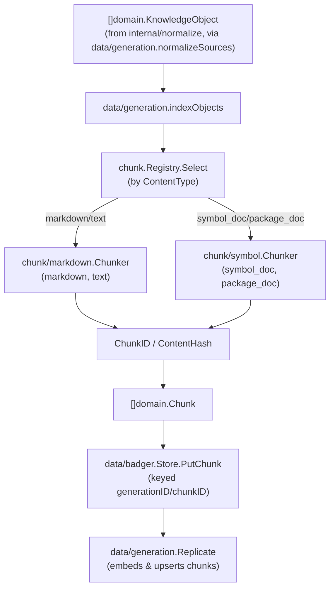

# internal/data/chunk

`internal/data/chunk` defines the shared `Chunker` interface every content-type-specific chunker implements, plus the deterministic `ChunkID`/`ContentHash` schemes they all use, and a `Registry` that dispatches by `KnowledgeObject.ContentType`. It exists so chunking stays content-aware per chunker (Markdown structural splitting vs. a Go-symbol passthrough) rather than growing one universal "N tokens with M overlap" splitter — CHUNK-001's explicit design constraint. Two subpackages, `markdown` and `symbol`, are the concrete chunkers registered by `data/generation.Build`.

## Key types and functions (internal/data/chunk)

- `Chunker` — interface: `Chunk(ctx, obj) ([]domain.Chunk, error)`. No `Supports` method, unlike `normalize.Normalizer` — dispatch is a plain content-type lookup owned by `Registry`. internal/data/chunk/chunk.go
- `Registry` — selects a `Chunker` by `KnowledgeObject.ContentType` membership, tried in registration order. internal/data/chunk/chunk.go
- `NewRegistry()` — returns an empty `Registry`. internal/data/chunk/chunk.go
- `Registry.Register(chunker, contentTypes...)` — associates a chunker with one or more content types; chainable. internal/data/chunk/chunk.go
- `Registry.Select(obj)` — returns the first registered chunker whose content types include `obj.ContentType`, or `(nil, false)`. internal/data/chunk/chunk.go
- `ChunkID(objectID, ordinal, content)` — derives a deterministic `"chk_"`-prefixed ID from the parent object ID, ordinal, and content (BLAKE3, length-prefixed fields) — content is included so a chunk whose boundaries shift gets a new ID rather than reusing a stale one. internal/data/chunk/chunk.go
- `ContentHash(content)` — hex BLAKE3 digest of content alone, independent of position. internal/data/chunk/chunk.go

## Key types and functions (internal/data/chunk/markdown — CHUNK-002)

- `Chunker` — implements `chunk.Chunker` for `ContentType` "markdown"/"text". internal/data/chunk/markdown/markdown.go
- `New(maxChunkBytes)` — returns a `Chunker` bounded to `maxChunkBytes` (falls back to `DefaultMaxChunkBytes` = 2000 if non-positive). internal/data/chunk/markdown/markdown.go
- `Chunker.Chunk` — splits `obj.Content` into heading-section chunks via `splitSections`, further splitting any oversized section at paragraph boundaries via `packSection`. internal/data/chunk/markdown/markdown.go
- `splitSections(content)` — line-by-line, fence-aware ATX-heading scan producing one `section{headingPath, headingLine, body}` per heading (Setext headings not recognized). internal/data/chunk/markdown/sections.go
- `packSection(headingLine, body, maxBytes)` — returns the section whole if it fits, else paragraph-packed groups with the heading prepended only to the first part. internal/data/chunk/markdown/sections.go

## Key types and functions (internal/data/chunk/symbol — CHUNK-003)

- `Chunker` — implements `chunk.Chunker` for `ContentType` "symbol_doc"/"package_doc"; near 1:1 passthrough of NORM-004 output. internal/data/chunk/symbol/symbol.go
- `New()` — returns a ready-to-use symbol chunker. internal/data/chunk/symbol/symbol.go
- `Chunker.Chunk` — emits exactly one `domain.Chunk` per object, with package/symbol/signature/source_path/version metadata promoted; falls back to `fallbackContent` (signature, then `package.symbol`) when `Content` is empty (undocumented symbol). internal/data/chunk/symbol/symbol.go

## Dataflow



## Walkthrough (markdown)

Scenario: the markdown chunker (`maxChunkBytes` left at `DefaultMaxChunkBytes` = 2000) is given a `domain.KnowledgeObject` with `ID: "ko_5xj2qk7v3n8w1yzrt9m4pbhs6c0e2d"` and this `Content` (a trimmed real-shaped go-redis README excerpt, three headings, ~650 bytes total):

````
# go-redis

Type-safe Redis client for Go.

## Installation

```
go get github.com/redis/go-redis/v9
```

## Quick start

```go
rdb := redis.NewClient(&redis.Options{Addr: "localhost:6379"})
```

## Contributing

PRs welcome — see CONTRIBUTING.md for guidelines and the # code-of-conduct rules linked there.
````

1. **`Chunk` calls `splitSections`** (internal/data/chunk/markdown/markdown.go, sections.go). Scanning line by line: the leading `# go-redis` line matches `atxHeading`, `flush()` emits nothing yet (nothing accumulated), `headingStack = ["go-redis"]`, `currentPath = "go-redis"`. The next line, blank, then `"Type-safe Redis client for Go."` accumulate into `current` until `## Installation` is hit — `flush()` emits `section{headingPath: "go-redis", headingLine: "# go-redis", body: "Type-safe Redis client for Go."}`. Critically, the ` ```go ... ``` ` and plain ` ``` ` fences around the install/quick-start snippets set `inFence = true` via `fenceMarkerOf`, so the fenced lines (including any that start with `#`) are written straight into `current` without being tested against `atxHeading` — the literal `# code-of-conduct` text inside the Contributing section's prose is outside any fence, but note it's *not* a line starting with `#` at column 0 (it's mid-sentence), so it was never at risk of misparsing anyway; the fence-awareness matters for a hypothetical `# comment` as the first token of a fenced shell line.

2. **Three sections result:** `{headingPath: "go-redis", body: "Type-safe Redis client for Go."}`, `{headingPath: "go-redis > Installation", body: "```\ngo get github.com/redis/go-redis/v9\n```"}`, `{headingPath: "go-redis > Quick start", body: "```go\nrdb := redis.NewClient(...)\n```"}`, `{headingPath: "go-redis > Contributing", body: "PRs welcome — ... code-of-conduct rules linked there."}` — each well under 2000 bytes, so `packSection` (sections.go) returns each `headingLine+"\n\n"+body` as a single whole part; no paragraph-packing triggers.

3. **Chunks are built** (markdown.go), one per part, `ordinal` incrementing across *all* sections (not reset per section):

   ```go
   domain.Chunk{
     ID:          dchunk.ChunkID("ko_5xj2qk7v3n8w1yzrt9m4pbhs6c0e2d", 0, content0),  // "chk_9k2mfa..."
     ObjectID:    "ko_5xj2qk7v3n8w1yzrt9m4pbhs6c0e2d",
     Ordinal:     0,
     Content:     []byte("# go-redis\n\nType-safe Redis client for Go."),
     ContentHash: dchunk.ContentHash(content0), // hex blake3, e.g. "3b8f01a2..."
     Metadata:    map[string]string{"heading_path": "go-redis"},
   }
   ```

   followed by ordinal 1 (`heading_path: "go-redis > Installation"`), ordinal 2 (`"go-redis > Quick start"`), ordinal 3 (`"go-redis > Contributing"`) — four chunks total for this one object.

4. **A hypothetical oversized section:** if `## Contributing`'s body were instead a single 6000-byte paragraph with no blank lines, `packSection` would find `len(full) > 2000`, call `packParagraphs(splitParagraphs(body), 2000)` (sections.go) — but since `splitParagraphs` finds exactly one paragraph (no `\n\n` boundary), `packParagraphs` still emits it as one over-limit group (its own `flush()` fires only when a *second* paragraph would overflow the current group) — matching the Notes section below: a single paragraph larger than `maxChunkBytes` is never cut mid-paragraph.

## Walkthrough (symbol)

Scenario: NORM-004's godoc normalizer emitted a `domain.KnowledgeObject` for `redis.NewClient` — an exported Go symbol with *no* doc comment (a real, common case: ~11% of real exported symbols per the chunk-sweep measurement in the Notes below):

```go
domain.KnowledgeObject{
  ID:          "ko_p9x3vw7k2m1qzr...",
  ContentType: "symbol_doc",
  LogicalPath: "client.go",
  Version:     "v9.5.1",
  Content:     []byte{},  // no doc comment
  Metadata: map[string]string{
    "package":   "redis",
    "symbol":    "NewClient",
    "signature": "func NewClient(opt *Options) *Client",
  },
}
```

1. **`Chunker.Chunk` builds the metadata map first** (internal/data/chunk/symbol/symbol.go): `{"package": "redis", "symbol": "NewClient", "signature": "func NewClient(opt *Options) *Client", "source_path": "client.go", "version": "v9.5.1"}`.

2. **The empty-content check fires** (symbol.go): `bytes.TrimSpace(obj.Content)` is zero-length, so `content = []byte(fallbackContent(metadata))`. `fallbackContent` (symbol.go) sees `metadata["signature"] != ""` and returns it immediately — `content` becomes `[]byte("func NewClient(opt *Options) *Client")`, never falling through to the `package.symbol` or bare-field cases.

3. **Exactly one chunk is emitted** (symbol.go), ordinal always `0`:

   ```go
   domain.Chunk{
     ID:          dchunk.ChunkID("ko_p9x3vw7k2m1qzr...", 0, []byte("func NewClient(opt *Options) *Client")),
     ObjectID:    "ko_p9x3vw7k2m1qzr...",
     Ordinal:     0,
     Content:     []byte("func NewClient(opt *Options) *Client"),
     ContentHash: dchunk.ContentHash(content), // hex blake3 of the signature text
     Metadata:    metadata,
   }
   ```

   Without the fallback, this object would instead have shipped a chunk with `Content: []byte{}` — real signal-free content that would embed to a near-meaningless vector; the fallback was added specifically because that's what the first version of this chunker did, caught only by `hack/chunk-sweep` against ~21k real objects, not by unit tests.

## Notes

- `chunk.Registry` is populated fresh in `data/generation.indexObjects` on every `Build` call (`Register(chunkmd.New(...), "markdown", "text").Register(symbol.New(), "symbol_doc", "package_doc")`) — internal/data/generation/build.go — not a package-level singleton.
- `data/generation.indexObjects` deduplicates chunk writes within one build via a `writtenChunkIDs` set: since `ChunkID` is content-derived, two objects that GEN-003-dedup to the same object ID (identical content) produce identical chunk IDs too, and without the guard `PutChunk` would silently overwrite while the manifest's chunk counter double-incremented (see internal/data/generation/build.go).
- `markdown.Chunker` uses a byte-length bound for `maxChunkBytes`, not a real tokenizer count — accepted as good enough for v0.1.
- A single paragraph larger than `maxChunkBytes` is emitted as its own over-limit chunk rather than cut mid-paragraph — confirmed against a real 67KB single-table paragraph during the corpus sweep (architecture.md), an accepted edge case, not a bug.
- `symbol.Chunker`'s empty-`Content` fallback was a real bug found by a real-corpus sweep (`hack/chunk-sweep`), not by unit tests: ~11% of real exported Go symbols have no doc comment, and the first version shipped an empty chunk instead of falling back to the signature.
