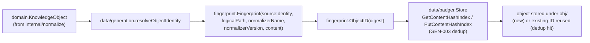

# internal/data/fingerprint

`internal/data/fingerprint` is ragctl's single deterministic content-identity primitive: a BLAKE3-based `Fingerprint` over a `KnowledgeObject`'s identifying inputs, and the `ObjectID` string derived from it. It exists so every subsystem that needs to detect "has this content actually changed" or "what's this object's storage key" goes through one function rather than hashing ad hoc in multiple places.

## Key types and functions

- `Fingerprint(sourceIdentity, logicalPath, normalizerName, normalizerVersion, content) [32]byte` — one BLAKE3 digest over those five inputs, each length-prefixed with a uvarint so variable-length fields can never collide by concatenation (e.g. `"ab"+"c"` vs `"a"+"bc"`). Bumping `normalizerVersion` deliberately changes the digest, so a parsing-logic change signals "re-normalize this" without the source bytes changing. internal/data/fingerprint/fingerprint.go
- `ObjectID(digest) string` — derives a `"ko_"`-prefixed, lowercase, unpadded-base32 ID from a fingerprint digest; used as the Badger key suffix for `obj/<object-id>`. Deliberately lowercase, unlike `internal/resolver.Fingerprint`'s uppercase convention, since this one is a human-inspectable storage key rather than an internal no-op-detection signal. internal/data/fingerprint/fingerprint.go

## Dataflow



## Walkthrough

Scenario: `data/generation.indexObjects` is resolving the identity of a `domain.KnowledgeObject` normalized from `README.md` in the `github.com/redis/go-redis/v9` repo at commit `a1c9f3e7b2d84f1e6c0a2b7d9e5f1a3c8b6d4e20`, version `v9.5.1`.

1. **The object arrives with these fields set** (per internal/data/generation/build.go and appendAttributed): `SourceID: "go-redis-git"`, `Commit: "a1c9f3e7b2d84f1e6c0a2b7d9e5f1a3c8b6d4e20"`, `LogicalPath: "README.md"`, `Content: []byte("# go-redis\n\nType-safe Redis client for Go.\n...")` (already CRLF/lone-CR-normalized by `markdown-normalizer`), and `Metadata: {"_normalizer_name": "markdown-normalizer", "_normalizer_version": "v1"}` (stashed by `normalizeOne`, internal/data/generation/build.go, matching `internal/normalize/markdown.Normalizer.Name()`/`.Version()`).

2. **`resolveObjectIdentity` builds the source identity string** (internal/data/generation/build.go): `sourceIdentity := "go-redis-git" + "@" + "a1c9f3e7b2d84f1e6c0a2b7d9e5f1a3c8b6d4e20"` = `"go-redis-git@a1c9f3e7b2d84f1e6c0a2b7d9e5f1a3c8b6d4e20"`.

3. **`Fingerprint` is called** (internal/data/fingerprint/fingerprint.go) with five positional args in fixed order:

   ```
   Fingerprint(
     "go-redis-git@a1c9f3e7b2d84f1e6c0a2b7d9e5f1a3c8b6d4e20", // sourceIdentity, 51 bytes
     "README.md",                                            // logicalPath, 9 bytes
     "markdown-normalizer",                                  // normalizerName, 20 bytes
     "v1",                                                    // normalizerVersion, 2 bytes
     []byte("# go-redis\n\nType-safe Redis client for Go.\n..."), // content, say 4381 bytes
   )
   ```

4. **Each field is length-prefixed before hashing** (`writeLengthPrefixed`, internal/data/fingerprint/fingerprint.go). For `sourceIdentity` (51 bytes), `binary.PutUvarint` encodes `51` as a single byte `0x33` (uvarint fits in one byte for any value < 128), written before the 51 content bytes; for `content` at 4381 bytes, the uvarint needs two bytes (`4381` = `0b1000100011101`, encoded LEB128-style as `0x9d 0x22` — low 7 bits `0x1d` with the continuation bit set, then the remaining `0x22`) written before the 4381 content bytes. This is what makes `"ab"+"c"` and `"a"+"bc"` unambiguous — the hash input includes each field's exact length, not just concatenated bytes — so e.g. a `logicalPath` of `"READ"` + content starting `"ME.md..."` can never collide with `logicalPath: "READ.md"` + different content.

5. **BLAKE3 digests the five length-prefixed fields in sequence** into one `[32]byte`, e.g. (illustrative) `digest = 0xb4 0x7e 0x2a 0x91 ... ` (32 bytes total).

6. **`ObjectID` derives the storage key** (internal/data/fingerprint/fingerprint.go): `base32.StdEncoding.WithPadding(base32.NoPadding).EncodeToString(digest[:])` lowercased and prefixed, yielding something like `ko_5xj2qk7v3n8w1yzrt9m4pbhs6c0e2d` — this is the exact string `resolveObjectIdentity` assigns to `obj.ID` (internal/data/generation/build.go) and the suffix `data/badger.PutKnowledgeObject` uses to build key `obj/ko_5xj2qk7v3n8w1yzrt9m4pbhs6c0e2d`.

7. **Separately, `resolveObjectIdentity` also computes `chunk.ContentHash(obj.Content)`** — a *pure* content hash with no source/path/normalizer inputs — and checks `GetContentHashIndex` for that hash before trusting the `Fingerprint`-derived ID: if a byte-identical README was already indexed by an earlier generation (e.g. this version's git tag didn't actually change the README from `v9.5.0`), the earlier object's ID is reused instead, even though `Fingerprint`'s `sourceIdentity` input (which embeds the new commit) would have produced a *different* digest. `Fingerprint`/`ObjectID` answer "what's this object's identity key given where it came from"; `ContentHash` alone answers "have I already stored these exact bytes."

## Notes

- `Fingerprint` does not itself normalize whitespace — it trusts that content arriving here was already run through `normalize.NormalizeLineEndings` by whichever `Normalizer` produced it (CRLF/lone-CR to LF), per the doc comment at internal/data/fingerprint/fingerprint.go. This is a deliberate separation of concerns: whitespace policy belongs to normalizers, not to the hash function.
- The only current caller is `data/generation.resolveObjectIdentity` (internal/data/generation/build.go), which combines `Fingerprint`/`ObjectID` with a *separate* pure-content hash (`chunk.ContentHash`, no source/logical-path/normalizer inputs) for GEN-003's dedup lookup — `Fingerprint` alone is not what dedup keys on; `ContentHash` is.
- `internal/resolver.Fingerprint` is an unrelated, pre-existing hash with the same name in a different package (uppercase base32, used for resolution no-op detection, not object identity) — the two are easy to confuse by name only.
