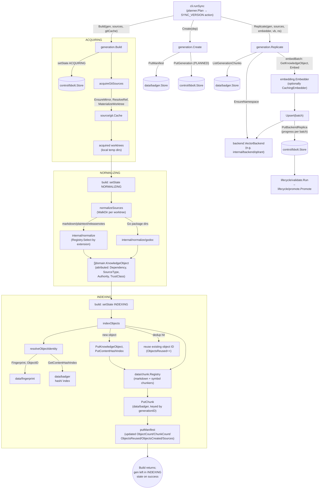

# internal/data/generation

`internal/data/generation` is ragctl's pipeline orchestrator: the first end-to-end code tying acquisition (Git), normalization, fingerprinting, chunking, and embedding/replication together into one staged `domain.Generation` for a real resolved dependency version. It exists as the single place that drives a dependency version from "resolved" to "indexed and vector-replicated," so no later stage (validation, promotion, GC) has to know how a generation was built — only what state it's in.

## Key types and functions

- `Manifest` — a generation's Badger-resident summary (dependency, sources, object/chunk counts, reuse/create counters, embedding model, created-at); grows with build progress, kept separate from `domain.Generation`'s bbolt lifecycle record. internal/data/generation/generation.go
- `Create(ctx, store, badgerStore, dep) (domain.Generation, error)` — writes an empty manifest skeleton to Badger, then a `PLANNED` `domain.Generation` (`gen_`-prefixed ULID) to bbolt; manifest first so a bbolt-write failure never leaves a record with nothing to build into. internal/data/generation/generation.go
- `Build(ctx, gen, sources, gitCache, store, badgerStore) error` — the linear ACQUIRING → NORMALIZING → INDEXING pipeline; any stage failure marks `gen` `FAILED` with the error persisted. internal/data/generation/build.go
- `acquireGitSources` — materializes a worktree per `type: git` registry source, pinned to that source's `Ref` template resolved against the dependency version. internal/data/generation/build.go
- `gitRef(source, version)` — substitutes `${version}` in a source's `Ref` template, stripped of any leading `v`. internal/data/generation/build.go
- `normalizeSources` — walks every acquired worktree, selects a `normalize.Normalizer` per file (or `godoc.New()` per Go-package directory), and attributes each resulting object's `Dependency`/`SourceType`/`Authority`/`TrustClass`. internal/data/generation/build.go
- `TrustClassForSourceType(sourceType) domain.TrustClass` — maps a registry source type (`git`/`godoc` → `TrustRepository`, `website`/`github-releases` → `TrustOfficial`, else `TrustUnknown`) to SEC-001's trust classification; exported and reused by `ragctl describe`. internal/data/generation/build.go
- `indexObjects` — fingerprints, GEN-003-dedups, chunks, and stores every normalized object, updating the manifest's counters. internal/data/generation/build.go
- `resolveObjectIdentity` — computes an object's fingerprint-derived ID and pure content hash, reusing an existing object ID on a content-hash hit instead of storing a duplicate. internal/data/generation/build.go
- `Replicate(ctx, gen, sources, embedder, vb, ns, store, badgerStore) error` — embeds every chunk staged for `gen` in batches of 64 and upserts into a `VectorBackend`, persisting `BackendReplica` progress after every batch. internal/data/generation/replicate.go
- `embedBatch` — resolves each chunk's parent object (cached per call), embeds text, and builds `backend.Point`s with metadata stamped from `gen`/current `sources` (never from the object's own stored fields, to avoid staleness after content reuse). internal/data/generation/replicate.go
- `ErrAcquisition` / `ErrNormalization` / `ErrReplication` — typed sentinel errors for `errors.Is`-based failure classification per pipeline stage. internal/data/generation/errors.go

## Dataflow

## Walkthrough

Scenario: `ragctl sync` resolves that a project now depends on `github.com/redis/go-redis/v9@v9.5.1`, and `internal/planner.Plan` emits a `SYNC_VERSION` action for it. The registry has one matching source, `registry.Source{ID: "go-redis-git", Type: "git", URL: "https://github.com/redis/go-redis", Ref: "v${version}", Authority: 90}`. This is the *second* generation ever built for this dependency — a prior generation already indexed `v9.5.0` and its `README.md` happens to be byte-identical to `v9.5.1`'s, giving GEN-003 dedup something real to do.

**1. Create.** `generation.Create(ctx, store, badgerStore, dep)` (internal/data/generation/generation.go) where `dep = domain.DependencyVersion{Dependency: {Ecosystem: "go", Name: "github.com/redis/go-redis/v9"}, Version: "v9.5.1"}`. It mints `id := "gen_" + ulid.Make().String()`, e.g. `"gen_01J8Z3K9QG7XZQZ8YB2QYQXABC"`. It writes an empty `Manifest{ID: "gen_01J8Z3K9QG7XZQZ8YB2QYQXABC", Dependency: dep, CreatedAt: now}` to Badger (`badger.PutManifest`, key `manifest/gen_01J8Z3K9QG7XZQZ8YB2QYQXABC`) *before* writing `domain.Generation{ID: "gen_01J8Z3K9QG7XZQZ8YB2QYQXABC", Dependency: dep, State: domain.GenPlanned}` to bbolt — so a bbolt failure after this point would only orphan a harmless empty manifest, never leave a bbolt record with nothing to build into.

**2. Build — ACQUIRING.** `Build(ctx, gen, sources, gitCache, store, badgerStore)` (internal/data/generation/build.go) first calls `setState(ctx, store, &gen, domain.GenAcquiring)`, persisting `State: "ACQUIRING"` via `store.PutGeneration`. Then `acquireGitSources` (build.go): for the one `git`-type source, `gitRef(source, "v9.5.1")` (build.go) strips the leading `v` (`"9.5.1"`) and substitutes into the `Ref` template `"v${version}"`, yielding `"v9.5.1"`. `gitCache.EnsureMirror(ctx, "https://github.com/redis/go-redis")` ensures a local bare mirror exists; `ResolveRef(ctx, repoPath, "v9.5.1")` resolves that tag to a commit, say `"a1c9f3e7b2d84f1e6c0a2b7d9e5f1a3c8b6d4e20"`; `MaterializeWorktree` checks out that commit into a temp worktree dir. `acquired = [{source: go-redis-git, worktreeDir: "/tmp/ragctl-wt-xk92", commit: "a1c9f3e7...", cleanup: fn}]`.

**3. Build — NORMALIZING.** `setState(..., domain.GenNormalizing)` persists `State: "NORMALIZING"`. `normalizeSources` (build.go) walks `/tmp/ragctl-wt-xk92`, builds a `snapshotFor` per file (e.g. `domain.SourceSnapshot{ID: "go-redis-git@a1c9f3e7...", SourceID: "go-redis-git", LogicalPath: "README.md", Commit: "a1c9f3e7..."}`), selects `markdown-normalizer` for `README.md` via `normReg.Select`, and for any directory containing `.go` files (e.g. the repo root, holding `client.go`) runs `godoc.New()` instead. Every resulting object gets `appendAttributed` (build.go): `Dependency = dep`, `SourceType = "git"`, `Authority = 90`, `TrustClass = TrustClassForSourceType("git") = domain.TrustRepository` (build.go, since `git`/`godoc` sources are the package's own repository). Say this yields two objects: the README (`ContentType: "markdown"`) and a `redis.NewClient` symbol doc (`ContentType: "symbol_doc"`, doc-comment-less, per docs/internal/data-chunk.md's symbol walkthrough).

**4. Build — INDEXING.** `setState(..., domain.GenIndexing)` persists `State: "INDEXING"`. `indexObjects` (build.go) registers a fresh `chunk.Registry` (`markdown`/`text` → `chunkmd.New(2000)`, `symbol_doc`/`package_doc` → `symbol.New()`) and loads the manifest written in step 1.

   - **README (dedup hit):** `resolveObjectIdentity` (build.go) computes `contentHash = dchunk.ContentHash(obj.Content)`. Because this README is byte-identical to the one indexed for `v9.5.0`, `GetContentHashIndex(ctx, contentHash)` succeeds and returns the *prior* generation's object ID, `"ko_5xj2qk7v3n8w1yzrt9m4pbhs6c0e2d"` — `reused = true`. Back in `indexObjects` (build.go), `manifest.ObjectsReused++` (→ 1) and neither `PutKnowledgeObject` nor `PutContentHashIndex` runs — the existing Badger payload is left untouched, only referenced. `manifest.ObjectCount++` (→ 1) still counts it as part of *this* generation's object set.
   - **`redis.NewClient` symbol (dedup miss):** its `Fingerprint` (source identity now embeds the *new* commit `a1c9f3e7...`) and `ContentHash` are both new — no hit in the hash index — so `resolveObjectIdentity` returns a fresh ID, `"ko_p9x3vw7k2m1qzr8bcnf4hstyu6d"`, `reused = false`. `obj.Validate()` passes (it has `SourceURI`/`TrustClass` set), `PutKnowledgeObject` and `PutContentHashIndex` both run, and `manifest.ObjectsCreated++` (→ 1), `manifest.ObjectCount++` (→ 2).
   - **Chunking:** the README (via `chunkmd`) produces 4 chunks (docs/internal/data-chunk.md's markdown walkthrough), the symbol object (via `symbol.New()`) produces 1 chunk with its signature-fallback content. Each is written via `PutChunk(ctx, "gen_01J8Z3K9QG7XZQZ8YB2QYQXABC", c)`, guarded by `writtenChunkIDs` so a chunk ID collision (possible when a dedup-reused object's content chunks identically to how it chunked before) is written once, not double-counted. `manifest.ChunkCount` ends at 5.
   - `manifest.Sources = ["go-redis-git"]`; the final `putManifest` call persists `Manifest{ObjectCount: 2, ChunkCount: 5, ObjectsReused: 1, ObjectsCreated: 1, Sources: ["go-redis-git"]}` to `manifest/gen_01J8Z3K9QG7XZQZ8YB2QYQXABC`. `Build` returns `nil` with `gen` left in `INDEXING` state — no automatic transition to `VALIDATING` happens inside this package.

**5. Replicate.** The caller (`ragctl sync`) next calls `Replicate(ctx, gen, sources, embedder, vb, ns, store, badgerStore)` (internal/data/generation/replicate.go) with, say, `embedder.ModelID() = "text-embedding-3-small"`, `vb.Name() = "qdrant"`, `ns = backend.Namespace{Name: "go-redis-v9", Dimensions: 1536}`. It first writes `domain.BackendReplica{GenerationID: "gen_01J8Z3K9QG7XZQZ8YB2QYQXABC", BackendName: "qdrant", EmbeddingModel: "text-embedding-3-small", Dimensions: 1536, Status: "replicating"}` via `store.PutBackendReplica` (key `gen_01J8Z3K9QG7XZQZ8YB2QYQXABC/qdrant` in bbolt's `backend_replicas` bucket). `vb.EnsureNamespace(ctx, ns)` prepares the Qdrant collection. `ListGenerationChunks` returns all 5 staged chunks — since 5 ≤ `defaultReplicateBatchSize` (64), they go through `embedBatch` as a single batch: for each chunk, its parent object is fetched (cached), and — critically — `embedBatch` (replicate.go) looks up `sourcesByID["go-redis-git"]` and stamps the point's `SourceType`/`Authority` from *that current source config* (`"git"`/`90`), not from the object's own stored fields, since the README's object was created by the `v9.5.0` generation and could otherwise carry stale metadata. All 5 `backend.Point`s (`Metadata.Version: "v9.5.1"`, `Metadata.Generation: "gen_01J8Z3K9QG7XZQZ8YB2QYQXABC"`) are upserted in one call; `replica.PointCount = 5` and `Status: "complete"` are persisted at the end.

**6. Downstream.** `lifecycle/validate.Run` and `lifecycle/promote.Promote` then take over — validating chunk/object counts against the manifest and, on success, calling `Store.PromoteGeneration(ctx, gen, "qdrant")` (docs/internal/control.md's own walkthrough) to move `gen_01J8Z3K9QG7XZQZ8YB2QYQXABC` from `READY` to `ACTIVE`, superseding whatever generation was active for `go|github.com/redis/go-redis/v9|qdrant` before it — in this scenario, the `v9.5.0` generation that the README's object ID was originally created by.

## Notes

- `Build` is deliberately one linear function, not a pluggable pipeline framework (GEN-002's simplicity constraint) — any stage failure aborts the whole build; a normalizer error on one file fails the entire generation rather than silently dropping it, so a generation's content is never ambiguously partial.
- Only `type: git` registry sources are acquired; a `godoc` source is informational only (Go doc is extracted from whatever `.go` files show up in the acquired git worktree, not fetched separately), and other source types (`website`, `github-releases`, etc.) are out of scope until their own acquisition milestone.
- GEN-003 content reuse is folded into `indexObjects`, not a separate pass: a hit reuses the existing object ID/payload even when the object's own fingerprint-derived ID would differ because the source commit changed.
- `Replicate`'s metadata stamping bug (a real, epic-14-review-caught issue) is worth noting for anyone extending this package: every point's `SourceType`/`Authority`/`Version` must come from the *current* `gen`/`sources`, never from the object's own stored fields — GEN-003 reuse means an object's stored fields only reflect whichever generation first created it.
- `Replicate` has no partial-batch resume — a re-run after failure starts over, relying on `CachingEmbedder` (if wrapped) to make re-embedding unchanged content cheap.
- Neither `Build` nor `Replicate` is wired to a CLI command directly inside this package — `ragctl sync` (`internal/cli`, driven by `internal/planner.Plan`) is the real caller, invoking `Create` → `Build` → `Replicate` → `lifecycle/validate.Run` → `lifecycle/promote.Promote` in sequence for each `SYNC_VERSION` action.
- Worktree cleanup runs unconditionally via `defer cleanupAll(acquired)` regardless of where `Build` fails, using `git.Cache.MaterializeWorktree`'s own `context.Background()`-scoped cleanup so a cancelled build never leaves a dangling worktree.
