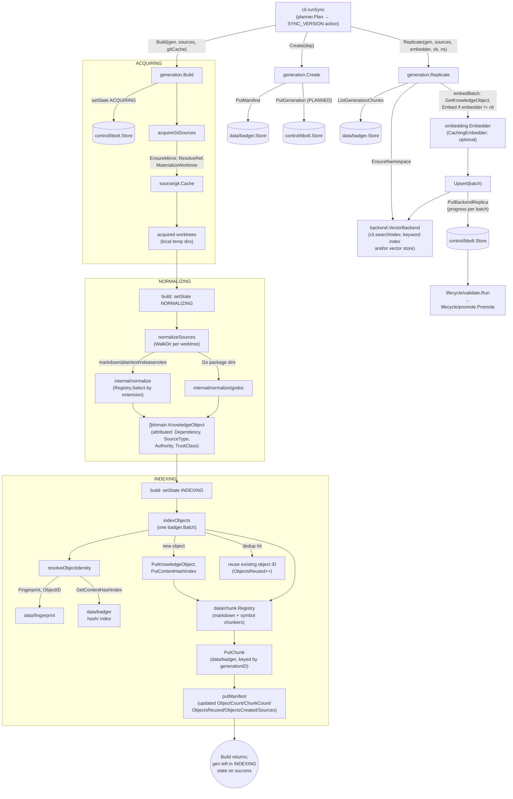

# internal/data/generation

`internal/data/generation` is ragctl's pipeline orchestrator: the code tying acquisition (Git), normalization, fingerprinting, chunking, and replication into the search indexes (with embedding when an embedder is available) together into one staged `domain.Generation` for a real resolved dependency version. It exists as the single place that drives a dependency version from "resolved" to "indexed and searchable," so no later stage (validation, promotion, GC) has to know how a generation was built — only what state it's in.

## Key types and functions

- `Manifest` — a generation's Badger-resident summary (dependency, sources, object/chunk counts, reuse/create counters, embedding model, created-at); grows with build progress, kept separate from `domain.Generation`'s bbolt lifecycle record. internal/data/generation/generation.go
- `Create(ctx, store, badgerStore, dep) (domain.Generation, error)` — writes an empty manifest skeleton to Badger, then a `PLANNED` `domain.Generation` (`gen_`-prefixed ULID) to bbolt; manifest first so a bbolt-write failure never leaves a record with nothing to build into. internal/data/generation/generation.go
- `Build(ctx, gen, sources, gitCache, store, badgerStore, projectRoot) error` — the linear ACQUIRING → NORMALIZING → INDEXING pipeline; any stage failure marks `gen` `FAILED` with the error persisted. `projectRoot` (GIT-004, epic 43) is the root of the specific project whose sync action triggered this build — resolved by the caller from `planner.Action.ProjectID`, since `domain.Generation` itself deliberately carries no project reference; always a safe empty string if unresolvable. internal/data/generation/build.go
- `acquireGitSources` — for each `type: git` registry source, first checks `localCacheSeed` (GIT-004) for an ecosystem-native local-cache hit; on a hit, skips every git step entirely (no monorepo-sibling problem to scope around — a package-manager cache entry is already exactly one package). On a miss, it ensures a blobless mirror via `git.Cache` (which tries its own GIT-006/GIT-007 external-seed tiers before ever cloning over the network — see docs/internal/source-git.md), resolves the first of `refCandidates` that exists (refreshing the mirror's tags once if none does, since a cached mirror never learns of newer tags), and materializes a sparse worktree limited to the doc-shaped file patterns the normalizers read. When the source names a `Subdir` (a module inside a monorepo), or one is discovered for Node (`discoverNodeSubdir`: the `package.json` that declares this package) or Python (`discoverPythonSubdir`), the worktree is scoped to it; a Node package that can't be located inside a multi-package repo fails acquisition rather than indexing the wrong package's content. internal/data/generation/build.go
- `localCacheSeed(ctx, ecosystem, depName, version, projectRoot) (string, bool)` (GIT-004) — Go via `go env GOMODCACHE` (`module.EscapePath`-encoded); Python via the active `python3`'s `site-packages`, matched through a `dist-info`'s own `top_level.txt` (never a name-based guess — PyPI names routinely differ from their real import package); Node via `projectRoot`'s own `node_modules/<pkg>`, version-checked against its `package.json`. Never fetches anything itself; only ever fast-paths acquiring one version's current file tree — release notes/cross-version work still needs the real git history. internal/data/generation/localcache.go
- `refCandidates(source, version)` — the refs to try, in order: every `RefTemplates` entry with `${version}` substituted; else, for a Go pseudo-version, its 12-hex-digit commit; else `gitRef`. `+incompatible` is stripped first. There is deliberately no fallback to a branch head. internal/data/generation/build.go
- `gitRef(source, version)` — substitutes `${version}` in a source's `Ref` template, stripped of any leading `v`. internal/data/generation/build.go
- `normalizeSources` — runs the TypeScript (`tsdoc`) or Python (`pydoc`) API-doc normalizer once at the package root for those ecosystems, then walks every acquired worktree, selecting a `normalize.Normalizer` per file (release notes, Markdown, plain text) and `godoc` per Go-package directory. It skips vendored/build directories, subdirectories with their own `go.mod` (separate Go modules), and, for Node, subdirectories whose `package.json` names a different package. Each resulting object gets `Dependency`/`SourceType`/`Authority`/`TrustClass` attributed. internal/data/generation/build.go
- `TrustClassForSourceType(sourceType) domain.TrustClass` — maps a registry source type (`git`/`godoc` → `TrustRepository`, `website`/`github-releases` → `TrustOfficial`, else `TrustUnknown`) to SEC-001's trust classification; exported and reused by `ragctl describe`. internal/data/generation/build.go
- `indexObjects` — fingerprints, GEN-003-dedups, chunks, and stores every normalized object through one `badger.Batch` (a few large commits instead of one per value), updating the manifest's counters. internal/data/generation/build.go
- `resolveObjectIdentity` — computes an object's fingerprint-derived ID and pure content hash, reusing an existing object ID on a content-hash hit (within this build's batch, or already in Badger) instead of storing a duplicate. internal/data/generation/build.go
- `Replicate(ctx, gen, sources, embedder, vb, ns, store, badgerStore) error` — writes every chunk staged for `gen` into `vb` (normally the CLI's `searchIndex`, i.e. the keyword index and/or vector store) in batches of 64, persisting `BackendReplica` progress after every batch. `embedder` may be nil (keyword-only): points then carry text and no vector. Any failure marks both the replica and the generation `FAILED`. internal/data/generation/replicate.go
- `AddToIndex(ctx, gen, sources, embedder, vb, ns, badgerStore) error` — writes an already-built generation into one more index, for backfill at the start of each sync: vectors for a generation first built keyword-only, or keyword entries (nil embedder) for one built before the install used keyword search. Never changes the generation's state; on failure it deletes what it wrote for the generation, so searches never see a partial set. internal/data/generation/replicate.go
- `embedBatch` — resolves each chunk's parent object (cached per call), embeds the texts when there is an embedder, and builds `backend.Point`s with metadata stamped from `gen`/current `sources` (never from the object's own stored fields, to avoid staleness after content reuse). internal/data/generation/replicate.go
- `keywordText(chunk)` — the point's `Text`: the chunk content, led by `package.Symbol` for an API-doc chunk, since doc comments rarely spell out the qualified name people search for. internal/data/generation/replicate.go
- `WithProgress(ctx, fn)` — returns a context on which `Replicate` reports `(done, total)` chunk counts. internal/data/generation/progress.go
- `ErrAcquisition` / `ErrNormalization` / `ErrReplication` — typed sentinel errors for `errors.Is`-based failure classification per pipeline stage. internal/data/generation/errors.go

## Dataflow

## Walkthrough

Scenario: `ragctl sync` resolves that a project now depends on `github.com/redis/go-redis/v9@v9.5.1`, and `internal/planner.Plan` emits a `SYNC_VERSION` action for it. The registry has one matching source, `registry.Source{ID: "go-redis-git", Type: "git", URL: "https://github.com/redis/go-redis", Ref: "v${version}", Authority: 90}`. This is the *second* generation ever built for this dependency — a prior generation already indexed `v9.5.0` and its `README.md` happens to be byte-identical to `v9.5.1`'s, giving GEN-003 dedup something real to do.

**1. Create.** `generation.Create(ctx, store, badgerStore, dep)` (internal/data/generation/generation.go) where `dep = domain.DependencyVersion{Dependency: {Ecosystem: "go", Name: "github.com/redis/go-redis/v9"}, Version: "v9.5.1"}`. It mints `id := "gen_" + ulid.Make().String()`, e.g. `"gen_01J8Z3K9QG7XZQZ8YB2QYQXABC"`. It writes an empty `Manifest{ID: "gen_01J8Z3K9QG7XZQZ8YB2QYQXABC", Dependency: dep, CreatedAt: now}` to Badger (`badger.PutManifest`, key `manifest/gen_01J8Z3K9QG7XZQZ8YB2QYQXABC`) *before* writing `domain.Generation{ID: "gen_01J8Z3K9QG7XZQZ8YB2QYQXABC", Dependency: dep, State: domain.GenPlanned}` to bbolt — so a bbolt failure after this point would only orphan a harmless empty manifest, never leave a bbolt record with nothing to build into.

**2. Build — ACQUIRING.** `Build(ctx, gen, sources, gitCache, store, badgerStore, projectRoot)` (internal/data/generation/build.go) first calls `setState(ctx, store, &gen, domain.GenAcquiring)`, persisting `State: "ACQUIRING"` via `store.PutGeneration`. Then `acquireGitSources` (build.go): for the one `git`-type source, `localCacheSeed(ctx, "go", "github.com/redis/go-redis/v9", "v9.5.1", projectRoot)` (GIT-004) checks `go env GOMODCACHE` for `github.com/redis/go-redis/v9@v9.5.1` already extracted — say this developer hasn't built against this exact version before, so it misses. Falling through to the real git path: `refCandidates(source, "v9.5.1")` (build.go) finds no `RefTemplates` and no pseudo-version, so it returns `[gitRef(source, "v9.5.1")]` — the leading `v` stripped (`"9.5.1"`) and substituted into the `Ref` template `"v${version}"`, yielding `["v9.5.1"]`. `gitCache.EnsureMirror(ctx, "https://github.com/redis/go-redis")` ensures a local blobless mirror exists (trying its own GIT-006/GIT-007 external-seed tiers first, both unconfigured here); `resolveFirstRef` resolves `v9.5.1` to a commit, say `"a1c9f3e7b2d84f1e6c0a2b7d9e5f1a3c8b6d4e20"`; `MaterializeWorktree` checks out that commit into a temp worktree dir, sparse — only the doc-shaped patterns from `normalize.SparsePatterns("go")`. `acquired = [{source: go-redis-git, worktreeDir: "/tmp/ragctl-wt-xk92", commit: "a1c9f3e7...", cleanup: fn}]`.

**3. Build — NORMALIZING.** `setState(..., domain.GenNormalizing)` persists `State: "NORMALIZING"`. `normalizeSources` (build.go) walks `/tmp/ragctl-wt-xk92`, builds a `snapshotFor` per file (e.g. `domain.SourceSnapshot{ID: "go-redis-git@a1c9f3e7...", SourceID: "go-redis-git", LogicalPath: "README.md", Commit: "a1c9f3e7..."}`), selects `markdown-normalizer` for `README.md` via `normReg.Select`, and for any directory containing `.go` files (e.g. the repo root, holding `client.go`) runs `godoc.New()` instead. Every resulting object gets `appendAttributed` (build.go): `Dependency = dep`, `SourceType = "git"`, `Authority = 90`, `TrustClass = TrustClassForSourceType("git") = domain.TrustRepository` (build.go, since `git`/`godoc` sources are the package's own repository). Say this yields two objects: the README (`ContentType: "markdown"`) and a `redis.NewClient` symbol doc (`ContentType: "symbol_doc"`, doc-comment-less, per docs/internal/data-chunk.md's symbol walkthrough).

**4. Build — INDEXING.** `setState(..., domain.GenIndexing)` persists `State: "INDEXING"`. `indexObjects` (build.go) registers a fresh `chunk.Registry` (`markdown`/`text` → `chunkmd.New(2000)`, `symbol_doc`/`package_doc` → `symbol.New()`) and loads the manifest written in step 1.

   - **README (dedup hit):** `resolveObjectIdentity` (build.go) computes `contentHash = dchunk.ContentHash(obj.Content)`. Because this README is byte-identical to the one indexed for `v9.5.0`, `GetContentHashIndex(ctx, contentHash)` succeeds and returns the *prior* generation's object ID, `"ko_5xj2qk7v3n8w1yzrt9m4pbhs6c0e2d"` — `reused = true`. Back in `indexObjects` (build.go), `manifest.ObjectsReused++` (→ 1) and neither `PutKnowledgeObject` nor `PutContentHashIndex` runs — the existing Badger payload is left untouched, only referenced. `manifest.ObjectCount++` (→ 1) still counts it as part of *this* generation's object set.
   - **`redis.NewClient` symbol (dedup miss):** its `Fingerprint` (source identity now embeds the *new* commit `a1c9f3e7...`) and `ContentHash` are both new — no hit in the hash index — so `resolveObjectIdentity` returns a fresh ID, `"ko_p9x3vw7k2m1qzr8bcnf4hstyu6d"`, `reused = false`. `obj.Validate()` passes (it has `SourceURI`/`TrustClass` set), `PutKnowledgeObject` and `PutContentHashIndex` both run, and `manifest.ObjectsCreated++` (→ 1), `manifest.ObjectCount++` (→ 2).
   - **Chunking:** the README (via `chunkmd`) produces 4 chunks (docs/internal/data-chunk.md's markdown walkthrough), the symbol object (via `symbol.New()`) produces 1 chunk with its signature-fallback content. Each is queued via `batch.PutChunk("gen_01J8Z3K9QG7XZQZ8YB2QYQXABC", c, obj.Content)`, guarded by `writtenChunkIDs` so a chunk ID collision (possible when a dedup-reused object's content chunks identically to how it chunked before) is written once, not double-counted. `manifest.ChunkCount` ends at 5.
   - `manifest.Sources = ["go-redis-git"]`; the final `putManifest` call persists `Manifest{ObjectCount: 2, ChunkCount: 5, ObjectsReused: 1, ObjectsCreated: 1, Sources: ["go-redis-git"]}` to `manifest/gen_01J8Z3K9QG7XZQZ8YB2QYQXABC`. `Build` returns `nil` with `gen` left in `INDEXING` state — no automatic transition to `VALIDATING` happens inside this package.

**5. Replicate.** The caller (`ragctl sync`) next calls `Replicate(ctx, gen, sources, embedder, vb, ns, store, badgerStore)` (internal/data/generation/replicate.go). On a default install (`vector.backend: embedded`, `retrieval.mode: auto`, Ollama running), `vb` is the CLI's `searchIndex` holding the keyword index and the embedded vector store, `vb.Name()` is `"embedded"`, `embedder` is a `CachingEmbedder` around Ollama's `nomic-embed-text-v2-moe`, and `ns = backend.Namespace{Name: "ragctl-1a2b3c4d", Dimensions: 768, Distance: "cosine"}`. It first writes `domain.BackendReplica{GenerationID: "gen_01J8Z3K9QG7XZQZ8YB2QYQXABC", BackendName: "embedded", EmbeddingModel: "nomic-embed-text-v2-moe", Dimensions: 768, Status: "replicating"}` via `store.PutBackendReplica` (key `gen_01J8Z3K9QG7XZQZ8YB2QYQXABC/embedded` in bbolt's `backend_replicas` bucket). `vb.EnsureNamespace(ctx, ns)` prepares both indexes. `ListGenerationChunks` returns all 5 staged chunks — since 5 ≤ `defaultReplicateBatchSize` (64), they go through `embedBatch` as a single batch: the texts are embedded, each chunk's parent object is fetched (cached), and — critically — `embedBatch` looks up `sourcesByID["go-redis-git"]` and stamps the point's `SourceType`/`Authority` from *that current source config* (`"git"`/`90`), not from the object's own stored fields, since the README's object was created by the `v9.5.0` generation and could otherwise carry stale metadata. Each point also gets `Text` from `keywordText` (the symbol chunk's becomes `"redis.NewClient\nfunc NewClient(opt *Options) *Client"`). All 5 `backend.Point`s (`Metadata.Version: "v9.5.1"`, `Metadata.Generation: "gen_01J8Z3K9QG7XZQZ8YB2QYQXABC"`) are upserted in one call, which the `searchIndex` writes to both indexes; `replica.PointCount = 5` and `Status: "complete"` are persisted at the end. Had Ollama been down, sync would have passed a nil embedder: the same points go out with no vectors, only the keyword index is written, and the next sync's backfill (`AddToIndex`) adds the vectors once Ollama is ready.

**6. Downstream.** `lifecycle/validate.Run` and `lifecycle/promote.Promote` then take over — validating chunk/object counts against the manifest and, on success, calling `Store.PromoteGeneration(ctx, gen, "embedded")` (see [internal/control](control.md)) to move `gen_01J8Z3K9QG7XZQZ8YB2QYQXABC` from `READY` to `ACTIVE` under the key `go|github.com/redis/go-redis/v9|v9.5.1|embedded`. Active generations are per dependency version (ADR-012), so the `v9.5.0` generation stays active for any project still on it; only a previous build of v9.5.1 itself would be superseded.

## Notes

- `Build` is deliberately one linear function, not a pluggable pipeline framework (GEN-002's simplicity constraint) — any stage failure aborts the whole build; a normalizer error on one file fails the entire generation rather than silently dropping it, so a generation's content is never ambiguously partial.
- Only `type: git` registry sources are acquired; a `godoc` source is informational only (Go doc is extracted from whatever `.go` files show up in the acquired git worktree, not fetched separately), and other source types (`website`, `github-releases`, etc.) are out of scope until their own acquisition milestone.
- GEN-003 content reuse is folded into `indexObjects`, not a separate pass: a hit reuses the existing object ID/payload even when the object's own fingerprint-derived ID would differ because the source commit changed.
- `Replicate`'s metadata stamping bug (a real, epic-14-review-caught issue) is worth noting for anyone extending this package: every point's `SourceType`/`Authority`/`Version` must come from the *current* `gen`/`sources`, never from the object's own stored fields — GEN-003 reuse means an object's stored fields only reflect whichever generation first created it.
- `Replicate` has no partial-batch resume — a re-run after failure starts over, relying on `CachingEmbedder` (if wrapped) to make re-embedding unchanged content cheap.
- Every point carries both `Vector` (nil without an embedder) and `Text`; each index takes what it needs. This is why one `Replicate` call can fill the keyword index and the vector store together.
- Neither `Build` nor `Replicate` is wired to a CLI command directly inside this package — `ragctl sync` (`internal/cli`, driven by `internal/planner.Plan`) is the real caller, invoking `Create` → `Build` → `Replicate` → `lifecycle/validate.Run` → `lifecycle/promote.Promote` in sequence for each `SYNC_VERSION` action. `AddToIndex` is called from the sync-start backfill (`backfillKeyword`/`backfillVectors` in internal/cli/retrieval.go).
- Worktree cleanup runs unconditionally via `defer cleanupAll(acquired)` regardless of where `Build` fails, using `git.Cache.MaterializeWorktree`'s own `context.Background()`-scoped cleanup so a cancelled build never leaves a dangling worktree.
- **Local-cache reuse (epic 43/GIT-004, 2026-09).** `acquireGitSources`' local-cache-seed check runs before any git operation at all — a hit means `EnsureMirror`/`ResolveRef`/`MaterializeWorktree`/subdir discovery are all skipped entirely for that source, not just fast-pathed; `acquiredSource.commit` is set to the sentinel `"local-cache"` (never a real git commit) for provenance. `projectRoot` flows in from `internal/cli/sync.go`'s `syncVersion`, which resolves `action.ProjectID` via `store.GetProject` — a best-effort lookup: a project deleted mid-sync just means the Node check can never hit for that build, never a failure. Cleanup for a local-cache-seeded source is a no-op (`func() error { return nil }`) since the directory (`$GOMODCACHE`, `node_modules`, `site-packages`) is never ragctl's to delete.
