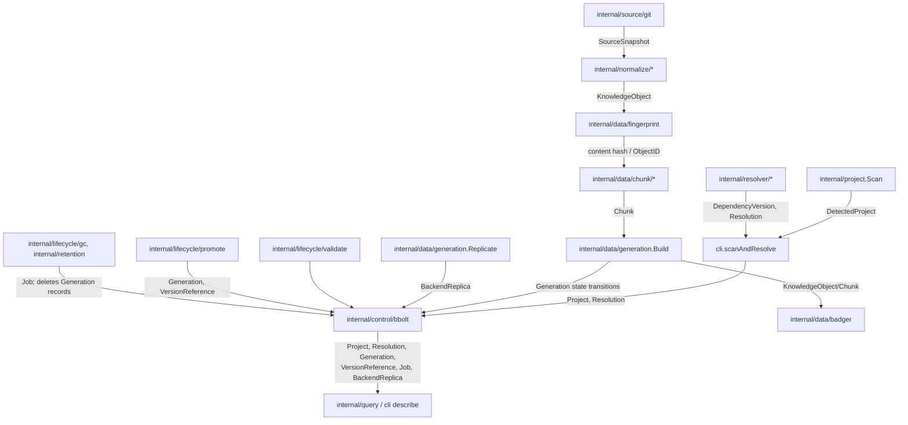

# internal/domain

`internal/domain` defines depctl's core data types and lifecycle state machines, shared by every other package in the codebase. It has no dependencies on storage, network, or CLI packages — it exists purely so that resolvers, storage, normalization, chunking, generation, validation, and the CLI all agree on one shared vocabulary (`Project`, `Dependency`, `KnowledgeObject`, `Generation`, ...) without importing each other. Types are added incrementally as the commands that need them land, not sketched up front (see `docs/tickets/completed/02-core-domain-storage/CORE-001-domain-types.md`).

## Key types and functions

- `Ecosystem` — a package-manager ecosystem identifier (`go`, `python`, `node`, `rust`, `java`), canonical and lowercase. Only `go`, `python` and `node` have resolvers; `rust`/`java` projects are detected but reported as unsupported — `internal/domain/domain.go`.
- `Project` — a registered local project root (ID, root path, timestamps) — `internal/domain/domain.go`.
- `(Project) Validate() error` — checks ID and Root are non-empty — `internal/domain/domain.go`.
- `Dependency` / `DependencyVersion` — a package identity within an ecosystem, and that identity pinned to a resolved version — `internal/domain/domain.go`.
- `SourceSnapshot` — materialized source content (e.g. a Git worktree checkout) ready for normalization, carrying `LogicalPath`/`LocalPath`/`Metadata` — `internal/domain/domain.go`.
- `TrustClass` — how much an MCP consumer should trust a `KnowledgeObject`'s content (`official`/`repository`/`community`/`user`/`unknown`), distinct from `Authority`'s numeric source ranking — `internal/domain/domain.go`.
- `KnowledgeObject` — normalized, retrieval-shaped content extracted from a `SourceSnapshot` by a Normalizer; one Normalizer's unit of output — `internal/domain/domain.go`.
- `(KnowledgeObject) Validate() error` — requires non-empty `SourceURI` and `TrustClass`, the minimum provenance metadata every downstream consumer relies on — `internal/domain/domain.go`.
- `Chunk` — a retrieval-sized slice of a `KnowledgeObject`, with an ID derived from `ObjectID+Ordinal+Content` so shifted boundaries get a new ID rather than reusing stale content — `internal/domain/domain.go`.
- `Generation` — one dependency version's knowledge snapshot as it moves through acquisition/normalization/indexing; a lifecycle entity with a ULID, not content-addressed — `internal/domain/domain.go`.
- `BackendReplica` — tracks one (generation, backend, embedding model) tuple's replication progress into a search index; `Status` is `replicating`, `complete` or `failed` — `internal/domain/domain.go`.
- `Job` — a restartable background unit of work (currently only GC: `Type` is `gc`, `gc_orphan` or `gc_superseded_duplicate`), with a deterministic ID so re-invocation resumes rather than duplicates — `internal/domain/domain.go`.
- `ReferenceReason` / `VersionReference` — why a dependency version is retained (`project`/`latest`/`manual_pin`/`grace_period`) and the record of one such reason — `internal/domain/domain.go`.
- `GracePeriodProjectID` — synthetic project ID (`"_grace"`) a grace-period reference uses since it isn't scoped to any one project — `internal/domain/domain.go`.
- `Resolution` — the canonical output of a `resolver.Resolver.Resolve` call, and the shape persisted by the control store — `internal/domain/domain.go`.
- `GenerationState` — a `Generation`'s position in its build/promotion/GC lifecycle (`DISCOVERED` ... `ACTIVE` ... `DELETED`). In practice a generation is created at `PLANNED`, and `GC_ELIGIBLE`/`DELETED` are never stored: GC deletes the record outright — `internal/domain/lifecycle.go`.
- `ValidGenerationTransition(from, to GenerationState) bool` — whether a direct state transition is allowed per the linear pipeline (`FAILED` reachable from any in-progress state). It documents the intended pipeline; the stores and lifecycle code do not call it — `internal/domain/lifecycle.go`.
- `JobState` — a `Job`'s execution/retry state (`PENDING`/`RUNNING`/`RETRY`/`SUCCEEDED`/`FAILED`/`CANCELLED`) — `internal/domain/lifecycle.go`.
- `ValidJobTransition(from, to JobState) bool` — whether a direct job-state transition is allowed — `internal/domain/lifecycle.go`.

## Dataflow



## Walkthrough

Concrete scenario: a project depends on `google.golang.org/grpc@v1.67.0`, matched by the registry to a single `git` source, and `depctl sync` drives it through a full generation lifecycle to `ACTIVE` on the `qdrant` backend (any `vector.backend` works the same way; `embedded` is the default for fresh installs).

1. The dependency arrives as a `domain.DependencyVersion` (`internal/domain/domain.go`):
   ```go
   domain.DependencyVersion{
       Dependency: domain.Dependency{Ecosystem: domain.EcosystemGo, Name: "google.golang.org/grpc", Direct: true},
       Version:    "v1.67.0",
       ResolvedBy: "go-list",
   }
   ```
2. `generation.Create` (`internal/data/generation/generation.go`) mints a ULID-based ID — `"gen_" + ulid.Make().String()`, e.g. (an actual generated value):
   ```
   gen_01M25QRMA23F4YSE4FNZVRYWBK
   ```
   It writes an empty `generation.Manifest{ID: "gen_01M25QRMA23F4YSE4FNZVRYWBK", Dependency: <above>, CreatedAt: now}` to Badger, then a `domain.Generation{ID: "gen_01M25...", Dependency: <above>, State: domain.GenPlanned, CreatedAt: now, UpdatedAt: now}` (`internal/domain/domain.go`) to the `generations` bbolt bucket (`internal/control/bbolt/generations.go`), keyed by the generation ID. `GenPlanned == "PLANNED"` (`internal/domain/lifecycle.go`) — this is the `DISCOVERED -> PLANNED` transition skipped in practice (`Create` starts a generation directly at `PLANNED`, since nothing upstream of `Create` persists a `DISCOVERED` record).
3. `generation.Build` (`internal/data/generation/build.go`) advances the generation through three states, each persisted via `setState` before the corresponding work runs:
   - `setState(..., domain.GenAcquiring)` — `State` becomes `"ACQUIRING"`. `acquireGitSources` resolves the registry's `git` source (`registry.Source{ID: "grpc-repo", Type: "git", URL: "https://github.com/grpc/grpc-go", Ref: "v${version}", Authority: 100}`) by substituting `${version}` with `1.67.0` (stripped of its `v` prefix) to get ref `v1.67.0` (`internal/data/generation/build.go`), mirrors the repo via `gitCache.EnsureMirror`, resolves that ref to a commit (say `a1b2c3d4e5f6...`), and materializes a worktree.
   - `setState(..., domain.GenNormalizing)` — `State` becomes `"NORMALIZING"`. `normalizeSources` walks the worktree; its `README.md` is selected by the Markdown normalizer, producing a `domain.KnowledgeObject` with `SourceType: "git"`, `TrustClass: generation.TrustClassForSourceType("git") == domain.TrustRepository` (`internal/data/generation/build.go`), `ContentType: "markdown"`, `LogicalPath: "README.md"`, `Content: []byte("# gRPC-Go\n\ngRPC-Go is...")`.
   - `setState(..., domain.GenIndexing)` — `State` becomes `"INDEXING"`. `indexObjects` (`internal/data/generation/build.go`) computes the object's identity via `fingerprint.Fingerprint("grpc-repo@a1b2c3d4e5f6", "README.md", "markdown", "v1", content)`, then `fingerprint.ObjectID(digest)` — an actual run of this exact input produces:
     ```
     ko_wgyjrleyprz2ftnxsxtj4bbfye5fgpmfypemocrbuq2xzpi3nxma
     ```
     No prior generation has this content hash, so `reused = false`: the object is validated (`KnowledgeObject.Validate`, `internal/domain/domain.go` — `SourceURI`/`TrustClass` both set, passes) and stored via `badgerStore.PutKnowledgeObject`. The Markdown chunker then splits it into `domain.Chunk`s (`internal/domain/domain.go`); chunk 0's ID via `chunk.ChunkID(objID, 0, content)` (`internal/data/chunk/chunk.go`) comes out as:
     ```
     chk_6gkdhwoktmkoxdma2jbvp75fowi2ie5nduwgctarqr2ddplawe2a
     ```
     stored under `gen_01M25QRMA23F4YSE4FNZVRYWBK` in Badger. `Build` returns with no error, having never advanced past `INDEXING` itself — `VALIDATING`/`READY` are validate's job, not Build's.
4. `generation.Replicate` (`internal/data/generation/replicate.go`) embeds each chunk (or, with no embedder configured, e.g. `retrieval.mode: keyword`, writes points carrying text only) and upserts it into `qdrant`, then writes a `domain.BackendReplica` (`internal/domain/domain.go`):
   ```go
   domain.BackendReplica{
       ID:             "01M25QRMA23F4YSE4FP2VF6P7H",
       GenerationID:   "gen_01M25QRMA23F4YSE4FNZVRYWBK",
       BackendName:    "qdrant",
       EmbeddingModel: "nomic-embed-text",
       Dimensions:     768,
       Status:         "complete",
       PointCount:     1,
   }
   ```
5. `validate.Run` (`internal/lifecycle/validate/run.go`) sets `gen.State = domain.GenValidating` (`"VALIDATING"`) and persists it, then runs `Structural`, `Sanity`, and `VersionCorrectness`, bundling the three `StructuralResult`s into a `Report`. All three pass (correct chunk/object counts in Badger, no unexplained shrink versus a prior generation, and a version-tagged embedding sanity-check on the replica), so `report.Passed()` is `true` and `gen.State` becomes `domain.GenReady` (`"READY"`, `internal/lifecycle/validate/run.go`) — this is the `VALIDATING -> READY` edge from `ValidGenerationTransition` (`internal/domain/lifecycle.go`). Had any check failed, `gen.State` would instead become `domain.GenFailed` with `gen.Error` set to the joined failure strings (the `VALIDATING -> FAILED` edge).
6. `promote.Promote` (`internal/lifecycle/promote/promote.go`) checks every supplied result passed and that `candidate.State == domain.GenReady` (both true here), then calls `store.PromoteGeneration(ctx, candidate, "qdrant")` (`internal/control/bbolt/active_generations.go`). That single bbolt transaction:
   - looks up the prior active-generation pointer under key `"go|google.golang.org/grpc|v1.67.0|qdrant"` (`activeGenerationKey`, `internal/control/bbolt/active_generations.go`) in the `active_generations` bucket. Active generations are per dependency *version* (ADR-012), so only an earlier build of this same version is replaced; other active versions of grpc are untouched. Say it finds `gen_01M1Z8...` from an earlier rebuild of `v1.67.0`: it loads it and flips its `State` to `domain.GenSuperseded` (`"SUPERSEDED"`, the `ACTIVE -> SUPERSEDED` edge);
   - sets `candidate.State = domain.GenActive` (`"ACTIVE"`, the `READY -> ACTIVE` edge) and writes it to the `generations` bucket under key `gen_01M25QRMA23F4YSE4FNZVRYWBK`;
   - repoints `active_generations["go|google.golang.org/grpc|v1.67.0|qdrant"]` to `gen_01M25QRMA23F4YSE4FNZVRYWBK`.
7. A later `depctl gc` pass (`internal/retention` plans it as a superseded duplicate, `internal/lifecycle/gc` executes it) deletes the superseded `gen_01M1Z8...` from the search index, Badger and bbolt — it does not pass through `GC_ELIGIBLE`/`DELETED`. `gen_01M25...` stays `ACTIVE` until it is rebuilt or `v1.67.0` stops being referenced and is collected.

## Notes

- `SyncJob` and a standalone `KnowledgeSource` type, both sketched as comments in the original CORE-001 ticket, still don't exist here: `generation.Build` takes `[]registry.Source` directly (the actual shape a registry match produces) rather than a separate `domain.KnowledgeSource`, per architecture.md's CORE-001 gap note.
- `GracePeriodProjectID` is the one place a `VersionReference` isn't really project-scoped — retention logic (`internal/retention`) uses it to represent "kept alive by grace period," not any real project.
- Both lifecycle transition maps (`generationTransitions`, `jobTransitions`) are simple adjacency maps checked linearly — no generic state-machine abstraction, since there are only two enums and their transition sets are small and fixed. Neither is enforced on writes; they describe the intended lifecycle and are exercised by tests.
- `Chunk.ID`'s dependence on `Content` (not just `ObjectID+Ordinal`) is what lets `internal/data/chunk`'s `ChunkID` helper detect a boundary shift from an upstream edit as a new chunk rather than silently overwriting stale content under an old ID.
