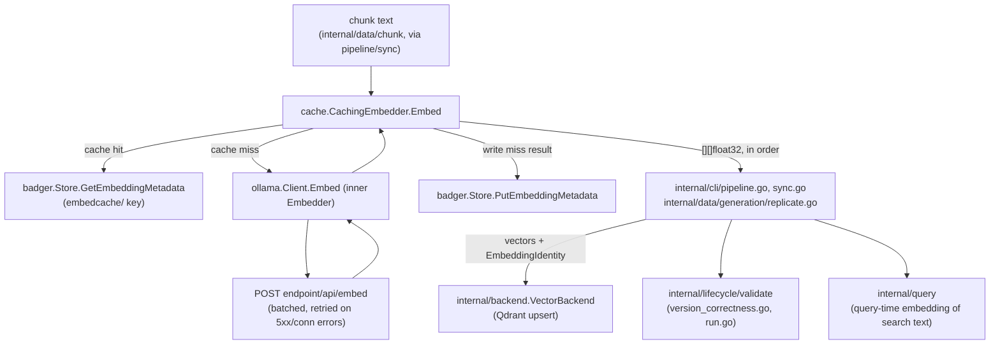

# internal/embedding

`internal/embedding` defines ragctl's narrow embedding-provider contract (`Embedder`) and the identity metadata (`EmbeddingIdentity`) that keeps vectors from different providers/models from ever being silently mixed together in a generation's vector replica. The root package has no provider-specific code — concrete providers (`internal/embedding/ollama`) and the content-hash cache (`internal/embedding/cache`) build on top of it.

## Key types and functions

**internal/embedding**
- `Embedder` — interface: `Name()`, `ModelID()`, `Dimensions(ctx) (int, error)`, `Embed(ctx, texts) ([][]float32, error)`. Batch request/response only, no streaming/async (internal/embedding/embedding.go).
- `EmbeddingIdentity` — persisted metadata (`Provider`, `Model`, `Dimensions`, `Normalization`, `CreatedAt`) tying a generation's vector replica to exactly the provider/model that produced it (internal/embedding/embedding.go).

**internal/embedding/ollama**
- `Client` — `Embedder` implementation against Ollama's `/api/embed` HTTP endpoint via a hand-written client, no SDK/third-party dependency (internal/embedding/ollama/ollama.go).
- `New(endpoint, model, opts...)` — constructs a `Client`; default batch size 16, 60s HTTP timeout (internal/embedding/ollama/ollama.go).
- `WithBatchSize(n)` / `WithHTTPClient(h)` — functional options (internal/embedding/ollama/ollama.go).
- `(*Client) Dimensions(ctx)` — probes vector length once with a fixed string (`dimensionProbeText`), cached via `sync.Once` (internal/embedding/ollama/ollama.go).
- `(*Client) Embed(ctx, texts)` — batches into groups of `batchSize`, validates every returned vector matches the cached dimension count (internal/embedding/ollama/ollama.go).
- `embedBatch`/`doEmbed` — internal: one HTTP round trip per batch, retries transient failures (5xx, connection errors) up to 3 times with fixed backoff (200ms/400ms/800ms); 4xx and malformed responses fail immediately (internal/embedding/ollama/ollama.go).

**internal/embedding/cache**
- `CachingEmbedder` — wraps any `embedding.Embedder` with a Badger-backed, content-hash-keyed cache so unchanged chunk content is never re-embedded across generations or re-syncs (internal/embedding/cache/cache.go).
- `New(inner, store)` — constructs a `CachingEmbedder` (internal/embedding/cache/cache.go).
- `(*CachingEmbedder) Embed(ctx, texts)` — checks Badger for each text's cache key first, calls `inner.Embed` only for misses, writes new entries back (internal/embedding/cache/cache.go).
- `(*CachingEmbedder) Counts() (reused, generated int)` — cumulative hit/miss counters across all `Embed` calls on this instance (internal/embedding/cache/cache.go).
- `cacheKey(text, provider, model)` — `"embedcache/" + ContentHash(text) + "/" + provider + "/" + model`, distinct from the generation-scoped `"embed/<generation-id>/..."` key shape the same Badger methods also serve (internal/embedding/cache/cache.go).

## Dataflow



`ollama.Client` and `cache.CachingEmbedder` both satisfy `embedding.Embedder`, so callers depend only on the interface. `internal/data/generation/replicate.go` and `internal/cli/pipeline.go`/`sync.go` are the producers that call `Embed` while building a generation's vector replica, tagging the result with an `EmbeddingIdentity`. `internal/query` calls `Embed` again at query time to vectorize search input. `internal/lifecycle/validate` reads `EmbeddingIdentity` fields (provider/model/dimensions) to check a generation's version correctness rather than calling `Embed` itself.

## Walkthrough

Sync is embedding three chunks pulled from `redis`'s `README.md` doc, using a `CachingEmbedder` wrapping an `ollama.Client` for model `nomic-embed-text`.

1. The caller builds `texts := []string{"Redis is an in-memory data structure store...", "To start the server, run redis-server...", "Redis is an in-memory data structure store..."}` — note chunk 0 and chunk 2 are identical text (a duplicated doc fragment) — and calls `cachingEmbedder.Embed(ctx, texts)` (internal/embedding/cache/cache.go).
2. For each text, `Embed` computes `key := cacheKey(text, "ollama", "nomic-embed-text")` (internal/embedding/cache/cache.go, 134-136). `cacheKey` hashes the text with `dchunk.ContentHash`, which is `hex.EncodeToString(blake3.Sum256(content))` (internal/data/chunk/chunk.go), giving e.g. `key = "embedcache/1f3a9c...7bde/ollama/nomic-embed-text"` for chunk 0, and the *same* key for chunk 2 since the text hash is identical.
3. On this first call the Badger store has no entries for any of the three keys, so all three `store.GetEmbeddingMetadata` calls return `badger.ErrNotFound` (internal/embedding/cache/cache.go). All three land in `missIdx = [0, 1, 2]`, `missTexts` = the same three strings.
4. `c.inner.Embed(ctx, missTexts)` calls into `ollama.Client.Embed` (internal/embedding/ollama/ollama.go), which — since 3 < `defaultBatchSize` (16) — sends one batch via `embedBatch`/`doEmbed` (internal/embedding/ollama/ollama.go).
5. `doEmbed` marshals `embedRequest{Model: "nomic-embed-text", Input: missTexts}` (internal/embedding/ollama/ollama.go, 160) and POSTs it to `http://127.0.0.1:11434/api/embed` (internal/embedding/ollama/ollama.go):
   ```json
   {"model": "nomic-embed-text", "input": ["Redis is an in-memory data structure store...", "To start the server, run redis-server...", "Redis is an in-memory data structure store..."]}
   ```
6. Ollama responds `200 OK` with `embedResponse{Embeddings: [][]float32}` (internal/embedding/ollama/ollama.go):
   ```json
   {"embeddings": [[0.0123, -0.0456, ...], [0.0810, 0.0021, ...], [0.0123, -0.0456, ...]]}
   ```
   `doEmbed` checks `len(parsed.Embeddings) == len(texts)` (3 == 3) and returns the three vectors, `transient=false`, `err=nil` (internal/embedding/ollama/ollama.go).
7. Back in `CachingEmbedder.Embed`, each miss vector is written into `out[idx]` and cached: `key := cacheKey(texts[idx], "ollama", "nomic-embed-text")`, `data, _ := json.Marshal(cacheEntry{Vector: vecs[j]})`, `c.store.PutEmbeddingMetadata(ctx, key, data)` (internal/embedding/cache/cache.go) — three writes, though chunk 0 and chunk 2 write the *same* key twice with identical values. Counters update: `c.reused += 0`, `c.made += 3` (internal/embedding/cache/cache.go), so `Counts()` now reports `(reused=0, generated=3)`.
8. A later sync re-embeds an overlapping batch — chunk 1's text ("To start the server...") plus a brand-new chunk 3 ("Persistence is configured via RDB or AOF..."). For chunk 1, `store.GetEmbeddingMetadata(ctx, key)` succeeds this time, `json.Unmarshal` decodes `cacheEntry{Vector: [0.0810, 0.0021, ...]}}`, and `out[i] = entry.Vector` — a cache hit, no HTTP call (internal/embedding/cache/cache.go). Chunk 3 misses and goes through steps 4-7 alone (a 1-text `/api/embed` request). The call returns with `reused=1, made=1` added to the running counters.

## Notes

- `Embed` has no partial-batch success: a single failure fails the whole batch, and callers are expected to retry the batch (internal/embedding/embedding.go). `ollama.Client` handles transient-vs-permanent distinction internally (retries 5xx/connection errors, not 4xx/malformed responses) so callers see one net error per `Embed` call.
- `ollama.Client.Dimensions` uses `sync.Once`; `Embed` can also opportunistically seed `c.dims` from the first real batch if `Dimensions` hasn't run yet (internal/embedding/ollama/ollama.go) — this races benignly against the `sync.Once` and is a deliberate call to avoid a redundant probe HTTP request.
- `CachingEmbedder`'s cache key is deliberately *not* scoped to a generation — it's `content-hash + provider + model` only, so identical chunk content reappearing in an unrelated generation is still a cache hit (internal/embedding/cache/cache.go).
- Cache corruption or read/write errors are logged and treated as a fallthrough to the inner embedder rather than a hard failure (internal/embedding/cache/cache.go, 111-114) — a broken cache degrades to "always miss," it never blocks embedding.
- Once a Badger write fails mid-batch, `CachingEmbedder` stops attempting further cache writes for the rest of that batch (`writeBroken` flag, internal/embedding/cache/cache.go) but still returns all vectors — a cache-write outage doesn't fail the embed operation.
