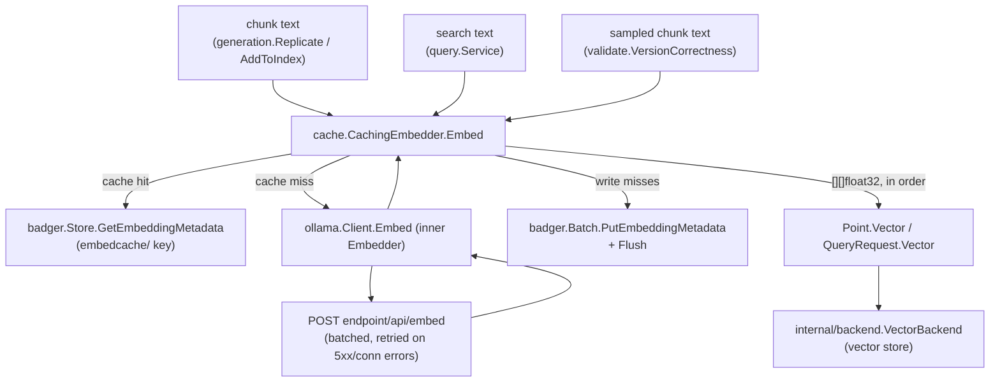

# internal/embedding

`internal/embedding` defines ragctl's narrow embedding-provider contract (`Embedder`). The root package has no provider-specific code — the one concrete provider (`internal/embedding/ollama`) and the content-hash cache (`internal/embedding/cache`) build on top of it.

Embedding is optional. With `retrieval.mode: keyword`, or in `auto` mode while Ollama isn't ready, ragctl builds and searches the keyword index with no embedder at all: `generation.Replicate`, `validate.VersionCorrectness` and `query.Service` all accept a nil `Embedder`, and points/queries then carry text only. Ollama is recommended for semantic (vector) search.

## Key types and functions

**internal/embedding** (internal/embedding/embedding.go)
- `Embedder` — interface: `Name()`, `ModelID()`, `Dimensions(ctx) (int, error)`, `Embed(ctx, texts) ([][]float32, error)`. Batch request/response only, no streaming/async; a failure fails the whole batch.
- `Prompts` — `Query` (with `{q}`), `Document` (with `{title}` and `{text}`) and `Dimensions` (keep the first N values; 0 = all). `QueryText`/`DocumentText` apply them; `Identity(model)` names what produced a set of vectors: just the model when nothing is set (as for every install before these existed), else the model plus the size and a hash of the prompts, so vectors made with different prompts or sizes are never treated as compatible. Built from config by `config.EmbeddingConfig.Prompts`.
- `Prompted` — an `Embedder` used with its `Prompts`: `EmbedQuery` for search questions, `EmbedDocuments` for chunks (each a `Document{Title, Text}`), both truncating to `Dimensions`. `ModelID` is the identity and `Dimensions` the truncated size. Everything that embeds goes through it: replication, backfill and validation embed documents, search embeds questions.
- `EmbeddingIdentity` — `Provider`, `Model`, `Dimensions`, `Normalization`, `CreatedAt`. Defined but not used yet: a replica's model and dimensions are recorded on `domain.BackendReplica`, and the cache keys on provider and model directly.

**internal/embedding/ollama** (internal/embedding/ollama/ollama.go)
- `Client` — `Embedder` against Ollama's `/api/embed` endpoint via a hand-written HTTP client, no SDK. `Name()` is `"ollama"`.
- `New(endpoint, model, opts...)` — default batch size 16 texts per request, 60s HTTP timeout. The default config uses `http://127.0.0.1:11434` and model `embeddinggemma-2:270m` (with code-retrieval prompts and 256 dimensions; see `docs/retrieval-eval.md`).
- `WithBatchSize(n)` / `WithHTTPClient(h)` — functional options.
- `(*Client) Dimensions(ctx)` — probes the vector length once by embedding a fixed string, cached via `sync.Once`.
- `(*Client) Embed(ctx, texts)` — sends batches of `batchSize` sequentially and checks every returned vector has the expected dimension count.
- `(*Client) Reachable(ctx)`, `ModelPulled(ctx)`, `PullModel(ctx, out)` — used by the CLI's embedding-readiness check (internal/cli/embedding_readiness.go) to tell "Ollama isn't running" from "the model isn't pulled yet", and to pull it. `ModelPulled` treats `model` and `model:latest` as the same. `PullModel` relays each distinct status line Ollama reports and uses its own client with no timeout (the caller's context bounds it), since a pull can take far longer than an embed request.
- `embedBatch`/`doEmbed` — internal: one HTTP round trip per batch; transient failures (5xx, connection errors, timeouts) are retried up to 3 times with 200ms/400ms/800ms backoff; 4xx and malformed responses fail immediately.

**internal/embedding/cache** (internal/embedding/cache/cache.go)
- `CachingEmbedder` — wraps any `embedding.Embedder` with a Badger-backed, content-hash-keyed cache so unchanged chunk content is never re-embedded across generations or re-syncs. `buildEmbedder` (internal/cli/pipeline.go) always wraps the Ollama client in one.
- `New(inner, store)` — constructs a `CachingEmbedder`.
- `(*CachingEmbedder) Embed(ctx, texts)` — looks up each text's cache key, calls `inner.Embed` only for the misses, and writes the new vectors back in one `badger.Batch`.
- `(*CachingEmbedder) Counts() (reused, generated int)` — cumulative hit/miss counters across all `Embed` calls on this instance.
- `cacheKey(text, provider, model)` — `"embedcache/" + ContentHash(text) + "/" + provider + "/" + model`, stored through `badger.Store.PutEmbeddingMetadata`/`GetEmbeddingMetadata` (so the Badger key is `embed/embedcache/…`).
- `encodeVector`/`decodeVector` — values are a `0x01` tag byte plus little-endian float32s (4 bytes per dimension). Older entries stored as JSON `{"vector": [...]}` still decode; the two can't be confused because JSON always starts with `{`.

## Dataflow



`ollama.Client` and `cache.CachingEmbedder` both satisfy `embedding.Embedder`, so callers depend only on the interface. `internal/data/generation` embeds chunks while writing a generation into the search indexes, `internal/lifecycle/validate` embeds a few sampled chunks to check the vector store answers correctly, and `internal/query` embeds the search text at query time. Each of these skips embedding when handed a nil `Embedder`.

## Walkthrough

Sync is embedding three chunks pulled from `redis`'s `README.md`, using a `CachingEmbedder` wrapping an `ollama.Client`. The example uses a config without prompts (model `nomic-embed-text-v2-moe`); with prompts, `Prompted` wraps each text first, so the cache keys on the prompted text.

1. The caller builds `texts := []string{"Redis is an in-memory data structure store...", "To start the server, run redis-server...", "Redis is an in-memory data structure store..."}` — chunk 0 and chunk 2 are identical text — and calls `cachingEmbedder.Embed(ctx, texts)`.
2. For each text, `Embed` computes `key := cacheKey(text, "ollama", "nomic-embed-text-v2-moe")`. `cacheKey` hashes the text with `dchunk.ContentHash` (`hex.EncodeToString(blake3.Sum256(content))`, internal/data/chunk/chunk.go), giving e.g. `"embedcache/1f3a9c...7bde/ollama/nomic-embed-text-v2-moe"` for chunk 0, and the *same* key for chunk 2.
3. On this first call Badger has none of these keys, so every `store.GetEmbeddingMetadata` returns `badger.ErrNotFound`; all three land in `missIdx = [0, 1, 2]`.
4. `c.inner.Embed(ctx, missTexts)` calls `ollama.Client.Embed`, which — since 3 < `defaultBatchSize` (16) — sends one request via `embedBatch`/`doEmbed`:
   ```
   POST http://127.0.0.1:11434/api/embed
   {"model": "nomic-embed-text-v2-moe", "input": ["Redis is an in-memory data structure store...", "To start the server, run redis-server...", "Redis is an in-memory data structure store..."]}
   ```
5. Ollama responds `200 OK` with `{"embeddings": [[0.0123, -0.0456, ...], [0.0810, 0.0021, ...], [0.0123, -0.0456, ...]]}`. `doEmbed` checks there are 3 embeddings for 3 texts and returns them.
6. Back in `CachingEmbedder.Embed`, each miss vector goes into `out[idx]` and is queued on one `badger.Batch` as `batch.PutEmbeddingMetadata(key, encodeVector(vec))` — chunks 0 and 2 queue the same key twice with identical values. `batch.Flush()` commits them together. Counters update to `(reused=0, generated=3)`.
7. A later sync embeds chunk 1's text again plus a new chunk 3. Chunk 1's key now hits: `decodeVector` reads the binary entry and no HTTP call is made. Chunk 3 misses and goes through steps 4-6 alone. Counters add `reused=1, generated=1`.

## Notes

- `Embed` has no partial-batch success: one failure fails the whole batch, and callers retry the batch. `ollama.Client` distinguishes transient from permanent failures internally, so callers see one net error per `Embed` call.
- `ollama.Client.Embed` can seed the cached dimension count from its first real batch if `Dimensions` hasn't run yet, avoiding a redundant probe request.
- The cache key is deliberately *not* scoped to a generation — only content hash, provider and model — so identical chunk content in an unrelated generation is still a hit, and changing the model never reuses an old vector.
- Cache read errors and corrupt entries are logged and treated as misses; a failed cache write stops further cache writes for that call and a failed `Flush` is logged — either way the vectors are still returned. A broken cache degrades to "always miss"; it never blocks embedding.
