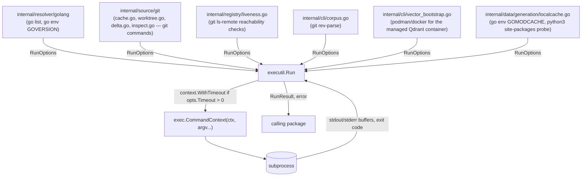

# internal/executil

`internal/executil` runs subprocesses safely: argv-style invocation only, no shell interpretation, with context cancellation/timeout support. It is the shared chokepoint for ragctl's short, capture-the-output tool calls (`go`, `git`, `python3`, the container runtime) instead of each calling `os/exec` directly — centralizing the "no shell, always respect context" guarantee in one place.

Not everything goes through it: the Python and Node resolvers parse lockfiles and run no subprocess at all; the `pydoc`/`tsdoc` normalizers call `os/exec` directly because they pipe an embedded script over stdin, which `RunOptions` has no field for; and the CLI's daemon auto-start uses `os/exec` directly because it launches a long-lived background process rather than waiting for output.

## Key types and functions

- `RunOptions` — `Dir`, `Args` (argv; `Args[0]` is the binary, no shell involved), `Timeout`, `Env` (additional vars appended to `os.Environ()`) (internal/executil/run.go).
- `RunResult` — `Stdout`, `Stderr`, `ExitCode` (internal/executil/run.go).
- `Run(ctx, opts)` — executes `opts.Args[0]` with `opts.Args[1:]`, never through a shell; a non-zero exit code is not itself an error, callers decide whether it's meaningful; `Run` returns an error only when the process couldn't be started or completed (binary missing, context cancelled/timed out) (internal/executil/run.go). **An unset `opts.Dir` defaults to `os.TempDir()`, never a silent inherit of the caller's own cwd** — found live (2026-09-30): a long-lived daemon process's own working directory can be deleted or moved while it keeps running (e.g. the directory it happened to be launched from), and every subprocess spawned with no explicit `Dir` afterward failed identically for a reason having nothing to do with the command itself — real evidence: every `git clone --mirror` call in an affected daemon failed with `fatal: Unable to read current working directory`. Most call sites in this codebase already pass an explicit `Dir`; this default is the safety net for ones that don't need a specific directory (or forget to set one in the future).

## Dataflow



`executil.Run` has no upstream dependency inside `internal/` beyond the standard library (`os/exec`, `context`, `bytes`). Every caller (git mirror/worktree/delta operations, the Go module resolver's `go list` and `go env` invocations, registry source liveness checks, `ragctl corpus`, the managed Qdrant container bootstrap, and the local module-cache probes) builds a `RunOptions` and interprets the returned `RunResult`/error itself — `executil` has no opinion on exit-code semantics beyond "non-zero is not automatically an error."

## Walkthrough

The Go module resolver needs the full dependency graph for a project. It shells out to `go list -m -json all` through `executil` rather than calling `os/exec` directly.

1. The resolver builds a `RunOptions` (internal/executil/run.go):

   ```go
   opts := executil.RunOptions{
       Dir:     "/Users/jin/proj/myservice",
       Args:    []string{"go", "list", "-m", "-json", "all"},
       Timeout: 60 * time.Second,
       Env:     []string{"GOFLAGS=-mod=mod", "GOWORK=off", "GOTOOLCHAIN=local"},
   }
   result, err := executil.Run(ctx, opts)
   ```

2. `Run` sees `opts.Timeout > 0` and wraps `ctx` with `context.WithTimeout(ctx, 60*time.Second)` (internal/executil/run.go), then builds `exec.CommandContext(ctx, "go", "list", "-m", "-json", "all")` with `cmd.Dir` set to `opts.Dir` (internal/executil/run.go). `opts.Env` is non-empty, so `cmd.Env` becomes the current process's environment with those three variables appended (later entries win).

3. Stdout and stderr are captured into in-memory buffers (internal/executil/run.go), then `cmd.Run()` executes.

**Success case.** The command exits 0 after printing one JSON object per module to stdout. `Run` returns:

```go
RunResult{
    Stdout: []byte(`{
	"Path": "github.com/jin/myservice",
	"Main": true,
	"Dir": "/Users/jin/proj/myservice"
}
{
	"Path": "github.com/spf13/cobra",
	"Version": "v1.8.1",
	"Dir": "/Users/jin/go/pkg/mod/github.com/spf13/cobra@v1.8.1",
	"GoMod": "/Users/jin/go/pkg/mod/cache/download/github.com/spf13/cobra/@v/v1.8.1.mod"
}
...`),
    Stderr:   []byte{},
    ExitCode: 0,
}, nil
```

`err == nil` and `result.ExitCode == 0`, so the resolver proceeds to decode `result.Stdout` as a stream of JSON module records.

**Non-zero exit case.** Run the same call from a directory with no `go.mod`. `cmd.Run()` fails with an `*exec.ExitError`. Since `ctx.Err() == nil` (no timeout/cancellation happened), `Run` takes the `exitErr` branch (internal/executil/run.go):

```go
RunResult{
    Stdout:   []byte{},
    Stderr:   []byte("go: go.mod file not found in current directory or any parent directory; see 'go help modules'\n"),
    ExitCode: 1,
}, nil
```

Note `err` is still `nil` — a non-zero exit is not an error by this package's contract. The resolver must inspect `result.ExitCode` itself to decide this run failed, then surface `result.Stderr` in its own error message. If instead the 60s timeout had elapsed, `ctx.Err()` would be non-nil and `Run` would return `(result, fmt.Errorf("executil: run [go list -m -json all]: %w", context.DeadlineExceeded))` (internal/executil/run.go) — a real Go error, distinguishable from the exit-code case above.

## Notes

- A non-zero exit code returns `(RunResult{ExitCode: n}, nil)`, not an error — callers must check `ExitCode` themselves if it matters (internal/executil/run.go). Only process-start failures and context cancellation/timeout produce a non-nil error.
- When `ctx.Err() != nil` after `cmd.Run()` fails, `Run` reports the context error (cancelled/deadline exceeded) rather than the raw `exec` error, even if both are technically available — this makes timeout/cancellation distinguishable from an ordinary exec failure at the call site (internal/executil/run.go).
- `opts.Timeout` is optional; when zero, `Run` relies entirely on the caller's own `ctx` for cancellation, with no additional per-call deadline imposed.
