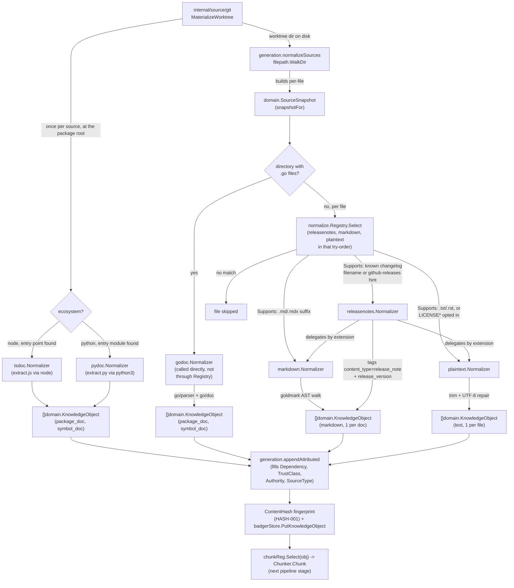

# internal/normalize

`internal/normalize` converts materialized source files (`domain.SourceSnapshot`) into retrieval-shaped `domain.KnowledgeObject` values. It defines the shared `Normalizer` interface and a `Registry` for selecting a normalizer by content type; the actual extraction logic lives in six format-specific subpackages, each implementing `Normalizer` for one kind of content:

- per-file document normalizers: `markdown`, `plaintext`, `releasenotes`;
- per-directory API-doc normalizers: `godoc` (Go source), `pydoc` (Python source), `tsdoc` (a Node package's `.d.ts`, or JSDoc over its `.js` entry point).

No normalizer ever executes the dependency's code: `godoc` uses Go's static parser, and `pydoc`/`tsdoc` run ragctl's own embedded extraction script (`extract.py`/`extract.js`, piped to `python3`/`node` over stdin) that parses the dependency's files as text. This is the pipeline stage between source acquisition (git worktree materialization) and chunking/storage.

## Key types and functions

### internal/normalize

- `Normalizer` — interface: `Name()`, `Version()`, `Supports(src) bool`, `Normalize(ctx, src) ([]domain.KnowledgeObject, error)` (internal/normalize/normalize.go).
- `Registry` — holds an ordered list of `Normalizer`s (internal/normalize/normalize.go).
- `NewRegistry` — constructs a `Registry` from normalizers in try-order (internal/normalize/normalize.go).
- `(*Registry) Select` — returns the first normalizer whose `Supports` matches, or `(nil, false)` (internal/normalize/normalize.go).
- `NormalizeLineEndings` — converts CRLF/CR to LF; called by every format normalizer before setting `KnowledgeObject.Content`, since HASH-001 fingerprinting trusts content is already whitespace-normalized (internal/normalize/lineendings.go).
- `SparsePatterns(ecosystem)` — git sparse-checkout patterns covering every file the normalizers read: the doc patterns below plus `*.go`/`go.mod` for Go, `package.json`/`*.d.ts` for Node, and `*.py`/`*.pyi` for Python (internal/normalize/sparse.go).
- `DocPatterns` / `PythonSourcePatterns` / `ScopeToSubdir` — the pieces `SparsePatterns` is built from, split out so acquisition can scope source patterns to a package's subdirectory while keeping README/LICENSE/CHANGELOG patterns at the repo root (internal/normalize/sparse.go).

### internal/normalize/markdown

- `Normalizer` — implements `normalize.Normalizer` for `.md`/`.mdx` (internal/normalize/markdown/markdown.go).
- `New` — constructs it (internal/normalize/markdown/markdown.go).
- `Supports` — matches `.md`/`.mdx` suffix, case-insensitive (internal/normalize/markdown/markdown.go).
- `Normalize` — reads the file, extracts title/headings/code languages/links via a goldmark AST walk, returns exactly one `KnowledgeObject` with that structure in `Metadata` (`headings`, `code_languages`, `links`, and `code_blocks` — a JSON list of each fenced block with its language, content and enclosing heading path; `parse_warning=true` for an empty file) (internal/normalize/markdown/normalize.go). Section splitting is deliberately deferred to chunking (CHUNK-002).
- `extract` — single-pass AST walk collecting heading breadcrumbs, fenced-code-block languages, and link destinations (internal/normalize/markdown/normalize.go).

### internal/normalize/plaintext

- `Normalizer` — implements `normalize.Normalizer` for `.txt`/`.rst`/opted-in `LICENSE*` files (internal/normalize/plaintext/plaintext.go).
- `New` — constructs it (internal/normalize/plaintext/plaintext.go).
- `Supports` — matches `.txt`/`.rst` suffix, or a `LICENSE`-prefixed basename only if `src.Metadata["include_license"] == "true"` (internal/normalize/plaintext/plaintext.go).
- `Normalize` — reads the file, trims whitespace, replaces invalid UTF-8 with `�`, returns exactly one `KnowledgeObject` with no structure extraction (internal/normalize/plaintext/normalize.go).

### internal/normalize/godoc

- `Normalizer` — implements `normalize.Normalizer` for a Go package directory (internal/normalize/godoc/godoc.go).
- `New` — constructs it (internal/normalize/godoc/godoc.go).
- `Supports` — true if `src.LocalPath` is a directory containing at least one `.go` file; operates per-directory, not per-file (internal/normalize/godoc/godoc.go).
- `Normalize` — parses the directory with `go/parser`+`go/doc` (exported-only, `Mode` 0), emits one `KnowledgeObject` for the package doc plus one per exported func/const/type/method (internal/normalize/godoc/normalize.go). Returns `(nil, nil)` on unparseable dirs or test-only packages rather than erroring.
- `singlePackage` — picks the non-`_test` package out of `parser.ParseDir`'s result map (internal/normalize/godoc/normalize.go).
- `symbolObject` — builds one symbol's `KnowledgeObject`, including a rendered signature (internal/normalize/godoc/normalize.go).
- `signature` — renders a decl's signature via `go/printer` with doc comment and (for funcs) body stripped (internal/normalize/godoc/normalize.go).
- `importPath` — best-effort import path fallback when `src.Metadata["import_path"]` is unset (internal/normalize/godoc/godoc.go).

### internal/normalize/pydoc

- `Normalizer` — implements `normalize.Normalizer` for a Python package directory; `Version()` is `v1` (internal/normalize/pydoc/pydoc.go).
- `Supports` — true when `python3` is on PATH and the directory has an entry module (`__init__.py`, else a single/first `.py` file); a missing `python3` is a silent skip, not a sync failure (internal/normalize/pydoc/pydoc.go, entrypoint.go).
- `Normalize` — runs the embedded `extract.py` (stdlib `ast` only) over the entry module and emits one `package_doc` object (the module docstring) plus one `symbol_doc` per public symbol, following single-hop relative re-exports. If `extract.py` itself fails to run, that is a ragctl bug and is returned as an error (internal/normalize/pydoc/normalize.go).

### internal/normalize/tsdoc

- `Normalizer` — implements `normalize.Normalizer` for a Node package directory; `Version()` is `v2` (internal/normalize/tsdoc/tsdoc.go).
- `Supports` — true when `node` is on PATH and the package has a resolvable entry point: a published `.d.ts` (from `package.json`'s `types`/`typings`, or alongside `module`/`main`), else a plain `.js` entry for the JSDoc fallback (internal/normalize/tsdoc/tsdoc.go, entrypoint.go).
- `Normalize` — runs the embedded `extract.js` over that entry file and emits one `package_doc` object plus one `symbol_doc` per exported declaration. A `.d.ts` always wins over the JSDoc fallback. No cross-file import resolution (internal/normalize/tsdoc/normalize.go).

### internal/normalize/releasenotes

- `Normalizer` — implements `normalize.Normalizer` as a decorator wrapping a `markdown.Normalizer` and a `plaintext.Normalizer`, not a parser of its own (internal/normalize/releasenotes/releasenotes.go).
- `New` — constructs it, wiring both delegate normalizers (internal/normalize/releasenotes/releasenotes.go).
- `Supports` — true for known filenames (`changelog`/`changes`/`releases`/`history`, `.md` or `.txt`, case-insensitive) or `src.Metadata["source_type"] == "github-releases"` (internal/normalize/releasenotes/releasenotes.go).
- `Normalize` — delegates to `markdown.Normalize` or `plaintext.Normalize` by extension/hint, then tags every returned object `Metadata["content_type"] = "release_note"` and sets `Metadata["release_version"]` from the first version-like heading (internal/normalize/releasenotes/normalize.go).
- `firstVersionHeading` — scans the markdown normalizer's `"headings"` metadata for the first breadcrumb whose last segment matches `versionHeading` (internal/normalize/releasenotes/normalize.go).

## Dataflow



## Walkthrough

Scenario: continuing from source-git.md's example, `generation.normalizeSources` walks the materialized grpc-go worktree at `/tmp/ragctl-worktree-482913567` and reaches `README.md`, whose real content includes something like:

````markdown
# gRPC-Go

[![Build Status]](https://github.com/grpc/grpc-go)

gRPC-Go is the Go implementation of gRPC.

## Installation

```sh
go get google.golang.org/grpc
```

## Documentation

See the [gRPC Go documentation](https://pkg.go.dev/google.golang.org/grpc).
````

1. **Snapshot and file-type routing.** `snapshotFor` builds `domain.SourceSnapshot{ID: "repository@7f6a3c1e...", SourceID: "repository", URI: "https://github.com/grpc/grpc-go", LocalPath: "/tmp/ragctl-worktree-482913567/README.md", LogicalPath: "README.md", Commit: "7f6a3c1e2b8d4f0a9c5e6b7d8f9a0b1c2d3e4f5a"}` — `SourceID` is the manifest source's `id` (`repository` in grpc-go.yaml). It leaves `Version` empty; the dependency version is attached later by `appendAttributed`. Since `LocalPath` is a regular file (not a directory containing `.go` files — the `godoc` special case), `generation` falls to the per-file path: `normalize.Registry.Select(src)` tries `releasenotes`, then `markdown`, then `plaintext` in that order (internal/normalize/normalize.go). `releasenotes.Supports` checks the basename against `changelog`/`changes`/`releases`/`history` and the `github-releases` metadata hint — `README.md` matches neither (internal/normalize/releasenotes/releasenotes.go) — so selection falls through to `markdown.Normalizer.Supports`, which matches the `.md` suffix case-insensitively (internal/normalize/markdown/markdown.go) and wins.

2. **Read and line-ending normalization.** `markdown.Normalize` reads the file with `os.ReadFile` and immediately runs the bytes through `normalize.NormalizeLineEndings`, converting any CRLF/CR to LF before anything else touches the content — required because `HASH-001` content-fingerprinting assumes whitespace-normalized input (internal/normalize/markdown/normalize.go, internal/normalize/lineendings.go).

3. **Single-pass AST walk.** `extract(raw)` parses the bytes with `goldmark.New().Parser().Parse(...)` and walks the resulting AST once (internal/normalize/markdown/normalize.go):
   - The `# gRPC-Go` heading is `ast.KindHeading` with `Level == 1`. `headingStack` becomes `["gRPC-Go"]`, `result.headings` gets `"gRPC-Go"`, and because it's a genuine (unclamped) H1 seen before any title was set, `result.title = "gRPC-Go"`.
   - `## Installation` is `Level == 2`; `headingStack` becomes `["gRPC-Go", "Installation"]`, so `result.headings` gets `"gRPC-Go > Installation"`.
   - The fenced code block under Installation is `ast.KindFencedCodeBlock` with `Language(source) == "sh"`, added to the `languages` set.
   - `## Documentation` is another `Level == 2` heading, popping back to `["gRPC-Go", "Documentation"]` and appending `"gRPC-Go > Documentation"`.
   - The `[gRPC Go documentation](https://pkg.go.dev/google.golang.org/grpc)` markdown link is `ast.KindLink`; its `Destination` (`https://pkg.go.dev/google.golang.org/grpc`) is appended to `result.links`. The badge image link similarly contributes `https://github.com/grpc/grpc-go` if it's a real link/autolink node rather than a bare image.

   After the walk, `languages` (a set) is sorted into a slice: `["sh"]`.

4. **Metadata assembly and the resulting `KnowledgeObject`.** Back in `Normalize`, `title = "gRPC-Go"` (non-empty, so the `filepath.Base` fallback isn't used), and the metadata map is built by joining each slice with a delimiter (internal/normalize/markdown/normalize.go):

   ```go
   domain.KnowledgeObject{
       SourceID:    "repository",
       SourceURI:   "https://github.com/grpc/grpc-go",
       ContentType: "markdown",
       LogicalPath: "README.md",
       Title:       "gRPC-Go",
       Version:     "", // the snapshot carries no version
       Commit:      "7f6a3c1e2b8d4f0a9c5e6b7d8f9a0b1c2d3e4f5a",
       Content:     raw, // the full, line-ending-normalized README bytes
       Metadata: map[string]string{
           "headings":       "gRPC-Go|gRPC-Go > Installation|gRPC-Go > Documentation",
           "code_languages": "sh",
           "links":          "https://pkg.go.dev/google.golang.org/grpc,https://github.com/grpc/grpc-go",
           "code_blocks":    `[{"index":0,"language":"sh","content":"go get google.golang.org/grpc\n","section_path":["gRPC-Go","Installation"]}]`,
       },
   }
   ```

   Exactly one `KnowledgeObject` comes back for the whole file — `markdown.Normalize` doesn't split by heading; that's deferred to chunking (CHUNK-002), which is why the full breadcrumb list is preserved in `Metadata["headings"]` rather than discarded (internal/normalize/markdown/normalize.go).

5. **Downstream.** `generation.appendAttributed` fills in the fields `markdown.Normalize` doesn't know about — `Dependency` (the grpc `DependencyVersion` from resolver.md's walkthrough), `TrustClass` (`TrustRepository`, since this came from the manifest's git source, not an explicit `official` designation), `Authority` (100, from the manifest's git source), and `SourceType` (`"git"`) — then normalizer name/version are recorded in `Metadata`, a `ContentHash` is computed, and the object is persisted via `badgerStore.PutKnowledgeObject` before being handed to `chunkReg.Select(obj).Chunk(...)`.

**Contrast with godoc.** Had the walk instead hit a directory of `.go` files (grpc-go's own `stats/` package, say), `generation.normalizeSources` would call `godoc.New().Normalize` directly rather than going through `Registry.Select` at all (`godoc` is deliberately not registered — see Notes below). `godoc.Normalize` parses the whole directory with `go/parser` + `go/doc` (exported-only, `Mode` 0) and emits *one `KnowledgeObject` per symbol* — a package-doc object plus one object per exported func/type/const/method, each with a rendered signature via `go/printer` — rather than markdown's single object per document (internal/normalize/godoc/normalize.go).

## Notes

- **`godoc`, `pydoc` and `tsdoc` are not in the `normalize.Registry`.** `generation.normalizeSources` (internal/data/generation/build.go) calls them directly — `godoc` for every directory containing `.go` files, `tsdoc` once per Node source at its package root, `pydoc` once per Python source at its entry directory — bypassing `Registry.Select`; the registry only holds `releasenotes`, `markdown`, `plaintext`. `tsdoc`/`pydoc.Supports` are checked before calling them; `godoc.Supports` is not used on that path.
- **Registry try-order matters**: `releasenotes` is registered before `markdown`/`plaintext` in `generation.normalizeSources` so a `CHANGELOG.md` is claimed by the release-notes decorator rather than the plain markdown normalizer.
- **`.rst` is not parsed as reStructuredText** — `plaintext.Normalizer` treats it as opaque text (internal/normalize/plaintext/plaintext.go).
- **`.mdx` is parsed as plain Markdown** — JSX-looking blocks pass through as opaque text; no MDX component execution (internal/normalize/markdown/markdown.go).
- **Markdown normalization produces one `KnowledgeObject` per document**, not per heading section — heading/section splitting is explicitly deferred to chunking (CHUNK-002), per the comment at internal/normalize/markdown/normalize.go and internal/normalize/releasenotes/normalize.go.
- **`releasenotes.release_version` is set from only the first version-like heading** in a changelog (typically the newest entry, since changelogs are usually newest-first). Nothing derives a per-section version yet; the full breadcrumb list stays available in `Metadata["headings"]`.
- **`godoc.Normalize` swallows two classes of directory as `(nil, nil)` rather than erroring**: unparseable `.go` files in the directory (e.g. intentionally-invalid test fixtures) and directories with only an external `_test` package — both are treated as "nothing to document," not failures, so they don't abort the whole generation run (internal/normalize/godoc/normalize.go).
- **LICENSE files are skipped by default** — `plaintext.Supports` only matches a `LICENSE*` basename when `src.Metadata["include_license"] == "true"`, and nothing in `generation.snapshotFor` currently sets that hint, so license text is effectively never indexed yet.
- Every normalizer reports `Version() == "v1"` except `tsdoc`, which is `v2` (its JSDoc fallback changed what it extracts). `Name()`+`Version()` are part of each object's fingerprint input.
- `NormalizeLineEndings` is the only shared normalization primitive; there's no shared whitespace/Unicode-normalization helper beyond it — plaintext's UTF-8 repair and markdown's structure extraction are each implemented independently.
