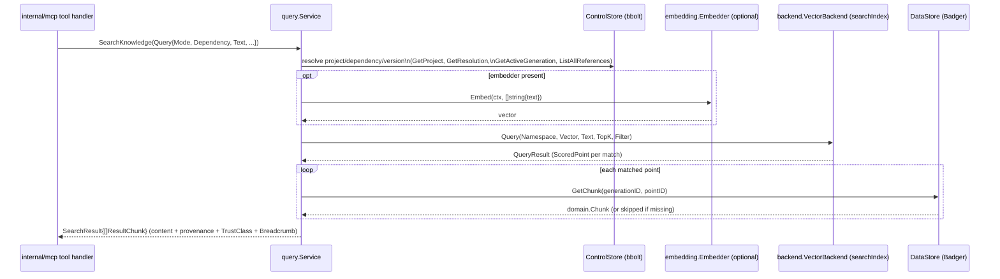

# internal/query

`internal/query` implements the transport-agnostic business logic behind every MCP tool: resolving a project's dependency versions and performing version-filtered knowledge search. No MCP/HTTP/gRPC transport type is imported here. The daemon builds the `Service` (internal/cli/daemon.go) and serves it over its socket to `internal/mcp`'s tool handlers and to CLI commands. It sits between storage (`internal/control/bbolt`, `internal/data/badger`) and the search index/embedder on one side, and its callers on the other.

The daemon keeps up to three services: one with no index (project/dependency lookups only); a full one with the embedder and the vector store (plus the keyword index in `auto` mode, as a fallback); and a keyword-only one with no embedder. Search uses the keyword-only service in `keyword` mode, and in `auto` mode whenever Ollama or the vector store isn't ready.

## Key types and functions

- `QueryMode` — one of `project`, `latest`, `compare`, `all-retained`; selects how `SearchKnowledge` resolves which version(s) to search (internal/query/query.go).
- `ErrProjectNotFound`, `ErrDependencyNotFound`, `ErrNoActiveGeneration` — sentinel errors, distinct from an empty result (internal/query/query.go).
- `Query` — one search request: `ProjectID`, `Text`, `Dependency`, `Mode`, `TopK` (internal/query/query.go).
- `ResultChunk` — one matched chunk: retrievable `Content`, score, provenance fields, `TrustClass`, and a human-readable `Breadcrumb` such as `google.golang.org/grpc@v1.67.0 > Retry > Configuration` (internal/query/query.go).
- `ProjectDependency` — a project's resolved dependency plus whether it has a promoted generation (internal/query/query.go).
- `Provenance` — a chunk's full origin (`SourceURI`, `LogicalPath`, etc.), resolved by reading through to its parent `KnowledgeObject` in Badger (internal/query/query.go).
- `ControlStore`, `DataStore` — narrow consumer-side interfaces over `*bbolt.Store`/`*badger.Store` (internal/query/query.go).
- `Status`, `ProjectRef` — fleet-wide sync-readiness summary for `knowledge_status` (internal/query/query.go).
- `ReleaseChange` — one release-note excerpt for a specific version (internal/query/query.go).
- `Service` — the query business logic; one struct, plain methods, holds `control`, `data`, `backend`, `embedder`, `namespace`, `backendName`. `embedder` is nil for a keyword-only service; `backend` is normally the CLI's `searchIndex` (see [internal/backend](backend.md)), and `backendName` is `vector.backend`, the active-generation key in every retrieval mode (internal/query/query.go).
- `New(control, data, vb, embedder, namespace, backendName)` — constructs a `Service` (internal/query/query.go).
- `(*Service) Status(ctx)` — tallies every registered project's resolved dependencies by active-generation presence (internal/query/search.go).
- `(*Service) GetProjectDependencies(ctx, projectID)` — lists a project's resolved dependencies, flagged with active-generation status (internal/query/search.go).
- `(*Service) GetDependencyVersion(ctx, projectID, pkg)` — a project's resolved version of one package (internal/query/search.go).
- `(*Service) GetProvenance(ctx, generationID, chunkID)` — reads a chunk and its parent `KnowledgeObject` from Badger (internal/query/search.go).
- `(*Service) GetReleaseChanges(ctx, dependency, from, to)` — exact-version release-note excerpt lookup via a Badger metadata scan (`content_type == "release_note"`), not an index search (internal/query/search.go).
- `(*Service) SearchKnowledge(ctx, q)` — dispatches on `q.Mode` to `searchProject`/`searchLatest`/`searchCompare`/`searchAllRetained` (internal/query/search.go).
- `search(ctx, text, topK, filter)` — internal: embeds `text` once when there is an embedder, queries the index with both the vector (if any) and the text under `filter`, resolves each match's chunk content from Badger, derives `TrustClass` from `SourceType` and builds the breadcrumb (internal/query/search.go).
- `breadcrumb(dependency, version, metadata)` — `dependency@version`, then the chunk's Markdown `section_path` segments, or its `source_path` and `symbol` for an API-doc chunk (internal/query/search.go).

## Dataflow



`ModeCompare` calls `searchProject` and `searchLatest` internally and merges their `SearchResult`s. `ModeAllRetained` enumerates every reference for a package name across all ecosystems (`ListAllReferences`) and issues one `search` call per version, merging results — the one mode that doesn't constrain to a single exact version. `GetProvenance` and `GetReleaseChanges` bypass the index entirely, reading Badger directly.

## Walkthrough

An MCP client working in project `proj_a1b2` (root `/home/jin/work/checkout-svc`) calls `search_dependency_docs` for `google.golang.org/grpc` with the text `"how do I configure retry policy on a client connection"`, mode `"project"`. The install uses the embedded vector store with `retrieval.mode: auto`, and Ollama is running.

1. `internal/mcp`'s tool handler (see [internal/mcp](mcp.md)) builds `query.Query{ProjectID: "proj_a1b2", Text: "how do I configure retry policy on a client connection", Dependency: "google.golang.org/grpc", Mode: query.ModeProject}` and calls `Service.SearchKnowledge` (internal/query/search.go). `TopK` is left at zero.

2. `SearchKnowledge` switches on `q.Mode == ModeProject` and dispatches to `searchProject`.

3. `searchProject` resolves the project's dependency version via `resolveProjectDependency`: `getResolution` first confirms the project exists (`ControlStore.GetProject`, else `ErrProjectNotFound`), then fetches its `domain.Resolution` (`ControlStore.GetResolution`, else `ErrDependencyNotFound`). Walking `resolution.Dependencies` finds `domain.DependencyVersion{Dependency: {Ecosystem: "go", Name: "google.golang.org/grpc"}, Version: "v1.67.0"}`.

4. `searchProject` asks for the active generation of exactly that version: `ControlStore.GetActiveGeneration(ctx, "go", "google.golang.org/grpc", "v1.67.0", "embedded")`. Active generations are tracked per dependency version and backend (ADR-012), so another project promoting a newer grpc version doesn't affect this lookup. It returns `domain.Generation{ID: "gen_20260904_1"}`; had nothing been active for v1.67.0, `searchProject` would return `ErrNoActiveGeneration`.

5. `searchProject` calls `search` with `topK = 0` (defaulted to `defaultTopK = 10`) and `filter = &backend.Filter{Ecosystem: "go", Dependency: "google.golang.org/grpc", Version: "v1.67.0", Generation: "gen_20260904_1"}`. The generation is included so a rebuild's not-yet-collected predecessor can never mix stale chunks into the results.

6. `search` embeds the query text once: `s.embedder.Embed(ctx, []string{text})`, which with the default Ollama model returns one 768-dimension vector. A keyword-only service skips this step and leaves `Vector` nil.

7. `search` queries the index: `s.backend.Query(ctx, backend.QueryRequest{Namespace: "depctl-1a2b3c4d", Vector: vectors[0], Text: text, TopK: 10, Filter: filter})`. The `searchIndex` sends it to the embedded vector store (falling back to the keyword index if there were no vector, or no vector matches), which returns, say, two matches:
   ```go
   []backend.ScoredPoint{
       {ID: "chk_7f3a", Score: 0.912, Metadata: backend.PointMetadata{
           Ecosystem: "go", Dependency: "google.golang.org/grpc", Version: "v1.67.0",
           Generation: "gen_20260904_1", SourceType: "git", Authority: 100,
       }},
       {ID: "chk_9b1e", Score: 0.847, Metadata: backend.PointMetadata{
           Ecosystem: "go", Dependency: "google.golang.org/grpc", Version: "v1.67.0",
           Generation: "gen_20260904_1", SourceType: "git", Authority: 100,
       }},
   }
   ```

8. For each point, `search` calls `s.data.GetChunk(ctx, "gen_20260904_1", id)` against Badger to get the actual chunk text. If `GetChunk` fails (the index still has the point but GC already removed Badger's copy), that point is skipped rather than failing the whole search.

9. Each surviving chunk becomes a `ResultChunk`. `TrustClass` is computed, not stored on the point, via `generation.TrustClassForSourceType("git")` = `domain.TrustRepository`; `Breadcrumb` comes from the chunk's own metadata, e.g. `google.golang.org/grpc@v1.67.0 > Retry > Configuration` for a Markdown section, or `google.golang.org/grpc@v1.67.0 > dialoptions.go > WithDefaultServiceConfig` for an API-doc chunk.

10. `SearchKnowledge` returns the `SearchResult`; `internal/mcp` serializes it into the tool's JSON response, with `TrustClass` and `Breadcrumb` per chunk so the agent can judge each excerpt.

## Notes

- `TrustClass` is derived at query time via `generation.TrustClassForSourceType(p.Metadata.SourceType)` rather than stored on the point — `backend.PointMetadata`'s schema is fixed and `TrustClass` is a pure function of `SourceType`, so this works on every already-synced point with no re-replication (internal/query/query.go, internal/query/search.go).
- `GetReleaseChanges` deliberately does not walk every version between `from` and `to` — there is no version-ordering/semver-range utility in the codebase (lexical comparison would misorder `"v2.0.0"` before `"v10.0.0"`), so it does exactly two exact-version lookups; a caller wanting the full history must enumerate versions itself (internal/query/search.go).
- `q.Dependency` is required for every mode, because `backend.Filter` has a single `Dependency`/`Version` field, not a list — there is no coherent single filter for "all of this project's dependencies at once" (internal/query/search.go).
- `searchLatest` and `searchAllRetained` filter by version only, not by generation, so they don't need an active-generation lookup.
- `searchAllRetained` has no ecosystem to filter by without a project or reference to derive it from, so it searches every reference for a package name regardless of ecosystem (internal/query/search.go) — the same ecosystem-blind shape `GetReleaseChanges` uses.
