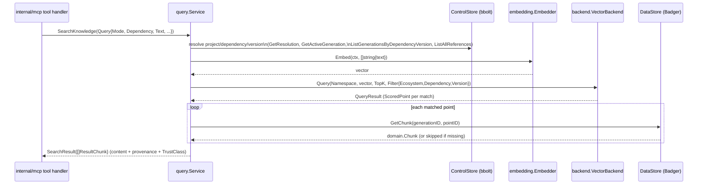

# internal/query

`internal/query` implements the transport-agnostic business logic behind every MCP tool: resolving a project's dependency versions and performing version-filtered knowledge search. No MCP/HTTP/gRPC transport type is imported here — `internal/mcp` is the only package that knows this service exists. It sits between storage (`internal/control/bbolt`, `internal/data/badger`) and the vector backend/embedder on one side, and `internal/mcp`'s tool handlers on the other.

## Key types and functions

- `QueryMode` — one of `project`, `latest`, `compare`, `all-retained`; selects how `SearchKnowledge` resolves which version(s) to search (internal/query/query.go).
- `ErrProjectNotFound`, `ErrDependencyNotFound`, `ErrNoActiveGeneration` — sentinel errors, distinct from an empty result (internal/query/query.go).
- `Query` — one search request: `ProjectID`, `Text`, `Dependency`, `Mode`, `TopK` (internal/query/query.go).
- `ResultChunk` — one matched chunk: retrievable `Content`, score, provenance fields, and `TrustClass` (internal/query/query.go).
- `ProjectDependency` — a project's resolved dependency plus whether it has a promoted generation (internal/query/query.go).
- `Provenance` — a chunk's full origin (`SourceURI`, `LogicalPath`, etc.), resolved by reading through to its parent `KnowledgeObject` in Badger (internal/query/query.go).
- `ControlStore`, `DataStore` — narrow consumer-side interfaces over `*bbolt.Store`/`*badger.Store` (internal/query/query.go, 143-147).
- `Status`, `ProjectRef` — fleet-wide sync-readiness summary for `knowledge_status` (internal/query/query.go).
- `ReleaseChange` — one release-note excerpt for a specific version (internal/query/query.go).
- `Service` — the query business logic; one struct, plain methods, holds `control`, `data`, `backend`, `embedder`, `namespace`, `backendName` (internal/query/query.go).
- `New(control, data, vb, embedder, namespace, backendName)` — constructs a `Service` (internal/query/query.go).
- `(*Service) Status(ctx)` — tallies every registered project's resolved dependencies by active-generation presence (internal/query/search.go).
- `(*Service) GetProjectDependencies(ctx, projectID)` — lists a project's resolved dependencies, flagged with active-generation status (internal/query/search.go).
- `(*Service) GetDependencyVersion(ctx, projectID, pkg)` — a project's resolved version of one package (internal/query/search.go).
- `(*Service) GetProvenance(ctx, generationID, chunkID)` — reads a chunk and its parent `KnowledgeObject` from Badger (internal/query/search.go).
- `(*Service) GetReleaseChanges(ctx, dependency, from, to)` — exact-version release-note excerpt lookup via a Badger metadata scan (`content_type == "release_note"`), not a vector search (internal/query/search.go).
- `(*Service) SearchKnowledge(ctx, q)` — dispatches on `q.Mode` to `searchProject`/`searchLatest`/`searchCompare`/`searchAllRetained` (internal/query/search.go).
- `search(ctx, text, topK, filter)` — internal: embeds `text` once, queries the vector backend under `filter`, resolves each match's chunk content from Badger, derives `TrustClass` from `SourceType` (internal/query/search.go).

## Dataflow



`ModeCompare` calls `searchProject` and `searchLatest` internally and merges their `SearchResult`s. `ModeAllRetained` enumerates every reference for a package name across all ecosystems (`ListAllReferences`) and issues one `search` call per version, merging results — the one mode that doesn't constrain to a single exact version. `GetProvenance` and `GetReleaseChanges` bypass the vector backend entirely, reading Badger directly.

## Walkthrough

An MCP client running inside project `proj_a1b2` (root `/home/jin/work/checkout-svc`) calls `search_dependency_docs` for `google.golang.org/grpc` with the text `"how do I configure retry policy on a client connection"`, mode `"project"`.

1. `internal/mcp`'s tool handler (see [internal/mcp](mcp.md)) builds `query.Query{ProjectID: "proj_a1b2", Text: "how do I configure retry policy on a client connection", Dependency: "google.golang.org/grpc", Mode: query.ModeProject}` and calls `Service.SearchKnowledge` (internal/query/search.go). `TopK` is left at zero.

2. `SearchKnowledge` switches on `q.Mode == ModeProject` and dispatches to `searchProject` (internal/query/search.go).

3. `searchProject` resolves the project's actual dependency version via `resolveProjectDependency` (internal/query/search.go, internal/query/search.go): it calls `s.getResolution(ctx, "proj_a1b2")`, which first confirms the project exists (`ControlStore.GetProject`, else `ErrProjectNotFound`) then fetches its `domain.Resolution` (`ControlStore.GetResolution`, else `ErrDependencyNotFound`). Walking `resolution.Dependencies` finds `domain.DependencyVersion{Dependency: {Ecosystem: "go", Name: "google.golang.org/grpc"}, Version: "v1.67.0"}` — this project resolved grpc to `v1.67.0`.

4. `searchProject` runs two checks, both of which must pass (internal/query/search.go, FIX-002): first, `ControlStore.GetActiveGeneration(ctx, "go", "google.golang.org/grpc", s.backendName)` (`s.backendName` is `"qdrant"`) confirms *some* generation is active for this ecosystem+package+backend at all — this returns `domain.Generation{ID: "gen_20260904_1"}`. Second, `ControlStore.ListGenerationsByDependencyVersion(ctx, "go", "google.golang.org/grpc", "v1.67.0")` confirms the project's *own resolved version specifically* was itself successfully promoted at some point (`State == ACTIVE` or `State == SUPERSEDED` on at least one returned generation) — deliberately not the same check as the first: `active_generations` is a single pointer per ecosystem+package+backend, so a *different* project promoting a newer version of the same dependency moves that pointer without invalidating this project's own, still-valid, still-synced version. If either check fails, `searchProject` returns `ErrNoActiveGeneration` instead of proceeding.

5. `searchProject` calls the shared `search` helper (internal/query/search.go, 247) with `text = "how do I configure retry policy on a client connection"`, `topK = 0` (defaults to `defaultTopK = 10`, internal/query/search.go, internal/query/query.go), and `filter = &backend.Filter{Ecosystem: "go", Dependency: "google.golang.org/grpc", Version: "v1.67.0"}` — note `Generation` is left empty on this filter, since the version alone is what constrains the search.

6. `search` embeds the query text once: `s.embedder.Embed(ctx, []string{"how do I configure retry policy on a client connection"})` (internal/query/search.go). With the `ollama` embedder wired in (see [internal/embedding](embedding.md)), this returns a single `[]float32` vector, e.g. `[][]float32{{0.014, -0.081, 0.223, ...}}` (768 dims for `nomic-embed-text`); `vectors[0]` is taken as the query vector.

7. `search` queries the vector backend: `s.backend.Query(ctx, backend.QueryRequest{Namespace: "ragctl", Vector: vectors[0], TopK: 10, Filter: filter})` (internal/query/search.go). The `qdrant` adapter (see [internal/backend](backend.md)) translates `Filter` into a Qdrant payload filter on `ecosystem`/`dependency`/`version` and returns `backend.QueryResult{Points: []backend.ScoredPoint{...}}` — say two matches:
   ```go
   []backend.ScoredPoint{
       {ID: "chk_7f3a", Score: 0.912, Metadata: backend.PointMetadata{
           Ecosystem: "go", Dependency: "google.golang.org/grpc", Version: "v1.67.0",
           Generation: "gen_20260904_1", SourceType: "git", Authority: 100,
       }},
       {ID: "chk_9b1e", Score: 0.847, Metadata: backend.PointMetadata{
           Ecosystem: "go", Dependency: "google.golang.org/grpc", Version: "v1.67.0",
           Generation: "gen_20260904_1", SourceType: "godoc", Authority: 90,
       }},
   }
   ```

8. `search` loops over `result.Points` (internal/query/search.go). For `chk_7f3a`, it calls `s.data.GetChunk(ctx, "gen_20260904_1", "chk_7f3a")` against Badger, which returns a `domain.Chunk` whose `Content` is the actual chunk bytes, e.g. `"WithDefaultServiceConfig can set a retry policy in JSON form on the client conn: ..."`. If `GetChunk` errors (the point exists in Qdrant but Badger's copy was GC'd), that point is skipped rather than failing the whole search (internal/query/search.go).

9. Each surviving chunk is derived into a `ResultChunk`, with `TrustClass` computed — not stored on the point — via `generation.TrustClassForSourceType(p.Metadata.SourceType)` (internal/query/search.go). `"git"` maps to `domain.TrustRepository` (internal/data/generation/build.go, internal/domain/domain.go). The final `SearchResult.Chunks` looks like:
   ```go
   []query.ResultChunk{
       {
           ChunkID: "chk_7f3a", Content: "WithDefaultServiceConfig can set a retry policy in JSON form on the client conn: ...",
           Score: 0.912, Ecosystem: "go", Dependency: "google.golang.org/grpc", Version: "v1.67.0",
           Generation: "gen_20260904_1", SourceType: "git", Authority: 100,
           TrustClass: domain.TrustRepository, // "repository"
       },
       {
           ChunkID: "chk_9b1e", Content: "type ServiceConfig struct { ... RetryPolicy *RetryPolicy ... }",
           Score: 0.847, Ecosystem: "go", Dependency: "google.golang.org/grpc", Version: "v1.67.0",
           Generation: "gen_20260904_1", SourceType: "godoc", Authority: 90,
           TrustClass: domain.TrustRepository, // "godoc" also maps to TrustRepository
       },
   }
   ```

10. `SearchKnowledge` returns this `SearchResult` up through `searchProject` unchanged; `internal/mcp`'s handler serializes it into the tool's JSON response, with `TrustClass` surfaced per chunk so the calling agent can judge how much to trust each excerpt.

## Notes

- `Service.embedder`, `backendName`, and `namespace` were not in the original ticket's sketched `Service` struct — added because `VectorBackend.Query` needs a query vector (nothing else turns `Query.Text` into one), and `GetActiveGeneration`/`VectorBackend.Query` are both backend/namespace-scoped (internal/query/query.go).
- `TrustClass` is derived at query time via `generation.TrustClassForSourceType(p.Metadata.SourceType)` rather than stored on the vector point itself — `backend.PointMetadata`'s schema is fixed (VEC-001) and `TrustClass` is a pure function of `SourceType`, so this works retroactively on every already-synced point with no backend schema change or re-replication needed (internal/query/query.go, internal/query/search.go).
- `GetReleaseChanges` deliberately does not walk every version between `from` and `to` — there is no version-ordering/semver-range utility anywhere in the codebase (naive lexical comparison would misorder e.g. `"v2.0.0"` before `"v10.0.0"`), so it does exactly two exact-version lookups; a caller wanting full history between them must enumerate versions itself (internal/query/search.go).
- `search`'s per-point Badger lookup skips (not fails) a point the backend returned but Badger no longer has — e.g. GC racing a query — so one missing chunk doesn't fail the whole search (internal/query/search.go).
- `q.Dependency` is required for every mode except `ModeAllRetained`'s ecosystem-unfiltered case, because `backend.Filter` has a single `Dependency`/`Version` field, not a list — there is no coherent single filter for "all of this project's dependencies at once" (internal/query/search.go).
- `searchAllRetained` has no ecosystem to filter by without a project or reference to derive it from, so it searches across every reference for a package name regardless of ecosystem (internal/query/search.go) — this is the same ecosystem-blind-search shape `GetReleaseChanges` uses.
