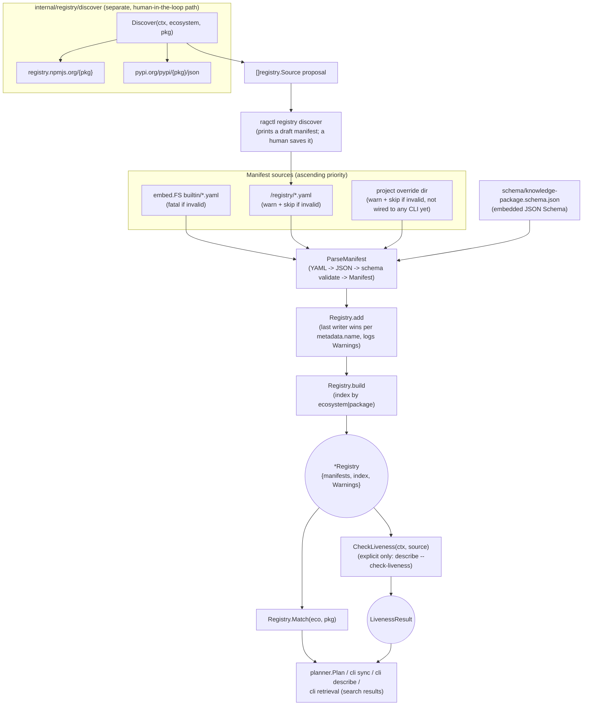

# internal/registry

`internal/registry` answers "where can I obtain trustworthy knowledge for this package/version?" — a question distinct from `internal/resolver`'s "what package/version does this project use?" The registry itself is data (YAML manifests validated against a JSON Schema), not code, so new package coverage ships without touching Go internals. `Loader` merges built-in, user, and project manifests into a `Registry` that answers exact ecosystem+package lookups; `internal/registry/discover` is a separate, human-in-the-loop helper that proposes candidate sources for packages the registry doesn't yet cover, by querying npm/PyPI metadata. `internal/registry/schema` and `internal/registry/builtin` are data-only directories (a JSON Schema and the seed manifests) embedded into the package via `go:embed` — neither is a Go subpackage.

## Key types and functions

### internal/registry

- `Manifest` — a KnowledgePackage: maps an ecosystem+package identity to its knowledge sources (internal/registry/manifest.go).
- `Metadata` — manifest identity (`Name`), independent of what it matches (internal/registry/manifest.go).
- `Match` — exact-membership predicate: ecosystem ∈ `Ecosystems` and name ∈ `Packages` (internal/registry/manifest.go).
- `VersionStrategy` — how a resolved dependency version maps to a point in the knowledge source, e.g. a git tag template (internal/registry/manifest.go).
- `Source` — one acquirable knowledge source (`git`/`godoc`/`website`/`github-releases`), ranked by `Authority` (internal/registry/manifest.go).
- `ManifestError` — wraps a manifest that failed schema validation or YAML parsing, naming the failing field(s) (internal/registry/manifest.go).
- `ParseManifest(data []byte) (Manifest, error)` — decodes YAML generically, round-trips through JSON, validates against the embedded `knowledge-package.schema.json`, then decodes into `Manifest` (internal/registry/manifest.go).
- `Registry` — the merged, matchable set of loaded manifests plus load `Warnings` (internal/registry/loader.go).
- `Loader` — loads and merges manifests from built-in, user, and project sources, ascending priority (internal/registry/loader.go).
- `NewLoader(userRegistryDir, projectRegistryDir string) *Loader` — either dir may be `""` to skip that source (internal/registry/loader.go).
- `(*Loader) Load(ctx) (*Registry, error)` — reads embedded `builtin/*.yaml` (fatal if invalid), then user dir, then project dir (each skips invalid files with a warning), then builds the match index (internal/registry/loader.go).
- `(*Registry) Match(eco domain.Ecosystem, pkg string) (Manifest, bool)` — O(1) index lookup; no match is `(Manifest{}, false)`, not an error (internal/registry/matcher.go).
- `(*Registry) ManifestNames() []string` — every loaded manifest's `metadata.name` (internal/registry/matcher.go).
- `(*Registry) Manifest(name string) (Manifest, bool)` — looks up a loaded manifest by name (internal/registry/matcher.go).
- `LivenessResult` — whether a `Source`'s URL was reachable when checked, with the underlying error preserved (internal/registry/liveness.go).
- `CheckLiveness(ctx, source Source) LivenessResult` — probes a source without acquiring it: `git ls-remote` for `git`, HTTP `HEAD` for `website`; only runs when explicitly called, never implicitly (internal/registry/liveness.go).

### internal/registry/discover

- `Discover(ctx, ecosystem domain.Ecosystem, pkg string) ([]registry.Source, error)` — queries the ecosystem's package-metadata API for structured source URLs (npm's `repository`, PyPI's `project_urls`/`home_page`); never guesses, returns an empty result for a package with no such fields (internal/registry/discover/discover.go). Supports `EcosystemNode` and `EcosystemPython` only.

### internal/registry/schema and internal/registry/builtin

- `internal/registry/schema/knowledge-package.schema.json` — the canonical JSON Schema a `Manifest` YAML file is validated against; embedded via `go:embed` in manifest.go. Lives inside the package (not at repo root) because `go:embed` can't reach outside a package's own directory tree.
- `internal/registry/builtin/*.yaml` — six hand-authored seed manifests (grpc-go, protobuf-go, badger, bbolt, pydantic, fastapi), embedded via `go:embed` in loader.go. Enough to validate the manifest format end-to-end, not real ecosystem coverage.

## Dataflow



## Walkthrough

Scenario: `ragctl plan` needs a knowledge source for the Go dependency `google.golang.org/grpc` and the built-in registry already ships a manifest for it, so no user/project override is involved.

1. **Startup: `Loader.Load` reads the built-in manifest.** `NewLoader("", "")` (or with real user/project dirs) builds a `Loader`; `Load` starts by reading `builtinFS.ReadDir("builtin")` — the `//go:embed builtin/*.yaml` filesystem compiled into the binary (internal/registry/loader.go). One of the six entries is `grpc-go.yaml`:

   ```yaml
   apiVersion: ragctl.dev/v1alpha1
   kind: KnowledgePackage
   metadata:
     name: grpc-go
   match:
     ecosystems: [go]
     packages: [google.golang.org/grpc]
   version:
     strategy: semver-tag
     repository: grpc/grpc-go
   sources:
     - id: repository
       type: git
       url: https://github.com/grpc/grpc-go
       ref: "v${version}"
       authority: 100
     - id: package-docs
       type: godoc
       module: google.golang.org/grpc
       authority: 95
   ```

   (internal/registry/builtin/grpc-go.yaml)

2. **`ParseManifest` validates before decoding.** The raw bytes go through `yaml.Unmarshal` into a generic `any`, get re-marshaled to JSON, and are validated against the embedded `schema/knowledge-package.schema.json` via `compiledSchema.Validate` — only after that does the same YAML get decoded a second time, now into the typed `Manifest` struct (internal/registry/manifest.go). A schema violation (say, a missing `authority` field) would come back as a `*ManifestError` naming the failing field; since this is a built-in manifest, `Loader.Load` treats that as fatal (internal/registry/loader.go) rather than skipping it, because a built-in manifest shipping broken is a bug, not user input.

3. **Decoded shape.** `ParseManifest` returns:

   ```go
   Manifest{
       Metadata: Metadata{Name: "grpc-go"},
       Match:    Match{Ecosystems: []domain.Ecosystem{"go"}, Packages: []string{"google.golang.org/grpc"}},
       Version:  VersionStrategy{Strategy: "semver-tag", Repository: "grpc/grpc-go"},
       Sources: []Source{
           {ID: "repository", Type: "git", URL: "https://github.com/grpc/grpc-go", Ref: "v${version}", Authority: 100},
           {ID: "package-docs", Type: "godoc", Module: "google.golang.org/grpc", Authority: 95},
       },
   }
   ```

4. **`Registry.add` and `Registry.build`.** `reg.add(m, "builtin")` stores it keyed by `metadata.name` — `"grpc-go"` — in `r.manifests` (no prior entry, so no override warning) (internal/registry/loader.go). After all built-in/user/project sources are merged, `build()` walks every manifest's `Match.Ecosystems × Match.Packages` cross product and populates the lookup index; for this manifest that's a single pair, so `r.index["go|google.golang.org/grpc"] = grpc-go manifest` (internal/registry/matcher.go, using `matchKey`).

5. **The planner calls `Registry.Match`.** Given the resolved dependency `domain.DependencyVersion{Dependency: {Ecosystem: "go", Name: "google.golang.org/grpc"}, Version: "v1.68.0"}` (from `internal/resolver/golang`, see resolver.md's walkthrough), `planner.Plan` (internal/planner/planner.go) calls `reg.Match(domain.EcosystemGo, "google.golang.org/grpc")` to decide whether the dependency has a knowledge source; `syncVersion` (internal/cli/sync.go) calls it again to get the manifest it builds from. That's `r.index[matchKey("go", "google.golang.org/grpc")]` → `r.index["go|google.golang.org/grpc"]`, an O(1) hit returning the `grpc-go` manifest and `true` (internal/registry/matcher.go).

6. **What the caller does with it.** `generation.Build` acquires every `git`-type source in the manifest — here just `https://github.com/grpc/grpc-go`, at ref `v1.68.0` (the `${version}` template filled from the resolved version) — through `internal/source/git` (see source-git.md's walkthrough). The `godoc` source is informational: it means "extract Go API docs from the `.go` files in the acquired checkout", not a separate download. `Authority` does not pick one source over another; it is copied onto each `KnowledgeObject` so search results can rank sources.

   If instead the dependency had no manifest (say a module that isn't in any built-in or user manifest), `Match` returns `(Manifest{}, false)` — not an error. The planner records "no knowledge source mapped", and `syncVersion` tries a fallback manifest derived from the package's own identity (`fallbackManifest` in internal/cli/sync.go: a `github.com/...` Go module path or vanity import, or npm/PyPI repository metadata). Only if that also fails is the version recorded as having no source, so later syncs stop retrying it.

## Notes

- `Registry.Match` is called by `internal/planner` (planner.go) and by the CLI's `sync.go`, `describe.go` and `retrieval.go`; `ragctl registry list` (`internal/cli/registry.go`) uses `ManifestNames`/`Manifest`.
- `internal/resolver` has an analogous `Registry` type for a different purpose (resolver priority, not manifest matching) — don't conflate the two; `internal/registry.Registry` is manifest-matching only.
- `discover.Discover` results are never applied to a loaded `Registry` automatically — `ragctl registry discover <ecosystem> <package>` only prints a draft manifest, which a human can review and save in `<data-dir>/registry/`.
- Sync does not need a manifest for every dependency: without one, it falls back to a single `git` source derived from the package itself (Authority 0), as described in step 6.
- `CheckLiveness` only supports `git` and `website` source types; `godoc` and `github-releases` sources return an "not implemented" error result rather than panicking.
- The project-override registry directory is fully supported by `Loader`, but every CLI caller passes `""` for it (`NewLoader(userDir, "")`), so it is unused from the CLI today.
- Malformed built-in manifests are treated as fatal (`Load` returns an error) since they're compiled in and should never be invalid; malformed user/project manifests are skipped with a warning instead, since those are external, mutable files.
- `discover`'s `sourceType` classifies any github.com/gitlab.com URL as `git` and everything else as `website` — a coarse heuristic, not URL validation.
