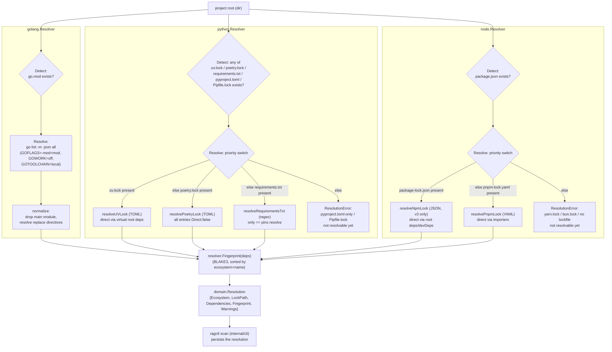

# internal/resolver

Defines the `Resolver` contract every ecosystem-specific dependency resolver implements, plus a fixed-order `Registry` and shared helpers (`Fingerprint`, `ResolutionError`). The ecosystem subpackages (`golang`, `python`, `node`) each detect whether a project root belongs to their ecosystem and, if so, turn its manifest/lockfile into a `domain.Resolution` — the canonical dependency list that downstream stages (source fetch, normalize, generation) consume per project.

## Key types and functions

### internal/resolver

- `Resolver` — interface: `Name() string`, `Detect(ctx, root) (bool, error)`, `Resolve(ctx, root) (domain.Resolution, error)` (internal/resolver/resolver.go)
- `Registry` — holds resolvers in fixed registration-priority order (internal/resolver/resolver.go)
- `NewRegistry` — builds a `Registry`, argument order becomes priority order (internal/resolver/resolver.go)
- `(*Registry) DetectAll` — runs every registered resolver's `Detect` against `root`, returns all matches in registration order (a project can match more than one ecosystem) (internal/resolver/resolver.go)
- `ResolutionError` — wraps a `Resolve` failure with `Resolver`/`Root`/`Cause`, unwraps via `errors.Is`/`As` (internal/resolver/errors.go)
- `Fingerprint` — BLAKE3 hash over a dependency list sorted by (ecosystem, name), so identical dependency sets always fingerprint the same regardless of emission order; shared across all ecosystem resolvers (internal/resolver/fingerprint.go)

### internal/resolver/golang

- `Resolver` — implements `resolver.Resolver` for Go modules (internal/resolver/golang/detect.go)
- `New` — constructs a Go resolver (internal/resolver/golang/detect.go)
- `(*Resolver) Detect` — single `os.Stat` for `go.mod` at root, no upward search, no parsing (internal/resolver/golang/detect.go)
- `listModules` — runs `go list -m -json all` via `executil.Run` with `GOFLAGS=-mod=mod`, `GOWORK=off`, `GOTOOLCHAIN=local`, decodes streamed (non-array) JSON module objects (internal/resolver/golang/list.go)
- `normalize` — drops the main module, resolves `replace` directives (`local:<path>` for path replaces, `replace:<path>@<version>` for version replaces) into `domain.DependencyVersion` (internal/resolver/golang/normalize.go)
- `(*Resolver) Resolve` — runs `listModules` then `normalize`, returns `domain.Resolution` with `resolver.Fingerprint` (internal/resolver/golang/resolve.go)

### internal/resolver/python

- `recognizedFiles` — lock/manifest files marking a Python project, in priority order: `uv.lock`, `poetry.lock`, `requirements.txt`, `pyproject.toml`, `Pipfile.lock` (internal/resolver/python/detect.go)
- `Resolver` — implements `resolver.Resolver` for Python projects (internal/resolver/python/detect.go)
- `New` — constructs a Python resolver (internal/resolver/python/detect.go)
- `(*Resolver) Detect` — existence check only, true if any `recognizedFiles` entry is present (internal/resolver/python/detect.go)
- `(*Resolver) Resolve` — picks a strategy by priority: `uv.lock` → `poetry.lock` → `requirements.txt`; `pyproject.toml`-only or `Pipfile.lock` return a `ResolutionError` (no strategy yet) (internal/resolver/python/resolve.go)
- `resolveUVLock`/`normalizeUV` — parses `uv.lock` (TOML), drops the project's own `virtual` root package(s), derives direct/indirect from the virtual root's declared dependencies, tags git/local provenance in `ResolvedBy` (internal/resolver/python/uv.go, internal/resolver/python/uv.go)
- `resolvePoetryLock`/`normalizePoetry` — parses `poetry.lock` (TOML); poetry.lock exposes no direct/indirect distinction so every entry is `Direct: false`; git/directory/file/url sources tagged in `ResolvedBy` (internal/resolver/python/poetry.go, internal/resolver/python/poetry.go)
- `resolveRequirementsTxt`/`parseRequirements` — line-regex parser; only exact `==` pins resolve, everything else (ranges, bare names, `-r` includes) becomes a `Resolution.Warnings` entry instead of a guess (internal/resolver/python/requirements.go, internal/resolver/python/requirements.go)

### internal/resolver/node

- `lockfilePriority` — lockfiles Resolve tries in order: `package-lock.json`, `pnpm-lock.yaml`, `yarn.lock`, `bun.lock` (internal/resolver/node/detect.go)
- `Resolver` — implements `resolver.Resolver` for Node.js projects (TypeScript rides the same graph) (internal/resolver/node/detect.go)
- `New` — constructs a Node resolver (internal/resolver/node/detect.go)
- `(*Resolver) Detect` — existence check for `package.json` only, independent of which lockfile (if any) is present (internal/resolver/node/detect.go)
- `(*Resolver) Resolve` — picks a strategy by priority: `package-lock.json` → `pnpm-lock.yaml`; `yarn.lock`/`bun.lock` detected but return a `ResolutionError` (no strategy yet), as does no lockfile at all (internal/resolver/node/resolve.go)
- `resolveNpmLock`/`normalizeNpm` — parses `package-lock.json` (JSON, lockfileVersion 3 only); direct/indirect from the root `""` entry's `dependencies`/`devDependencies`; nested `node_modules/a/node_modules/b` keys collapse via `npmPackageName`; `link: true` entries tagged `local:<path>` (internal/resolver/node/npm.go, internal/resolver/node/npm.go)
- `resolvePnpmLock`/`normalizePnpm` — parses `pnpm-lock.yaml` (YAML); direct/indirect from every workspace `importers` entry; `splitPnpmKey` strips a peer-dependency parenthetical suffix before splitting `name@version`; cross-workspace member dependencies are naturally excluded since they never appear under `packages:` (internal/resolver/node/pnpm.go, internal/resolver/node/pnpm.go, internal/resolver/node/pnpm.go)

## Dataflow



## Walkthrough

Scenario: `ragctl scan` runs against a project root `/repos/myservice` whose `go.mod` requires `google.golang.org/grpc`.

1. **Detect.** `scan` (per resolver.md's Notes, it calls `golang.New()` directly rather than through `Registry`) invokes `(*Resolver).Detect(ctx, "/repos/myservice")`. This is a single `os.Stat(filepath.Join(root, "go.mod"))` — no parsing, no upward directory search — and returns `true` because `/repos/myservice/go.mod` exists and is a regular file (/Users/jin/GolandProjects/ragctl/internal/resolver/golang/detect.go).

2. **Resolve → listModules.** `(*Resolver).Resolve` calls `listModules(ctx, "/repos/myservice")`, which shells out via `executil.Run` to:

   ```
   go list -m -json all
   ```

   run with `Dir: "/repos/myservice"`, a 60s timeout, and three deliberately-set env vars: `GOFLAGS=-mod=mod` (so a vendored project doesn't fail with "can't compute 'all' using the vendor directory"), `GOWORK=off` (so an ancestor `go.work` doesn't force workspace mode, which is incompatible with `-mod=mod`), and `GOTOOLCHAIN=local` (so a `go.mod` requesting a newer Go doesn't trigger a network download that eats the timeout) (/Users/jin/GolandProjects/ragctl/internal/resolver/golang/list.go).

3. **One streamed module object.** `go list -m -json all` doesn't emit a JSON array — it streams concatenated JSON objects, one per module in the build list, so `listModules` decodes them one at a time with `json.NewDecoder(...).Decode(&m)` in a loop until `io.EOF` (/Users/jin/GolandProjects/ragctl/internal/resolver/golang/list.go). The object for grpc-go itself looks like:

   ```json
   {"Path":"google.golang.org/grpc","Version":"v1.68.0","Indirect":false}
   ```

   decoded into `goModule{Path: "google.golang.org/grpc", Version: "v1.68.0", Main: false, Indirect: false, Replace: nil}` (/Users/jin/GolandProjects/ragctl/internal/resolver/golang/list.go). The main module itself (`myservice`) also appears in the stream, with `Main: true` and no `Version`.

4. **normalize.** `normalize(modules)` walks every decoded `goModule`: the main module (`Main: true`) is skipped; for grpc-go, `m.Replace == nil` so `version` stays `"v1.68.0"` and `resolvedBy` stays the default `"go-list"` (/Users/jin/GolandProjects/ragctl/internal/resolver/golang/normalize.go). It builds:

   ```go
   domain.DependencyVersion{
       Dependency: domain.Dependency{Ecosystem: domain.EcosystemGo, Name: "google.golang.org/grpc", Direct: true},
       Version:    "v1.68.0",
       ResolvedBy: "go-list",
   }
   ```

   A different, illustrative module in the same output, `golang.org/x/net`, might carry `Indirect: true` (so `Direct: false`); and if `go.mod` had a line like `replace google.golang.org/grpc => ../local-grpc`, that module's `Replace` field would be `{Path: "../local-grpc", Version: ""}`, giving `resolvedBy = "local:../local-grpc"` and leaving `version` as whatever the unreplaced entry reported — the "no `Replace.Version`" branch treats an empty version as a filesystem-path replace, distinct from a version-pinned replace like `replace foo => foo v1.2.3` (`resolvedBy = "replace:foo@v1.2.3"`) (/Users/jin/GolandProjects/ragctl/internal/resolver/golang/normalize.go).

5. **Fingerprint and Resolution.** `Resolve` hashes the full `deps` slice with `resolver.Fingerprint` (BLAKE3 over the list sorted by ecosystem+name, so fingerprint is independent of `go list`'s emission order) and returns:

   ```go
   domain.Resolution{
       Ecosystem:    domain.EcosystemGo,
       Dependencies: deps, // includes the grpc DependencyVersion above
       Fingerprint:  "b3:9f2a...", // BLAKE3 digest
   }
   ```

   (/Users/jin/GolandProjects/ragctl/internal/resolver/golang/resolve.go). `scan` persists this `Resolution`; downstream, `plan` looks up each `DependencyVersion.Dependency.{Ecosystem,Name}` — `("go", "google.golang.org/grpc")` — against `internal/registry.Registry.Match` (see registry.md's walkthrough, which picks up exactly this dependency) and uses `DependencyVersion.Version` (`"v1.68.0"`) to fill the manifest's `${version}` ref template.

**Contrast with python/node.** Neither `python.Resolver` nor `node.Resolver` execs a package-manager binary the way `golang` execs `go list` — they parse an existing lockfile directly (TOML for `uv.lock`/`poetry.lock`, JSON for `package-lock.json`, YAML for `pnpm-lock.yaml`) with no subprocess involved. For example, `python.Resolve` on a project with `uv.lock` calls `resolveUVLock`, which parses the TOML file and derives `Direct`/`Indirect` from the *virtual root package's* declared dependencies rather than from a `Main`/`Indirect` field the tool itself reports (/Users/jin/GolandProjects/ragctl/internal/resolver/python/uv.go) — the ecosystem's own lockfile format dictates what provenance information is even available (e.g. `poetry.lock` can't distinguish direct from transitive at all, so every entry is `Direct: false`).

## Notes

- `Registry`/`DetectAll` exist but nothing calls them from the CLI yet — `scan` (`internal/cli/scan.go`) calls the right resolver directly by ecosystem via a hardcoded `supportedEcosystems`/`resolvers` map (`go`→`golang.New()`, `python`→`python.New()`, `node`→`node.New()`). The registry is meant to earn its keep once resolvers need to compete for the same project (e.g. an ambiguous polyglot repo) — see docs/architecture.md line ~46.
- Go's `go list` env vars (`GOFLAGS=-mod=mod`, `GOWORK=off`, `GOTOOLCHAIN=local`) are a deliberate tradeoff, not a pure win: per docs/architecture.md (GO-002 amendment), 118 of ~1100 scanned real repos previously resolved by silently downloading a newer Go toolchain over the network; now they fail fast with a clear version-mismatch error instead of eating the 60s timeout.
- `scan` flags a directory as `python`/`node` on manifest presence alone (`pyproject.toml`/`requirements.txt`, `package.json`), which is broader than what `Resolve` can actually handle — e.g. `pyproject.toml` with no lockfile, or `package.json` with no lockfile at all, register successfully but log a non-fatal resolve error (docs/architecture.md line ~208).
- `python`/`node` resolvers implement backlog epics 20/21 (`docs/tickets/backlog/`), pulled forward ahead of planned epic order at the user's explicit request — not a change to the backlog/planned split's meaning otherwise.
- Poetry's lockfile format has no way to distinguish direct vs. transitive dependencies, so `normalizePoetry` always sets `Direct: false` — unlike `uv.lock` (via the virtual root's declared deps) and npm/pnpm (via the root/importers deps).
- `python.Resolve` and `node.Resolve` both duplicate a small `exists`/`lockPath`/`resolutionErr` helper trio locally rather than sharing one — each ecosystem package is self-contained by design (see CLAUDE.md: pull in only what's needed, no speculative shared abstraction for two callers).
