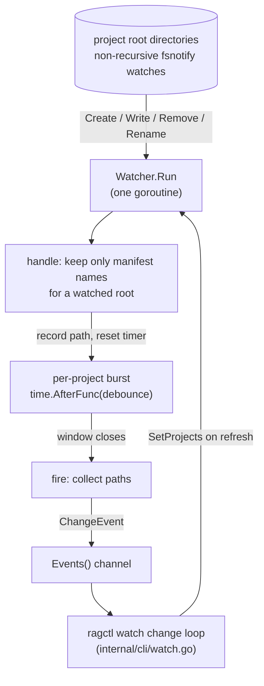

# internal/watch

`internal/watch` notices when a registered project's dependency manifests change (`go.mod`, `package-lock.json`, `uv.lock`, ...) and reports each change once, after a debounce window. It knows nothing about resolving or syncing; `ragctl watch` (`internal/cli/watch.go`) consumes its events and does that work.

## Key types and functions

- `manifestFiles` — static map from ecosystem to the files that ecosystem's resolver reads. Only ecosystems with a resolver are listed (Go, Python, Node) (internal/watch/paths.go).
- `Project` — `ID`, `Root`, `Ecosystem`: one project to watch. The CLI builds these from registered projects plus their stored resolution's ecosystem (internal/watch/paths.go).
- `WatchPaths(p)` — the absolute paths of `p`'s manifest files that exist right now; used for the startup listing (internal/watch/paths.go).
- `Watcher` — wraps one `fsnotify.Watcher`. `New(debounce, logf)`, `SetProjects(projects)` (replaces the watched set, unwatching removed roots), `Run(ctx)` (processes filesystem events until `ctx` ends), `Events()` (debounced `ChangeEvent`s) (internal/watch/watcher.go).
- `ChangeEvent` — `ProjectID` and the sorted `Paths` that changed in one burst (internal/watch/watcher.go).

## Dataflow

`Run` never blocks on a consumer: it only records paths and resets timers. Each timer fires on its own goroutine, and that goroutine does the (possibly blocking) send, so a slow consumer delays delivery without stopping the watcher from seeing further changes.

## Walkthrough

A Go project at `/src/app` is registered and resolved, so the CLI hands the watcher `Project{ID: "proj_x", Root: "/src/app", Ecosystem: "go"}` and `SetProjects` adds a watch on the `/src/app` directory itself.

1. The user runs `go get example.com/dep`. Go rewrites `go.mod` and `go.sum`, typically by writing a temp file and renaming it over the original.
2. fsnotify reports several events in a few milliseconds: a create for a temp name, then create/write events for `/src/app/go.mod` and `/src/app/go.sum`.
3. `handle` drops the temp-file event (not a manifest name). The first manifest event creates a burst for `proj_x` with a 2-second timer (`watch.debounce`). Each later event adds its path and resets the timer.
4. Two seconds after the last event, `fire` sends `ChangeEvent{ProjectID: "proj_x", Paths: ["/src/app/go.mod", "/src/app/go.sum"]}`.
5. `ragctl watch` receives it, re-resolves `/src/app`, and runs the same plan-and-sync as `ragctl sync --project proj_x`.

## Notes

- Roots are watched as directories, not the manifest files themselves. A watch on the file stops working when a tool replaces the file by rename. A directory watch keeps working, turns remove-then-recreate into one change, and sees a lockfile created for the first time. fsnotify watches aren't recursive, so nothing below the root is watched.
- `SetProjects` is how removal works: a root missing from the new set is unwatched and any pending change for it is dropped. The CLI calls it after every processed change and once a minute.
- A root that can't be watched (deleted, no permission) is logged through `logf` and skipped; the other projects keep working.
