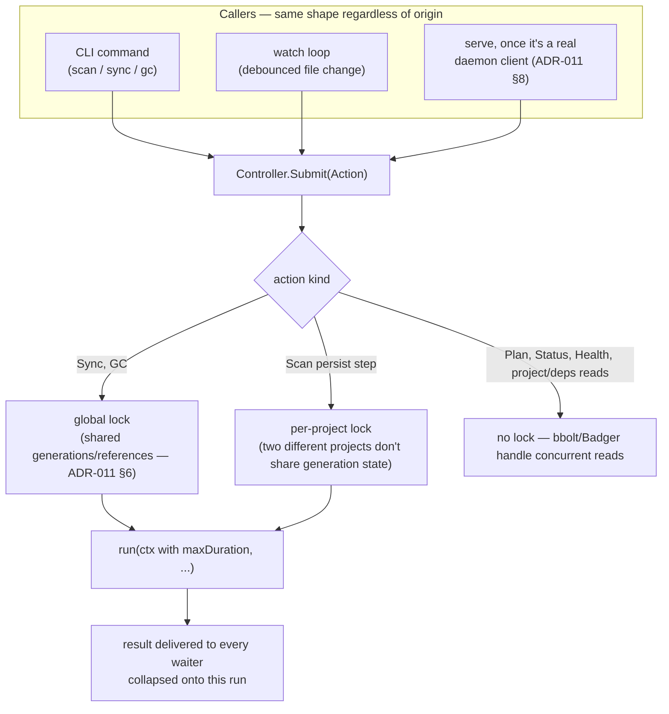

# Proposal: generalize the sync scheduler into an action controller

**Status:** implemented for `sync`, `GC`, and scan's per-project persist lock — see "Implementation notes" at the end. Extends [ADR-011](../adr/ADR-011-single-owner-daemon.md), doesn't replace it. Companion to [`daemon-mcp-topology.md`](daemon-mcp-topology.md). `serve` has since also caught up to ADR-011 §8 (WATCH-010, a separate piece of work) — see that doc, now marked resolved.

## The gap this closes

ADR-011 already decided the thing we were circling: **while the daemon is running, it is the only process that opens or mutates ragctl's persistent stores** (§Decision), and §6/§7 already serialize *sync* globally and collapse duplicate requests so syncs can't overlap or corrupt a shared generation.

Two things haven't caught up to that decision yet:

1. **`ragctl serve` doesn't follow §8 yet.** The ADR says it "opens no store and builds no embedder" — a pure stdio↔daemon proxy. The code (`internal/cli/serve.go`) still calls `openControlStore()`/`openDataStore()` directly. This is the actual mechanism behind the lock-contention diagram in `daemon-mcp-topology.md` §2 — not a new design flaw, an unfinished piece of an already-accepted ADR.
2. **Only `sync` goes through the serialized scheduler.** `gc` and `scan`'s persist step (`PutProject`/`PutResolution`) call straight into the `engine` per HTTP request — no lock, no queue. ADR-011 §6's own reasoning ("generations are keyed by dependency and shared across projects... two projects could otherwise race to build the same generation") applies just as directly to `gc` (deletes generations/references) racing a concurrent `sync` (creates them), or two `scan` calls racing the same project's resolution.

Fixing (1) is what makes (2) matter for MCP too: once `serve` is a real client, its one write path (`sync_project`) is just another caller submitting to whatever the daemon's serialization mechanism is — it doesn't need special-casing, but only if that mechanism actually covers every mutating action, not just sync.

## What "atomic" means here — three different guarantees, worth separating

"Everything should be atomic" bundles three distinct concerns. Naming them separately matters because they have different solutions and different costs:

1. **No corruption from two mutating actions interleaving.** Two things touching shared state (references, active-generation pointers, a project's resolution) at once, each seeing the other's half-finished work. This is what a serialized queue/lock actually prevents — the thing you're describing as a controller.
2. **No corruption from one write landing half-applied.** A crash or panic mid-write leaving a bucket in an inconsistent state. Already solved, underneath everything else: every bbolt write goes through `db.Update` (one ACID transaction per call), every Badger write is transactional. This layer doesn't need new design — it's a property of the stores already in use.
3. **No corruption from a multi-stage *pipeline* failing partway through.** `generation.Build` acquires a git worktree, normalizes files, embeds, and upserts to a vector backend — real network calls across several services. This **cannot** be one atomic transaction; there's no distributed-transaction layer here and ADR-011 explicitly declined to build one ("not built: a distributed scheduler... a generalized workflow engine"). What exists instead is the lifecycle-state pattern from epic 11: `PLANNED → ACQUIRING → NORMALIZING → INDEXING → {READY, FAILED}`. A failure at any stage marks the generation `FAILED` with the error recorded — legible and safely retried, never silently vanished or left ambiguous. That's the honest ceiling for "atomic" in a system with real external I/O; the goal is *never leave state a reader can't tell is broken*, not *the whole operation either fully happens or fully doesn't*.

Point 1 is the actual gap. Points 2 and 3 are already handled by existing design — worth stating plainly so "make it atomic" doesn't turn into rebuilding things that already work.

There's a fourth thing bundled into your worry that deserves its own name: **no permanent lock.** This is exactly the bug fixed earlier this session — `Scheduler.execute()` used to hold the global sync lock for as long as `run()` took, unbounded, so one hung network call to an unreachable embedder could wedge every future sync behind it forever. The fix (`maxSyncDuration`, a 30-minute ceiling via `context.WithTimeout(context.WithoutCancel(s.base), maxSyncDuration)`) is the template: **every action kind the controller runs needs the same bound**, not just sync, or generalizing the queue just multiplies the ways it can wedge itself shut.

## Proposal: `Scheduler` → `Controller`

Generalize `internal/daemon/scheduler.go` from "runs `SyncOptions`" to "runs a typed `Action`," keeping the machinery that already works (per-key `syncing`/`dirty` collapsing, waiter channels, global mutex, bounded context) rather than inventing something new.

Concretely:

- **Action types**, not just `SyncOptions`: `Sync{ProjectID, Opts}`, `GC{DryRun}`, `ScanPersist{ProjectID, Resolution}`. `Resolve` stays folded into `Sync` exactly as it is today (`opts.Resolve`) — no change needed there.
- **Lock granularity per action kind**, not one blanket rule:
  - `Sync` and `GC` → the existing global lock. Both touch generations/references/active pointers, the same shared-state class ADR-011 §6 already reasoned about for sync.
  - `ScanPersist` → a per-project lock is enough. Two different projects scanning at once don't share generation state; only the same project being scanned twice concurrently is unsafe.
  - Reads (`Plan`, `Status`, `Health`, `project`/`deps` lookups) never enter the controller at all — no benefit to serializing them, only latency cost.
- **Collapsing keyed by (action kind, scope)**, not just project ID — so two queued `GC` requests still collapse into one follow-up (today's behavior, generalized), but a queued `GC` and a queued `Sync` never silently merge into each other; they're different work and both need to actually run.
- **Every action bounded by a max duration**, the same shape as this session's earlier `maxSyncDuration` fix (generalized to `maxActionDuration`, shared) — this is the direct fix for "permanent lock." A hung `GC` or a hung `ScanPersist` (unlikely today since neither makes network calls, but `Sync` does, and the point is the *pattern* not today's specific risk) can't hold its lock past the ceiling.
- **Ordering: plain FIFO.** No priority concept — a watch-triggered sync and a user-triggered `ragctl sync` are treated identically. Decided.
- **Shutdown semantics unchanged in spirit**: an in-flight action finishes rather than being cancelled (ADR-011's "never leave a half-built generation," generalized to "never leave a half-built anything"); anything still queued is dropped and lost on daemon restart — no durable queue, matching ADR-011's explicit non-goals list. Nothing was written for a queued-but-not-started action, so losing it isn't a corruption risk, just lost work the next file change or command re-requests.

## Sequencing

`serve` finishing ADR-011 §8 (real daemon client, no direct store access) has to land before this fully closes the loop — otherwise MCP's `sync_project` keeps bypassing whatever controller exists, same as it bypasses today's `Scheduler`. They can be built in either order, but the controller generalization only pays off for MCP once §8 is actually finished.

Within the controller work itself: ship `GC` first. It's the same global-lock shape `Sync` already has — no new locking logic, just a second action kind sharing the existing lock. `ScanPersist`'s per-project locking is genuinely new machinery (today there's no per-project lock anywhere, only the global one) and is where a mistake would actually reproduce the class of bug ADR-011 was written to eliminate — worth its own focused review and tests before merging, not bundled into the same change as `GC`.

## Decided

- **Ordering: plain FIFO.** No priority tier for CLI vs. watch vs. (eventually) MCP-triggered requests — first in, first run.
- **`GC` and `Sync` share the global lock, unconditionally.** This isn't the same "simplicity default" call ADR-011 made for sync-vs-sync-of-a-different-dependency — it's a real correctness requirement. GC decides a generation has zero references by reading the same `references` bucket a concurrent sync can be actively adding to; there's no way to scope GC's lock to "just the dependency it's currently deleting" because it can't know in advance which dependency an unrelated sync is about to reference. Sequential is correct here, not just simple — being sequential when touching shared data is the accepted cost, and `maxDuration` (above) is what keeps that cost bounded rather than open-ended.

## Implementation notes

Landed in `internal/daemon/scheduler.go` (kept the `Scheduler` name rather than renaming to `Controller` — same mechanism the doc describes, renaming the type was pure churn with no functional benefit) plus `internal/daemon/handlers.go`, `internal/daemon/server.go`, `internal/cli/daemon.go`, and `internal/cli/scan.go`:

- `Sync` and `GC` now share `Scheduler.global` through the same collapsing/bounded machinery — `RequestGC` mirrors `Request` exactly (`gcState` mirrors `projectState`, daemon-wide instead of per-project since GC always considers every project's retention state at once). `handleGC` used to grab `s.scheduler.global.Lock()` directly and unboundedly; it now goes through `RequestGC`, which is bounded by `maxActionDuration` (renamed from `maxSyncDuration`, now shared) and collapses concurrent GC requests the same way sync's `dirty` flag does — dry-run only survives into a collapsed follow-up if *every* collapsed request wanted dry-run, mirroring how `Offline` collapses in `mergeOptions`.
- `Scheduler.LockProject(id string) func()` gives scan its per-project lock, lazily created per project ID. `scanAndResolve` (`internal/cli/scan.go`) holds it around one project's persist step (`GetProject` → `PutProject` → `Resolve` → `PutResolution`), not across the whole scan — two different projects discovered in the same scan proceed independently; only the same project being persisted twice at once serializes. Wiring this through required extending the `Engine.Scan` interface with a `lockProject func(projectID string) func()` parameter, since `scanAndResolve` discovers project IDs during the walk rather than knowing them up front — `handleResolve` passes `s.scheduler.LockProject` in.
- `maxActionDuration` changed from `const` to `var` (matching `bboltstore.lockTimeout`'s existing pattern) so tests can shorten it.

**Not done, deliberately out of scope for this pass:** `ScanPersist` doesn't share the global lock with `Sync`/`GC`, and a scan of a project isn't excluded from a concurrent sync of that *same* project (only scan-vs-scan of the same project is). That cross-action interaction was never decided in the design conversation this doc came out of — flagging it here rather than silently deciding it. It's also lower-stakes than it first sounds: bbolt gives every single write full transactional atomicity, and sync doesn't do a read-modify-write on the same record scan writes, so the actual exposure is "a sync might compute its plan from a resolution snapshot a few milliseconds stale," which self-corrects on the next cycle — not corruption. If it turns out to matter more than that, the fix is straightforward: have `execute` also take `LockProject(projectID)` for the project it's syncing.

**Test coverage** (`internal/daemon/scheduler_test.go`, `internal/cli/scan_test.go`), all passing under `-race`:
- `TestSchedulerGCCollapsesRequestsIntoOneFollowUp` / `TestSchedulerGCSurvivesFailureAndPanic` / `TestSchedulerGCShutdownFinishesRunAndFailsQueued` — GC gets the same guarantees sync already had, mirrored.
- `TestSchedulerGCDryRunNeverEscalatesWhenCollapsed` — regression test for a real bug the first pass shipped: the dry-run merge used `pending.DryRun && next.DryRun`, so a caller's explicit preview-only request could collapse with someone else's real request and silently execute as a real delete. Fixed to `||` — a collapsed run stays dry-run if *any* collapsed request wanted it; the opposite failure mode (a real request folded into a dry-run, nothing deleted) is safe because it's recoverable by asking again, unlike a surprise deletion.
- `TestSchedulerGCAndSyncExcludeEachOther` — the actual correctness requirement from "Decided" above: three concurrent sync+GC pairs, asserts neither ever saw more than one run in flight.
- `TestSchedulerLockProjectSerializesSameProject` / `TestSchedulerLockProjectEvictsIdleEntries` — same project's lock serializes, different projects' locks don't wait on each other, and (the second test) `scanLocks` entries are actually removed once nothing holds or wants them — the map doesn't grow by one entry for every project ever scanned over the daemon's lifetime, only for ones currently contended.
- `TestSchedulerActionTimesOutWithoutWedgingQueue` — a run that respects `ctx` (as every real `SyncFunc`/`GCFunc` does) gets cut off at `maxActionDuration` and the next queued action runs promptly, not after 30 real minutes.
- `TestScanConcurrentSameProjectDoesNotRace` — the real integration, not just the lock primitive: four concurrent `ragctl scan` invocations of the same root end up with exactly one persisted project and an intact resolution.

**A second daemon-bypass found and fixed along the way:** `ragctl status` (`internal/cli/status.go`) had the same bug as `serve` — it called `openControlStore()` directly instead of going through `ensureDaemon`, which is exactly why `GCRunning` couldn't be wired in at first: the field would have been correct on the daemon's `/v1/status` route, but `ragctl status` never called that route. Migrated `runStatus` to `ensureDaemon(cmd.Context())` + `client.Status(ctx)`, matching `scan`/`plan`/`sync`/`gc`'s existing pattern; `buildStatus` itself is unchanged and still backs `engine.Status` daemon-side. `api.Status` gained `GCRunning bool`, set in `handleStatus` from the same `gcBusy()` helper `handleGC`'s progress message already used, and rendered as a `gc running:` line in `printStatusText`. One test (`TestStatusCommandReportsDownBackendWithoutFailing`) needed `runInitForTest`/`useRealRagctlBinary` added, the same fix every other daemon-mode test in this arc needed.

`serve` itself is still the one remaining known daemon-bypass (see `daemon-mcp-topology.md`) — not touched in this pass.
