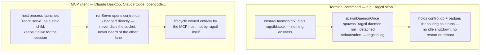
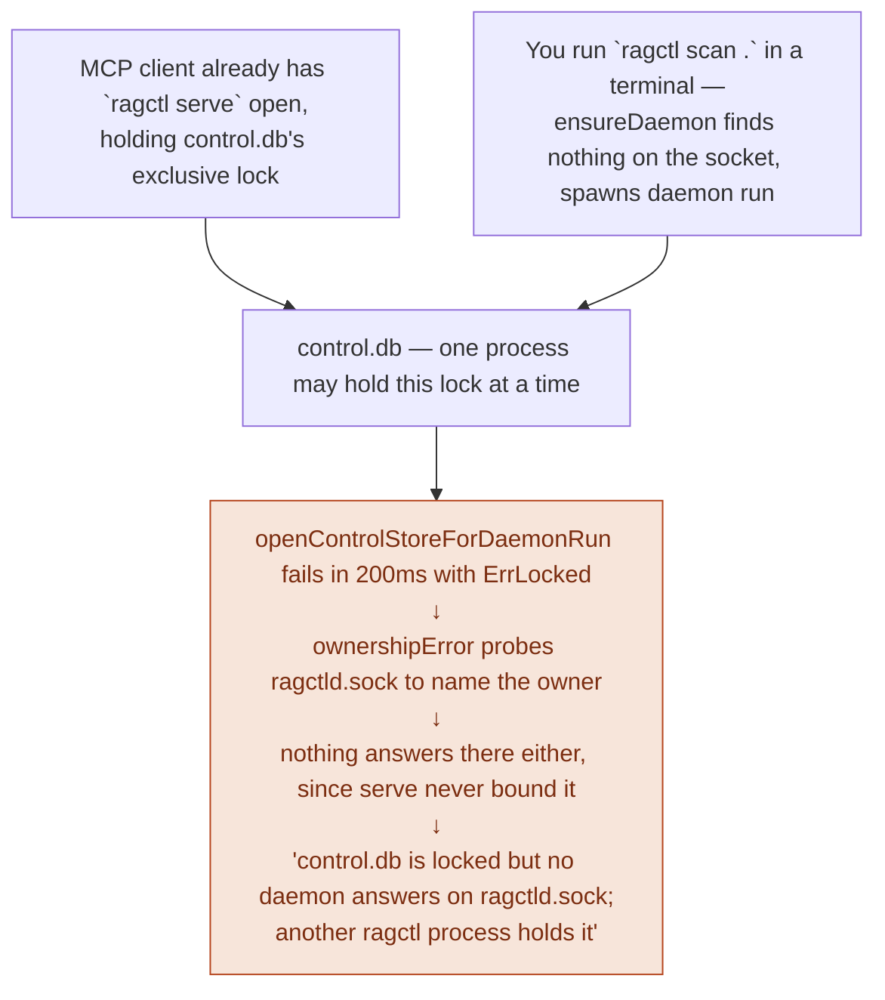
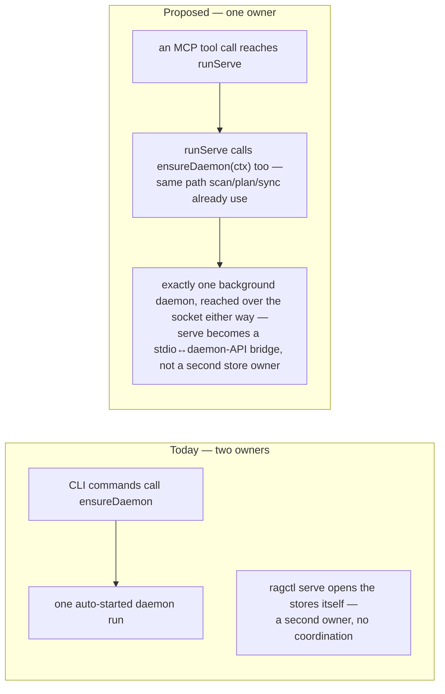

# Daemon / MCP topology — resolved (WATCH-010)

**Status: the gap this doc describes is fixed.** `ragctl serve` now opens no store and builds no embedder — it's a thin daemon client (`ensureDaemon` + `internal/cli/query_client.go`'s `daemonQueryService`/`daemonSyncTrigger`) exactly like every other command, satisfying ADR-011 §8. See `docs/internal/daemon.md` and `docs/internal/cli.md` for the current, accurate shape. This doc is kept as-is below for the historical record of what the bug looked like and why it mattered — panels 1 and 2 describe a scenario that can no longer happen.

Companion to the "Daemon architecture" section of [`docs/architecture.md`](../architecture.md).

## 1. Two processes, no handshake

Neither side needs a terminal held open, but each assumes it's the only long-running `ragctl` process — nothing checks.

Both lanes can be alive at once. Only one of them can hold `control.db`'s lock.

## 2. What happens when both are up

An MCP session is already open when a terminal command tries to auto-start its own daemon.

True, but it doesn't say which process — or that it's `serve`.

## 3. What ragctl notices without a restart

Three things you might change while a daemon is already running, and how long it takes to notice:

| You do | ragctl notices | When |
|---|---|---|
| Drop a new manifest into `<data-dir>/registry/*.yaml` | `loadRegistryForCLI` reloads it on the very next `plan`/`sync` call | **Immediate** |
| `ragctl scan` a brand-new project directory | Same open store handle; the watch loop's periodic refresh starts watching it live | **Immediate** |
| Edit `config.yaml` — backend endpoint, embedding model, `watch.debounce`, `daemon.autostart`, ... | `runDaemonRun` loads config once and hands it to `engine` for its whole life | **Restart required** (`ragctl daemon stop`) |

## 4. One entry point instead of two (proposed)

If MCP is meant to be primary, the stateful process shouldn't be the one only a terminal command can start.

