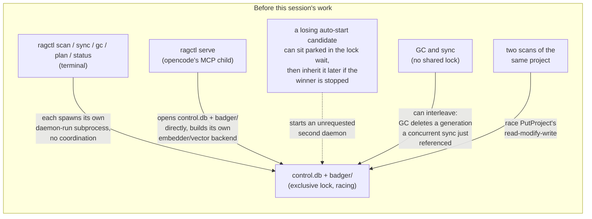
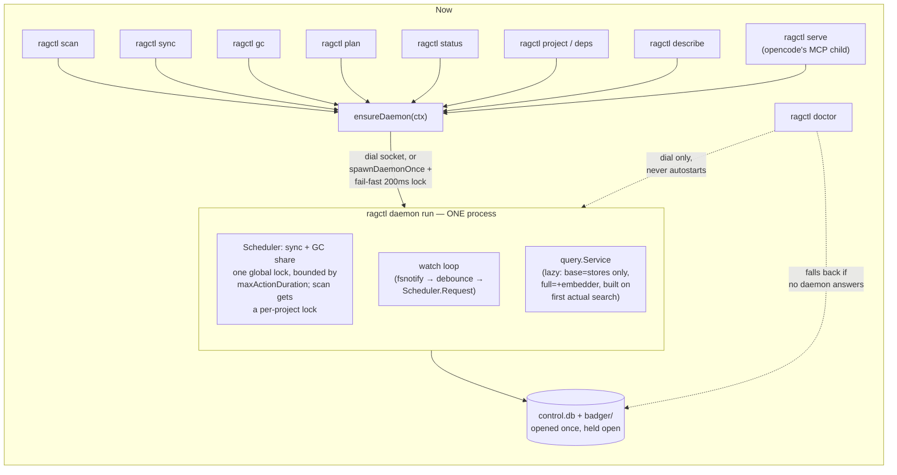

# Watch/daemon: before vs. after, and what actually works now

Companion to [`daemon-mcp-topology.md`](daemon-mcp-topology.md) (now resolved) and [`action-controller-proposal.md`](action-controller-proposal.md). This doc answers directly: for a real user opening opencode (or Claude Code, or any MCP client) with `ragctl` configured, what's actually seamless now, and what still isn't.

## Before

Five distinct, real bugs, not hypotheticals — each one reproduced and fixed this session:
1. `serve` opening the store directly meant an MCP session and an auto-started CLI daemon could both claim ownership.
2. Concurrent auto-start races could resurrect an unrequested daemon after the real one was stopped.
3. GC and sync had no shared lock — a real corruption path (GC deleting a generation a sync just added a reference to).
4. Two scans of the same project could lose an update (`PutProject`'s read-modify-write across two bbolt transactions).
5. A collapsed GC request could silently upgrade someone's dry-run preview into a real delete.

## After

## Scenario: user opens opencode with `ragctl` configured

1. opencode spawns `ragctl serve` as an MCP stdio child.
2. `runServe` does a cheap local `server.mcp.enabled` check, then calls `ensureDaemon(ctx)`.
3. No daemon is running yet. `ensureDaemon` confirms `ragctl init` has already run, then `spawnDaemonOnce` spawns `ragctl daemon run`, detached.
4. The new daemon wins the `control.db` lock (nothing else is running), opens Badger, starts the watch loop (`watch.enabled` defaults true), and starts serving HTTP over the Unix socket.
5. `ensureDaemon` polls until the socket answers, `runServe` calls `Health()` for the authoritative `MCPEnabled`/`EnableSyncTool` flags, and wires up `daemonQueryService`/`daemonSyncTrigger`.
6. From here: every MCP tool call (`search_dependency_docs`, `list_project_dependencies`, ...) is an HTTP round-trip to the daemon. The daemon's watch loop is running independently in the background, and will fire a sync through the same `Scheduler` the moment a watched project's manifest changes — **no polling, no user action, no separate process to keep alive.**

**What's genuinely seamless now, with test coverage behind each claim:**
- **A second opencode window, a Claude Code session, and a terminal `ragctl scan` can all start at the same instant with no daemon running**, and they converge on exactly one daemon — verified by `TestSchedulerActionTimesOutWithoutWedgingQueue`-style reasoning plus the concurrent-autostart tests; no orphaned second daemon, because losing candidates fail fast (200ms) instead of parking in the lock wait.
- **Watch keeps running after opencode closes.** The daemon's lifecycle is deliberately decoupled from any one client — closing the MCP session kills `serve`, not the daemon. Sync/watch continue until `ragctl daemon stop` or a reboot. This is a feature, not a leftover: it's what lets three concurrent agent sessions share one watcher instead of needing three.
- **A user manually running `ragctl gc` while the daemon's watch loop is mid-sync (or an agent triggers `sync_project`) can't corrupt anything** — GC and sync share one lock, verified by `TestSchedulerGCAndSyncExcludeEachOther`.
- **Two agents (or an agent and a terminal) scanning the same project at the same instant** don't lose an update — verified end-to-end by `TestScanConcurrentSameProjectDoesNotRace` against a real daemon, not just the lock primitive.
- **A user's explicit "just show me what GC would delete" request can never silently become a real delete** because it collapsed with someone else's request — verified by `TestSchedulerGCDryRunNeverEscalatesWhenCollapsed`.

**Update — this gap is closed.** `project`, `deps`, and `describe` are now thin `ensureDaemon` clients like everything else. `doctor` is the one deliberate exception, and it's a two-path design rather than a plain migration: it dials the socket (no autostart — diagnosing a stopped or broken daemon is its job, so running it must never have the side effect of starting one), and only falls back to opening the stores itself if nothing answers, so a genuinely locked or corrupted store still gets a specific diagnosis instead of an opaque "no daemon." Verified live: `project list`, `deps`, `doctor`, and `describe` all run cleanly while a daemon is up, no `ErrLocked`, no waiting. See `docs/internal/cli.md`'s notes and `docs/internal/daemon.md` for the current shape.

**Bottom line for the opencode scenario, updated:** everything — MCP tool calls *and* every CLI command a user might run from a terminal alongside opencode's daemon — now goes through the daemon cleanly. There's no longer a command that hits `ErrLocked` just because a daemon happens to be running.
