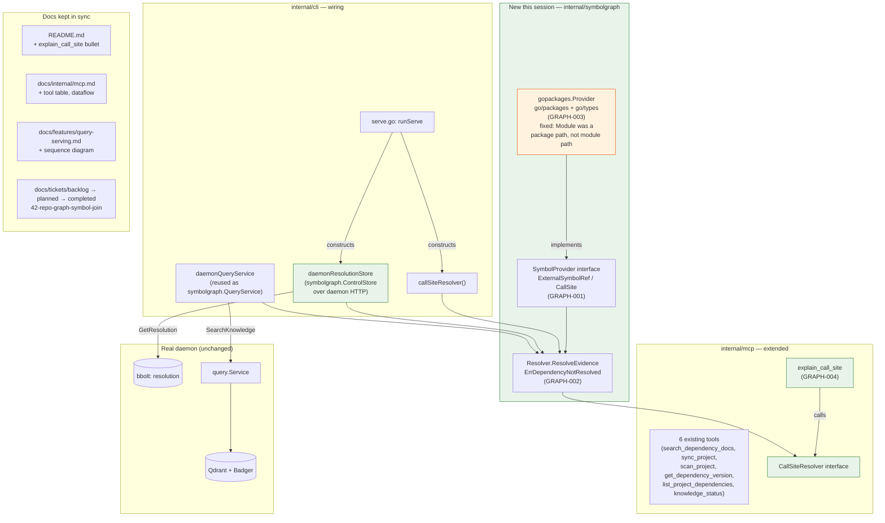

# Epic: Repo-Graph Symbol Join

The scratch doc's §14 calls this "the most compelling cross-system feature to prototype": a project's repo/code graph and ragctl's dependency knowledge share a natural join key — the dependency symbol used at a call site. Neither system needs to duplicate the other's job:

> - graph system: **what symbol is this code referring to?**
> - ragctl: **what knowledge is valid for that dependency version?**

Flow (scratch doc §14):
```text
project source
 -> graph/LSP resolves call site
 -> external symbol identity
 -> dependency/module identity
 -> exact project-resolved version
 -> ragctl exact-version source/docs
 -> evidence bundle
```
Example: `client.go` calls `bbolt.(*Tx).Bucket` → graph resolves the external symbol → ragctl's resolver already knows the project resolved `go.etcd.io/bbolt@1.3.11` → ragctl fetches exact symbol/docs/source for that version.

## Status

**2026-09: pulled forward from backlog, scoped, and shipped.** A competitive review comparing ragctl against Grounded Docs and Tessl independently proposed this exact join ("code-aware retrieval": let the agent ask what a call site means under the installed version, by joining an existing code-intelligence tool's call-site resolution with ragctl's resolved dependency versions, without ragctl building its own code graph) as one of three concrete follow-on improvements worth benchmarking against a simpler baseline before building — external reaffirmation this is the right shape, not new scope. That review also settled the one thing GRAPH-001 originally deferred: which graph provider to build against first (GRAPH-003).

All four tickets shipped in one pass, in the build order below, each independently tested (unit tests for GRAPH-001/002, a real fixture-module test for GRAPH-003 covering plain-function/method-selector/interface-value/internal/compile-error cases, and a true end-to-end test for GRAPH-004 wiring a real `gopackages.Provider` through a real `symbolgraph.Resolver` into `explainCallSiteHandler` — not mocked at the resolver boundary).

**Then reviewed and live-tested, matching the discipline WATCH-019/020 established this session.** Code review found one real bug — `ExternalSymbolRef.Module` was a package path, not a module path, silently breaking the join for any multi-package dependency (see GRAPH-003's post-implementation note) — and one untested wire-boundary adapter (`daemonResolutionStore`, now covered by `internal/cli/symbolgraph_wiring_test.go`), both fixed/covered before live testing rather than after. A real live-test session (real daemon, real `ragctl serve`, a real MCP client, a real published multi-package dependency — `github.com/stretchr/testify`) then confirmed the fix and the whole chain, including the internal-call-site and stdlib-call edge cases — see GRAPH-004's post-implementation note for the full session. `go build ./...`, `go vet ./...`, `gofmt -l .`, and the full `go test ./...` suite are clean throughout.

## What changed



Read top to bottom: an agent calls `explain_call_site` with a file/line/column → `CallSiteResolver` → `symbolgraph.Resolver.ResolveEvidence` → real `go/packages` type-checking (`gopackages.Provider`) resolves the call site to an external symbol → matched against the project's real resolution (via `daemonResolutionStore`, over the live daemon) → searched via the existing `query.Service`/Qdrant path (via `daemonQueryService`, reused unchanged) → version-correct chunks come back.

The orange node is the one real bug code review caught (package path vs. module path — see GRAPH-003's post-implementation note) — fixed and live-verified against a real multi-package dependency (`github.com/stretchr/testify`) before this was trusted. Everything downstream of it (daemon, bbolt, Qdrant, `query.Service`) is existing infrastructure this feature reuses, not new.

## Tickets
- [GRAPH-001](GRAPH-001-external-symbol-provider-interface.md) — a thin, narrow `SymbolProvider` interface resolving a call site to an `ExternalSymbolRef`. Explicitly not a control plane.
- [GRAPH-002](GRAPH-002-composite-symbol-to-evidence-bundle.md) — the actual join: `ExternalSymbolRef` → known `domain.Dependency`/version (via `internal/control/bbolt.Store`) → `internal/query.Service` evidence for that exact dependency+version. Depends on GRAPH-001.
- [GRAPH-003](GRAPH-003-go-packages-symbol-provider.md) — the first concrete `SymbolProvider`: a `golang.org/x/tools/go/packages` + `go/types`-based Go implementation, chosen as the cleanest deterministic option with the least integration work (a one-shot library call, no LSP session, matching how `internal/resolver/golang` already shells out to real `go` tooling rather than reimplementing it). Go-only, per this project's "one reference implementation before adding more" convention. Depends on GRAPH-001.
- [GRAPH-004](GRAPH-004-explain-call-site-mcp-tool.md) — wires GRAPH-002's join into a new `explain_call_site` MCP tool, the actual end-user-visible point of the epic; without this, GRAPH-001-003 ship a real, tested library nothing calls. Depends on GRAPH-002, GRAPH-003.

Build order: GRAPH-001 → GRAPH-002 and GRAPH-003 in parallel (both depend only on GRAPH-001's interface, not on each other) → GRAPH-004 (needs both).

## Non-goals for this epic
- Python/Node/other-ecosystem symbol providers — GRAPH-003 is Go-only; a second-ecosystem provider is explicitly deferred to its own future ticket once the Go-only join has proven out end-to-end, matching this project's "one reference implementation before adding more" rule.
- No context-control-plane, no agent-memory subsystem (scratch doc §21's "do not build yet" list applies here directly — a symbol join is a narrow lookup, not a new subsystem that owns state).
- No new query-ranking/ordering logic — the join hands its result to `internal/query.Service` unchanged; how that evidence is presented to an agent is existing query-serving scope, not repeated here.
- No JIT-sync-on-miss for `explain_call_site` (see GRAPH-004's own non-goals) — a follow-up, not part of first landing.
